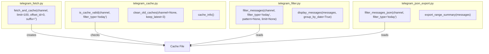

# Direct Module Usage

<cite>
**Referenced Files in This Document**   
- [telegram_fetch.py](file://scripts/telegram_tools/core/telegram_fetch.py)
- [telegram_cache.py](file://scripts/telegram_tools/core/telegram_cache.py)
- [telegram_filter.py](file://scripts/telegram_tools/core/telegram_filter.py)
- [telegram_json_export.py](file://scripts/telegram_tools/core/telegram_json_export.py)
- [.env](file://.env)
</cite>

## Table of Contents
1. [Introduction](#introduction)
2. [Core Module Interfaces](#core-module-interfaces)
3. [Module Initialization and Configuration](#module-initialization-and-configuration)
4. [Using telegram_fetch.py Programmatically](#using-telegram_fetchpy-programmatically)
5. [Using telegram_cache.py for Cache Management](#using-telegram_cachepy-for-cache-management)
6. [Using telegram_filter.py for Message Filtering](#using-telegram_filterpy-for-message-filtering)
7. [Advanced Use Cases and Integration Patterns](#advanced-use-cases-and-integration-patterns)
8. [API Stability and Version Compatibility](#api-stability-and-version-compatibility)
9. [Troubleshooting and Best Practices](#troubleshooting-and-best-practices)

## Introduction
This document provides comprehensive guidance on leveraging the core Python modules of the Telegram tools suite directly within custom applications. While these modules are designed to work through CLI scripts and the `telegram_manager.sh` wrapper, they expose well-defined public interfaces that enable direct integration into larger systems, automation workflows, and custom dashboards. The focus is on the three primary modules: `telegram_fetch.py`, `telegram_cache.py`, and `telegram_filter.py`, detailing their programmatic usage, dependencies, configuration requirements, and practical implementation patterns for advanced use cases.

## Core Module Interfaces
The core modules expose distinct public functions that serve as entry points for direct Python integration. Each module follows a clean separation of concerns, allowing independent or combined usage based on application needs.

**Diagram sources**
- [telegram_fetch.py](file://scripts/telegram_tools/core/telegram_fetch.py#L100-L140)
- [telegram_cache.py](file://scripts/telegram_tools/core/telegram_cache.py#L30-L100)
- [telegram_filter.py](file://scripts/telegram_tools/core/telegram_filter.py#L100-L150)
- [telegram_json_export.py](file://scripts/telegram_tools/core/telegram_json_export.py#L30-L80)

## Module Initialization and Configuration
All modules rely on a unified `.env` file located in the project root for configuration. This file must contain the following credentials for Telegram API access:

:TELEGRAM_API_ID: Your Telegram API ID (integer)
:TELEGRAM_API_HASH: Your Telegram API hash (string)
:TELEGRAM_SESSION: String session data for the authenticated client

The modules automatically locate the `.env` file relative to their own path using `Path(__file__).parent.parent.parent.parent / ".env"`. When integrating these modules into external applications, ensure the `.env` file is accessible at the expected location or modify the path resolution logic accordingly. The `telethon` library is a required dependency and must be installed via `pip install telethon`.

**Section sources**
- [telegram_fetch.py](file://scripts/telegram_tools/core/telegram_fetch.py#L20-L40)
- [telegram_cache.py](file://scripts/telegram_tools/core/telegram_cache.py#L10-L20)
- [telegram_filter.py](file://scripts/telegram_tools/core/telegram_filter.py#L10-L20)

## Using telegram_fetch.py Programmatically
The `fetch_and_cache` function is the primary interface for retrieving messages from a Telegram channel and storing them in JSON format. It is an asynchronous function that must be awaited within an async context.

To use this module in a standalone script, import the function and run it within an asyncio event loop. The function accepts parameters for the channel identifier, message limit, offset ID for pagination, and an optional suffix for the cache filename. It returns the path to the created cache file upon successful execution. Error handling should account for network issues, authentication failures, and invalid channel names.

**Section sources**
- [telegram_fetch.py](file://scripts/telegram_tools/core/telegram_fetch.py#L100-L140)

## Using telegram_cache.py for Cache Management
The `telegram_cache.py` module provides utilities for managing the lifecycle of cached message data. The `is_cache_valid` function checks whether the latest cache file for a given channel is still valid based on configurable TTL (Time-To-Live) rules, which vary by filter type (e.g., 5 minutes for "today", 60 minutes for "recent"). This function is essential for building applications that need to balance freshness with performance.

The `clean_old_caches` function allows for programmatic cleanup of outdated cache files, retaining only the most recent N files per channel. This is useful for automated maintenance tasks. The `cache_info` function provides detailed statistics about the current cache state, which can be integrated into monitoring dashboards.

**Section sources**
- [telegram_cache.py](file://scripts/telegram_tools/core/telegram_cache.py#L30-L100)

## Using telegram_filter.py for Message Filtering
The `filter_messages` function enables powerful filtering of cached messages based on date, text patterns, and result limits. It supports various filter types including "today", "yesterday", "last:N" days, specific dates, and "all" messages. Pattern filtering uses Python's `re` module for case-insensitive regex matching.

This function returns a list of message dictionaries, making it ideal for integration into data processing pipelines. The `display_messages` function is provided for human-readable output but is less relevant for programmatic use. For applications requiring raw JSON output, the `telegram_json_export.py` module's `filter_messages_json` function offers a similar interface without the display formatting.

**Section sources**
- [telegram_filter.py](file://scripts/telegram_tools/core/telegram_filter.py#L100-L150)
- [telegram_json_export.py](file://scripts/telegram_tools/core/telegram_json_export.py#L30-L80)

## Advanced Use Cases and Integration Patterns
These modules can be combined to build sophisticated applications. For example, a custom dashboard can use `is_cache_valid` to determine if a refresh is needed, call `fetch_and_cache` to update data, and then use `filter_messages` to extract relevant information for display. Web services can embed these functions to provide real-time Telegram analytics.

Specialized filtering logic can be implemented by processing the message list returned by `filter_messages`, adding custom metadata extraction or sentiment analysis. The modules' design supports embedding into larger applications by treating the cache directory as a shared data layer, enabling multiple components to access the same message data without redundant API calls.

**Section sources**
- [telegram_fetch.py](file://scripts/telegram_tools/core/telegram_fetch.py#L100-L140)
- [telegram_cache.py](file://scripts/telegram_tools/core/telegram_cache.py#L30-L100)
- [telegram_filter.py](file://scripts/telegram_tools/core/telegram_filter.py#L100-L150)

## API Stability and Version Compatibility
The public interfaces of these modules are considered stable for the current version. However, internal implementation details, such as the cache file naming convention and JSON structure, are subject to change. Applications should depend on the documented function signatures and not on the specific format of cache files.

When upgrading the tools suite, verify that the function parameters and return values remain consistent. The dependency on `telethon` should be pinned to a compatible version to avoid breaking changes. Long-term maintenance is facilitated by the modular design, which isolates changes to individual components.

**Section sources**
- [telegram_fetch.py](file://scripts/telegram_tools/core/telegram_fetch.py#L100-L140)
- [telegram_cache.py](file://scripts/telegram_tools/core/telegram_cache.py#L30-L100)
- [telegram_filter.py](file://scripts/telegram_tools/core/telegram_filter.py#L100-L150)

## Troubleshooting and Best Practices
Ensure the `telegram_cache` directory exists and is writable. Handle exceptions from `telethon` operations, particularly during network failures. When using the modules in a web context, avoid blocking the main thread by running async functions in a separate executor. For high-frequency polling, leverage the TTL-based cache validation to minimize unnecessary API calls. Always validate the return values of functions, as they may indicate failure conditions (e.g., no cache found).

**Section sources**
- [telegram_fetch.py](file://scripts/telegram_tools/core/telegram_fetch.py#L140-L146)
- [telegram_cache.py](file://scripts/telegram_tools/core/telegram_cache.py#L100-L178)
- [telegram_filter.py](file://scripts/telegram_tools/core/telegram_filter.py#L200-L238)