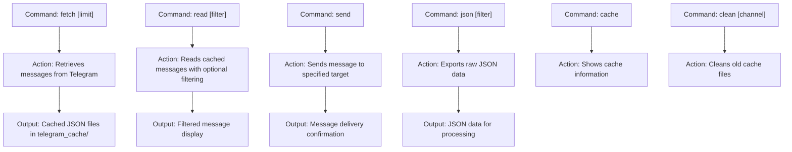

# Scripting and Automation

<cite>
**Referenced Files in This Document**   
- [telegram_manager.sh](file://telegram_manager.sh)
- [scripts/telegram_tools/core/telegram_fetch.py](file://scripts/telegram_tools/core/telegram_fetch.py)
- [scripts/telegram_tools/core/telegram_filter.py](file://scripts/telegram_tools/core/telegram_filter.py)
- [scripts/telegram_tools/core/telegram_json_export.py](file://scripts/telegram_tools/core/telegram_json_export.py)
- [scripts/telegram_tools/core/telegram_cache.py](file://scripts/telegram_tools/core/telegram_cache.py)
- [tests/comprehensive_message_analysis.sh](file://tests/comprehensive_message_analysis.sh)
- [tests/simple_first_message_detector.sh](file://tests/simple_first_message_detector.sh)
- [tests/boundary_aware_first_message_detector.sh](file://tests/boundary_aware_first_message_detector.sh)
- [tests/test_10_error_handling.sh](file://tests/test_10_error_handling.sh)
</cite>

## Table of Contents
1. [Introduction](#introduction)
2. [Core Commands Overview](#core-commands-overview)
3. [Message Monitoring Workflows](#message-monitoring-workflows)
4. [Automated Alerting Systems](#automated-alerting-systems)
5. [JSON Processing and Downstream Integration](#json-processing-and-downstream-integration)
6. [Cron Integration for Periodic Execution](#cron-integration-for-periodic-execution)
7. [Error Handling in Unattended Scripts](#error-handling-in-unattended-scripts)
8. [Best Practices for Production Scripts](#best-practices-for-production-scripts)
9. [Common Pitfalls and Solutions](#common-pitfalls-and-solutions)
10. [Comprehensive Pipeline Design](#comprehensive-pipeline-design)

## Introduction
The FALLBACK_SCRIPTS toolkit provides a robust framework for scripting and automation of Telegram message monitoring and alerting workflows. This document details how to create shell scripts that chain multiple commands (fetch, filter, json, send) to build automated systems for daily digest generation, anomaly detection, and scheduled message relaying. The toolkit's modular design enables flexible pipeline construction with proper error handling, caching strategies, and integration capabilities.

## Core Commands Overview
The telegram_manager.sh script serves as the primary interface for interacting with Telegram channels through various subcommands that can be chained together in automation workflows.

**Diagram sources**
- [telegram_manager.sh](file://telegram_manager.sh#L0-L109)

**Section sources**
- [telegram_manager.sh](file://telegram_manager.sh#L0-L109)

## Message Monitoring Workflows
The toolkit enables creation of sophisticated message monitoring workflows by chaining commands together. These workflows can be designed for various use cases including daily digest generation and anomaly detection.

### Daily Digest Generation
Daily digest scripts can be created by combining the fetch, filter, and send commands to automatically compile and deliver summaries of channel activity.

**Diagram sources**
- [telegram_manager.sh](file://telegram_manager.sh#L0-L109)
- [scripts/telegram_tools/core/telegram_fetch.py](file://scripts/telegram_tools/core/telegram_fetch.py#L0-L146)
- [scripts/telegram_tools/core/telegram_filter.py](file://scripts/telegram_tools/core/telegram_filter.py#L0-L238)

### Anomaly Detection via Pattern Filtering
Anomaly detection workflows use pattern matching to identify specific message content that requires attention or further action.

**Diagram sources**
- [telegram_manager.sh](file://telegram_manager.sh#L0-L109)
- [scripts/telegram_tools/core/telegram_filter.py](file://scripts/telegram_tools/core/telegram_filter.py#L0-L238)

**Section sources**
- [telegram_manager.sh](file://telegram_manager.sh#L0-L109)
- [scripts/telegram_tools/core/telegram_filter.py](file://scripts/telegram_tools/core/telegram_filter.py#L0-L238)

## Automated Alerting Systems
The toolkit supports creation of automated alerting systems that can detect specific conditions and send notifications through various channels.

### Scheduled Message Relaying
Scheduled message relaying workflows automatically forward messages from one channel to another based on timing or content criteria.

**Diagram sources**
- [telegram_manager.sh](file://telegram_manager.sh#L0-L109)

## JSON Processing and Downstream Integration
The json command enables integration with downstream processing systems by providing raw JSON output that can be parsed and analyzed.

### Parsing JSON Output
The telegram_json_export.py script provides structured JSON output that can be processed by other tools or systems.

**Diagram sources**
- [scripts/telegram_tools/core/telegram_json_export.py](file://scripts/telegram_tools/core/telegram_json_export.py#L0-L124)

### Downstream Processing Pipeline
JSON output can be integrated into larger data processing pipelines for advanced analytics and reporting.

**Diagram sources**
- [scripts/telegram_tools/core/telegram_fetch.py](file://scripts/telegram_tools/core/telegram_fetch.py#L0-L146)
- [scripts/telegram_tools/core/telegram_json_export.py](file://scripts/telegram_tools/core/telegram_json_export.py#L0-L124)

**Section sources**
- [scripts/telegram_tools/core/telegram_json_export.py](file://scripts/telegram_tools/core/telegram_json_export.py#L0-L124)

## Cron Integration for Periodic Execution
Cron integration enables periodic execution of monitoring and alerting scripts without manual intervention.

### Cron Job Configuration
Cron jobs can be configured to execute scripts at specified intervals for continuous monitoring.

**Section sources**
- [telegram_manager.sh](file://telegram_manager.sh#L0-L109)

## Error Handling in Unattended Scripts
Proper error handling is critical for unattended scripts to ensure reliability and provide meaningful diagnostics when issues occur.

### Error Handling Strategies
The toolkit includes comprehensive error handling mechanisms to manage various failure scenarios.

**Diagram sources**
- [tests/test_10_error_handling.sh](file://tests/test_10_error_handling.sh#L0-L244)

**Section sources**
- [tests/test_10_error_handling.sh](file://tests/test_10_error_handling.sh#L0-L244)

## Best Practices for Production Scripts
Implementing best practices ensures reliable and maintainable automation scripts in production environments.

### Logging and Monitoring
Comprehensive logging provides visibility into script execution and aids in troubleshooting.

### Failure Recovery
Robust failure recovery mechanisms ensure scripts can handle transient issues gracefully.

### Rate Limit Avoidance
Strategies to avoid rate limits when interacting with external APIs.

**Section sources**
- [scripts/telegram_tools/core/telegram_cache.py](file://scripts/telegram_tools/core/telegram_cache.py#L0-L178)
- [telegram_manager.sh](file://telegram_manager.sh#L0-L109)

## Common Pitfalls and Solutions
Understanding common pitfalls helps avoid issues when developing automation scripts with the toolkit.

### Environment Variable Scoping
Environment variables must be properly scoped and accessible to all script components.

### Cache Contention in Concurrent Scripts
Multiple concurrent scripts accessing the cache require proper coordination to avoid conflicts.

**Section sources**
- [scripts/telegram_tools/core/telegram_cache.py](file://scripts/telegram_tools/core/telegram_cache.py#L0-L178)

## Comprehensive Pipeline Design
The comprehensive_message_analysis.sh script demonstrates robust pipeline design principles for complex message analysis workflows.

### Robust Pipeline Components
A well-designed pipeline incorporates multiple components working together to achieve reliable results.

**Section sources**
- [tests/comprehensive_message_analysis.sh](file://tests/comprehensive_message_analysis.sh#L0-L114)
- [tests/simple_first_message_detector.sh](file://tests/simple_first_message_detector.sh#L0-L86)
- [tests/boundary_aware_first_message_detector.sh](file://tests/boundary_aware_first_message_detector.sh#L0-L156)