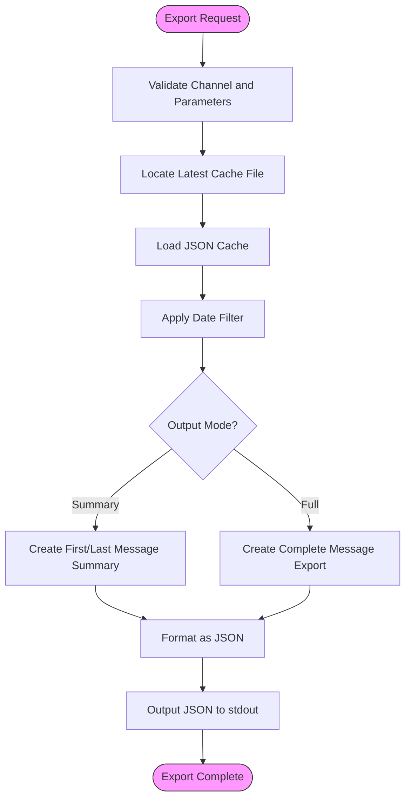
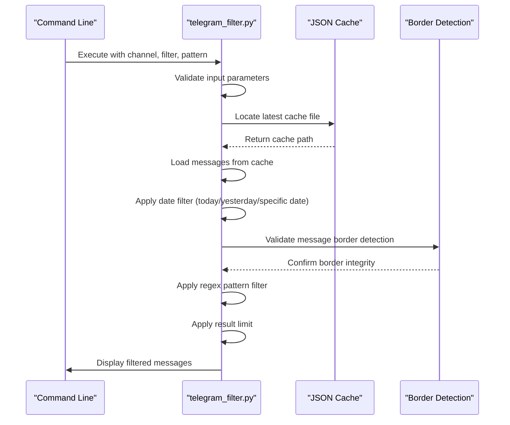
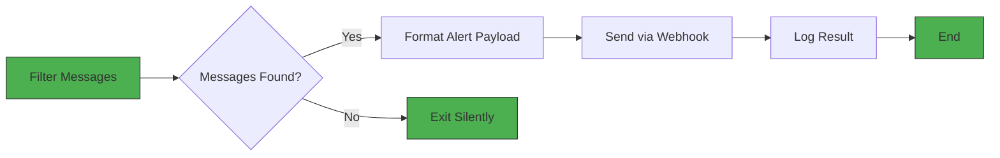
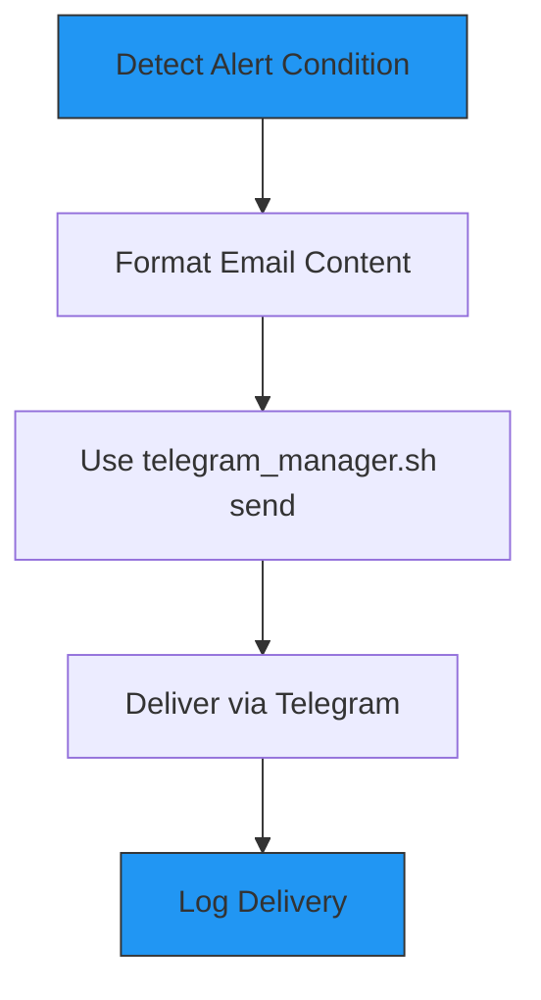
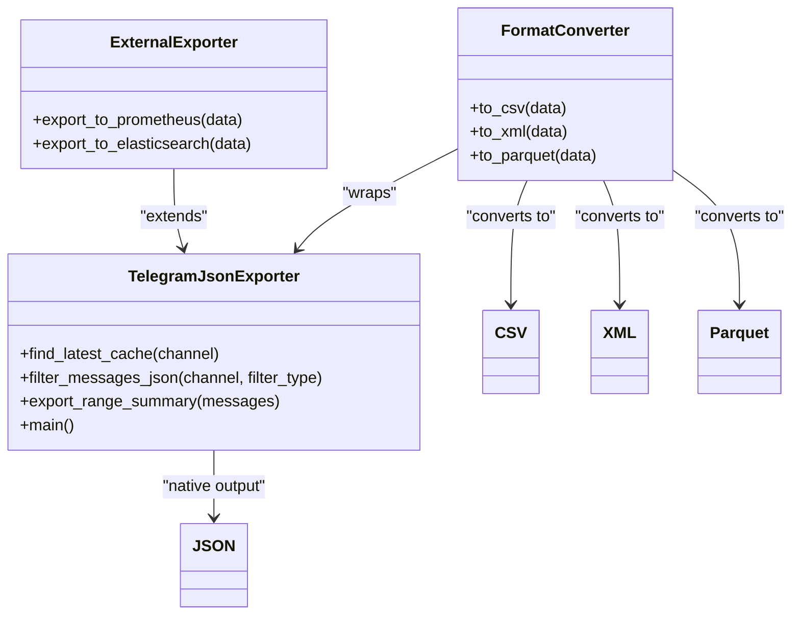
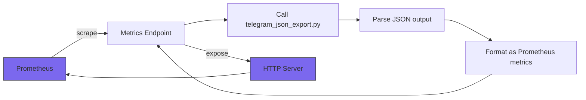
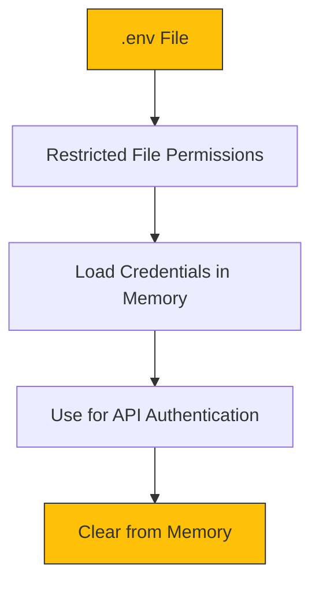
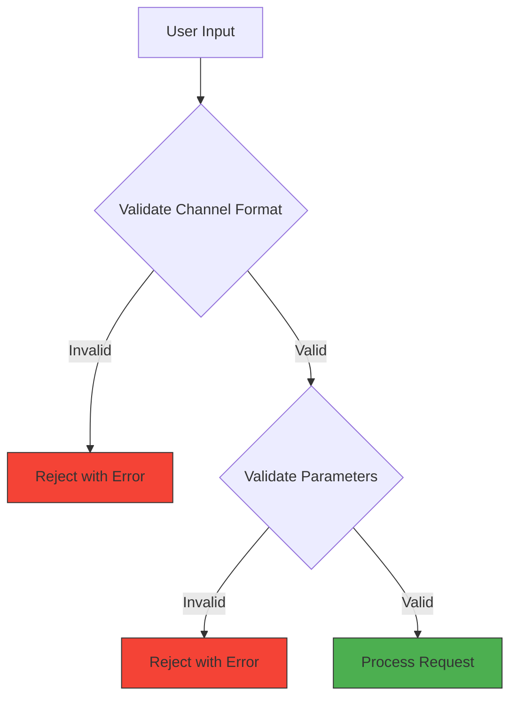

# System Integration

<cite>
**Referenced Files in This Document**   
- [telegram_json_export.py](file://scripts/telegram_tools/core/telegram_json_export.py)
- [telegram_filter.py](file://scripts/telegram_tools/core/telegram_filter.py)
- [telegram_manager.sh](file://telegram_manager.sh)
- [telegram_fetch.py](file://scripts/telegram_tools/core/telegram_fetch.py)
- [telegram_cache.py](file://scripts/telegram_tools/core/telegram_cache.py)
</cite>

## Table of Contents
1. [Introduction](#introduction)
2. [Data Export for Analytics Platforms](#data-export-for-analytics-platforms)
3. [Custom Filtering for External Alerts](#custom-filtering-for-external-alerts)
4. [Notification Triggering Mechanisms](#notification-triggering-mechanisms)
5. [Extending Export Formats](#extending-export-formats)
6. [CI/CD and Monitoring Integration](#cicd-and-monitoring-integration)
7. [Security Considerations](#security-considerations)

## Introduction
The FALLBACK_SCRIPTS toolset provides a comprehensive framework for integrating Telegram message data with external systems. This document details the integration capabilities of the system, focusing on data export, filtering, notification triggering, and secure deployment patterns. The architecture centers around cached JSON data that can be processed and exported in various formats for consumption by analytics platforms, monitoring tools, and alerting systems.

**Section sources**
- [telegram_manager.sh](file://telegram_manager.sh#L1-L110)
- [telegram_json_export.py](file://scripts/telegram_tools/core/telegram_json_export.py#L1-L125)

## Data Export for Analytics Platforms

### JSON Export Structure
The `telegram_json_export.py` script provides structured JSON output that can be ingested by analytics platforms such as ELK, Grafana, and Pandas. The exporter supports two output modes: summary and full export.



**Diagram sources**
- [telegram_json_export.py](file://scripts/telegram_tools/core/telegram_json_export.py#L27-L64)
- [telegram_json_export.py](file://scripts/telegram_tools/core/telegram_json_export.py#L97-L124)

The full JSON export includes a metadata section with channel information, filter parameters, and export timestamp, followed by the complete message array. This structure enables seamless integration with data analysis tools:

- **ELK Stack**: The JSON format is directly compatible with Logstash ingestion pipelines
- **Grafana**: Can be used with JSON data source plugins for visualization
- **Pandas**: Easily loaded using `pd.read_json()` for data analysis

**Section sources**
- [telegram_json_export.py](file://scripts/telegram_tools/core/telegram_json_export.py#L1-L125)

## Custom Filtering for External Alerts

### Filter Implementation
The `telegram_filter.py` script enables creation of custom filters to extract specific data points for external alerting systems. The filtering process combines date-based filtering with pattern matching using regular expressions.



**Diagram sources**
- [telegram_filter.py](file://scripts/telegram_tools/core/telegram_filter.py#L75-L115)
- [telegram_filter.py](file://scripts/telegram_tools/core/telegram_filter.py#L145-L180)

Custom filters can be created by specifying a pattern parameter that uses Python's `re.search()` function with case-insensitive matching. For example, to detect critical system alerts:

```bash
python telegram_filter.py @system_logs today "ERROR|CRITICAL|FAILURE"
```

This would extract all messages from today containing any of the specified alert keywords, which could then trigger external alerting systems.

**Section sources**
- [telegram_filter.py](file://scripts/telegram_tools/core/telegram_filter.py#L1-L239)

## Notification Triggering Mechanisms

### Webhook Integration
The FALLBACK_SCRIPTS system can trigger notifications via webhook calls by combining the filtering capabilities with external HTTP clients. While the core scripts don't include direct webhook functionality, they can be easily integrated with tools like `curl` or `httpie`.



**Diagram sources**
- [telegram_manager.sh](file://telegram_manager.sh#L65-L109)
- [telegram_filter.py](file://scripts/telegram_tools/core/telegram_filter.py#L145-L180)

Example integration with a webhook service:
```bash
#!/bin/bash
# Check for critical errors and send alert
MESSAGES=$(python scripts/telegram_tools/core/telegram_filter.py @app_logs today "ERROR" 1)
if [ -n "$MESSAGES" ]; then
    curl -X POST https://alert-webhook.example.com \
         -H "Content-Type: application/json" \
         -d "{\"message\": \"Critical error detected in application logs\", \"severity\": \"high\"}"
fi
```

### Email Notifications
Email notifications can be triggered by combining the filtering system with standard email utilities. The `telegram_manager.sh` script already includes a send functionality that can be repurposed for alert notifications.



**Diagram sources**
- [telegram_manager.sh](file://telegram_manager.sh#L65-L109)

The existing send functionality uses Telethon to deliver messages through Telegram, which can serve as an alternative to traditional email alerts.

**Section sources**
- [telegram_manager.sh](file://telegram_manager.sh#L65-L109)

## Extending Export Formats

### JSON Exporter Architecture
The `telegram_json_export.py` script can be extended or wrapped to support additional export formats for integration with various systems.



**Diagram sources**
- [telegram_json_export.py](file://scripts/telegram_tools/core/telegram_json_export.py#L1-L125)

### Creating New Export Formats
To extend the system with new export formats, developers can:

1. **Wrap the JSON exporter**: Create a wrapper script that calls `telegram_json_export.py` and converts the output to the desired format
2. **Extend the exporter class**: Subclass the functionality to add new export methods
3. **Create format-specific exporters**: Build new scripts that use the same caching mechanism but different output formats

Example CSV wrapper:
```python
#!/usr/bin/env python3
"""CSV Export Wrapper for Telegram data"""
import subprocess
import json
import csv
import sys

# Call the JSON exporter and convert to CSV
result = subprocess.run(['python', 'telegram_json_export.py', sys.argv[1], 'today', '--full'], 
                       capture_output=True, text=True)
data = json.loads(result.stdout)

# Convert to CSV
with open('telegram_export.csv', 'w', newline='', encoding='utf-8') as csvfile:
    fieldnames = ['id', 'date_msk', 'sender', 'text', 'views']
    writer = csv.DictWriter(csvfile, fieldnames=fieldnames)
    writer.writeheader()
    for message in data['messages']:
        writer.writerow({
            'id': message['id'],
            'date_msk': message['date_msk'],
            'sender': message['sender'],
            'text': message['text'].replace('\n', ' '),
            'views': message['views'] or 0
        })
```

**Section sources**
- [telegram_json_export.py](file://scripts/telegram_tools/core/telegram_json_export.py#L1-L125)

## CI/CD and Monitoring Integration

### Prometheus Integration
The system can be integrated with Prometheus monitoring by creating a metrics endpoint that exports key statistics.



**Diagram sources**
- [telegram_json_export.py](file://scripts/telegram_tools/core/telegram_json_export.py#L97-L124)
- [telegram_manager.sh](file://telegram_manager.sh#L1-L110)

Example metrics exporter:
```python
from http.server import BaseHTTPRequestHandler, HTTPServer
import json
import subprocess

def get_telegram_metrics():
    # Get summary data
    result = subprocess.run([
        'python', 'scripts/telegram_tools/core/telegram_json_export.py',
        '@monitored_channel', 'today', '--summary'
    ], capture_output=True, text=True)
    summary = json.loads(result.stdout)
    
    metrics = []
    metrics.append(f"telegram_messages_total {summary['total']}")
    
    if summary['first_message']:
        # Convert timestamp to Unix time for Prometheus
        first_time = summary['first_message']['date_msk']
        # ... convert and add metric
        pass
        
    return "\n".join(metrics)

class MetricsHandler(BaseHTTPRequestHandler):
    def do_GET(self):
        if self.path == '/metrics':
            self.send_response(200)
            self.send_header('Content-type', 'text/plain')
            self.end_headers()
            self.wfile.write(get_telegram_metrics().encode())
```

### CI/CD Pipeline Integration
The FALLBACK_SCRIPTS tools can be incorporated into CI/CD pipelines for automated monitoring and reporting:

1. **Pre-deployment checks**: Verify message patterns before deployment
2. **Post-deployment validation**: Monitor for error patterns after deployment
3. **Automated reporting**: Generate daily/weekly reports from message data

Example GitLab CI integration:
```yaml
monitoring:
  script:
    - python scripts/telegram_tools/core/telegram_filter.py @production_logs "$CI_COMMIT_REF_NAME" "DEPLOY|START|STOP"
    - |
      if python scripts/telegram_tools/core/telegram_filter.py @production_logs "$CI_COMMIT_REF_NAME" "ERROR|FAILURE"; then
        exit 1
      fi
  rules:
    - if: $CI_COMMIT_BRANCH == "main"
```

**Section sources**
- [telegram_json_export.py](file://scripts/telegram_tools/core/telegram_json_export.py#L1-L125)
- [telegram_filter.py](file://scripts/telegram_tools/core/telegram_filter.py#L1-L239)
- [telegram_manager.sh](file://telegram_manager.sh#L1-L110)

## Security Considerations

### Credential Handling
The system implements secure credential handling through environment variables stored in a `.env` file:



**Diagram sources**
- [telegram_fetch.py](file://scripts/telegram_tools/core/telegram_fetch.py#L45-L65)
- [telegram_manager.sh](file://telegram_manager.sh#L65-L109)

The `.env` file contains sensitive credentials:
```
TELEGRAM_API_ID=123456
TELEGRAM_API_HASH=abcdef1234567890
TELEGRAM_SESSION=...
```

Security best practices include:
- Setting file permissions to 600 (read/write for owner only)
- Excluding the file from version control
- Using different credentials for different environments

### Input Validation and Sanitization
The system implements comprehensive input validation to prevent injection attacks:



**Diagram sources**
- [telegram_manager.sh](file://telegram_manager.sh#L25-L63)
- [test_10_error_handling.sh](file://tests/test_10_error_handling.sh#L41-L79)

The system validates:
- Channel format (must start with @)
- Limit values (1-1000 range)
- Date formats
- Special characters that could enable command injection

### Data Exposure Controls
When exposing data through integrations, implement the following controls:
- **Principle of Least Privilege**: Only export the data needed for the specific integration
- **Data Minimization**: Remove sensitive fields from exports when possible
- **Access Controls**: Restrict access to export endpoints
- **Audit Logging**: Log all data export activities

The caching system already implements TTL-based cache invalidation, reducing the risk of stale data exposure.

**Section sources**
- [telegram_cache.py](file://scripts/telegram_tools/core/telegram_cache.py#L1-L179)
- [test_10_error_handling.sh](file://tests/test_10_error_handling.sh#L125-L170)