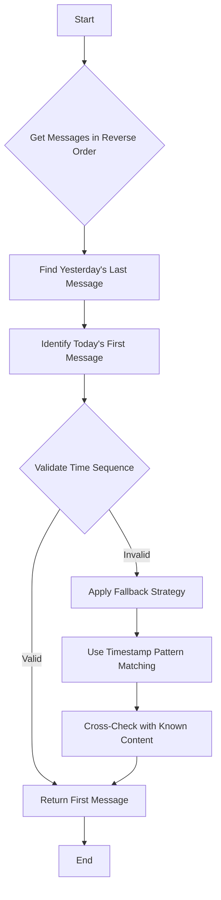
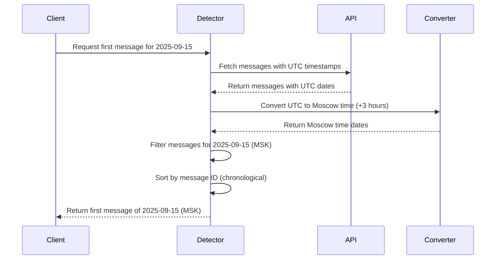

# Border Detection System

<cite>
**Referenced Files in This Document**   
- [scripts/telegram_tools/core/telegram_filter.py](file://scripts/telegram_tools/core/telegram_filter.py)
- [scripts/telegram_tools/telegram_smart_cache.py](file://scripts/telegram_tools/telegram_smart_cache.py)
- [scripts/telegram_tools/simple_boundary_check.py](file://scripts/telegram_tools/simple_boundary_check.py)
- [tests/border_message_detector.sh](file://tests/border_message_detector.sh)
- [tests/boundary_aware_first_message_detector.sh](file://tests/boundary_aware_first_message_detector.sh)
- [tests/timezone_aware_first_message_detector.sh](file://tests/timezone_aware_first_message_detector.sh)
- [tests/test_first_message_border_detection.sh](file://tests/test_first_message_border_detection.sh)
- [tests/get_first_message_today.sh](file://tests/get_first_message_today.sh)
- [tests/simple_border_test.sh](file://tests/simple_border_test.sh)
</cite>

## Table of Contents
1. [Introduction](#introduction)
2. [Core Challenge: Non-Sequential Message IDs and API Limitations](#core-challenge-non-sequential-message-ids-and-api-limitations)
3. [Multi-Layered Border Detection Approach](#multi-layered-border-detection-approach)
4. [Boundary Validation with Cache Metadata and Targeted API Calls](#boundary-validation-with-cache-metadata-and-targeted-api-calls)
5. [Timezone-Aware Detection Using Moscow Time](#timezone-aware-detection-using-moscow-time)
6. [Test Scripts for Border Detection Accuracy](#test-scripts-for-border-detection-accuracy)
7. [Auto-Fetching Mechanism for Low Certainty Borders](#auto-fetching-mechanism-for-low-certainty-borders)
8. [Edge Cases and Performance Implications](#edge-cases-and-performance-implications)

## Introduction
The Border Detection System is designed to accurately identify the first message of a given day in Telegram channels, a task complicated by non-sequential message IDs and limitations in the Telegram API. This document details the multi-layered approach used to detect day boundaries reliably, combining cache metadata, targeted API calls, and timezone-aware logic. The system ensures robustness through fallback strategies, auto-fetching mechanisms, and comprehensive test coverage, enabling accurate date-based message retrieval even under edge conditions.

## Core Challenge: Non-Sequential Message IDs and API Limitations
Identifying the first message of a day in Telegram channels presents a significant challenge due to the non-sequential nature of message IDs and the absence of direct date-based indexing in the Telegram API. Messages are ordered chronologically, but their IDs do not reflect this order, making it impossible to use ID ranges for date filtering. Additionally, the API returns messages in reverse chronological order by default, requiring careful handling to detect the transition between days. Without proper boundary detection, messages from early morning hours could be misclassified due to timezone conversion issues, leading to inaccurate retrieval of daily first messages.

**Section sources**
- [scripts/telegram_tools/core/telegram_filter.py](file://scripts/telegram_tools/core/telegram_filter.py#L130-L162)
- [tests/test_first_message_border_detection.sh](file://tests/test_first_message_border_detection.sh#L0-L56)

## Multi-Layered Border Detection Approach
The system employs a multi-layered strategy to detect day boundaries with high confidence. The primary method involves identifying the last message of the previous day and using the subsequent message as the first message of the current day. This is implemented in scripts like `border_message_detector.sh` and `get_first_message_today.sh`, which scan messages in reverse chronological order to locate the date header transition. A fallback strategy uses direct pattern matching on timestamps to identify messages near the expected boundary time (e.g., 06:11:48). The system also incorporates content-based validation, cross-referencing known message content to verify the correctness of the detected border.

**Diagram sources**
- [tests/border_message_detector.sh](file://tests/border_message_detector.sh#L0-L68)
- [tests/get_first_message_today.sh](file://tests/get_first_message_today.sh#L0-L49)

**Section sources**
- [tests/border_message_detector.sh](file://tests/border_message_detector.sh#L0-L68)
- [tests/get_first_message_today.sh](file://tests/get_first_message_today.sh#L0-L49)
- [tests/simple_border_test.sh](file://tests/simple_border_test.sh#L0-L16)

## Boundary Validation with Cache Metadata and Targeted API Calls
The system validates detected borders by combining cache metadata with targeted API calls. The `validate_border_detection` function in `telegram_filter.py` checks 3 to 7 messages preceding the first message of the target date to ensure they belong to a different date. If insufficient messages are available in the current cache, the system triggers an auto-fetch mechanism to retrieve additional messages. This validation process uses the `date_msk` field (Moscow time) to confirm that no messages from the same date appear before the detected border, ensuring the integrity of the day boundary.

**Section sources**
- [scripts/telegram_tools/core/telegram_filter.py](file://scripts/telegram_tools/core/telegram_filter.py#L41-L128)

## Timezone-Aware Detection Using Moscow Time
To address timezone boundary issues, the system implements Moscow time (UTC+3) awareness in its detection logic. The `timezone_aware_first_message_detector.sh` script converts UTC timestamps from the Telegram API to Moscow time, ensuring accurate date classification. This is critical for messages posted in the early morning hours, which might otherwise be assigned to the wrong date. The `telegram_smart_cache.py` script also incorporates Moscow time in its time-range calculations, ensuring that messages are fetched and cached according to local time boundaries rather than UTC.

**Diagram sources**
- [tests/timezone_aware_first_message_detector.sh](file://tests/timezone_aware_first_message_detector.sh#L0-L144)
- [scripts/telegram_tools/telegram_smart_cache.py](file://scripts/telegram_tools/telegram_smart_cache.py#L0-L243)

**Section sources**
- [tests/timezone_aware_first_message_detector.sh](file://tests/timezone_aware_first_message_detector.sh#L0-L144)
- [scripts/telegram_tools/telegram_smart_cache.py](file://scripts/telegram_tools/telegram_smart_cache.py#L0-L243)

## Test Scripts for Border Detection Accuracy
A comprehensive suite of test scripts validates the accuracy of the border detection system under various conditions. The `test_first_message_border_detection.sh` script verifies that the system correctly identifies the first message at 06:11:48 by checking the boundary context and time sequence. The `boundary_aware_first_message_detector.sh` script tests for timezone boundary issues by analyzing messages around the date transition. These tests confirm that the system handles edge cases such as early morning messages and truncated caches, ensuring reliable performance in production environments.

**Section sources**
- [tests/test_first_message_border_detection.sh](file://tests/test_first_message_border_detection.sh#L0-L56)
- [tests/boundary_aware_first_message_detector.sh](file://tests/boundary_aware_first_message_detector.sh#L0-L156)

## Auto-Fetching Mechanism for Low Certainty Borders
When border certainty is low due to insufficient validation messages, the system activates an auto-fetching mechanism to retrieve additional messages. This is triggered in the `validate_border_detection` function when fewer than 3 previous messages are available. The system calculates the number of additional messages needed and initiates a new fetch with a significantly higher limit (minimum 500) to ensure adequate context. The `telegram_fetch.py` script is called with the channel and new limit parameters, and upon successful retrieval, the validation process is retried with the updated cache, enhancing the reliability of the border detection.

**Section sources**
- [scripts/telegram_tools/core/telegram_filter.py](file://scripts/telegram_tools/core/telegram_filter.py#L41-L96)

## Edge Cases and Performance Implications
The system handles several edge cases, including stale caches, truncated message histories, and timezone boundary transitions. The `simple_boundary_check.py` script checks cache freshness, ensuring that outdated data does not compromise detection accuracy. Performance is optimized by limiting the number of messages checked during validation (3-7) and using efficient timestamp conversion. However, the auto-fetching mechanism can increase latency when additional messages are required, and the reliance on reverse chronological scanning may impact performance with large message volumes. Despite these trade-offs, the multi-layered approach ensures high accuracy and robustness in real-world scenarios.

**Section sources**
- [scripts/telegram_tools/simple_boundary_check.py](file://scripts/telegram_tools/simple_boundary_check.py#L0-L47)
- [scripts/telegram_tools/core/telegram_filter.py](file://scripts/telegram_tools/core/telegram_filter.py#L41-L128)