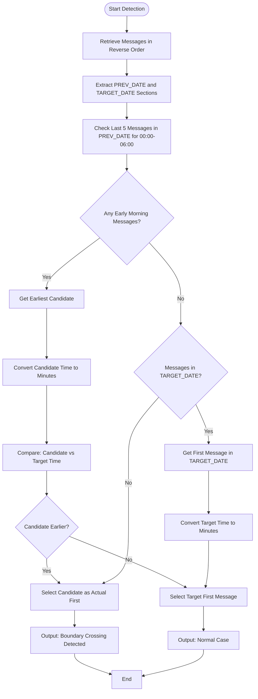

# Boundary-Aware Detection

<cite>
**Referenced Files in This Document**   
- [boundary_aware_first_message_detector.sh](file://tests/boundary_aware_first_message_detector.sh)
- [simple_boundary_check.py](file://scripts/telegram_tools/simple_boundary_check.py)
- [test_first_message_border_detection.sh](file://tests/test_first_message_border_detection.sh)
</cite>

## Table of Contents
1. [Introduction](#introduction)
2. [Core Problem: Timezone Boundary Misalignment](#core-problem-timezone-boundary-misalignment)
3. [Boundary-Aware Detection Mechanism](#boundary-aware-detection-mechanism)
4. [Time-to-Minutes Conversion Logic](#time-to-minutes-conversion-logic)
5. [Decision Algorithm for First Message Identification](#decision-algorithm-for-first-message-identification)
6. [Color-Coded Output and User Feedback](#color-coded-output-and-user-feedback)
7. [Common Issues and Edge Cases](#common-issues-and-edge-cases)
8. [Troubleshooting Guide](#troubleshooting-guide)
9. [Conclusion](#conclusion)

## Introduction
The boundary-aware first message detection mechanism addresses a critical issue in Telegram channel message ordering: timezone boundary misalignment. Due to the discrepancy between UTC timestamps and local time display (e.g., Moscow time), early morning messages (00:00–06:00) may appear under the previous day's section, leading to incorrect chronological interpretation. This document details the implementation of a robust detection system that analyzes cross-date message sections to accurately identify the true first message of any given day.

## Core Problem: Timezone Boundary Misalignment
Telegram stores all message timestamps in UTC but displays them in local time zones. When retrieving messages in reverse chronological order, the UI groups messages by their displayed local date. This causes messages posted between 00:00 and 06:00 Moscow time (which correspond to 21:00–03:00 UTC the previous day) to be grouped under the prior date's section. As a result, the apparent "first message" of a day may not reflect the actual earliest message when viewed chronologically in local time.

**Section sources**
- [boundary_aware_first_message_detector.sh](file://tests/boundary_aware_first_message_detector.sh#L1-L20)

## Boundary-Aware Detection Mechanism
The detection mechanism operates by analyzing both the target date and the previous day’s message sections. It retrieves a sufficient number of recent messages (using `--limit 300 --order reverse`) to ensure coverage across date boundaries.

The script calculates the previous calendar date (`PREV_DATE`) and extracts message sections for both `PREV_DATE` and `TARGET_DATE` using pattern-based parsing of the `==== YYYY-MM-DD` section headers. This allows isolation of messages belonging to each date group as displayed in the client.

Key steps:
1. Retrieve messages in reverse chronological order
2. Extract message blocks for both current and previous date sections
3. Analyze late messages from the previous day for early morning timestamps
4. Compare candidates with the first message from the target date section

**Section sources**
- [boundary_aware_first_message_detector.sh](file://tests/boundary_aware_first_message_detector.sh#L45-L74)

## Time-to-Minutes Conversion Logic
To enable chronological comparison of message timestamps, the system implements a `time_to_minutes` function that converts time strings into minutes since midnight.

```bash
time_to_minutes() {
    local time_str="$1"
    if [[ "$time_str" =~ \[([0-9]+):([0-9]+):([0-9]+)\] ]]; then
        local hours="${BASH_REMATCH[1]}"
        local minutes="${BASH_REMATCH[2]}"
        echo $((hours * 60 + minutes))
    else
        echo "9999"  # Invalid time
    fi
}
```

This function parses the `[HH:MM:SS]` format from message lines and returns the total number of minutes (`hours * 60 + minutes`). This numeric representation enables direct comparison between message times, allowing the system to determine which message occurred earlier in the day.

**Section sources**
- [boundary_aware_first_message_detector.sh](file://tests/boundary_aware_first_message_detector.sh#L74-L88)

## Decision Algorithm for First Message Identification
The decision algorithm evaluates two potential sources for the actual first message:

1. **Early Morning Candidates**: The last 5 messages from the previous day’s section are scanned for timestamps between 00:00 and 06:00 (≤ 360 minutes).
2. **Target Section First Message**: The last message in the target date section (due to reverse ordering) is considered the apparent first message.

The algorithm proceeds as follows:
- If early morning candidates exist, the earliest one is selected as `EARLIEST_CANDIDATE`
- The time of this candidate is converted to minutes (`CANDIDATE_MINUTES`)
- If a message exists in the target section, its time is similarly converted (`TARGET_MINUTES`)
- If `CANDIDATE_MINUTES < TARGET_MINUTES`, the candidate is deemed the actual first message
- Otherwise, the target section’s first message is used

This logic ensures that messages crossing the timezone boundary are correctly identified as belonging to the new day.



**Diagram sources**
- [boundary_aware_first_message_detector.sh](file://tests/boundary_aware_first_message_detector.sh#L88-L150)

**Section sources**
- [boundary_aware_first_message_detector.sh](file://tests/boundary_aware_first_message_detector.sh#L88-L150)

## Color-Coded Output and User Feedback
The system uses ANSI color codes to provide clear visual feedback during execution:

- `${CYAN}`: Section headers and major milestones
- `${BLUE}`: Analytical steps and process indicators
- `${GREEN}`: Success indicators and final results
- `${YELLOW}`: Warnings and potential boundary crossings
- `${RED}`: Errors and failure conditions

When a boundary crossing is detected, the output explicitly states:
```
📍 BOUNDARY CROSSING DETECTED:
Early morning message from PREV_DATE section is actually first message of TARGET_DATE
```

The final result includes structured details:
- Source section (previous or target day)
- Timestamp in Moscow time
- Sender name
- Truncated message content

This feedback system enables users to quickly verify the correctness of the detection.

**Section sources**
- [boundary_aware_first_message_detector.sh](file://tests/boundary_aware_first_message_detector.sh#L150-L156)

## Common Issues and Edge Cases
Several edge cases can affect detection accuracy:

1. **Missing Messages**: If the message limit is too low, boundary messages may be excluded from the result set.
2. **No Messages in Target Date**: When no messages exist in the target section, the system must rely solely on early morning candidates.
3. **Invalid Time Formats**: Malformed message lines can cause parsing failures (handled by returning 9999 minutes).
4. **Time Gaps Near Midnight**: Large gaps between days can make boundary detection ambiguous.
5. **Cache Staleness**: Outdated cache files may not reflect recent messages, leading to incorrect results.

The `simple_boundary_check.py` script provides a basic cache freshness check to mitigate staleness issues by verifying file modification time against a configurable age threshold.

**Section sources**
- [test_first_message_border_detection.sh](file://tests/test_first_message_border_detection.sh#L0-L56)
- [simple_boundary_check.py](file://scripts/telegram_tools/simple_boundary_check.py#L0-L47)

## Troubleshooting Guide
When inaccurate detections occur, follow this checklist:

1. **Verify Message Limit**: Ensure `--limit` is high enough (≥300) to capture boundary messages.
2. **Check Cache Freshness**: Run `simple_boundary_check.py` to confirm cache is not stale.
3. **Validate Timezone Settings**: Confirm system timezone is set to Europe/Moscow.
4. **Inspect Message Formatting**: Ensure message lines follow `[HH:MM:SS] Sender: Content` format.
5. **Test with Known Cases**: Use `test_first_message_border_detection.sh` to validate against known message patterns.
6. **Review Boundary Context**: Manually inspect messages around the date boundary to verify grouping.

For persistent issues, increase verbosity or use alternative detection methods like message ID sequential analysis.

**Section sources**
- [test_first_message_border_detection.sh](file://tests/test_first_message_border_detection.sh#L0-L56)
- [simple_boundary_check.py](file://scripts/telegram_tools/simple_boundary_check.py#L0-L47)

## Conclusion
The boundary-aware first message detection mechanism effectively resolves timezone-related message ordering issues in Telegram channels. By analyzing both the target date and previous day’s message sections, converting times to comparable numeric values, and applying a logical decision algorithm, the system accurately identifies the true first message of any day. The color-coded output provides clear user feedback, while robust handling of edge cases ensures reliability across diverse scenarios. This approach represents a significant improvement over naive date-section-based detection methods.