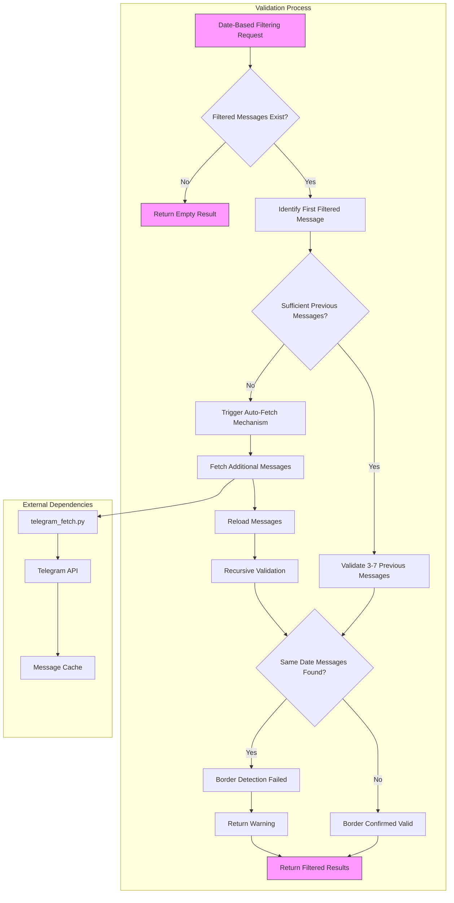
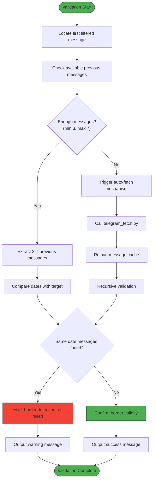
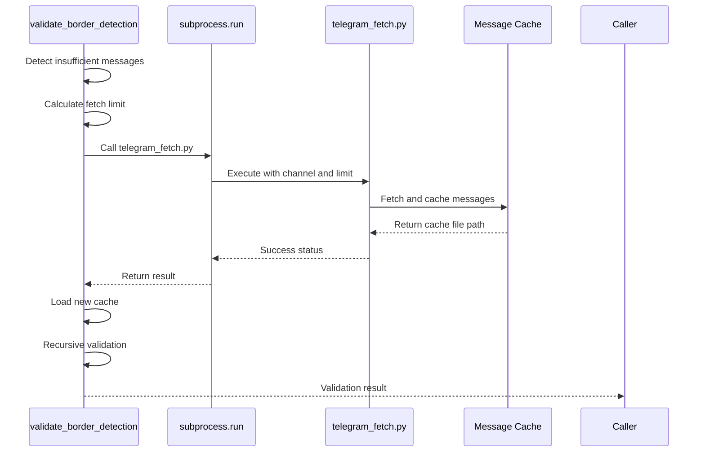
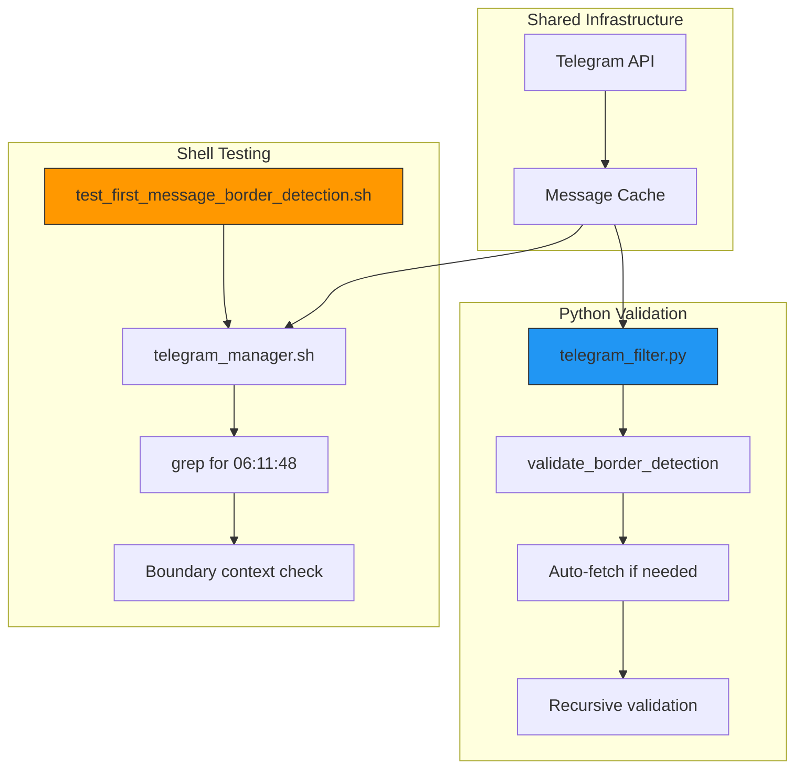
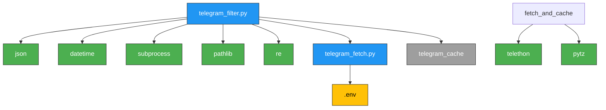

# Fallback Border Validation

<cite>
**Referenced Files in This Document**   
- [telegram_filter.py](file://scripts/telegram_tools/core/telegram_filter.py)
- [telegram_fetch.py](file://scripts/telegram_tools/core/telegram_fetch.py)
- [test_first_message_border_detection.sh](file://tests/test_first_message_border_detection.sh)
</cite>

## Table of Contents
1. [Introduction](#introduction)
2. [Core Components](#core-components)
3. [Architecture Overview](#architecture-overview)
4. [Detailed Component Analysis](#detailed-component-analysis)
5. [Dependency Analysis](#dependency-analysis)
6. [Troubleshooting Guide](#troubleshooting-guide)
7. [Conclusion](#conclusion)

## Introduction

The fallback border validation mechanism in the `telegram_filter.py` module serves as a critical safeguard for accurate date-based message retrieval. This system ensures that when filtering messages by date (such as "today" or a specific date), the boundary between dates is correctly identified, preventing the inclusion of messages from the wrong day due to potential detection issues. The mechanism operates as a secondary validation layer that checks the integrity of date borders by examining messages immediately preceding the first detected message of the target date.

This validation is particularly important in scenarios where message ordering or timestamp accuracy might be compromised, ensuring that date-based filtering remains reliable even when edge cases occur. The system employs a sophisticated algorithm that combines immediate validation with an auto-recovery mechanism, making it resilient to incomplete data and capable of self-correction when necessary.

## Core Components

The fallback border validation system consists of several interconnected components that work together to ensure accurate date-based message filtering. The primary component is the `validate_border_detection` function, which implements the core validation logic. This function is triggered automatically whenever date-based filtering occurs and performs a thorough check of the message sequence around date boundaries.

When insufficient data is available for proper validation, the system activates an auto-fetching mechanism that retrieves additional messages to ensure comprehensive analysis. This recovery process involves calling the `telegram_fetch.py` module to obtain more historical messages, which are then re-validated to confirm border accuracy. The integration with shell-based detection scripts provides additional validation layers, creating a robust multi-tiered approach to border detection.

**Section sources**
- [telegram_filter.py](file://scripts/telegram_tools/core/telegram_filter.py#L50-L238)
- [telegram_fetch.py](file://scripts/telegram_tools/core/telegram_fetch.py#L1-L146)

## Architecture Overview

The fallback border validation system operates within a layered architecture that prioritizes data integrity and reliability. The validation process is integrated into the message filtering workflow, acting as a gatekeeper that ensures date boundaries are correctly identified before results are returned.

**Diagram sources **
- [telegram_filter.py](file://scripts/telegram_tools/core/telegram_filter.py#L50-L145)
- [telegram_fetch.py](file://scripts/telegram_tools/core/telegram_fetch.py#L1-L146)

## Detailed Component Analysis

### Fallback Border Detection Algorithm

The `validate_border_detection` function implements a sophisticated algorithm designed to verify the accuracy of date-based message boundaries. The process begins by identifying the first message in the filtered set (which represents the earliest message of the target date) and locating its position within the complete message sequence. Since messages are stored in reverse chronological order, this first filtered message appears at the end of the filtered list but at a specific index in the original messages array.

The algorithm then examines 3-7 messages immediately preceding this border message to ensure they belong to a different date. This range is chosen to balance thoroughness with performance - checking too few messages might miss border issues, while checking too many would impact efficiency. The validation process compares the date portion of the `date_msk` field (Moscow time) between the target date and each preceding message.

**Diagram sources **
- [telegram_filter.py](file://scripts/telegram_tools/core/telegram_filter.py#L50-L145)

**Section sources**
- [telegram_filter.py](file://scripts/telegram_tools/core/telegram_filter.py#L50-L145)

### Auto-Fetching Recovery Mechanism

When the validation process detects insufficient previous messages (fewer than 3), it triggers an auto-fetching recovery mechanism to ensure proper border validation. This critical safeguard prevents the system from making unreliable determinations based on incomplete data. The auto-fetch process calculates the required number of additional messages needed and invokes the `telegram_fetch.py` script through a subprocess call.

The fetch limit is calculated using a conservative formula: `max(500, len(messages) + needed_messages + 100)`, ensuring that significantly more messages are retrieved than minimally required. This approach accounts for potential gaps in message history and provides ample data for comprehensive validation. The subprocess call includes the channel identifier and calculated fetch limit, executing in the context of the script directory to maintain proper relative paths.

After successful fetching, the system reloads the updated cache file and recursively calls the validation function with the expanded message set. To prevent infinite recursion, the channel parameter is set to `None` in the recursive call, disabling further auto-fetch attempts. This creates a fail-safe mechanism that allows validation to proceed even if additional fetching fails.

**Diagram sources **
- [telegram_filter.py](file://scripts/telegram_tools/core/telegram_filter.py#L85-L135)
- [telegram_fetch.py](file://scripts/telegram_tools/core/telegram_fetch.py#L1-L146)

### Integration with Shell-Based Detection Scripts

The Python-based fallback validation complements a suite of shell scripts designed for first message detection and border testing. These shell scripts, such as `test_first_message_border_detection.sh`, provide independent verification of border detection accuracy and serve as test cases for the Python validation logic.

The integration between these systems is conceptual rather than direct - both approaches aim to solve the same problem of reliable first message identification but operate in different contexts. The shell scripts use `telegram_manager.sh` to retrieve messages and apply grep-based pattern matching to identify specific timestamps, while the Python validation uses structured JSON data and programmatic date comparison.

This multi-tool approach creates a robust validation ecosystem where the Python function serves as the primary runtime safeguard, while the shell scripts provide development-time testing and verification. The known target message at "06:11:48" referenced in the test script serves as a ground truth reference point that both systems can validate against.

**Diagram sources **
- [telegram_filter.py](file://scripts/telegram_tools/core/telegram_filter.py#L50-L145)
- [test_first_message_border_detection.sh](file://tests/test_first_message_border_detection.sh#L1-L56)

**Section sources**
- [test_first_message_border_detection.sh](file://tests/test_first_message_border_detection.sh#L1-L56)

## Dependency Analysis

The fallback border validation system has a well-defined dependency structure that ensures modularity while maintaining necessary integration points. The primary dependency is on the message cache system, which provides the JSON data structure containing messages with Moscow time timestamps. This dependency is critical as the validation algorithm relies on the `date_msk` field for accurate date comparison.

The system depends on `telegram_fetch.py` for the auto-recovery mechanism, calling it as a subprocess when additional messages are needed. This loose coupling allows the fetch functionality to be maintained independently while still being accessible when required. The validation function also depends on standard Python libraries including `json`, `datetime`, and `subprocess` for core functionality.

External dependencies include the Telethon library (indirectly through `telegram_fetch.py`) and environment variables containing Telegram API credentials. The system assumes a specific directory structure with cache files stored in a `telegram_cache` directory relative to the script location.

**Diagram sources **
- [telegram_filter.py](file://scripts/telegram_tools/core/telegram_filter.py#L1-L238)
- [telegram_fetch.py](file://scripts/telegram_tools/core/telegram_fetch.py#L1-L146)

**Section sources**
- [telegram_filter.py](file://scripts/telegram_tools/core/telegram_filter.py#L1-L238)
- [telegram_fetch.py](file://scripts/telegram_tools/core/telegram_fetch.py#L1-L146)

## Troubleshooting Guide

When border detection consistently fails, several troubleshooting steps can help identify and resolve the issue. First, verify that the message cache contains sufficient historical data by checking the number of messages in the cache file. If the cache is too small, the auto-fetch mechanism should automatically retrieve more messages, but you can manually trigger this by running `telegram_fetch.py` with a higher limit.

Check the console output for specific validation messages that indicate the nature of the problem. Messages like "Not enough previous messages to validate" suggest insufficient data, while "Border detection issue: Message X before border has same date" indicates actual border misidentification. The detailed validation output shows each message being checked, including IDs and timestamps, which can help pinpoint problematic messages.

Ensure that timezone handling is correct by verifying that the `date_msk` field shows proper Moscow time timestamps. Issues with timezone conversion can cause messages to be assigned to incorrect dates. The system relies on the `pytz` library and proper system timezone configuration.

If auto-fetching fails, check that the `telegram_fetch.py` script is executable and that API credentials in the `.env` file are correct. Network connectivity to Telegram's servers should also be verified. For persistent issues, examine the shell test scripts like `test_first_message_border_detection.sh` to see if they also encounter problems, which would indicate a systemic issue rather than a problem with the Python validation logic.

**Section sources**
- [telegram_filter.py](file://scripts/telegram_tools/core/telegram_filter.py#L50-L145)
- [test_first_message_border_detection.sh](file://tests/test_first_message_border_detection.sh#L1-L56)

## Conclusion

The fallback border validation mechanism in `telegram_filter.py` provides a robust safeguard for accurate date-based message retrieval. By implementing a multi-layered approach that combines immediate validation with auto-recovery capabilities, the system ensures reliable border detection even in edge cases. The algorithm's design balances thoroughness with efficiency, checking 3-7 preceding messages to verify date boundaries while avoiding excessive processing.

The integration of an auto-fetching mechanism demonstrates thoughtful error recovery, allowing the system to self-correct when insufficient data is available. This proactive approach to data integrity, combined with clear console feedback and recursive validation, creates a resilient system that maintains accuracy across varying data conditions.

The relationship with shell-based detection scripts provides additional validation layers, creating a comprehensive ecosystem for first message detection. This multi-tool approach allows for both runtime protection and development-time testing, ensuring the reliability of date-based filtering across the entire application lifecycle.