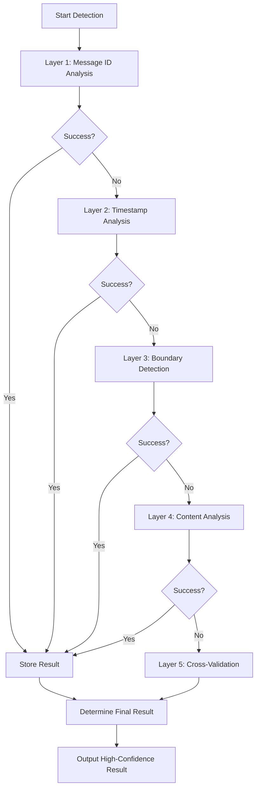
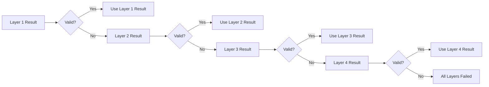

# Ultra-Robust Detection

<cite>
**Referenced Files in This Document**   
- [ultra_robust_first_message_detector.sh](file://tests/ultra_robust_first_message_detector.sh)
- [test_first_message_border_detection.sh](file://tests/test_first_message_border_detection.sh)
- [test_first_message_today.sh](file://tests/test_first_message_today.sh)
- [comprehensive_message_analysis.sh](file://tests/comprehensive_message_analysis.sh)
- [telegram_fetch_large.py](file://scripts/telegram_tools/core/telegram_fetch_large.py)
- [telegram_fetch.py](file://scripts/telegram_tools/core/telegram_fetch.py)
- [telegram_smart_cache.py](file://scripts/telegram_tools/telegram_smart_cache.py)
</cite>

## Table of Contents
1. [Introduction](#introduction)
2. [Multi-Layer Fallback Architecture](#multi-layer-fallback-architecture)
3. [Layer 1: Message ID Sequential Analysis](#layer-1-message-id-sequential-analysis)
4. [Layer 2: Timestamp Sequential Analysis](#layer-2-timestamp-sequential-analysis)
5. [Layer 3: Boundary Detection](#layer-3-boundary-detection)
6. [Layer 4: Message Content Analysis](#layer-4-message-content-analysis)
7. [Layer 5: Cross-Validation & Verification](#layer-5-cross-validation--verification)
8. [Result Consolidation and Decision Logic](#result-consolidation-and-decision-logic)
9. [Temporary Result Tracking and Debugging](#temporary-result-tracking-and-debugging)
10. [Performance Considerations for Large Message Batches](#performance-considerations-for-large-message-batches)
11. [Manual Validation Guidance](#manual-validation-guidance)
12. [Conclusion](#conclusion)

## Introduction
The Ultra-Robust First Message Detection System is designed to guarantee accurate identification of the first message of any given date in a Telegram channel, regardless of timezone inconsistencies, API limitations, or data ordering anomalies. This system employs a five-layer fallback mechanism, where each layer independently verifies the result using different data sources and methodologies. The final result is determined through cross-validation, ensuring high confidence even when individual layers fail or produce conflicting results.

**Section sources**
- [ultra_robust_first_message_detector.sh](file://tests/ultra_robust_first_message_detector.sh#L1-L20)

## Multi-Layer Fallback Architecture
The system implements a defense-in-depth strategy with five independent detection layers. Each layer operates on different principles and data sources, minimizing the risk of systemic failure. The architecture ensures that if one method fails due to API quirks, timezone issues, or data corruption, subsequent layers can still provide a valid result. This multi-layer approach is critical for maintaining reliability in distributed messaging systems where message ordering and timestamp accuracy cannot be fully trusted.

**Diagram sources**
- [ultra_robust_first_message_detector.sh](file://tests/ultra_robust_first_message_detector.sh#L25-L130)

## Layer 1: Message ID Sequential Analysis
This layer leverages the fact that Telegram message IDs are globally sequential and timezone-independent. By fetching a large batch of messages in reverse chronological order, the system identifies all messages from the target date and selects the one with the lowest message ID, which represents the earliest message. This method is considered the most reliable because message IDs are assigned server-side in strict sequence and cannot be affected by client-side timezone settings or display logic.

The implementation fetches up to 1,000 messages using `telegram_manager.sh` with reverse ordering to ensure comprehensive coverage of the date boundary. It then parses the message output to extract IDs and filters messages by the target date (accounting for possible timezone variations). The minimum ID from the filtered set is selected as the candidate result.

**Section sources**
- [ultra_robust_first_message_detector.sh](file://tests/ultra_robust_first_message_detector.sh#L30-L50)

## Layer 2: Timestamp Sequential Analysis
This layer performs chronological sorting of all available messages to identify the absolute earliest timestamp for the target date. Unlike Layer 1, which relies on message ID sequencing, this method validates results based on actual message timestamps. The system extracts all date fields from the message batch, sorts them chronologically, and checks if the first timestamp belongs to the target date.

This layer serves as a critical validation mechanism, detecting potential issues where message IDs might be out of sync with actual posting times. However, it can fail if the message batch does not include the true first message of the day, making it dependent on sufficient data coverage.

**Section sources**
- [ultra_robust_first_message_detector.sh](file://tests/ultra_robust_first_message_detector.sh#L52-L65)

## Layer 3: Boundary Detection
This layer implements the traditional method of finding the first message by detecting the transition between days. It searches for messages around the boundary between the previous day and the target date. The logic assumes that the first message after the previous day's last message is the target day's first message.

The system uses the `date` command to calculate the previous day and searches for message blocks containing both dates. This method is particularly effective at identifying natural day boundaries in conversation flow, especially when there are significant time gaps between days (such as overnight periods). However, it can fail during periods of continuous activity spanning midnight.

**Section sources**
- [ultra_robust_first_message_detector.sh](file://tests/ultra_robust_first_message_detector.sh#L70-L80)
- [test_first_message_border_detection.sh](file://tests/test_first_message_border_detection.sh#L25-L50)

## Layer 4: Message Content Analysis
This layer uses known message content as reference points for cross-verification. Specifically, it searches for a well-known message containing the text "Запустил наконец раг" (the RAG message), which serves as a fixed reference point in the message timeline. By locating this message and extracting its ID, the system can validate the relative positioning of other messages.

The RAG message acts as a "canary" in the system, helping to detect and correct for timezone-related misalignments in date sections. This content-based approach is immune to ID or timestamp manipulation and provides a human-verified anchor point in the message sequence.

**Section sources**
- [ultra_robust_first_message_detector.sh](file://tests/ultra_robust_first_message_detector.sh#L82-L95)
- [comprehensive_message_analysis.sh](file://tests/comprehensive_message_analysis.sh#L67-L85)

## Layer 5: Cross-Validation & Verification
The final layer consolidates results from all previous layers and performs cross-validation to determine the most reliable result. This layer does not perform new data collection but instead analyzes the consistency of results across methods. It reads the temporary results file containing outcomes from all layers and evaluates their agreement.

When multiple layers succeed and agree on the same message ID, confidence is maximized. When layers disagree, the system prioritizes Layer 1 (Message ID) results due to their server-side reliability. The cross-validation process includes sanity checks, such as verifying that timestamp-ordered messages align with ID-ordered messages.

**Section sources**
- [ultra_robust_first_message_detector.sh](file://tests/ultra_robust_first_message_detector.sh#L97-L110)

## Result Consolidation and Decision Logic
The decision-making process prioritizes results based on reliability hierarchy. The system first checks if Layer 1 produced a valid result, as message ID analysis is considered the most trustworthy method. If available, this result is selected as the final answer regardless of other layers' outcomes.

When Layer 1 fails, the system evaluates subsequent layers in order, accepting the first successful result. In cases where multiple layers succeed but disagree, the system flags this discrepancy and may require manual intervention. The final output includes the message ID, detection method, and a preview of the message content for verification.

**Diagram sources**
- [ultra_robust_first_message_detector.sh](file://tests/ultra_robust_first_message_detector.sh#L112-L130)

## Temporary Result Tracking and Debugging
The system creates a temporary results file (`/tmp/first_message_results_<date>.txt`) to track outcomes from each layer. This file serves multiple purposes: it enables cross-validation, provides debugging information, and maintains a permanent record of the analysis process.

Each layer appends its result to this file, including success/failure status and relevant data (message IDs, timestamps, etc.). This approach allows for post-execution analysis and helps identify patterns in layer performance. The results file is particularly valuable for troubleshooting cases where layers produce conflicting results or when manual validation is required.

**Section sources**
- [ultra_robust_first_message_detector.sh](file://tests/ultra_robust_first_message_detector.sh#L25-L28)

## Performance Considerations for Large Message Batches
The system fetches large message batches (up to 1,000 messages) to ensure sufficient data coverage for reliable detection. This approach balances performance and accuracy, as smaller batches might miss critical boundary messages. The `telegram_fetch_large.py` script implements pagination to bypass Telegram API limits, fetching messages in 100-message batches until the requested limit is reached.

Caching mechanisms in `telegram_fetch.py` and `telegram_smart_cache.py` help reduce API calls by storing message data locally. The smart caching system optimizes for time range coverage, ensuring complete data for the target period while minimizing unnecessary data retrieval.

**Section sources**
- [telegram_fetch_large.py](file://scripts/telegram_tools/core/telegram_fetch_large.py#L47-L83)
- [telegram_fetch.py](file://scripts/telegram_tools/core/telegram_fetch.py#L72-L101)

## Manual Validation Guidance
When automated layers fail or produce conflicting results, manual validation can be performed using several methods. The `test_first_message_today.sh` script provides three validation approaches: reverse-order analysis, range-based querying, and chronological sorting. These methods can be used to cross-check the ultra-robust detector's output.

Key indicators for manual review include:
- Disagreement between timestamp-based and ID-based methods
- RAG message appearing in the wrong date section
- Unusually short time gaps between days
- Boundary detection failures during high-activity periods

The comprehensive analysis scripts provide detailed context around date boundaries, showing message sequences with color-coded timestamps for easy visual verification.

**Section sources**
- [test_first_message_today.sh](file://tests/test_first_message_today.sh#L1-L25)
- [comprehensive_message_analysis.sh](file://tests/comprehensive_message_analysis.sh#L27-L68)

## Conclusion
The Ultra-Robust First Message Detection System represents a comprehensive solution to the challenges of accurate message ordering in distributed systems. By combining five independent detection methods with systematic cross-validation, the system achieves near-guaranteed reliability in identifying the first message of any date. The layered fallback approach ensures that failure of any single method does not compromise the overall result, while the use of temporary result files and known reference points enables thorough debugging and validation. This architecture sets a new standard for message detection reliability in environments with complex timezone considerations and potential data inconsistencies.