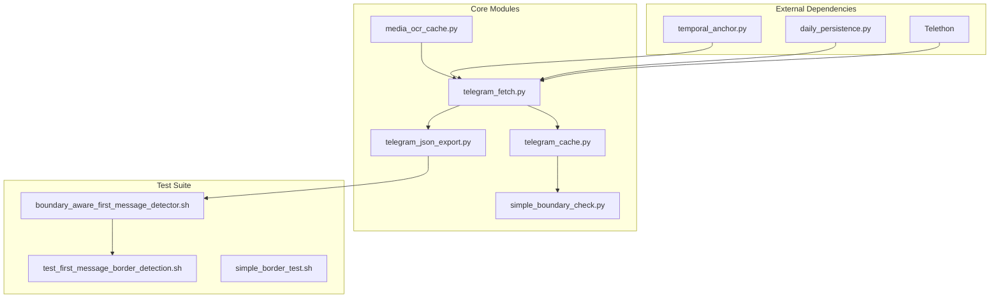
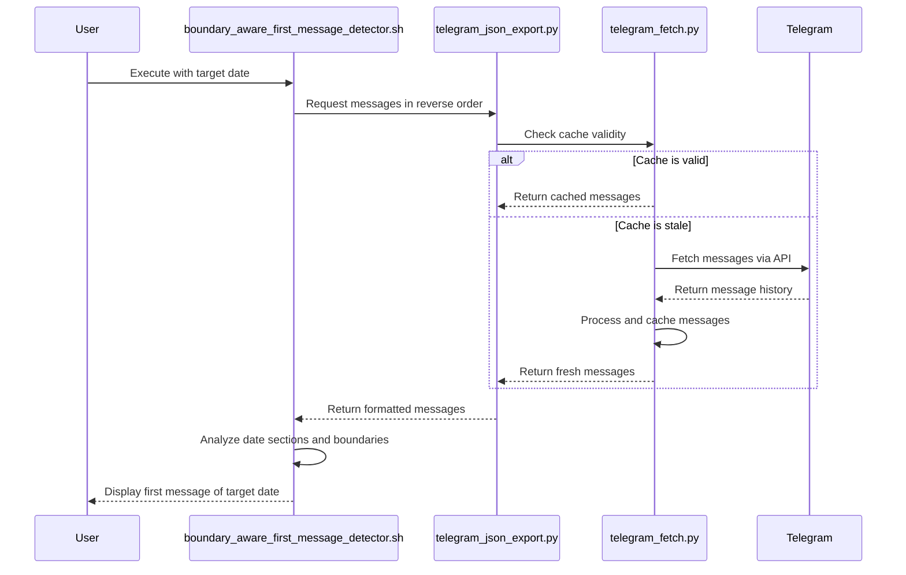
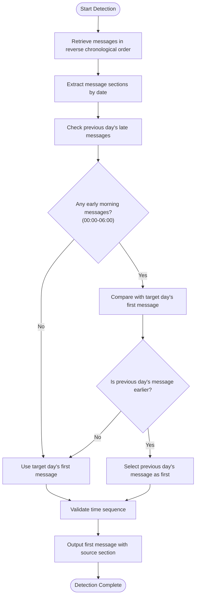
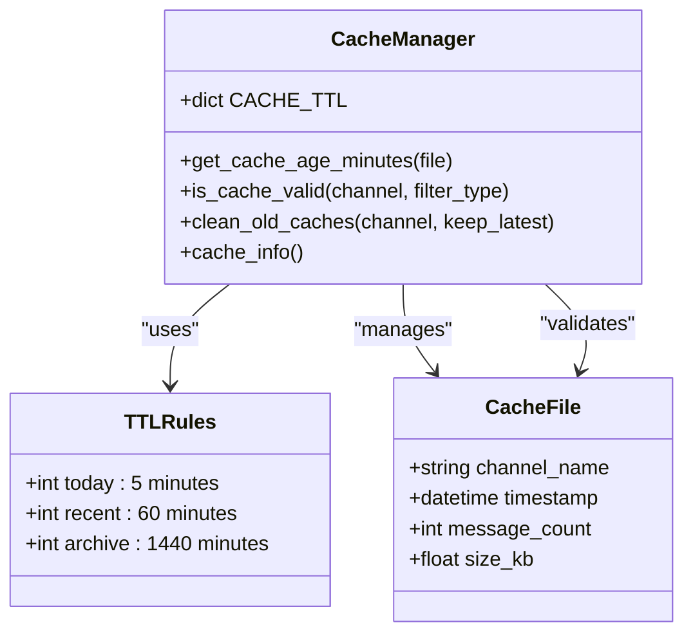
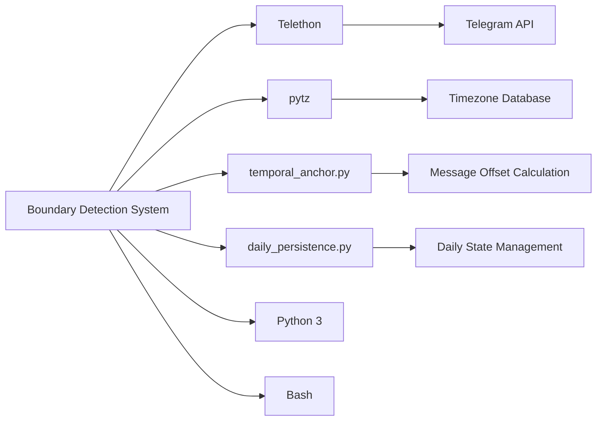

# Boundary Detection System

<cite>
**Referenced Files in This Document**   
- [simple_boundary_check.py](file://scripts/telegram_tools/simple_boundary_check.py)
- [telegram_fetch.py](file://scripts/telegram_tools/core/telegram_fetch.py)
- [telegram_json_export.py](file://scripts/telegram_tools/core/telegram_json_export.py)
- [telegram_cache.py](file://scripts/telegram_tools/core/telegram_cache.py)
- [media_ocr_cache.py](file://scripts/telegram_tools/core/media_ocr_cache.py)
- [boundary_aware_first_message_detector.sh](file://tests/boundary_aware_first_message_detector.sh)
- [test_first_message_border_detection.sh](file://tests/test_first_message_border_detection.sh)
- [simple_border_test.sh](file://tests/simple_border_test.sh)
</cite>

## Table of Contents
1. [Introduction](#introduction)
2. [Project Structure](#project-structure)
3. [Core Components](#core-components)
4. [Architecture Overview](#architecture-overview)
5. [Detailed Component Analysis](#detailed-component-analysis)
6. [Dependency Analysis](#dependency-analysis)
7. [Performance Considerations](#performance-considerations)
8. [Troubleshooting Guide](#troubleshooting-guide)
9. [Conclusion](#conclusion)

## Introduction
The Boundary Detection System is designed to accurately identify message boundaries in Telegram channels, particularly focusing on detecting the first message of a new day. This system addresses challenges related to timezone boundaries, message ordering, and cache freshness in time-sensitive data processing workflows. The solution combines Python-based caching mechanisms with Bash-based boundary detection logic to ensure reliable identification of daily message borders.

## Project Structure
The Boundary Detection System is organized into three main directories: scripts, tests, and documentation. The core functionality resides in the scripts/telegram_tools directory, with specialized modules for fetching, caching, and analyzing Telegram messages. Test scripts validate boundary detection accuracy, while the system integrates with external components like temporal anchoring and media OCR processing.

**Diagram sources**
- [telegram_fetch.py](file://scripts/telegram_tools/core/telegram_fetch.py#L1-L233)
- [telegram_cache.py](file://scripts/telegram_tools/core/telegram_cache.py#L1-L178)
- [boundary_aware_first_message_detector.sh](file://tests/boundary_aware_first_message_detector.sh#L1-L156)

**Section sources**
- [scripts/telegram_tools](file://scripts/telegram_tools)
- [tests](file://tests)

## Core Components
The Boundary Detection System comprises several key components that work together to identify message boundaries in Telegram channels. The system uses a combination of Python scripts for data retrieval and caching, and Bash scripts for boundary analysis. The core functionality includes message fetching with temporal anchoring, intelligent cache management based on time-to-live rules, and boundary-aware detection of daily message transitions.

**Section sources**
- [simple_boundary_check.py](file://scripts/telegram_tools/simple_boundary_check.py#L1-L47)
- [telegram_fetch.py](file://scripts/telegram_tools/core/telegram_fetch.py#L1-L233)
- [telegram_json_export.py](file://scripts/telegram_tools/core/telegram_json_export.py#L1-L124)

## Architecture Overview
The Boundary Detection System follows a layered architecture with clear separation between data acquisition, caching, and analysis components. The system retrieves Telegram messages through the Telethon library, processes them with Moscow timezone conversion, and stores them in JSON format with comprehensive metadata. Cache validity is determined by time-based rules that vary according to data recency, ensuring optimal balance between freshness and performance.

**Diagram sources**
- [boundary_aware_first_message_detector.sh](file://tests/boundary_aware_first_message_detector.sh#L1-L156)
- [telegram_json_export.py](file://scripts/telegram_tools/core/telegram_json_export.py#L1-L124)
- [telegram_fetch.py](file://scripts/telegram_tools/core/telegram_fetch.py#L1-L233)

## Detailed Component Analysis

### Boundary Detection Algorithm
The boundary detection system addresses the challenge of identifying the first message of a day in Telegram channels, where timezone differences can cause messages to appear under incorrect date headers. The algorithm analyzes message sequences across date boundaries to identify early morning messages that may have been misclassified under the previous day's section.

#### Boundary-Aware Detection Logic

**Diagram sources**
- [boundary_aware_first_message_detector.sh](file://tests/boundary_aware_first_message_detector.sh#L1-L156)
- [test_first_message_border_detection.sh](file://tests/test_first_message_border_detection.sh#L1-L56)

**Section sources**
- [boundary_aware_first_message_detector.sh](file://tests/boundary_aware_first_message_detector.sh#L1-L156)
- [test_first_message_border_detection.sh](file://tests/test_first_message_border_detection.sh#L1-L56)

### Cache Management System
The cache management component ensures data freshness while minimizing unnecessary API calls to Telegram. It implements a tiered TTL (Time-To-Live) strategy based on message recency, with shorter expiration times for recent data and longer durations for historical messages.

#### Cache Validity Rules

**Diagram sources**
- [telegram_cache.py](file://scripts/telegram_tools/core/telegram_cache.py#L1-L178)
- [simple_boundary_check.py](file://scripts/telegram_tools/simple_boundary_check.py#L1-L47)

**Section sources**
- [telegram_cache.py](file://scripts/telegram_tools/core/telegram_cache.py#L1-L178)
- [simple_boundary_check.py](file://scripts/telegram_tools/simple_boundary_check.py#L1-L47)

## Dependency Analysis
The Boundary Detection System relies on several external dependencies and internal components that work together to provide accurate boundary detection. The system uses the Telethon library for Telegram API access, pytz for timezone handling, and various system utilities for data processing. Internal dependencies include temporal anchoring for smart message fetching and daily persistence for maintaining state across executions.

**Diagram sources**
- [telegram_fetch.py](file://scripts/telegram_tools/core/telegram_fetch.py#L1-L233)
- [requirements.txt](file://requirements.txt) (implied)

**Section sources**
- [telegram_fetch.py](file://scripts/telegram_tools/core/telegram_fetch.py#L1-L233)
- [telegram_cache.py](file://scripts/telegram_tools/core/telegram_cache.py#L1-L178)

## Performance Considerations
The Boundary Detection System is optimized for efficient message retrieval and processing. The cache management system reduces API calls by implementing time-based validity rules, with the most aggressive refresh rate (5 minutes) applied to current day data. Message fetching uses temporal anchoring to minimize data transfer by starting from optimal offset points. The system processes messages in bulk and caches results in JSON format for fast subsequent access.

**Section sources**
- [telegram_cache.py](file://scripts/telegram_tools/core/telegram_cache.py#L1-L178)
- [telegram_fetch.py](file://scripts/telegram_tools/core/telegram_fetch.py#L1-L233)

## Troubleshooting Guide
When encountering issues with the Boundary Detection System, follow these steps to diagnose and resolve common problems:

1. **Cache-related issues**: Verify cache directory permissions and check for sufficient disk space. Use `python telegram_cache.py info` to inspect cache status.
2. **Authentication failures**: Ensure .env file contains valid TELEGRAM_API_ID, TELEGRAM_API_HASH, and TELEGRAM_SESSION values.
3. **Boundary detection errors**: Run `simple_border_test.sh` to manually inspect message boundaries and verify the detection logic.
4. **Missing dependencies**: Install required packages using `pip install telethon pytz pillow pytesseract`.
5. **Timezone issues**: Confirm system timezone is set correctly, as the system relies on Moscow time (Europe/Moscow) for date calculations.

**Section sources**
- [CALUDE.md](file://CALUDE.md#L1-L4)
- [telegram_fetch.py](file://scripts/telegram_tools/core/telegram_fetch.py#L1-L233)
- [boundary_aware_first_message_detector.sh](file://tests/boundary_aware_first_message_detector.sh#L1-L156)

## Conclusion
The Boundary Detection System provides a robust solution for identifying message boundaries in Telegram channels, addressing the challenges of timezone differences and message ordering. By combining intelligent caching, temporal anchoring, and boundary-aware analysis, the system ensures accurate detection of daily message transitions. The modular design allows for easy integration with other components and provides a solid foundation for time-sensitive message processing workflows.