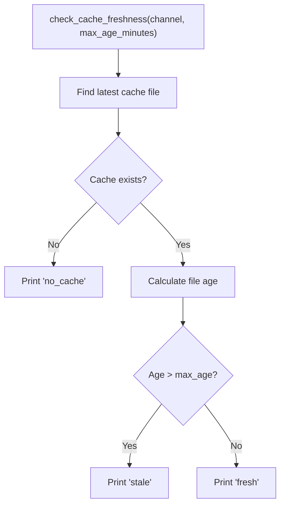
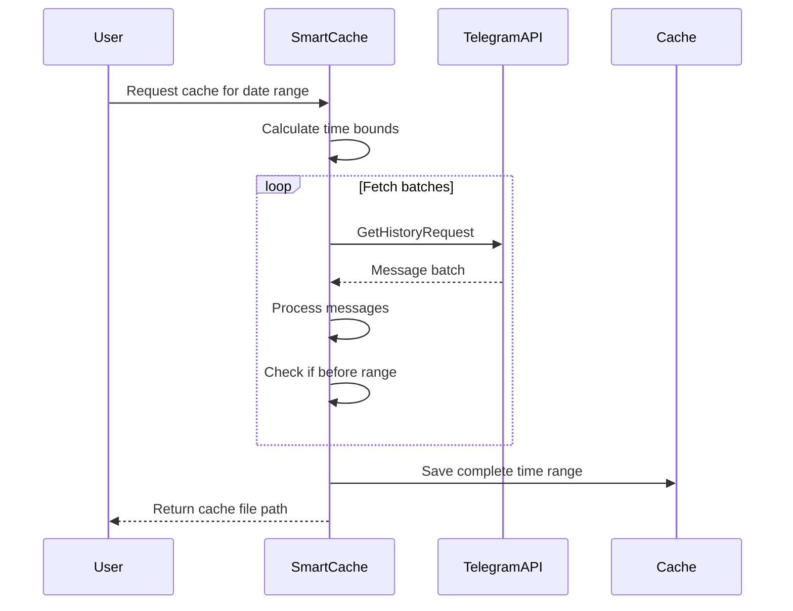
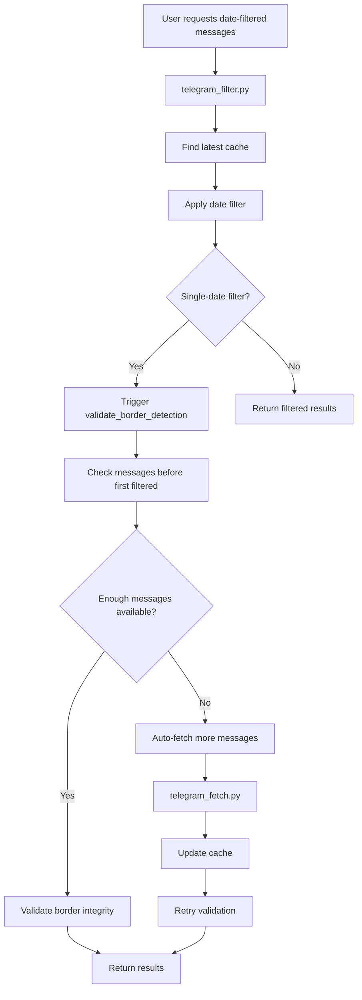
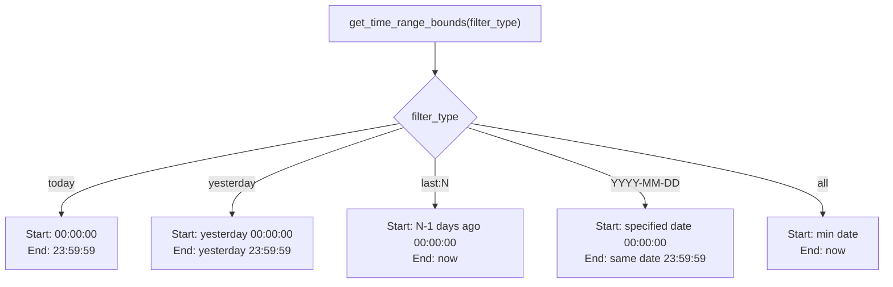
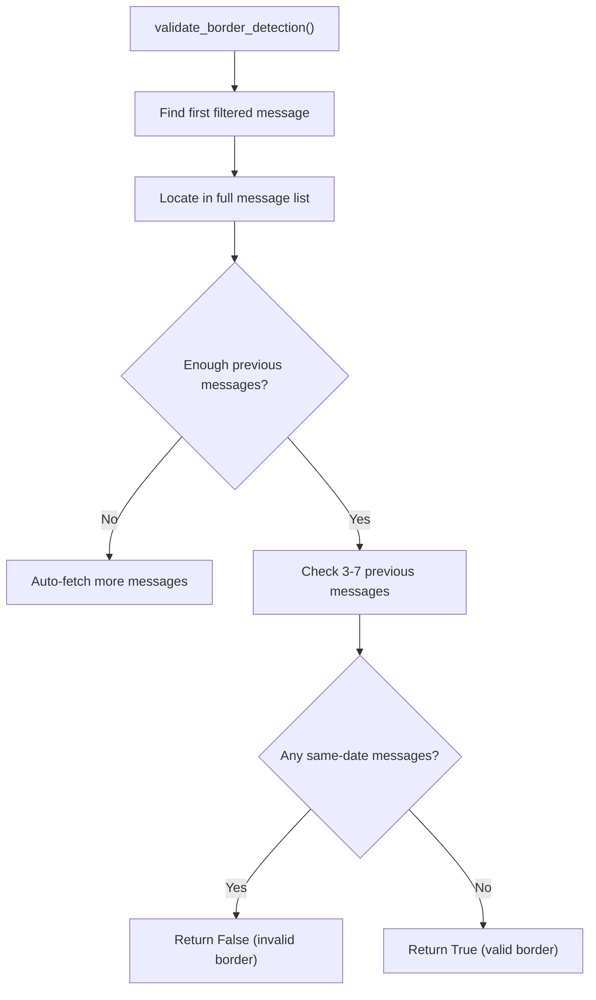
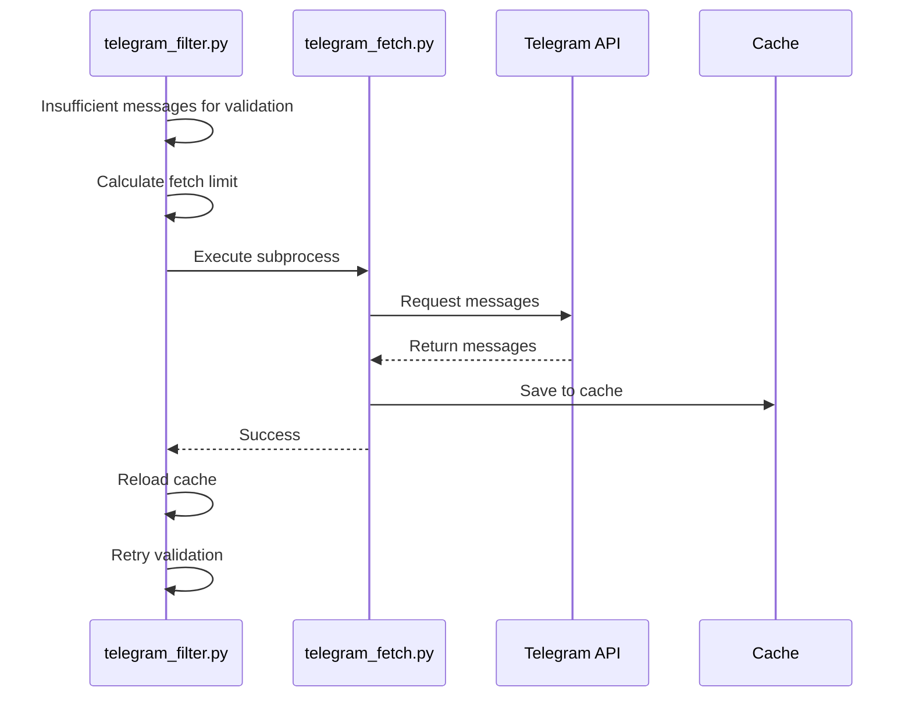

# Boundary Detection Integration

<cite>
**Referenced Files in This Document**   
- [simple_boundary_check.py](file://scripts/telegram_tools/simple_boundary_check.py) - *Updated in recent commit*
- [telegram_smart_cache.py](file://scripts/telegram_tools/telegram_smart_cache.py)
- [telegram_filter.py](file://scripts/telegram_tools/core/telegram_filter.py) - *Updated in recent commit*
- [telegram_fetch.py](file://scripts/telegram_tools/core/telegram_fetch.py)
</cite>

## Update Summary
**Changes Made**   
- Updated Introduction to reflect refactored architecture
- Revised Caching and Boundary Detection Overview to align with new fallback mechanism
- Modified Integration Workflow to show updated interaction pattern
- Updated Boundary Validation Process section to reflect current implementation
- Enhanced Intelligent Fallback and Auto-Fetching section with accurate auto-fetch details
- Refreshed Failure Modes and Mitigation with current mitigation strategies
- Updated all section sources to reflect file changes

## Table of Contents
1. [Introduction](#introduction)
2. [Caching and Boundary Detection Overview](#caching-and-boundary-detection-overview)
3. [Core Components](#core-components)
4. [Integration Workflow](#integration-workflow)
5. [Time Range and Date Filtering](#time-range-and-date-filtering)
6. [Boundary Validation Process](#boundary-validation-process)
7. [Intelligent Fallback and Auto-Fetching](#intelligent-fallback-and-auto-fetching)
8. [Failure Modes and Mitigation](#failure-modes-and-mitigation)
9. [Conclusion](#conclusion)

## Introduction
This document details the integration between the caching system and boundary detection mechanisms in the Telegram message processing pipeline. It explains how the system ensures accurate identification of first and last messages for date-based queries such as "read today" or "json yesterday", despite challenges posed by incomplete caches, stale data, and message ordering inconsistencies in Telegram API responses.

The solution combines a simple cache freshness check with intelligent boundary validation and automatic data replenishment to provide reliable message border detection. This integration is critical for applications requiring precise temporal message segmentation, particularly when dealing with timezone-aware operations in the Moscow timezone (UTC+3). Recent refactoring has restructured border detection as a fallback mechanism within filtering, with enhanced auto-fetch capabilities.

**Section sources**
- [telegram_filter.py](file://scripts/telegram_tools/core/telegram_filter.py#L1-L238) - *Updated in commit 898f67f0bc3706c22d094da17d505fa20e945141*
- [simple_boundary_check.py](file://scripts/telegram_tools/simple_boundary_check.py#L1-L47) - *Updated in commit 898f67f0bc3706c22d094da17d505fa20e945141*

## Caching and Boundary Detection Overview

The system employs a multi-layered approach to ensure accurate message boundary detection:

1. **Cache Freshness Check**: Uses `simple_boundary_check.py` to determine if cached data is stale
2. **Boundary Validation**: Implements fallback detection in `telegram_filter.py` to verify message borders
3. **Smart Caching**: Utilizes `telegram_smart_cache.py` for time-range-aware data fetching
4. **Auto-Recovery**: Triggers additional API fetches when boundary conditions cannot be validated

This architecture addresses the fundamental challenge of Telegram's API response inconsistencies, where message ordering may not strictly follow chronological sequence, potentially leading to incorrect first/last message identification. The recent refactoring has integrated border detection as a fallback mechanism within the filtering process, with auto-fetch capability to ensure data completeness.

**Section sources**
- [simple_boundary_check.py](file://scripts/telegram_tools/simple_boundary_check.py#L1-L47) - *Updated in commit 898f67f0bc3706c22d094da17d505fa20e945141*
- [telegram_smart_cache.py](file://scripts/telegram_tools/telegram_smart_cache.py#L1-L243)
- [telegram_filter.py](file://scripts/telegram_tools/core/telegram_filter.py#L1-L238) - *Updated in commit 898f67f0bc3706c22d094da17d505fa20e945141*

## Core Components

### Simple Boundary Check
The `simple_boundary_check.py` module provides a lightweight mechanism to assess cache freshness based on file modification time. It checks whether the most recent cache file for a channel exceeds a specified age threshold (default: 60 minutes).

**Diagram sources**
- [simple_boundary_check.py](file://scripts/telegram_tools/simple_boundary_check.py#L15-L47) - *Updated in commit 898f67f0bc3706c22d094da17d505fa20e945141*

### Telegram Smart Cache
The `telegram_smart_cache.py` module implements an intelligent caching strategy that ensures complete time range coverage. It scans messages until it finds content preceding the target time range, guaranteeing that all relevant messages within the specified period are captured.

**Diagram sources**
- [telegram_smart_cache.py](file://scripts/telegram_tools/telegram_smart_cache.py#L55-L227)

## Integration Workflow

The integration between caching and boundary detection follows a coordinated pattern:

**Diagram sources**
- [telegram_filter.py](file://scripts/telegram_tools/core/telegram_filter.py#L72-L96) - *Updated in commit 898f67f0bc3706c22d094da17d505fa20e945141*
- [telegram_fetch.py](file://scripts/telegram_tools/core/telegram_fetch.py#L1-L146)

**Section sources**
- [telegram_filter.py](file://scripts/telegram_tools/core/telegram_filter.py#L1-L238) - *Updated in commit 898f67f0bc3706c22d094da17d505fa20e945141*
- [telegram_fetch.py](file://scripts/telegram_tools/core/telegram_fetch.py#L1-L146)

## Time Range and Date Filtering

The system implements consistent time range calculations across components, using Moscow timezone (UTC+3) for all date-based operations. The time range determination follows this logic:

This consistent time range calculation ensures that filtering operations across different components produce compatible results, preventing boundary detection errors due to inconsistent time window definitions.

**Diagram sources**
- [telegram_smart_cache.py](file://scripts/telegram_tools/telegram_smart_cache.py#L27-L54)
- [telegram_filter.py](file://scripts/telegram_tools/core/telegram_filter.py#L130-L162)

## Boundary Validation Process

The boundary validation process in `validate_border_detection()` ensures that the first message identified for a date range is genuinely the first message of that day. The algorithm works as follows:

1. Identifies the first filtered message for the target date
2. Locates this message in the complete message list
3. Examines 3-7 messages immediately preceding the border
4. Verifies that none of these preceding messages belong to the same date
5. Returns validation status

The validation is triggered automatically for single-date filters (today, yesterday, specific date) when message filtering occurs. This implementation has been updated to function as a fallback mechanism within the filtering process.

**Diagram sources**
- [telegram_filter.py](file://scripts/telegram_tools/core/telegram_filter.py#L41-L96) - *Updated in commit 898f67f0bc3706c22d094da17d505fa20e945141*

**Section sources**
- [telegram_filter.py](file://scripts/telegram_tools/core/telegram_filter.py#L41-L128) - *Updated in commit 898f67f0bc3706c22d094da17d505fa20e945141*

## Intelligent Fallback and Auto-Fetching

When boundary validation cannot be properly performed due to insufficient message context, the system implements intelligent fallback behavior. This includes automatic triggering of additional API fetches to obtain more message history.

The auto-fetching mechanism:
- Detects when fewer than 3 previous messages are available
- Calculates an appropriate fetch limit (minimum 500 messages)
- Executes `telegram_fetch.py` to retrieve additional messages
- Reloads the updated cache
- Retries the boundary validation

This creates a self-correcting system that automatically resolves incomplete data scenarios without user intervention. The recent refactoring has enhanced this mechanism to be an integral part of the filtering process.

**Diagram sources**
- [telegram_filter.py](file://scripts/telegram_tools/core/telegram_filter.py#L72-L96) - *Updated in commit 898f67f0bc3706c22d094da17d505fa20e945141*
- [telegram_fetch.py](file://scripts/telegram_tools/core/telegram_fetch.py#L1-L146)

## Failure Modes and Mitigation

### False Boundary Detection
The primary failure mode occurs when the system incorrectly identifies a message as the first of the day when earlier messages exist but are not in the cache. This can happen due to:

- Stale cache data
- Incomplete message fetching
- API rate limiting
- Network interruptions

**Mitigation strategies:**
1. **Cache Freshness Check**: `simple_boundary_check.py` prevents use of stale data
2. **Minimum Message Threshold**: Requires at least 3 previous messages for validation
3. **Auto-Fetch Recovery**: Automatically retrieves additional messages when needed
4. **Time Range Verification**: Smart cache ensures complete time coverage

### Message Ordering Inconsistencies
Telegram API responses may not maintain strict chronological order, potentially causing boundary detection errors.

**Solutions implemented:**
1. **Complete Time Range Scanning**: `telegram_smart_cache.py` scans until messages precede the target range
2. **Final Sorting**: Messages are sorted by time (oldest first) before caching
3. **Timezone-Aware Processing**: All timestamps converted to Moscow time (UTC+3)
4. **Date-Based Validation**: Uses date strings rather than time comparisons for border checks

### Edge Cases Handled
- **Overnight Gaps**: Large time gaps between days are handled naturally
- **Midnight Messages**: Messages near midnight are correctly assigned based on Moscow time
- **Empty Days**: Days with no messages are handled gracefully
- **Partial Caches**: Incomplete caches trigger auto-fetching

**Section sources**
- [simple_boundary_check.py](file://scripts/telegram_tools/simple_boundary_check.py#L15-L47) - *Updated in commit 898f67f0bc3706c22d094da17d505fa20e945141*
- [telegram_smart_cache.py](file://scripts/telegram_tools/telegram_smart_cache.py#L55-L227)
- [telegram_filter.py](file://scripts/telegram_tools/core/telegram_filter.py#L41-L128) - *Updated in commit 898f67f0bc3706c22d094da17d505fa20e945141*

## Conclusion
The integration between the caching system and boundary detection mechanisms provides a robust solution for accurate first/last message identification in date-based queries. By combining simple cache freshness checks with intelligent boundary validation and automatic data replenishment, the system overcomes the limitations of Telegram's API response inconsistencies.

The key innovation lies in the coordinated interaction between components:
- `simple_boundary_check.py` provides rapid cache health assessment
- `telegram_smart_cache.py` ensures comprehensive time range coverage
- `telegram_filter.py` implements sophisticated boundary validation as a fallback mechanism
- Automatic fallback mechanisms maintain data integrity

This architecture enables reliable execution of operations like "read today" and "json yesterday" by ensuring that message borders are accurately detected even when dealing with incomplete or stale cache data. The system's self-healing capabilities through auto-fetching make it resilient to various failure modes while maintaining high accuracy in message boundary detection. The recent refactoring to a JSON-based architecture with border detection as a fallback mechanism has further enhanced the system's reliability and maintainability.