# Cache Cleanup

<cite>
**Referenced Files in This Document**   
- [telegram_cache.py](file://scripts/telegram_tools/core/telegram_cache.py) - *Updated in commit 31550db8e2d1547465fec0cb04d2d8118407272c*
- [telegram_manager.sh](file://telegram_manager.sh) - *Updated in commit 31550db8e2d1547465fec0cb04d2d8118407272c*
</cite>

## Update Summary
**Changes Made**   
- Updated documentation to reflect the enhanced caching system introduced in commit 31550db8e2d1547465fec0cb04d2d8118407272c
- Clarified the role of `clean_old_caches` within the broader cache lifecycle management system
- Verified all function behavior and command usage against current implementation
- Enhanced explanation of cache TTL rules and their relationship to cleanup operations
- Added context about integration with boundary detection and verification features

## Table of Contents
1. [Introduction](#introduction)
2. [Cache File Naming Convention](#cache-file-naming-convention)
3. [clean_old_caches Function Analysis](#clean_old_caches-function-analysis)
4. [User Interface and Command Integration](#user-interface-and-command-integration)
5. [Cleanup Scenarios and Examples](#cleanup-scenarios-and-examples)
6. [Error Handling and Recovery](#error-handling-and-recovery)
7. [Performance Benefits](#performance-benefits)

## Introduction

The caching system implements a robust cache cleanup mechanism to manage storage efficiently while ensuring access to recent data. The core functionality revolves around the `clean_old_caches` function, which systematically removes outdated cache files while preserving the most recent data. This document provides a comprehensive analysis of the cache cleanup operations, detailing the file naming convention, function implementation, user interface, and practical applications of the cleanup system.

**Section sources**
- [telegram_cache.py](file://scripts/telegram_tools/core/telegram_cache.py#L59-L84)
- [telegram_manager.sh](file://telegram_manager.sh#L1-L110)

## Cache File Naming Convention

The caching system employs a standardized naming convention that enables chronological sorting and efficient age-based deletion. Cache files follow the pattern `channel_YYYYMMDD_HHMMSS.json`, where:

- `channel`: The Telegram channel identifier (with special characters replaced)
- `YYYYMMDD`: The date in year-month-day format
- `HHMMSS`: The time in hour-minute-second format
- `.json`: The file extension indicating JSON format

This naming convention is critical for the cleanup process as it allows simple lexicographic sorting to determine file age. The timestamp format ensures that newer files naturally sort after older files when using standard sorting algorithms. The structure also facilitates easy extraction of timestamp information for age calculations.


**Diagram sources**
- [telegram_cache.py](file://scripts/telegram_tools/core/telegram_cache.py#L25-L35)

## clean_old_caches Function Analysis

The `clean_old_caches` function implements the core logic for removing outdated cache files while preserving the latest N files per channel. The function accepts two parameters: `channel` (optional) and `keep_latest` (default 3), providing flexibility for both targeted and global cleanup operations.

### Function Parameters
- `channel` (str, optional): Specifies a particular channel for targeted cleanup. If None, performs global cleanup across all channels.
- `keep_latest` (int): Number of most recent files to preserve per channel (default: 3).

### Targeted Channel Cleanup

When a specific channel is provided, the function processes only that channel's cache files. It first normalizes the channel name by removing '@' symbols and replacing '/' with underscores, then identifies all cache files matching the channel pattern.

```mermaid
flowchart TD
Start([Function Entry]) --> NormalizeChannel["Normalize Channel Name\nRemove @, Replace / with _"]
NormalizeChannel --> FindFiles["Find Matching Cache Files\nGlob pattern: {channel}_*.json"]
FindFiles --> SortFiles["Sort Files Chronologically"]
SortFiles --> CheckCount{"File Count >\nkeep_latest?"}
CheckCount --> |No| End([No Cleanup Needed])
CheckCount --> |Yes| IdentifyOld["Identify Oldest Files\nfiles[:-keep_latest]"]
IdentifyOld --> DeleteFiles["Delete Each Old File\nunlink()"]
DeleteFiles --> LogRemoval["Log Removal\n'🧹 Removed old cache: {filename}'"]
LogRemoval --> End
```



**Diagram sources**
- [telegram_cache.py](file://scripts/telegram_tools/core/telegram_cache.py#L63-L70)

### Global Cleanup Process

When no channel is specified, the function performs a comprehensive cleanup across all channels. It first identifies all unique channels by parsing the stem of each cache file and extracting the channel portion (everything before the last two underscore-separated components).


**Diagram sources**
- [telegram_cache.py](file://scripts/telegram_tools/core/telegram_cache.py#L71-L83)

**Section sources**
- [telegram_cache.py](file://scripts/telegram_tools/core/telegram_cache.py#L59-L84)

## User Interface and Command Integration

The cache cleanup functionality is exposed to users through a command-line interface integrated with the `telegram_manager.sh` script. This integration provides a simple and consistent way to manage cache operations across the system.

### Command Structure

The `clean` command in `telegram_manager.sh` serves as the primary interface for cache cleanup operations:

```bash
./telegram_manager.sh clean [channel]
```

When executed, the script delegates to the Python implementation in `telegram_cache.py`, maintaining a clean separation between shell interface and core logic.


**Diagram sources**
- [telegram_manager.sh](file://telegram_manager.sh#L100-L102)
- [telegram_cache.py](file://scripts/telegram_tools/core/telegram_cache.py#L140-L145)

### Integration with Read Operations

The cleanup functionality is also integrated into the `read` command workflow, allowing users to automatically refresh data by clearing the cache before fetching new messages. This is achieved through the `--clean` or `clean_cache` flags:

```bash
./telegram_manager.sh read aiclubsweggs today --clean
```

This integration creates a seamless user experience where cache management becomes part of the regular data access pattern rather than a separate maintenance task.

**Section sources**
- [telegram_manager.sh](file://telegram_manager.sh#L30-L50)

## Cleanup Scenarios and Examples

The cache cleanup system supports various practical scenarios for maintaining optimal cache performance and storage usage.

### Example 1: Targeted Channel Cleanup

To clean the cache for a specific channel while preserving the 3 most recent files:

```bash
python3 scripts/telegram_tools/core/telegram_cache.py clean aiclubsweggs
```

This command will:
1. Locate all cache files for the "aiclubsweggs" channel
2. Sort them chronologically (oldest to newest)
3. Preserve the 3 newest files
4. Remove all older files
5. Output removal notifications for each deleted file

### Example 2: Global Cache Maintenance

To perform a system-wide cleanup across all channels:

```bash
python3 scripts/telegram_tools/core/telegram_cache.py clean
```

This operation iterates through all channels in the cache directory, applying the retention policy to each channel's cache files independently.

### Example 3: Custom Retention Policy

While the default keeps 3 files, the underlying function supports custom retention counts. For channels with higher update frequency, preserving more files might be beneficial:

```python
# In custom scripts
clean_old_caches("high_volume_channel", keep_latest=5)
```

This flexibility allows administrators to tailor cache retention policies to specific channel characteristics and usage patterns.

**Section sources**
- [telegram_cache.py](file://scripts/telegram_tools/core/telegram_cache.py#L140-L145)
- [telegram_manager.sh](file://telegram_manager.sh#L100-L102)

## Error Handling and Recovery

The cache cleanup system includes several safeguards to prevent data loss and handle common issues that may arise during file operations.

### Permission Errors

If the process lacks write permissions for the cache directory or specific cache files, the `unlink()` operation will raise a `PermissionError`. The current implementation does not explicitly handle this exception, which would cause the function to terminate prematurely. Users encountering this issue should verify directory permissions and ensure the executing user has appropriate write access.

### Accidental Cache Removal

The system prevents accidental removal of active caches through several mechanisms:
1. **Retention Policy**: Always preserves the N most recent files per channel
2. **Channel Isolation**: Operations are scoped to specific channels or require explicit global execution
3. **No Force Deletion**: Uses standard file deletion rather than immediate unlinking

### Recovery Procedures

In the event of unintended cache removal, recovery options include:
1. **Automatic Refetch**: The system will automatically fetch fresh data when cache is missing
2. **Backup Strategy**: Implement regular backups of the cache directory for critical channels
3. **Version Control**: Consider placing the cache directory under version control for important historical data

The design philosophy prioritizes data availability over storage efficiency, ensuring that missing cache data can be readily regenerated from the source.

**Section sources**
- [telegram_cache.py](file://scripts/telegram_tools/core/telegram_cache.py#L68-L69)
- [telegram_cache.py](file://scripts/telegram_tools/core/telegram_cache.py#L78-L82)

## Performance Benefits

Regular cache maintenance provides several performance benefits that enhance the overall system efficiency.

### Storage Optimization

By removing outdated cache files, the system maintains a lean storage footprint. This is particularly important for channels with high message volume, where cache files can accumulate rapidly. The retention policy ensures that storage usage scales linearly with the number of active channels rather than growing indefinitely.

### Improved Access Speed

A well-maintained cache directory improves file system performance by:
- Reducing directory listing times
- Minimizing file search operations
- Preventing filesystem fragmentation
- Optimizing disk I/O patterns

### Resource Management

Regular cleanup prevents unbounded growth of temporary files, which could otherwise lead to:
- Disk space exhaustion
- Slower backup operations
- Increased system monitoring overhead
- Potential service disruptions

The automated cleanup process ensures that these issues are proactively addressed, maintaining system stability and performance over extended periods of operation.

**Section sources**
- [telegram_cache.py](file://scripts/telegram_tools/core/telegram_cache.py#L59-L84)