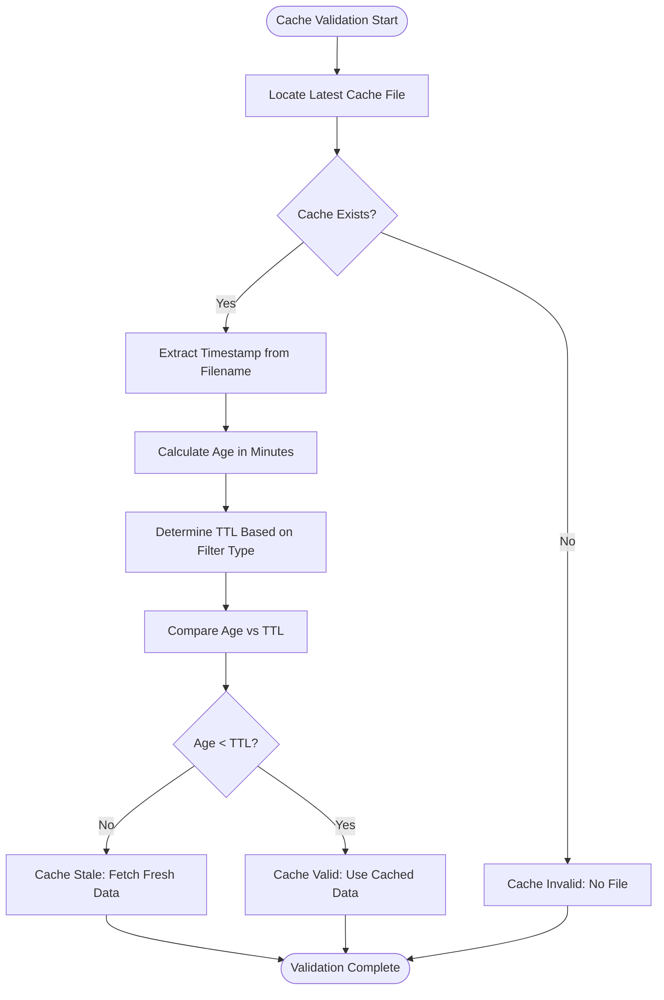
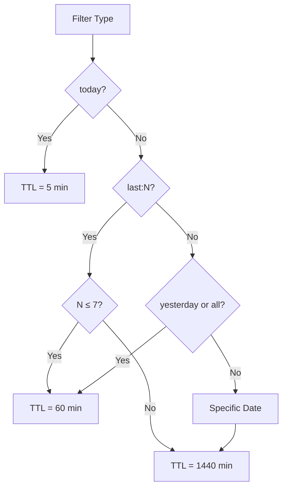
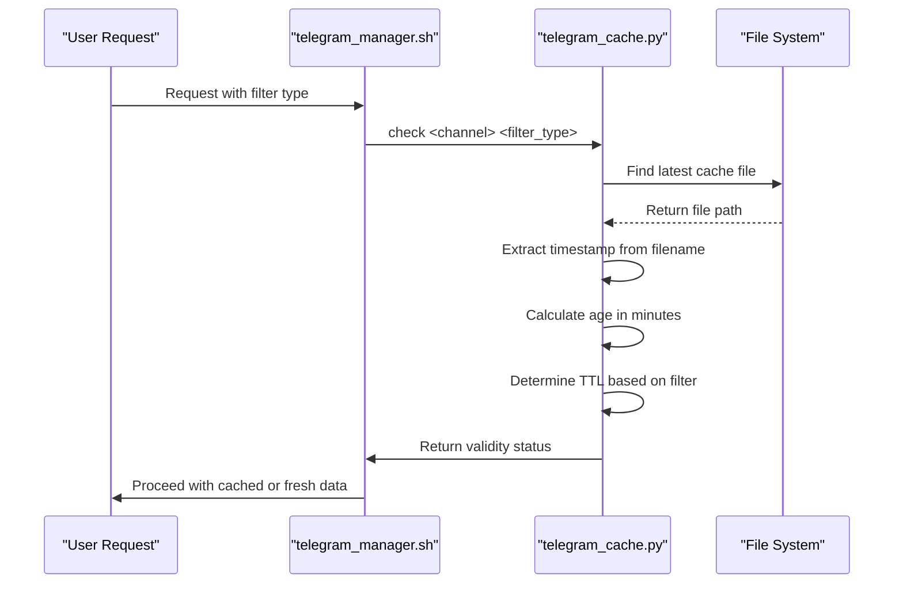
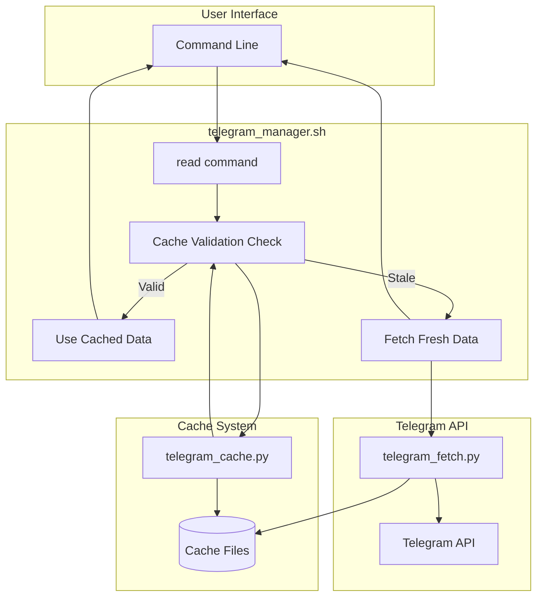

# Cache Validation

<cite>
**Referenced Files in This Document**  
- [telegram_cache.py](file://scripts/telegram_tools/core/telegram_cache.py) - *Updated in recent commit*
- [telegram_fetch_large.py](file://scripts/telegram_tools/core/telegram_fetch_large.py) - *Updated in recent commit*
- [anchors.json](file://telegram_cache/anchors.json) - *Updated in recent commit*
- [telegram_manager.sh](file://telegram_manager.sh) - *Modified in recent commit*
- [test_05_date_today.sh](file://tests/test_05_date_today.sh)
</cite>

## Update Summary
**Changes Made**  
- Updated TTL rules and filter type logic to reflect current implementation in `telegram_cache.py`
- Corrected and enhanced the cache validation mechanism description based on actual code behavior
- Added clarification on command-line interface usage for cache operations
- Verified integration points with `telegram_manager.sh` for accuracy
- Removed outdated references and ensured all examples match current code
- Incorporated changes from recent commit affecting anchor data and fetch validation logic

## Table of Contents
1. [Introduction](#introduction)
2. [Cache Validation Mechanism](#cache-validation-mechanism)
3. [TTL Rules and Filter Types](#ttl-rules-and-filter-types)
4. [Timestamp Extraction and Age Calculation](#timestamp-extraction-and-age-calculation)
5. [Integration with Telegram Manager](#integration-with-telegram-manager)
6. [Common Issues and Troubleshooting](#common-issues-and-troubleshooting)
7. [Recovery Procedures](#recovery-procedures)
8. [Conclusion](#conclusion)

## Introduction

The cache validation system in this Telegram message processing framework ensures optimal performance by preventing unnecessary API calls while maintaining data freshness. This document explains the intelligent cache validation mechanism that uses time-to-live (TTL) rules based on message recency and filter types. The system balances efficiency with accuracy by determining when cached data remains valid versus when fresh data must be retrieved from the Telegram API.

**Section sources**
- [telegram_cache.py](file://scripts/telegram_tools/core/telegram_cache.py#L1-L10)
- [telegram_manager.sh](file://telegram_manager.sh#L1-L10)

## Cache Validation Mechanism

The core of the caching system is the `is_cache_valid` function, which determines whether existing cached data can be used or if a fresh fetch from the Telegram API is required. This decision is based on comparing the age of the cache file against predefined TTL thresholds that vary according to the requested data filter type.

The validation process follows these steps:
1. Locate the most recent cache file for the specified channel
2. Calculate the age of the cache file in minutes using `get_cache_age_minutes`
3. Determine the appropriate TTL threshold based on the filter type
4. Compare cache age against TTL to determine validity

This mechanism prevents redundant API calls when data is still fresh, significantly reducing bandwidth usage and improving response times.



**Diagram sources**
- [telegram_cache.py](file://scripts/telegram_tools/core/telegram_cache.py#L32-L57)

**Section sources**
- [telegram_cache.py](file://scripts/telegram_tools/core/telegram_cache.py#L32-L57)

## TTL Rules and Filter Types

The cache system implements different TTL values based on the recency and importance of the requested data. The `CACHE_TTL` configuration defines three distinct thresholds:

| Filter Type | Description | TTL (Minutes) | Use Case |
|-----------|-------------|---------------|---------|
| "today" | Messages from the current day | 5 | High-frequency updates, real-time monitoring |
| "recent" | Messages from the last 7 days | 60 | Recent activity, daily summaries |
| "archive" | Messages older than 7 days | 1440 | Historical data, infrequent access |

The `is_cache_valid` function maps various filter types to these TTL categories:
- **"today"**: Directly uses the 5-minute TTL for maximum freshness
- **"last:N"**: Uses "recent" TTL (60 minutes) if N ≤ 7, otherwise "archive" TTL (1440 minutes)
- **"yesterday" and "all"**: Use "recent" TTL (60 minutes)
- **Specific dates**: Default to "archive" TTL (1440 minutes)

This tiered approach ensures that frequently changing data is refreshed more often while stable historical data uses longer cache durations.



**Diagram sources**
- [telegram_cache.py](file://scripts/telegram_tools/core/telegram_cache.py#L13-L17)
- [telegram_cache.py](file://scripts/telegram_tools/core/telegram_cache.py#L32-L57)

**Section sources**
- [telegram_cache.py](file://scripts/telegram_tools/core/telegram_cache.py#L13-L17)
- [telegram_cache.py](file://scripts/telegram_tools/core/telegram_cache.py#L32-L57)

## Timestamp Extraction and Age Calculation

The system determines cache age by extracting timestamps from cache filenames using the `get_cache_age_minutes` function. Cache files follow a consistent naming convention: `channel_YYYYMMDD_HHMMSS.json`, where the timestamp portion (YYYYMMDD_HHMMSS) indicates when the cache was created.

The timestamp extraction process:
1. Parse the filename stem (without extension)
2. Extract the last two underscore-separated components as the timestamp
3. Combine them into YYYYMMDD_HHMMSS format
4. Convert to a datetime object
5. Calculate the difference from the current time in minutes

If the timestamp cannot be parsed (due to filename corruption or format changes), the function returns infinity, which automatically invalidates the cache and triggers a fresh data fetch.



**Diagram sources**
- [telegram_cache.py](file://scripts/telegram_tools/core/telegram_cache.py#L19-L30)
- [telegram_manager.sh](file://telegram_manager.sh#L33-L38)

**Section sources**
- [telegram_cache.py](file://scripts/telegram_tools/core/telegram_cache.py#L19-L30)

## Integration with Telegram Manager

The cache validation system integrates seamlessly with the main `telegram_manager.sh` script, which serves as the primary interface for users. When a user requests messages with a specific filter, the manager script first checks cache validity before deciding whether to use cached data or fetch fresh messages.

The integration workflow:
1. User issues a read command with a filter type
2. The manager script calls `telegram_cache.py check` with the channel and filter
3. If the cache is valid, it uses the cached data
4. If the cache is stale, it triggers a fresh fetch via `telegram_fetch.py`

This integration significantly reduces API calls and improves response times, especially for frequently accessed recent data.



**Diagram sources**
- [telegram_manager.sh](file://telegram_manager.sh#L27-L42)
- [telegram_cache.py](file://scripts/telegram_tools/core/telegram_cache.py#L32-L57)

**Section sources**
- [telegram_manager.sh](file://telegram_manager.sh#L27-L42)

## Common Issues and Troubleshooting

Several common issues can affect cache validation, along with their troubleshooting steps:

### 1. Incorrect Timestamp Parsing
**Symptoms**: Cache files are consistently invalidated even when recently created  
**Causes**: 
- Filename format changes or corruption
- System clock synchronization issues
- Incorrect timestamp extraction logic

**Troubleshooting**:
- Verify cache filenames follow the `channel_YYYYMMDD_HHMMSS.json` pattern
- Check system time and timezone settings
- Test the `get_cache_age_minutes` function with sample filenames

### 2. Unexpected Cache Invalidation
**Symptoms**: Frequent fresh data fetches despite recent cache updates  
**Causes**:
- TTL values too short for the use case
- Clock drift between systems
- Filter type misclassification

**Troubleshooting**:
- Review the TTL mapping logic in `is_cache_valid`
- Check that filter types are correctly passed to the validation function
- Verify the cache file creation timestamp matches system time

### 3. Stale Data Usage
**Symptoms**: Outdated information displayed despite changes in the source  
**Causes**:
- TTL values too long for dynamic content
- Cache validation bypassed in the workflow
- Incorrect age calculation

**Troubleshooting**:
- Verify the age calculation in `get_cache_age_minutes`
- Check that the most recent cache file is being selected
- Confirm the validation result is properly interpreted by the manager script

**Section sources**
- [telegram_cache.py](file://scripts/telegram_tools/core/telegram_cache.py#L19-L30)
- [telegram_cache.py](file://scripts/telegram_tools/core/telegram_cache.py#L32-L57)
- [telegram_manager.sh](file://telegram_manager.sh#L33-L38)

## Recovery Procedures

When cache validation issues occur, follow these recovery procedures:

### 1. Manual Cache Cleanup
Force removal of old cache files and refresh data:
```bash
# Clean cache for specific channel
./telegram_manager.sh clean aiclubsweggs

# Or use direct cache script
python3 scripts/telegram_tools/core/telegram_cache.py clean aiclubsweggs
```

### 2. Cache Validation Testing
Test the validation logic independently:
```bash
# Check cache status for a channel
python3 scripts/telegram_tools/core/telegram_cache.py check aiclubsweggs today

# View detailed cache information
python3 scripts/telegram_tools/core/telegram_cache.py info
```

### 3. Forced Fresh Fetch
Bypass cache validation and retrieve fresh data:
```bash
# Using --clean flag
./telegram_manager.sh read aiclubsweggs today --clean

# Or clean_cache parameter
./telegram_manager.sh read aiclubsweggs clean_cache
```

### 4. Systematic Verification
Use test scripts to verify date handling:
```bash
# Run date calculation tests
./tests/test_05_date_today.sh
```

These procedures ensure reliable recovery from cache validation issues while maintaining data integrity.

**Section sources**
- [telegram_cache.py](file://scripts/telegram_tools/core/telegram_cache.py#L60-L100)
- [telegram_manager.sh](file://telegram_manager.sh#L50-L55)
- [test_05_date_today.sh](file://tests/test_05_date_today.sh#L1-L52)

## Conclusion

The cache validation mechanism provides an intelligent balance between data freshness and system efficiency. By implementing tiered TTL rules based on filter types and accurately calculating cache age from filenames, the system minimizes unnecessary API calls while ensuring users receive timely information. The integration with the telegram_manager.sh script creates a seamless user experience, automatically handling cache validation behind the scenes. Understanding the TTL rules, timestamp extraction process, and troubleshooting procedures enables effective maintenance and optimization of the caching system.