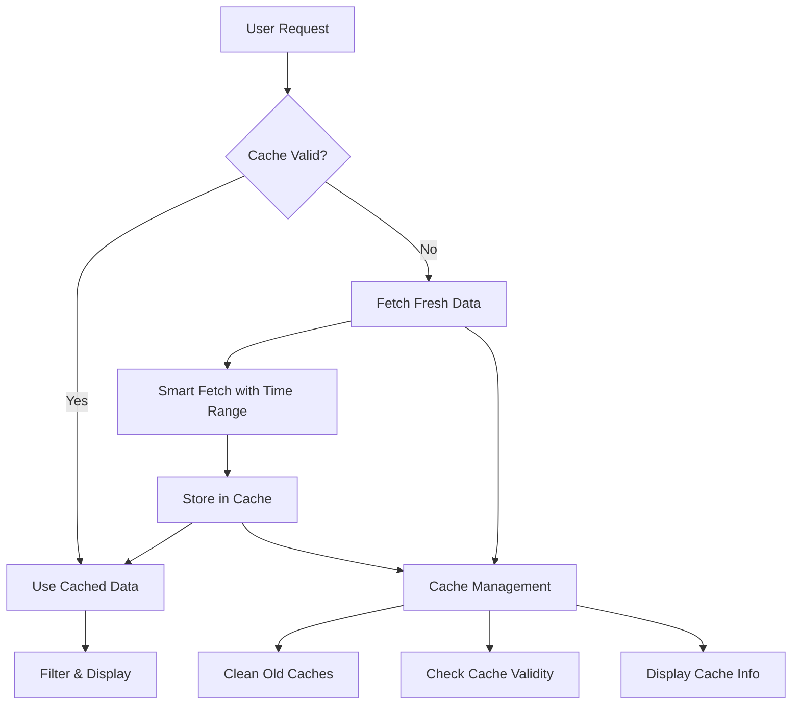
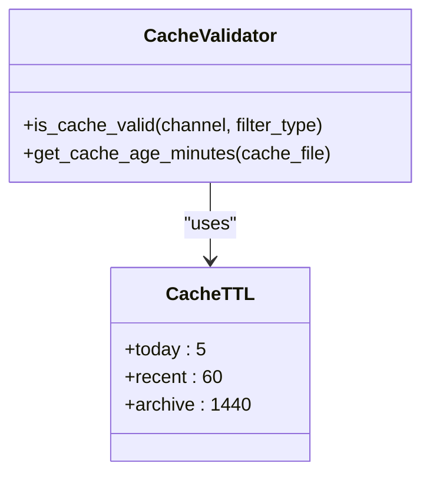
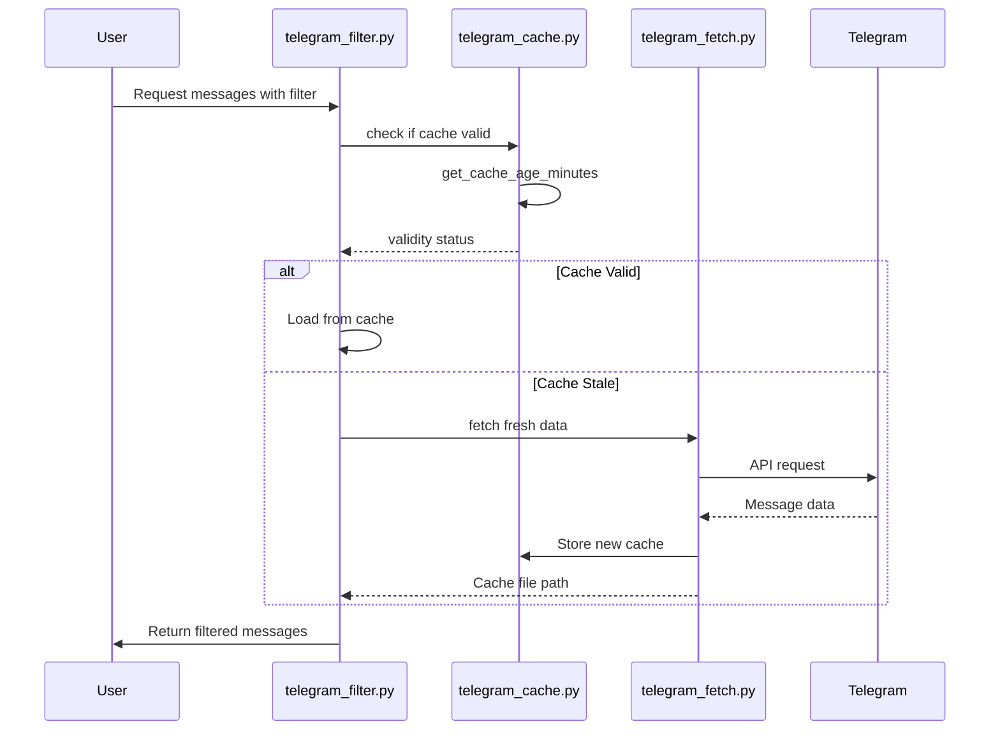
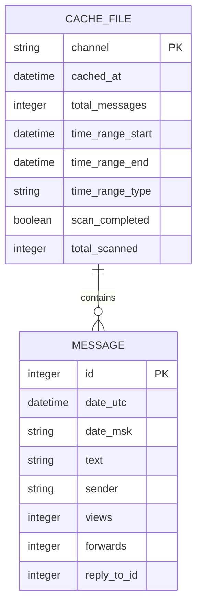
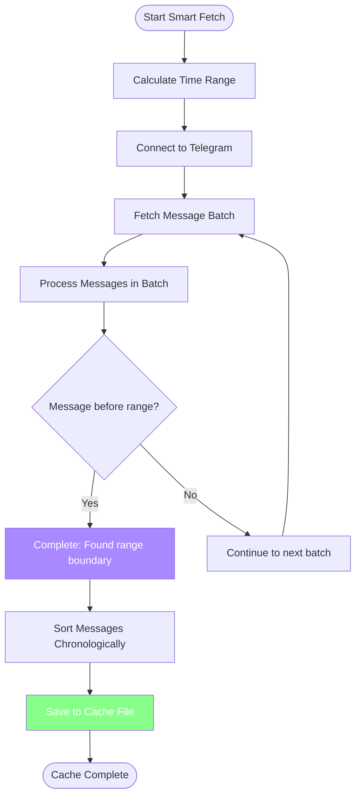
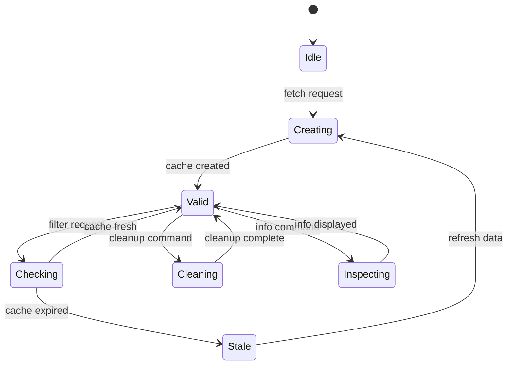

# Caching System

<cite>
**Referenced Files in This Document**   
- [telegram_cache.py](file://scripts/telegram_tools/core/telegram_cache.py)
- [telegram_smart_cache.py](file://scripts/telegram_tools/telegram_smart_cache.py)
- [telegram_fetch.py](file://scripts/telegram_tools/core/telegram_fetch.py)
- [telegram_filter.py](file://scripts/telegram_tools/core/telegram_filter.py)
- [telegram_json_export.py](file://scripts/telegram_tools/core/telegram_json_export.py)
- [telegram_manager.sh](file://telegram_manager.sh)
</cite>

## Table of Contents
1. [Introduction](#introduction)
2. [Caching Architecture Overview](#caching-architecture-overview)
3. [TTL-Based Cache Invalidation Strategy](#ttl-based-cache-invalidation-strategy)
4. [Cache Freshness Validation](#cache-freshness-validation)
5. [Cache File Structure and Metadata](#cache-file-structure-and-metadata)
6. [Component Interactions](#component-interactions)
7. [Smart Cache Mechanism Implementation](#smart-cache-mechanism-implementation)
8. [Cache Lifecycle Management](#cache-lifecycle-management)
9. [Common Issues and Recovery Procedures](#common-issues-and-recovery-procedures)
10. [Conclusion](#conclusion)

## Introduction
The caching system in this Telegram message processing framework is designed to optimize performance by minimizing redundant API calls while ensuring data freshness. The system implements an intelligent caching strategy that balances efficiency with accuracy, particularly important when dealing with time-sensitive message data. This document details the architecture, implementation, and operational characteristics of the caching system, focusing on its TTL-based invalidation, smart fetching mechanisms, and integration with other components in the workflow.

**Section sources**
- [telegram_cache.py](file://scripts/telegram_tools/core/telegram_cache.py#L1-L178)
- [telegram_smart_cache.py](file://scripts/telegram_tools/telegram_smart_cache.py#L1-L243)

## Caching Architecture Overview
The caching architecture consists of multiple coordinated components that work together to provide efficient access to Telegram message data. At its core, the system uses JSON files stored in a dedicated cache directory to persist message data, with filename conventions that encode timestamps for easy age calculation. The architecture supports both simple caching through direct fetching and intelligent caching that ensures complete time range coverage.



**Diagram sources**
- [telegram_cache.py](file://scripts/telegram_tools/core/telegram_cache.py#L1-L178)
- [telegram_smart_cache.py](file://scripts/telegram_tools/telegram_smart_cache.py#L1-L243)

**Section sources**
- [telegram_cache.py](file://scripts/telegram_tools/core/telegram_cache.py#L1-L178)
- [telegram_smart_cache.py](file://scripts/telegram_tools/telegram_smart_cache.py#L1-L243)

## TTL-Based Cache Invalidation Strategy
The system implements a tiered TTL (Time-To-Live) strategy that applies different expiration rules based on the recency and type of data being cached. This approach optimizes cache usage by recognizing that more recent data is more likely to change and therefore requires more frequent refreshing.

The TTL rules are defined as follows:
- **Today's messages**: 5 minutes TTL - recognizing that current day messages are most volatile
- **Recent messages** (last 7 days): 60 minutes TTL - balancing freshness with performance
- **Archive messages** (older than 7 days): 1440 minutes (24 hours) TTL - assuming older data is stable

The TTL determination is context-aware, with the system analyzing the filter type to select the appropriate expiration rule. For example, when filtering by "today" or "yesterday", the system applies the shorter TTLs, while specific date filters or longer time ranges trigger the archive TTL.



**Diagram sources**
- [telegram_cache.py](file://scripts/telegram_tools/core/telegram_cache.py#L12-L17)
- [telegram_cache.py](file://scripts/telegram_tools/core/telegram_cache.py#L32-L56)

**Section sources**
- [telegram_cache.py](file://scripts/telegram_tools/core/telegram_cache.py#L12-L56)

## Cache Freshness Validation
The system validates cache freshness by examining the timestamp encoded in cache filenames and comparing the cache age against the appropriate TTL threshold. Cache files follow a naming convention: `{channel}_{YYYYMMDD}_{HHMMSS}.json`, which allows the system to extract the creation timestamp without loading the file contents.

The validation process involves:
1. Locating the most recent cache file for the requested channel
2. Extracting the timestamp from the filename
3. Calculating the age of the cache in minutes
4. Determining the appropriate TTL based on the filter type
5. Comparing cache age against TTL to determine validity

This approach enables efficient validation without the overhead of parsing JSON content, making the check operation lightweight and fast.



**Diagram sources**
- [telegram_cache.py](file://scripts/telegram_tools/core/telegram_cache.py#L19-L32)
- [telegram_filter.py](file://scripts/telegram_tools/core/telegram_filter.py#L108-L120)

**Section sources**
- [telegram_cache.py](file://scripts/telegram_tools/core/telegram_cache.py#L19-L56)
- [telegram_filter.py](file://scripts/telegram_tools/core/telegram_filter.py#L108-L120)

## Cache File Structure and Metadata
Cache files are structured as JSON documents with a consistent schema that includes both metadata and message data. The internal structure consists of two main sections:

- **meta**: Contains metadata about the cache including:
  - Channel identifier
  - Cache creation timestamp
  - Total message count
  - Time range specifications (for smart caching)
  - Filter type used
  - Scan completion status

- **messages**: Array of message objects, each containing:
  - Message ID
  - UTC timestamp
  - Moscow timezone timestamp
  - Text content (with media indicators)
  - Sender information
  - View and forward counts
  - Reply-to message ID

The metadata enables comprehensive cache management and validation, while the message structure preserves essential Telegram message attributes for downstream processing.



**Diagram sources**
- [telegram_smart_cache.py](file://scripts/telegram_tools/telegram_smart_cache.py#L200-L215)
- [telegram_fetch.py](file://scripts/telegram_tools/core/telegram_fetch.py#L110-L125)

**Section sources**
- [telegram_smart_cache.py](file://scripts/telegram_tools/telegram_smart_cache.py#L200-L215)
- [telegram_fetch.py](file://scripts/telegram_tools/core/telegram_fetch.py#L110-L125)

## Component Interactions
The caching system integrates with several components in the workflow, creating a cohesive message processing pipeline. The primary interactions occur between the cache management module, data fetching components, and filtering utilities.

The `telegram_cache.py` module serves as the central cache management component, providing validation and cleanup functionality used by other modules. The `telegram_smart_cache.py` implements advanced caching with time-range awareness, while `telegram_fetch.py` provides basic caching functionality. The `telegram_filter.py` module consumes cached data and orchestrates cache validation and refresh operations as needed.

```mermaid
graph TD
A[telegram_manager.sh] --> B[telegram_filter.py]
A --> C[telegram_cache.py]
A --> D[telegram_smart_cache.py]
A --> E[telegram_fetch.py]
B --> C: check cache validity
B --> E: fetch if stale
C --> F[Cache Directory]
D --> F
E --> F
D --> G[.env credentials]
E --> G
B --> H[Display]
style A fill:#f9f,stroke:#333
style C fill:#bbf,stroke:#333
```

**Diagram sources**
- [telegram_manager.sh](file://telegram_manager.sh#L1-L110)
- [telegram_filter.py](file://scripts/telegram_tools/core/telegram_filter.py#L1-L238)

**Section sources**
- [telegram_manager.sh](file://telegram_manager.sh#L1-L110)
- [telegram_filter.py](file://scripts/telegram_tools/core/telegram_filter.py#L1-L238)

## Smart Cache Mechanism Implementation
The smart caching mechanism, implemented in `telegram_smart_cache.py`, addresses the challenge of ensuring complete time range coverage when fetching messages from Telegram. Unlike simple pagination, this mechanism scans messages until it confirms that the complete time range has been captured, preventing truncation issues.

The implementation works by:
1. Calculating the time range bounds based on the filter type
2. Fetching messages in batches from the most recent
3. Continuing to fetch until a message predates the requested time range
4. Including only messages within the specified time range
5. Sorting messages chronologically before caching

This approach ensures that all messages within the requested time period are captured, even if they are not contiguous in the message history. The mechanism also includes safety checks to prevent infinite loops during the scanning process.



**Diagram sources**
- [telegram_smart_cache.py](file://scripts/telegram_tools/telegram_smart_cache.py#L63-L199)

**Section sources**
- [telegram_smart_cache.py](file://scripts/telegram_tools/telegram_smart_cache.py#L63-L199)

## Cache Lifecycle Management
The system provides comprehensive tools for managing the entire cache lifecycle, including creation, validation, and cleanup operations. These operations are exposed through both direct script execution and the unified `telegram_manager.sh` interface.

Cache creation occurs automatically when data is fetched, either through simple fetching or smart caching. Validation is performed transparently when filtering messages, with stale caches automatically refreshed. Cleanup operations remove older cache files while preserving a configurable number of recent versions per channel.

The lifecycle management functions include:
- **Creation**: Automatic during fetch operations with timestamped filenames
- **Validation**: Age-based checking against TTL rules by filter type
- **Cleanup**: Removal of older files, keeping only the most recent N files
- **Inspection**: Detailed cache information and statistics display



**Diagram sources**
- [telegram_cache.py](file://scripts/telegram_tools/core/telegram_cache.py#L59-L108)
- [telegram_cache.py](file://scripts/telegram_tools/core/telegram_cache.py#L109-L148)

**Section sources**
- [telegram_cache.py](file://scripts/telegram_tools/core/telegram_cache.py#L59-L148)

## Common Issues and Recovery Procedures
The caching system addresses several common issues that can arise in message processing workflows, with built-in recovery procedures to maintain data integrity.

**Stale Data**: The primary defense against stale data is the TTL-based validation system. When a cache is determined to be stale, the system automatically triggers a fresh data fetch. The tiered TTL strategy ensures that more volatile data is refreshed more frequently.

**Cache Corruption**: While not explicitly handled, the system's design provides natural recovery from cache corruption. Since cache files are regenerated on each fetch operation, any corruption is automatically resolved by the next refresh cycle.

**Boundary Detection Issues**: The system includes sophisticated border detection logic in the filtering module that validates the integrity of date-based filters. When insufficient messages are available for proper boundary validation, the system automatically triggers additional data fetching to ensure accurate results.

**Recovery Procedures**:
1. For stale data: Automatic refresh via TTL validation
2. For incomplete data: Auto-fetch additional messages during filtering
3. For cache management issues: Manual cleanup via cache management commands
4. For credential issues: Environment-based configuration with .env file

The system also provides diagnostic tools like the cache information display and JSON export capabilities to assist in troubleshooting and verification.

**Section sources**
- [telegram_filter.py](file://scripts/telegram_tools/core/telegram_filter.py#L44-L99)
- [telegram_cache.py](file://scripts/telegram_tools/core/telegram_cache.py#L109-L148)

## Conclusion
The caching system provides a robust foundation for efficient Telegram message processing, balancing performance optimization with data accuracy. Through its intelligent TTL-based invalidation, smart fetching mechanisms, and comprehensive lifecycle management, the system effectively reduces API calls while ensuring data freshness. The modular design allows for both simple caching operations and sophisticated time-range-aware fetching, making it adaptable to various use cases. The integration with filtering and management components creates a cohesive workflow that handles common issues like stale data and boundary detection automatically, providing a reliable foundation for message analysis and processing.

**Section sources**
- [telegram_cache.py](file://scripts/telegram_tools/core/telegram_cache.py#L1-L178)
- [telegram_smart_cache.py](file://scripts/telegram_tools/telegram_smart_cache.py#L1-L243)
- [telegram_manager.sh](file://telegram_manager.sh#L1-L110)