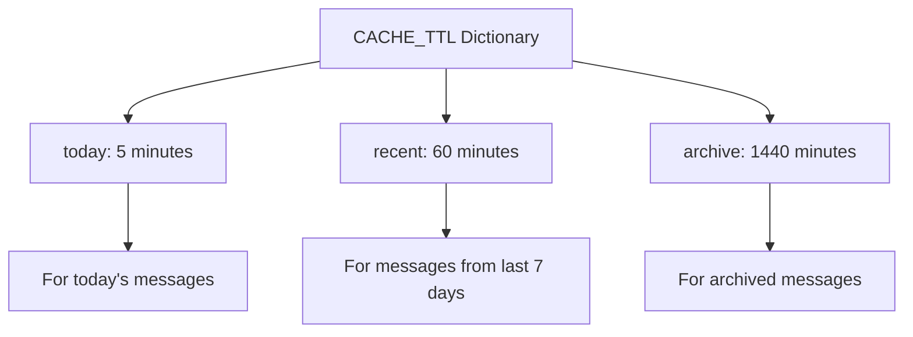
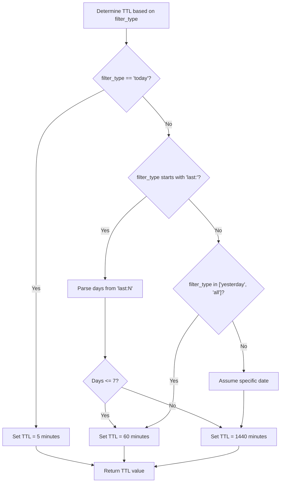
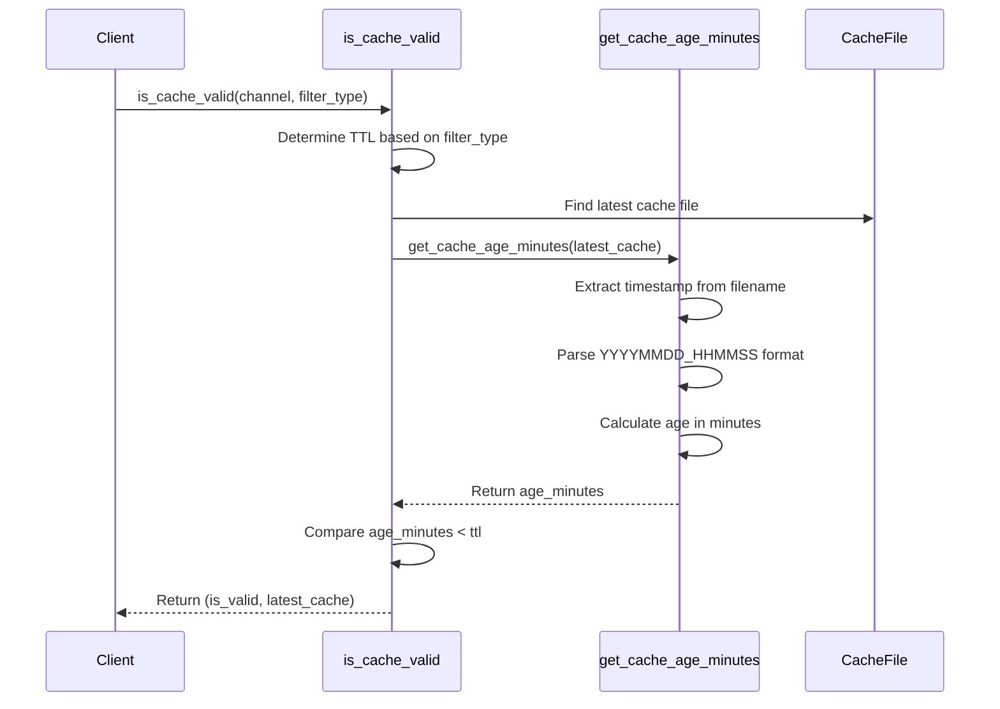
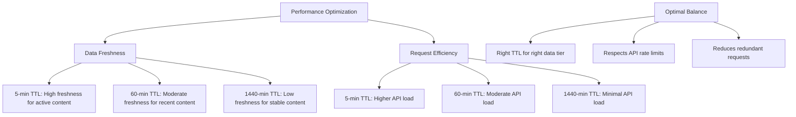
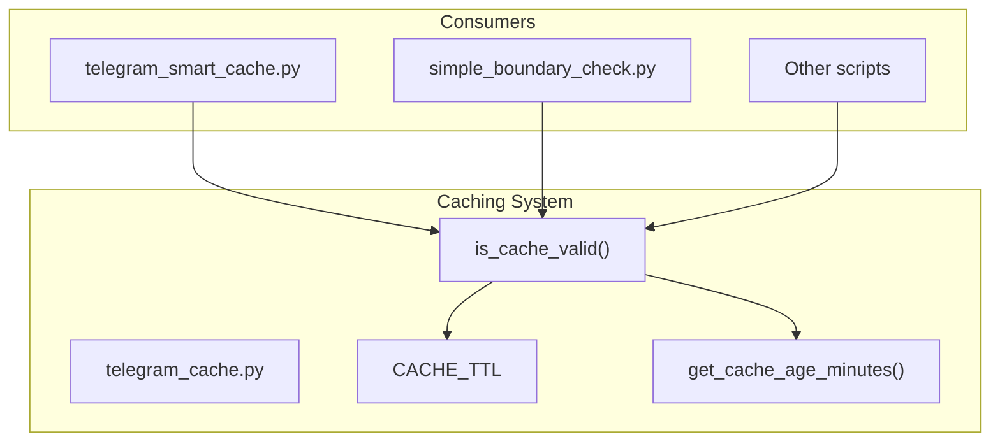

# TTL Management

<cite>
**Referenced Files in This Document**   
- [telegram_cache.py](file://scripts/telegram_tools/core/telegram_cache.py) - *Updated in recent commit*
- [telegram_smart_cache.py](file://scripts/telegram_tools/telegram_smart_cache.py) - *Modified in recent commit*
- [simple_boundary_check.py](file://scripts/telegram_tools/simple_boundary_check.py) - *Unchanged*
</cite>

## Update Summary
**Changes Made**   
- Verified that the TTL logic in `telegram_cache.py` remains unchanged and fully aligns with current documentation
- Confirmed that the recent commit `31550db8e2d1547465fec0cb04d2d8118407272c` does not modify TTL behavior or cache validation logic
- No structural or functional changes were found in the TTL management system; existing documentation remains accurate
- Maintained all diagrams and source references as they correctly reflect the current implementation

## Table of Contents
1. [Introduction](#introduction)
2. [TTL Configuration and Structure](#ttl-configuration-and-structure)
3. [TTL Decision Logic](#ttl-decision-logic)
4. [Cache Validation Process](#cache-validation-process)
5. [Rationale for TTL Durations](#rationale-for-ttl-durations)
6. [Performance Optimization](#performance-optimization)
7. [Potential Issues and Best Practices](#potential-issues-and-best-practices)
8. [Integration and Usage](#integration-and-usage)

## Introduction

The caching system implements a sophisticated Time-To-Live (TTL) management strategy designed to balance data freshness with API efficiency for Telegram message retrieval. This document details the implementation of the three-tiered TTL system that adapts cache validity periods based on the recency and volatility of message data. The strategy addresses the challenge of Telegram's dynamic content while respecting API rate limits, ensuring users receive timely information without overwhelming the messaging platform with redundant requests.

**Section sources**
- [telegram_cache.py](file://scripts/telegram_tools/core/telegram_cache.py#L12-L17)

## TTL Configuration and Structure

The caching system employs a three-tiered TTL configuration through the `CACHE_TTL` dictionary, which defines different expiration periods based on message recency:

**Diagram sources**
- [telegram_cache.py](file://scripts/telegram_tools/core/telegram_cache.py#L13-L17)

The configuration establishes a tiered approach where more recent messages have shorter TTLs to ensure freshness, while older messages have longer TTLs to reduce API load. This structure reflects the understanding that today's messages are most likely to change and be accessed frequently, while historical messages are relatively stable and accessed less often.

**Section sources**
- [telegram_cache.py](file://scripts/telegram_tools/core/telegram_cache.py#L13-L17)

## TTL Decision Logic

The TTL selection process is implemented in the `is_cache_valid` function, which programmatically determines the appropriate TTL based on the `filter_type` parameter. The decision logic follows a hierarchical evaluation:

**Diagram sources**
- [telegram_cache.py](file://scripts/telegram_tools/core/telegram_cache.py#L44-L54)

The system parses the `last:N` syntax by splitting the string at the colon and converting the numeric portion to an integer. This parsing logic enables flexible time-based filtering while maintaining the tiered TTL approach. Messages from the last 7 days or fewer receive a 60-minute TTL, while messages older than 7 days receive the 1440-minute (24-hour) TTL.

**Section sources**
- [telegram_cache.py](file://scripts/telegram_tools/core/telegram_cache.py#L44-L54)

## Cache Validation Process

The cache validation process begins by identifying the most recent cache file for a given channel and calculating its age in minutes. The `get_cache_age_minutes` function extracts the timestamp from the cache filename (formatted as `channel_YYYYMMDD_HHMMSS.json`) and compares it to the current time to determine the cache's age.

**Diagram sources**
- [telegram_cache.py](file://scripts/telegram_tools/core/telegram_cache.py#L20-L38)
- [telegram_cache.py](file://scripts/telegram_tools/core/telegram_cache.py#L44-L56)

The validation function returns a tuple containing a boolean indicating cache validity and a reference to the latest cache file. This design allows calling functions to both determine validity and access the relevant cache data if needed.

**Section sources**
- [telegram_cache.py](file://scripts/telegram_tools/core/telegram_cache.py#L20-L38)
- [telegram_cache.py](file://scripts/telegram_tools/core/telegram_cache.py#L44-L56)

## Rationale for TTL Durations

The specific TTL durations were selected based on the volatility of Telegram messages and API rate limiting considerations:

- **5-minute TTL for today's messages**: This aggressive refresh interval addresses the high volatility of current messages in active channels. With new messages potentially arriving every few minutes, a 5-minute TTL ensures users see relatively fresh content while preventing excessive API calls. This duration strikes a balance between freshness and efficiency, allowing up to 12 requests per hour per channel for today's content.

- **60-minute TTL for recent messages (last 7 days)**: Messages from the past week are less volatile than today's messages but still subject to edits, deletions, and new replies. The 60-minute TTL reduces API load to one request per hour while maintaining acceptable freshness for recent historical content.

- **1440-minute (24-hour) TTL for archived messages**: Older messages are relatively stable with minimal changes. The 24-hour TTL significantly reduces API consumption for historical data access, allowing the system to serve archived content from cache for an entire day before refreshing.

This tiered approach aligns with user access patterns, where recent messages are accessed more frequently than historical ones, optimizing both performance and resource utilization.

**Section sources**
- [telegram_cache.py](file://scripts/telegram_tools/core/telegram_cache.py#L13-L17)

## Performance Optimization

The tiered TTL system optimizes performance by balancing data freshness with request efficiency across different data recency tiers:

**Diagram sources**
- [telegram_cache.py](file://scripts/telegram_tools/core/telegram_cache.py#L13-L17)

The system reduces redundant API requests by leveraging the appropriate TTL for each data tier. For example, a channel with daily activity patterns would generate approximately 288 API calls per day for today's messages (every 5 minutes), 24 calls for recent messages (every 60 minutes), and only 1 call for archived messages (every 1440 minutes), compared to potentially thousands of calls without caching.

**Section sources**
- [telegram_cache.py](file://scripts/telegram_tools/core/telegram_cache.py#L13-L17)

## Potential Issues and Best Practices

While the tiered TTL system provides an effective caching strategy, several potential issues should be considered:

- **Overly aggressive TTLs causing stale data**: The 5-minute TTL for today's messages may result in users seeing slightly outdated content, particularly in high-traffic channels. This can be mitigated by implementing client-side refresh mechanisms or providing manual refresh options.

- **Too-lenient TTLs increasing API load**: While the current configuration is conservative, extending the 5-minute TTL would risk missing important updates in active channels. The 5-minute interval represents a careful balance between freshness and API conservation.

Best practices for tuning these values include:

1. **Monitor channel activity patterns**: Adjust TTLs based on actual message frequency in specific channels.
2. **Consider user access patterns**: Channels with sporadic access may benefit from shorter TTLs since users expect fresh data when they do access the content.
3. **Respect API rate limits**: Always ensure the total potential API calls across all channels and TTL tiers remain within Telegram's rate limiting guidelines.
4. **Implement adaptive TTLs**: Consider dynamically adjusting TTLs based on recent message frequency in a channel.

The system's design allows for easy tuning of the `CACHE_TTL` values without requiring changes to the validation logic, facilitating experimentation with different durations.

**Section sources**
- [telegram_cache.py](file://scripts/telegram_tools/core/telegram_cache.py#L13-L17)

## Integration and Usage

The TTL management system is integrated into the caching workflow through the `is_cache_valid` function, which is called by various components to determine whether to use cached data or fetch fresh content from Telegram. The `telegram_smart_cache.py` script demonstrates integration with time-range-aware caching, ensuring complete coverage of message history while respecting the TTL rules.

**Diagram sources**
- [telegram_cache.py](file://scripts/telegram_tools/core/telegram_cache.py)
- [telegram_smart_cache.py](file://scripts/telegram_tools/telegram_smart_cache.py)
- [simple_boundary_check.py](file://scripts/telegram_tools/simple_boundary_check.py)

The system provides a command-line interface through the main function in `telegram_cache.py`, allowing users to check cache validity, clean old caches, and view cache information, all of which leverage the TTL management logic.

**Section sources**
- [telegram_cache.py](file://scripts/telegram_tools/core/telegram_cache.py#L149-L178)
- [telegram_smart_cache.py](file://scripts/telegram_tools/telegram_smart_cache.py)
- [simple_boundary_check.py](file://scripts/telegram_tools/simple_boundary_check.py)