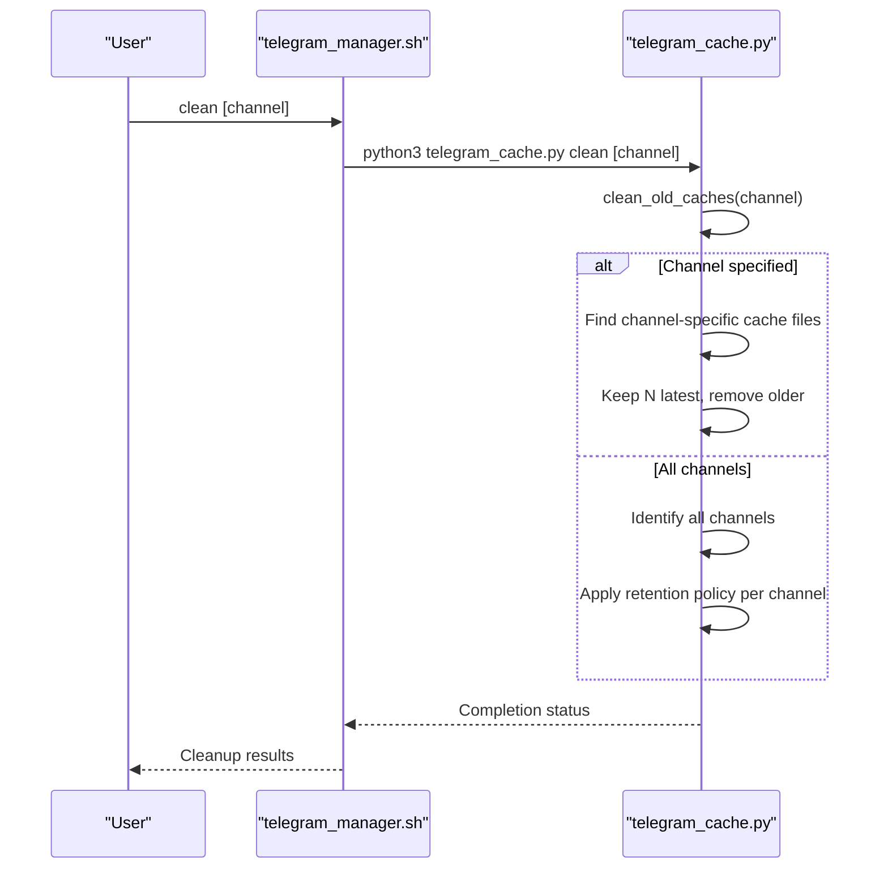
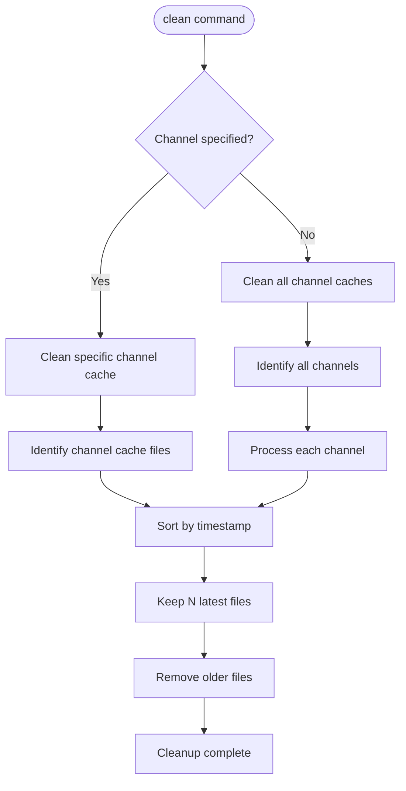

# Cache Cleanup Command

<cite>
**Referenced Files in This Document**   
- [telegram_cache.py](file://scripts/telegram_tools/core/telegram_cache.py)
- [telegram_manager.sh](file://telegram_manager.sh)
</cite>

## Table of Contents
1. [Command Syntax and Usage](#command-syntax-and-usage)
2. [Implementation Details](#implementation-details)
3. [Use Cases](#use-cases)
4. [Selective vs Full Cleanup](#selective-vs-full-cleanup)
5. [Integration with Read Command](#integration-with-read-command)
6. [Performance and API Implications](#performance-and-api-implications)
7. [Error Handling](#error-handling)
8. [Examples](#examples)

## Command Syntax and Usage

The `clean` command provides cache management functionality through the `telegram_manager.sh` script. The syntax follows the pattern `clean [channel]`, where the channel parameter is optional. When no channel is specified, the command performs a full cleanup of all cached data across all channels. When a specific channel is provided, only the cache files associated with that channel are cleaned.

The command is accessible as a top-level option in the `telegram_manager.sh` script, making it easily available for users who need to manage their Telegram message cache. The implementation ensures that only outdated cache files are removed while preserving the most recent cache entries to maintain some level of data availability.

**Section sources**
- [telegram_manager.sh](file://telegram_manager.sh#L101-L109)
- [telegram_cache.py](file://scripts/telegram_tools/core/telegram_cache.py#L141-L149)

## Implementation Details

The `clean` command functionality is implemented through a two-layer architecture. The `telegram_manager.sh` shell script serves as the user interface, while the core logic resides in `telegram_cache.py`. When the `clean` command is invoked, the shell script delegates to the Python module by executing `python3 telegram_cache.py clean [channel]`.

The core implementation in `telegram_cache.py` defines the `clean_old_caches()` function, which handles the actual cache cleanup process. This function accepts an optional channel parameter and a `keep_latest` parameter (defaulting to 3) that determines how many of the most recent cache files to preserve. The function first normalizes the channel name by removing special characters like '@' and '/' to ensure consistent file naming.

For selective cleanup (when a channel is specified), the function identifies all cache files for that channel, sorts them chronologically, and removes all except the N most recent files. For full cleanup (when no channel is specified), the function iterates through all channels in the cache directory and applies the same retention policy to each.



**Diagram sources**
- [telegram_manager.sh](file://telegram_manager.sh#L101-L109)
- [telegram_cache.py](file://scripts/telegram_tools/core/telegram_cache.py#L59-L78)

**Section sources**
- [telegram_cache.py](file://scripts/telegram_tools/core/telegram_cache.py#L59-L78)
- [telegram_cache.py](file://scripts/telegram_tools/core/telegram_cache.py#L155-L157)

## Use Cases

The `clean` command serves several important use cases in the Telegram message management workflow:

**Debugging**: When users encounter issues with message retrieval or filtering, stale cache data may be the culprit. Executing the clean command ensures that subsequent operations work with fresh data, helping to isolate whether issues are cache-related or stem from other parts of the system.

**Ensuring Fresh Data**: For time-sensitive operations where the most current messages are critical, users can clean the cache to force immediate retrieval of the latest messages from Telegram's API. This is particularly useful when monitoring active channels where message content changes rapidly.

**Freeing Disk Space**: Over time, the cache directory can accumulate numerous files, especially for channels with frequent updates. The cleanup functionality helps manage disk usage by removing older, less relevant cache files while preserving recent data.

**Cache Maintenance**: Regular cleanup prevents the cache from growing unbounded, maintaining optimal performance of cache operations and reducing the time required for cache-related operations like listing or searching.

**Section sources**
- [telegram_cache.py](file://scripts/telegram_tools/core/telegram_cache.py#L59-L78)
- [telegram_cache.py](file://scripts/telegram_tools/core/telegram_cache.py#L118-L149)

## Selective vs Full Cleanup

The `clean` command supports two distinct modes of operation: selective cleanup by channel and full cleanup of all channels.

**Selective Cleanup**: When a specific channel is provided as an argument (e.g., `clean aiclubsweggs`), the system targets only the cache files associated with that channel. This approach is useful when users want to refresh data for a particular channel without affecting others. The implementation preserves the most recent cache files (default: 3) for the specified channel while removing older versions.

**Full Cleanup**: When no channel is specified (e.g., `clean`), the system performs a comprehensive cleanup across all channels in the cache directory. This global operation iterates through every channel and applies the same retention policy, removing older cache files while keeping the most recent entries. This mode is appropriate when users want to reset their entire cache state or when troubleshooting system-wide issues.

The distinction between these modes allows users to choose the appropriate level of cache refresh based on their needs, balancing data freshness with the overhead of re-fetching messages.



**Diagram sources**
- [telegram_cache.py](file://scripts/telegram_tools/core/telegram_cache.py#L59-L78)

**Section sources**
- [telegram_cache.py](file://scripts/telegram_tools/core/telegram_cache.py#L59-L78)

## Integration with Read Command

The `clean` command is closely integrated with the `read` command through the `--clean` flag (also aliased as `clean_cache`). This integration creates a streamlined workflow where users can combine cache cleanup with immediate data retrieval in a single operation.

When the `read` command is invoked with the `--clean` flag, the system automatically executes the cache cleanup process before fetching fresh messages. This sequence ensures that users always work with the most current data without needing to manually execute separate commands.

The integration is implemented in the `telegram_manager.sh` script, which detects the presence of the `--clean` flag and triggers the cleanup process accordingly. After cleaning the cache, the system proceeds to fetch new messages and apply the requested filter, providing a seamless experience for users who require up-to-date information.

This combined functionality is particularly valuable for automated scripts and regular monitoring tasks where data freshness is paramount.

**Section sources**
- [telegram_manager.sh](file://telegram_manager.sh#L34-L58)

## Performance and API Implications

Cache deletion has significant implications for both performance and API usage patterns. When cache files are removed, subsequent commands must retrieve data directly from Telegram's API rather than using cached results. This results in increased API calls, which may be subject to rate limiting depending on Telegram's policies.

The performance impact manifests in longer response times for commands that follow a cache cleanup, as network requests to fetch messages take considerably longer than reading from local cache files. However, this trade-off is often acceptable when data freshness is more important than speed.

The system's design mitigates some of these impacts by retaining the most recent cache files (typically 3) even during cleanup operations. This hybrid approach ensures that some data remains available locally while still forcing refresh of stale content. Additionally, the TTL (time-to-live) system in `telegram_cache.py` automatically invalidates cache based on age and message recency, reducing the need for manual cleanup in many scenarios.

Users should consider the timing of cleanup operations, avoiding peak usage periods when possible to minimize the impact of increased API load.

**Section sources**
- [telegram_cache.py](file://scripts/telegram_tools/core/telegram_cache.py#L1-L42)
- [telegram_cache.py](file://scripts/telegram_tools/core/telegram_cache.py#L3-L10)

## Error Handling

The `clean` command implementation includes robust error handling to manage various failure scenarios. The system handles invalid channel names by normalizing input (removing '@' and '/' characters) rather than rejecting it, making the command more forgiving of different input formats.

File system issues are addressed through Python's exception handling in the `cache_info()` function, which catches and reports errors when reading cache files. This prevents the entire cleanup operation from failing due to a single problematic file.

The implementation also includes validation in the main function of `telegram_cache.py`, ensuring that required arguments are present and providing helpful usage information when commands are misused. The shell script layer adds additional parameter validation to prevent invalid inputs from reaching the Python backend.

For file operations, the system uses Python's `unlink()` method with implicit error handling through the try-except block in related functions, ensuring that the cleanup process can continue even if individual file removal operations encounter issues.

**Section sources**
- [telegram_cache.py](file://scripts/telegram_tools/core/telegram_cache.py#L118-L130)
- [telegram_cache.py](file://scripts/telegram_tools/core/telegram_cache.py#L141-L149)
- [telegram_manager.sh](file://telegram_manager.sh#L34-L36)

## Examples

The following examples demonstrate practical usage of the `clean` command:

**Cleaning a specific channel**:
```bash
./telegram_manager.sh clean aiclubsweggs
```
This command removes older cache files for the "aiclubsweggs" channel while preserving the 3 most recent cache entries.

**Performing a full cache cleanup**:
```bash
./telegram_manager.sh clean
```
This command cleans the cache for all channels, removing older files while keeping the most recent 3 cache files for each channel.

**Combining cleanup with message reading**:
```bash
./telegram_manager.sh read aiclubsweggs today --clean
```
This command first cleans the cache for "aiclubsweggs", then fetches fresh messages, and finally filters for today's messages, ensuring completely up-to-date results.

**Using the alternative clean_cache syntax**:
```bash
./telegram_manager.sh read aiclubsweggs clean_cache
```
This alternative syntax achieves the same result as using `--clean`, providing flexibility in how users specify cache cleanup.

**Section sources**
- [telegram_manager.sh](file://telegram_manager.sh#L101-L109)
- [telegram_manager.sh](file://telegram_manager.sh#L34-L58)