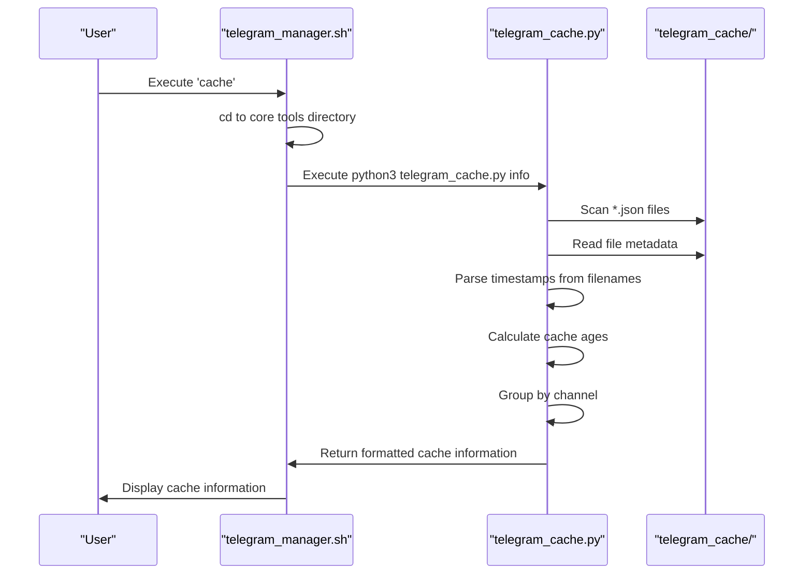
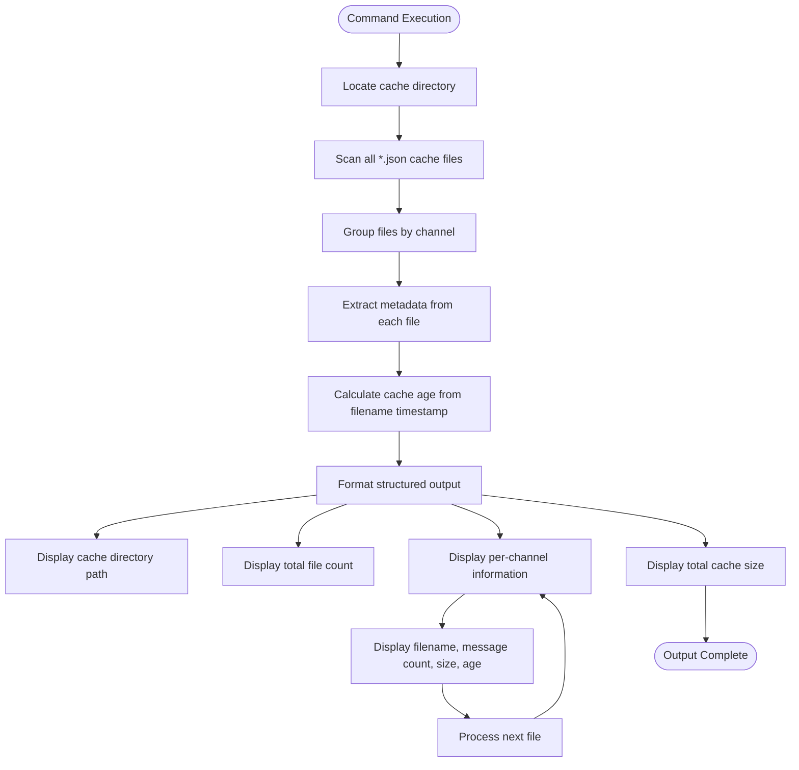

# Cache Information Command

<cite>
**Referenced Files in This Document**   
- [telegram_manager.sh](file://telegram_manager.sh) - *Updated in recent commit*
- [scripts/telegram_tools/core/telegram_cache.py](file://scripts/telegram_tools/core/telegram_cache.py) - *Enhanced with JSON-based architecture in recent commit*
- [scripts/telegram_tools/core/telegram_fetch.py](file://scripts/telegram_tools/core/telegram_fetch.py)
- [scripts/telegram_tools/core/telegram_filter.py](file://scripts/telegram_tools/core/telegram_filter.py)
</cite>

## Update Summary
**Changes Made**   
- Updated documentation to reflect JSON-based architecture enhancements in `telegram_cache.py`
- Added details about message count, file size, and age metrics in cache output
- Enhanced description of TTL (time-to-live) rules and cache validation logic
- Updated implementation details to reflect current code structure
- Revised output format section to accurately describe current emoji usage and data presentation
- Improved integration section with accurate command relationships

## Table of Contents
1. [Command Overview](#command-overview)
2. [Syntax and Usage](#syntax-and-usage)
3. [Implementation Details](#implementation-details)
4. [Output Format](#output-format)
5. [System Monitoring and Debugging](#system-monitoring-and-debugging)
6. [Integration with Other Commands](#integration-with-other-commands)
7. [Cache Freshness Assessment](#cache-freshness-assessment)
8. [Automation Scripting Tips](#automation-scripting-tips)
9. [Command Limitations](#command-limitations)

## Command Overview

The `cache` command provides comprehensive information about the current message cache state in the Telegram message processing system. It serves as a vital monitoring and diagnostic tool for understanding cached data, including metadata about cached channels, message counts, timestamps, and cache expiration status. This command is read-only and does not modify the cache state, making it safe for frequent use in both interactive and automated contexts.

**Section sources**
- [telegram_manager.sh](file://telegram_manager.sh#L65-L69)
- [scripts/telegram_tools/core/telegram_cache.py](file://scripts/telegram_tools/core/telegram_cache.py#L79-L116)

## Syntax and Usage

The `cache` command has a simple syntax with no arguments required:

```
cache
```

When executed, this command invokes the `telegram_cache.py` script with the `info` action parameter. The command is accessible through the main `telegram_manager.sh` script and requires no additional parameters for basic operation. It is designed to be straightforward and intuitive, providing immediate visibility into the cache state without configuration overhead.

The command works by calling the `cache_info()` function in `telegram_cache.py`, which scans the cache directory, analyzes all cache files, and presents a structured summary of the cache contents. This function is specifically designed to be lightweight and fast, ensuring minimal impact on system performance while providing comprehensive cache insights.

**Section sources**
- [telegram_manager.sh](file://telegram_manager.sh#L65)
- [scripts/telegram_tools/core/telegram_cache.py](file://scripts/telegram_tools/core/telegram_cache.py#L79)

## Implementation Details

The `cache` command implementation follows a modular architecture where the shell script acts as a wrapper that delegates to a Python module for the actual cache analysis. When the `cache` command is invoked, `telegram_manager.sh` changes to the core tools directory and executes `telegram_cache.py` with the `info` argument.

The `telegram_cache.py` script implements the cache information functionality through the `cache_info()` function, which performs several key operations:
- Locates the cache directory relative to the script location
- Scans for all JSON cache files in the directory
- Groups cache files by channel
- Extracts metadata from each cache file including message count, file size, and age
- Calculates cache age based on timestamps embedded in filenames
- Formats and displays the comprehensive cache summary

The cache files follow a naming convention that includes the channel identifier and timestamp (e.g., `channel_YYYYMMDD_HHMMSS.json`), which enables the system to determine cache freshness and ordering without loading file contents.



**Diagram sources**
- [telegram_manager.sh](file://telegram_manager.sh#L65)
- [scripts/telegram_tools/core/telegram_cache.py](file://scripts/telegram_tools/core/telegram_cache.py#L79)

## Output Format

The `cache` command produces a structured output that provides comprehensive information about the cache state. The output includes:

- Cache directory location and total file count
- Per-channel cache information showing all cache files
- Message count for each cache file
- File size in kilobytes
- Cache age displayed in minutes or hours
- Total cache size across all files

The output format uses visual indicators (emojis) to enhance readability:
- 📁 indicates directory information
- 📊 shows total statistics
- 📋 categorizes the per-channel breakdown
- 💾 displays total cache size
- ⏳ or ⌛ indicates cache age

For each channel, the command displays all available cache files sorted by age (oldest first), showing the filename, message count, size, and age. This allows users to quickly assess cache freshness and identify potential issues with stale data.



**Diagram sources**
- [scripts/telegram_tools/core/telegram_cache.py](file://scripts/telegram_tools/core/telegram_cache.py#L79)

## System Monitoring and Debugging

The `cache` command plays a critical role in system monitoring and debugging cache-related issues. By providing detailed information about the cache state, it enables users to diagnose problems related to data freshness, cache pollution, and storage utilization.

Key monitoring capabilities include:
- Identifying stale cache entries that may contain outdated information
- Detecting cache bloat from excessive cache file accumulation
- Verifying that cache operations are functioning correctly
- Monitoring cache size growth over time
- Confirming that expected channels are being cached

For debugging purposes, the command helps identify issues such as:
- Missing cache files for expected channels
- Cache files with zero or unexpectedly low message counts
- Cache age exceeding expected TTL (time-to-live) values
- Inconsistent cache file naming or structure
- Cache directory permission or access issues

The command's error handling displays warnings (⚠️) when individual cache files cannot be read, allowing users to identify corrupted or inaccessible cache entries without failing the entire operation.

**Section sources**
- [scripts/telegram_tools/core/telegram_cache.py](file://scripts/telegram_tools/core/telegram_cache.py#L104-L116)

## Integration with Other Commands

The `cache` command is closely integrated with other system commands, particularly `fetch` and `read`, which depend on the cache state for their operation. This integration creates a cohesive workflow for message retrieval and processing.

The `read` command uses cache validation logic that is closely related to the `cache` command's functionality. Before displaying messages, `read` checks if the cache is valid using TTL rules that consider the message filter type (today, yesterday, last:N days). This ensures users receive fresh data when needed while leveraging cached data for efficiency.

The `fetch` command is responsible for populating the cache with new message data. Understanding the current cache state through the `cache` command helps users determine when to use `fetch` to refresh data. The `clean` command, which removes old cache files, complements `cache` by providing cache maintenance capabilities.

```mermaid
graph TB
subgraph "User Commands"
Cache[cache] --> |Provides info| CacheState
Fetch[fetch] --> |Populates| CacheState
Read[read] --> |Consumes| CacheState
Clean[clean] --> |Modifies| CacheState
end
subgraph "Cache State"
CacheState[(Cache Directory)]
end
subgraph "Cache Management"
CacheInfo[cache_info()] --> |Reads| CacheState
IsValid[is_cache_valid()] --> |Checks| CacheState
CleanOld[clean_old_caches()] --> |Removes| CacheState
end
Cache --> CacheInfo
Read --> IsValid
Clean --> CleanOld
Fetch --> CacheState
style CacheState fill:#f9f,stroke:#333
```

**Diagram sources**
- [telegram_manager.sh](file://telegram_manager.sh#L65-L69)
- [scripts/telegram_tools/core/telegram_cache.py](file://scripts/telegram_tools/core/telegram_cache.py#L79)
- [scripts/telegram_tools/core/telegram_fetch.py](file://scripts/telegram_tools/core/telegram_fetch.py#L118)
- [scripts/telegram_tools/core/telegram_filter.py](file://scripts/telegram_tools/core/telegram_filter.py#L18)

## Cache Freshness Assessment

The `cache` command enables users to assess data freshness by providing clear indicators of cache age and expiration status. By examining the output, users can determine whether cached data is likely to be current or if it requires refreshing.

Key indicators for assessing cache freshness include:
- Cache age displayed in minutes (e.g., "15m ago") or hours (e.g., "2.5h ago")
- Comparison of cache age against expected TTL values
- Presence of multiple cache files for the same channel
- Message count consistency across cache files

The system implements different TTL (time-to-live) rules based on message recency:
- Today's messages: 5 minutes TTL
- Recent messages (last 7 days): 60 minutes TTL
- Archive messages (older): 1440 minutes (24 hours) TTL

When the cache age exceeds these thresholds, the data should be considered stale. Users can use this information to decide whether to invoke the `fetch` command to retrieve fresh data before processing.

**Section sources**
- [scripts/telegram_tools/core/telegram_cache.py](file://scripts/telegram_tools/core/telegram_cache.py#L15-L21)

## Automation Scripting Tips

The `cache` command is particularly valuable in automation scripts where assessing data freshness is critical before processing. Here are several tips for effectively using cache information in automated workflows:

1. **Parse cache output to determine processing strategy**: Scripts can check the most recent cache file's age and decide whether to proceed with cached data or trigger a fresh fetch.

2. **Implement conditional fetching**: Use the cache information to create intelligent fetching logic that only retrieves new data when necessary, conserving API rate limits and bandwidth.

3. **Monitor cache health**: Include cache checks in monitoring scripts to alert when cache files are missing, corrupted, or excessively stale.

4. **Optimize processing pipelines**: Use cache metadata to determine the appropriate processing approach based on data recency and volume.

5. **Handle edge cases**: Account for scenarios where no cache exists or when cache files have zero messages, implementing appropriate fallback behaviors.

When integrating the `cache` command into automation scripts, consider capturing its output and parsing key metrics like cache age and message count to drive decision-making in your workflows.

**Section sources**
- [scripts/telegram_tools/core/telegram_cache.py](file://scripts/telegram_tools/core/telegram_cache.py#L79)

## Command Limitations

The `cache` command is designed specifically for information retrieval and has important limitations to understand:

- **Read-only operation**: The command does not modify the cache in any way. It cannot create, update, or delete cache entries.
- **No cache modification**: Unlike the `clean` command, `cache` cannot remove old cache files or alter the cache structure.
- **Informational focus**: It provides metadata about the cache but does not offer functionality to manipulate cached data.
- **No direct message access**: The command shows cache statistics but does not display message content.

Users requiring cache modification should use the `clean` command, which can remove old cache files either for specific channels or globally. The separation of concerns between information retrieval (`cache`) and cache maintenance (`clean`) ensures that diagnostic operations cannot accidentally alter the cache state.

**Section sources**
- [telegram_manager.sh](file://telegram_manager.sh#L70-L73)
- [scripts/telegram_tools/core/telegram_cache.py](file://scripts/telegram_tools/core/telegram_cache.py#L54)