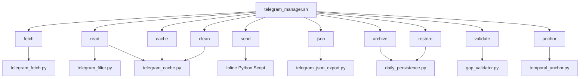
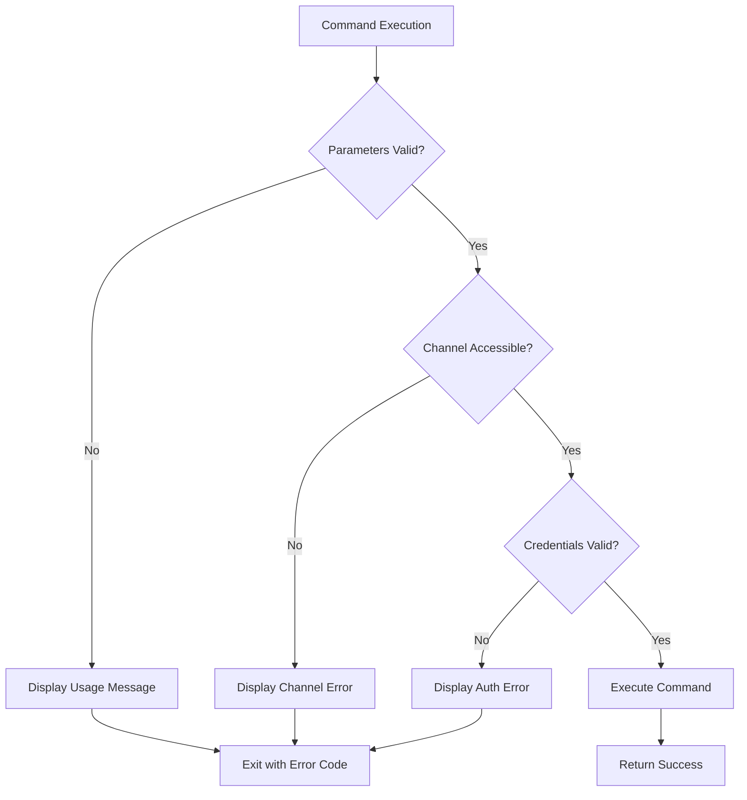
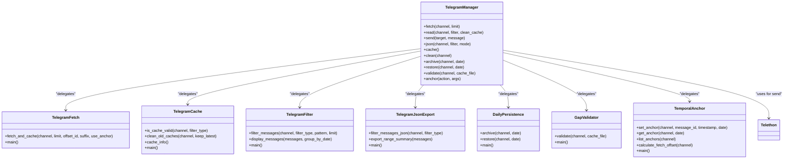

# Command Reference

<cite>
**Referenced Files in This Document**  
- [telegram_manager.sh](file://telegram_manager.sh) - *Updated in recent commit*
- [scripts/telegram_tools/core/telegram_cache.py](file://scripts/telegram_tools/core/telegram_cache.py) - *Updated in recent commit*
- [scripts/telegram_tools/core/telegram_fetch.py](file://scripts/telegram_tools/core/telegram_fetch.py) - *Updated in recent commit*
- [scripts/telegram_tools/core/telegram_filter.py](file://scripts/telegram_tools/core/telegram_filter.py) - *Updated in recent commit*
- [scripts/telegram_tools/core/telegram_json_export.py](file://scripts/telegram_tools/core/telegram_json_export.py) - *Updated in recent commit*
- [scripts/telegram_tools/core/temporal_anchor.py](file://scripts/telegram_tools/core/temporal_anchor.py) - *Added in recent commit*
- [scripts/telegram_tools/core/daily_persistence.py](file://scripts/telegram_tools/core/daily_persistence.py) - *Added in recent commit*
- [scripts/telegram_tools/core/gap_validator.py](file://scripts/telegram_tools/core/gap_validator.py) - *Added in recent commit*
</cite>

## Update Summary
**Changes Made**   
- Added documentation for new commands: `archive`, `restore`, `validate`, and `anchor`
- Updated command overview to reflect new functionality
- Enhanced filter types section with date-based filtering
- Updated integration section to include new Python modules
- Added new architecture diagram reflecting JSON-based architecture
- Updated section sources to reflect file changes and additions

## Table of Contents
1. [Introduction](#introduction)
2. [Command Overview](#command-overview)
3. [Command Details](#command-details)
4. [Filter Types](#filter-types)
5. [Error Handling and Validation](#error-handling-and-validation)
6. [Output Interpretation](#output-interpretation)
7. [Integration with Python Modules](#integration-with-python-modules)

## Introduction

The `telegram_manager.sh` script provides a command-line interface for managing Telegram messages through a set of simple, focused commands. This interface abstracts the complexity of direct API interactions by orchestrating a suite of Python modules that handle specific tasks such as message fetching, filtering, caching, and sending. The script is designed to be accessible to beginners while providing the robust functionality needed for automation and scripting use cases.

The command-line interface follows a consistent pattern where each command maps to a specific Python module that performs the core functionality. The bash script acts as a controller, handling parameter validation, environment setup, and coordinating the execution flow between different components. This modular architecture allows for easy maintenance and extension of functionality.

**Section sources**
- [telegram_manager.sh](file://telegram_manager.sh#L1-L165)

## Command Overview

The `telegram_manager.sh` script provides ten primary commands that enable comprehensive management of Telegram messages:

- **fetch**: Retrieves messages from a Telegram channel and stores them in a local cache
- **read**: Displays cached messages with optional filtering and cache refresh capabilities
- **send**: Sends a message to a specified Telegram target (user or channel)
- **json**: Exports message data in JSON format for programmatic use
- **cache**: Displays information about the current cache state
- **clean**: Removes old cache files to free up space
- **archive**: Archives daily cache for permanent storage
- **restore**: Restores daily cache from storage
- **validate**: Validates message completeness and detects gaps
- **anchor**: Manages temporal anchors for precise message retrieval

Each command is designed to perform a single, well-defined function, following the Unix philosophy of doing one thing well. The commands can be chained together in scripts to create more complex workflows, such as fetching fresh data and then processing it with custom analysis tools.



**Diagram sources**
- [telegram_manager.sh](file://telegram_manager.sh#L6-L165)
- [scripts/telegram_tools/core/telegram_cache.py](file://scripts/telegram_tools/core/telegram_cache.py#L1-L178)
- [scripts/telegram_tools/core/telegram_fetch.py](file://scripts/telegram_tools/core/telegram_fetch.py#L1-L193)
- [scripts/telegram_tools/core/telegram_filter.py](file://scripts/telegram_tools/core/telegram_filter.py#L1-L238)
- [scripts/telegram_tools/core/telegram_json_export.py](file://scripts/telegram_tools/core/telegram_json_export.py#L1-L124)
- [scripts/telegram_tools/core/daily_persistence.py](file://scripts/telegram_tools/core/daily_persistence.py#L1-L150)
- [scripts/telegram_tools/core/gap_validator.py](file://scripts/telegram_tools/core/gap_validator.py#L1-L120)
- [scripts/telegram_tools/core/temporal_anchor.py](file://scripts/telegram_tools/core/temporal_anchor.py#L1-L180)

**Section sources**
- [telegram_manager.sh](file://telegram_manager.sh#L6-L165)

## Command Details

### fetch Command

The `fetch` command retrieves messages from a specified Telegram channel and stores them in a local JSON cache file. This command serves as the primary data ingestion mechanism for the system.

**Syntax**: `./telegram_manager.sh fetch <channel> [limit]`

- **Required parameters**: `<channel>` - The Telegram channel identifier (with or without @ prefix)
- **Optional parameters**: `[limit]` - Maximum number of messages to fetch (default: 200)

**Expected behavior**: The command changes to the core tools directory and executes `telegram_fetch.py` with the provided parameters. It connects to Telegram using credentials from the `.env` file, retrieves the specified number of messages from the channel, and saves them with full metadata to a timestamped JSON file in the cache directory. The command now uses temporal anchoring to optimize message retrieval.

**Practical example**: To fetch 100 messages from the "aiclubsweggs" channel:
```bash
./telegram_manager.sh fetch aiclubsweggs 100
```

**Section sources**
- [telegram_manager.sh](file://telegram_manager.sh#L10-L13)
- [scripts/telegram_tools/core/telegram_fetch.py](file://scripts/telegram_tools/core/telegram_fetch.py#L1-L193)

### read Command

The `read` command displays messages from the cache with optional filtering and cache management capabilities. It intelligently determines whether to use cached data or fetch fresh messages based on cache validity.

**Syntax**: `./telegram_manager.sh read <channel> [filter] [--clean|clean_cache]`

- **Required parameters**: `<channel>` - The Telegram channel identifier
- **Optional parameters**: `[filter]` - Filter type to apply (default: today), `--clean` or `clean_cache` - Flag to clean cache before reading

**Expected behavior**: The command first checks if the `--clean` flag is present. If so, it cleans the cache for the specified channel and fetches fresh messages. Otherwise, it checks cache validity using `telegram_cache.py check` and only fetches new data if the cache is stale. Finally, it processes the messages through `telegram_filter.py` with the specified filter.

**Practical example**: To read today's messages from "aiclubsweggs" with a fresh cache:
```bash
./telegram_manager.sh read aiclubsweggs today --clean
```

**Section sources**
- [telegram_manager.sh](file://telegram_manager.sh#L14-L42)
- [scripts/telegram_tools/core/telegram_cache.py](file://scripts/telegram_tools/core/telegram_cache.py#L1-L178)
- [scripts/telegram_tools/core/telegram_filter.py](file://scripts/telegram_tools/core/telegram_filter.py#L1-L238)

### send Command

The `send` command sends a message to a specified Telegram target, which can be a user or channel.

**Syntax**: `./telegram_manager.sh send <target> <message>`

- **Required parameters**: `<target>` - The recipient (user ID, username, or channel), `<message>` - The message content to send

**Expected behavior**: The command executes an inline Python script that loads credentials from the `.env` file, establishes a connection to Telegram using Telethon, sends the message to the specified target, and disconnects. The script provides immediate feedback upon successful message delivery.

**Practical example**: To send a greeting to the user @almazom:
```bash
./telegram_manager.sh send @almazom "Hello, how are you?"
```

**Section sources**
- [telegram_manager.sh](file://telegram_manager.sh#L43-L64)

### json Command

The `json` command exports message data in JSON format, making it suitable for programmatic processing and integration with other tools.

**Syntax**: `./telegram_manager.sh json <channel> [filter] [--summary|--full]`

- **Required parameters**: `<channel>` - The Telegram channel identifier
- **Optional parameters**: `[filter]` - Filter type to apply (default: today), `[--summary|--full]` - Output mode (default: --summary)

**Expected behavior**: The command executes `telegram_json_export.py` with the provided parameters. In `--summary` mode (default), it returns a concise JSON object containing the first and last messages from the filtered set. In `--full` mode, it returns all filtered messages with complete metadata.

**Practical example**: To get a summary of today's messages from "aiclubsweggs":
```bash
./telegram_manager.sh json aiclubsweggs today --summary
```

**Section sources**
- [telegram_manager.sh](file://telegram_manager.sh#L90-L95)
- [scripts/telegram_tools/core/telegram_json_export.py](file://scripts/telegram_tools/core/telegram_json_export.py#L1-L124)

### cache Command

The `cache` command displays detailed information about the current cache state, including file counts, sizes, and age.

**Syntax**: `./telegram_manager.sh cache`

- **Required parameters**: None
- **Optional parameters**: None

**Expected behavior**: The command executes `telegram_cache.py info` to retrieve and display comprehensive cache statistics. It shows the total number of cache files, their sizes, and detailed information grouped by channel, including message counts and file ages.

**Practical example**: To view cache information:
```bash
./telegram_manager.sh cache
```

**Section sources**
- [telegram_manager.sh](file://telegram_manager.sh#L78-L80)
- [scripts/telegram_tools/core/telegram_cache.py](file://scripts/telegram_tools/core/telegram_cache.py#L1-L178)

### clean Command

The `clean` command removes old cache files to free up disk space, either for a specific channel or all channels.

**Syntax**: `./telegram_manager.sh clean [channel]`

- **Required parameters**: None
- **Optional parameters**: `[channel]` - Specific channel to clean (if omitted, cleans all channels)

**Expected behavior**: The command executes `telegram_cache.py clean` with the provided channel parameter. It removes old cache files while preserving the most recent files (typically keeping the latest 3 per channel). When no channel is specified, it cleans cache files for all channels.

**Practical example**: To clean the cache for the "aiclubsweggs" channel:
```bash
./telegram_manager.sh clean aiclubsweggs
```

**Section sources**
- [telegram_manager.sh](file://telegram_manager.sh#L81-L83)
- [scripts/telegram_tools/core/telegram_cache.py](file://scripts/telegram_tools/core/telegram_cache.py#L1-L178)

### archive Command

The `archive` command archives daily cache for permanent storage, enabling long-term message preservation.

**Syntax**: `./telegram_manager.sh archive <channel> [date]`

- **Required parameters**: `<channel>` - The Telegram channel identifier
- **Optional parameters**: `[date]` - Specific date to archive (default: today)

**Expected behavior**: The command executes `daily_persistence.py archive` with the provided parameters. It moves the cache file for the specified channel and date to a permanent storage location, preserving it from regular cache cleanup operations.

**Practical example**: To archive today's messages from "aiclubsweggs":
```bash
./telegram_manager.sh archive aiclubsweggs
```

**Section sources**
- [telegram_manager.sh](file://telegram_manager.sh#L96-L98)
- [scripts/telegram_tools/core/daily_persistence.py](file://scripts/telegram_tools/core/daily_persistence.py#L1-L150)

### restore Command

The `restore` command restores daily cache from permanent storage, allowing access to archived messages.

**Syntax**: `./telegram_manager.sh restore <channel> <date>`

- **Required parameters**: `<channel>` - The Telegram channel identifier, `<date>` - Date of the archive to restore (YYYY-MM-DD format)

**Expected behavior**: The command executes `daily_persistence.py restore` with the provided parameters. It retrieves the archived cache file for the specified channel and date from permanent storage and places it back in the active cache directory.

**Practical example**: To restore messages from "aiclubsweggs" for September 15, 2025:
```bash
./telegram_manager.sh restore aiclubsweggs 2025-09-15
```

**Section sources**
- [telegram_manager.sh](file://telegram_manager.sh#L99-L101)
- [scripts/telegram_tools/core/daily_persistence.py](file://scripts/telegram_tools/core/daily_persistence.py#L1-L150)

### validate Command

The `validate` command validates message completeness and detects gaps in the message sequence.

**Syntax**: `./telegram_manager.sh validate <channel> [cache_file]`

- **Required parameters**: `<channel>` - The Telegram channel identifier
- **Optional parameters**: `[cache_file]` - Specific cache file to validate (if omitted, uses latest cache)

**Expected behavior**: The command executes `gap_validator.py validate` with the provided parameters. It analyzes the message sequence in the cache file for the specified channel, checking for gaps in message IDs and reporting any inconsistencies.

**Practical example**: To validate message completeness for "aiclubsweggs":
```bash
./telegram_manager.sh validate aiclubsweggs
```

**Section sources**
- [telegram_manager.sh](file://telegram_manager.sh#L102-L108)
- [scripts/telegram_tools/core/gap_validator.py](file://scripts/telegram_tools/core/gap_validator.py#L1-L120)

### anchor Command

The `anchor` command manages temporal anchors for precise message retrieval, supporting set, get, and list operations.

**Syntax**: 
```
./telegram_manager.sh anchor set <channel> <message_id> <timestamp> [date]
./telegram_manager.sh anchor get <channel> [date]
./telegram_manager.sh anchor list [channel]
```

- **Required parameters**: Varies by subcommand
- **Optional parameters**: Varies by subcommand

**Expected behavior**: The command delegates to `temporal_anchor.py` with the appropriate subcommand. Temporal anchors provide a way to mark specific messages as reference points for future retrieval, enabling precise offset calculations when fetching messages.

**Practical example**: To set a temporal anchor for message 72856 at 00:58:11:
```bash
./telegram_manager.sh anchor set aiclubsweggs 72856 00:58:11
```

**Section sources**
- [telegram_manager.sh](file://telegram_manager.sh#L109-L165)
- [scripts/telegram_tools/core/temporal_anchor.py](file://scripts/telegram_tools/core/temporal_anchor.py#L1-L180)

## Filter Types

The filtering system provides several predefined filter types that can be applied to message retrieval operations across multiple commands. These filters determine which messages are included in the output based on temporal criteria.

### today Filter

The `today` filter selects messages sent on the current day according to Moscow time (UTC+3).

**Behavior**: Messages are filtered by comparing their Moscow timestamp against the current date. The cache validity for this filter is set to 5 minutes, meaning frequently accessed today's messages will trigger fresh fetches every 5 minutes to ensure up-to-date content.

**Example**: When used with the `read` command, it displays all messages from the current day:
```bash
./telegram_manager.sh read aiclubsweggs today
```

**Section sources**
- [telegram_manager.sh](file://telegram_manager.sh#L17-L22)
- [scripts/telegram_tools/core/telegram_filter.py](file://scripts/telegram_tools/core/telegram_filter.py#L1-L238)
- [scripts/telegram_tools/core/telegram_cache.py](file://scripts/telegram_tools/core/telegram_cache.py#L1-L178)

### yesterday Filter

The `yesterday` filter selects messages sent on the previous day according to Moscow time.

**Behavior**: Messages are filtered by comparing their Moscow timestamp against yesterday's date. The cache validity for this filter is set to 60 minutes, balancing freshness with performance for historical data access.

**Example**: To read messages from yesterday:
```bash
./telegram_manager.sh read aiclubsweggs yesterday
```

**Section sources**
- [telegram_manager.sh](file://telegram_manager.sh#L97)
- [scripts/telegram_tools/core/telegram_filter.py](file://scripts/telegram_tools/core/telegram_filter.py#L1-L238)
- [scripts/telegram_tools/core/telegram_cache.py](file://scripts/telegram_tools/core/telegram_cache.py#L1-L178)

### last:N Filter

The `last:N` filter selects messages from the past N days, where N is a positive integer.

**Behavior**: Messages are filtered by calculating a cutoff date (current date minus N days) and including all messages dated on or after this cutoff. For N ≤ 7, the cache TTL is 60 minutes; for N > 7, the cache TTL is 1440 minutes (24 hours), recognizing that older data changes less frequently.

**Example**: To fetch messages from the last 3 days:
```bash
./telegram_manager.sh fetch aiclubsweggs
./telegram_manager.sh read aiclubsweggs last:3
```

**Section sources**
- [telegram_manager.sh](file://telegram_manager.sh#L97)
- [scripts/telegram_tools/core/telegram_filter.py](file://scripts/telegram_tools/core/telegram_filter.py#L1-L238)
- [scripts/telegram_tools/core/telegram_cache.py](file://scripts/telegram_tools/core/telegram_cache.py#L1-L178)

### all Filter

The `all` filter selects all cached messages without temporal restrictions.

**Behavior**: Returns all messages currently stored in the cache for the specified channel. Since this filter accesses the complete dataset, the cache validity is set to 60 minutes, assuming that comprehensive data access is less time-sensitive than recent messages.

**Example**: To display all cached messages from a channel:
```bash
./telegram_manager.sh read aiclubsweggs all
```

**Section sources**
- [telegram_manager.sh](file://telegram_manager.sh#L97)
- [scripts/telegram_tools/core/telegram_filter.py](file://scripts/telegram_tools/core/telegram_filter.py#L1-L238)
- [scripts/telegram_tools/core/telegram_cache.py](file://scripts/telegram_tools/core/telegram_cache.py#L1-L178)

## Error Handling and Validation

The command-line interface implements comprehensive error handling and validation to ensure robust operation and provide clear feedback for troubleshooting.

### Parameter Validation

Each command performs validation of required parameters and provides specific usage guidance when parameters are missing or incorrect. For example, the `fetch` command validates that a channel parameter is provided, exiting with a clear usage message if omitted.



**Diagram sources**
- [telegram_manager.sh](file://telegram_manager.sh#L10-L165)
- [tests/test_10_error_handling.sh](file://tests/test_10_error_handling.sh#L1-L244)

### Cache Validation

The system implements intelligent cache validation based on filter types and message recency. Different filter types have different cache TTL (time-to-live) values:
- `today` filter: 5 minutes
- `yesterday` and `last:N` (N≤7): 60 minutes
- `last:N` (N>7) and `all`: 1440 minutes (24 hours)

This tiered approach ensures that frequently accessed recent messages are kept fresh while reducing unnecessary API calls for historical data.

**Section sources**
- [scripts/telegram_tools/core/telegram_cache.py](file://scripts/telegram_tools/core/telegram_cache.py#L1-L178)
- [telegram_manager.sh](file://telegram_manager.sh#L33-L37)

### Error Conditions

The system handles various error conditions with appropriate responses:
- **Missing credentials**: Exits with a clear error message when required environment variables are not found
- **Invalid channel format**: Validates channel identifiers and rejects malformed inputs
- **Network issues**: Handles connection problems with Telegram API gracefully
- **Permission errors**: Manages cases where the bot lacks access to requested channels

The test suite in `test_10_error_handling.sh` verifies these error conditions through comprehensive test cases.

**Section sources**
- [tests/test_10_error_handling.sh](file://tests/test_10_error_handling.sh#L1-L244)
- [telegram_manager.sh](file://telegram_manager.sh#L1-L165)

## Output Interpretation

Understanding the output and exit codes of the command-line interface is essential for both interactive use and scripting automation.

### Exit Codes

The script follows standard Unix conventions for exit codes:
- **0**: Success - Command completed successfully
- **1**: Error - Command failed due to invalid parameters, authentication issues, or other errors

Scripts that incorporate `telegram_manager.sh` commands should check exit codes to handle failures appropriately.

### Command Output

Each command produces specific output that indicates its status and results:
- **fetch**: Confirms the number of messages cached and the cache file location
- **read**: Displays messages in a formatted list with date headers and message details
- **send**: Prints "✅ Message sent" upon successful delivery
- **json**: Outputs JSON data to stdout for programmatic processing
- **cache**: Shows cache statistics including file counts and sizes
- **clean**: Reports removed cache files and completion status
- **archive**: Confirms successful archiving of cache
- **restore**: Confirms successful restoration of cache
- **validate**: Reports validation results and any detected gaps
- **anchor**: Provides feedback on anchor operations

The output uses emoji indicators (✅, ❌, 📋, etc.) to provide visual feedback on operation status.

**Section sources**
- [telegram_manager.sh](file://telegram_manager.sh#L1-L165)
- [scripts/telegram_tools/core/telegram_cache.py](file://scripts/telegram_tools/core/telegram_cache.py#L1-L178)
- [scripts/telegram_tools/core/telegram_fetch.py](file://scripts/telegram_tools/core/telegram_fetch.py#L1-L193)
- [scripts/telegram_tools/core/telegram_filter.py](file://scripts/telegram_tools/core/telegram_filter.py#L1-L238)

## Integration with Python Modules

The bash script serves as a controller that orchestrates several specialized Python modules, each responsible for a specific aspect of Telegram message management.

### Architecture Overview



**Diagram sources**
- [telegram_manager.sh](file://telegram_manager.sh#L1-L165)
- [scripts/telegram_tools/core/telegram_cache.py](file://scripts/telegram_tools/core/telegram_cache.py#L1-L178)
- [scripts/telegram_tools/core/telegram_fetch.py](file://scripts/telegram_tools/core/telegram_fetch.py#L1-L193)
- [scripts/telegram_tools/core/telegram_filter.py](file://scripts/telegram_tools/core/telegram_filter.py#L1-L238)
- [scripts/telegram_tools/core/telegram_json_export.py](file://scripts/telegram_tools/core/telegram_json_export.py#L1-L124)
- [scripts/telegram_tools/core/daily_persistence.py](file://scripts/telegram_tools/core/daily_persistence.py#L1-L150)
- [scripts/telegram_tools/core/gap_validator.py](file://scripts/telegram_tools/core/gap_validator.py#L1-L120)
- [scripts/telegram_tools/core/temporal_anchor.py](file://scripts/telegram_tools/core/temporal_anchor.py#L1-L180)

### Module Responsibilities

- **telegram_fetch.py**: Handles the retrieval of messages from Telegram API and caching to JSON files with full metadata
- **telegram_cache.py**: Manages cache lifecycle, including validity checking, cleanup, and statistics reporting
- **telegram_filter.py**: Processes cached messages with various filtering criteria and formats output for display
- **telegram_json_export.py**: Provides JSON output for programmatic consumption, with options for summary or full data export
- **daily_persistence.py**: Manages archiving and restoration of cache files for long-term storage
- **gap_validator.py**: Validates message completeness and detects gaps in message sequences
- **temporal_anchor.py**: Manages temporal anchors for precise message retrieval and offset calculation

The bash script coordinates these modules by passing parameters, managing working directories, and handling the overall execution flow, creating a cohesive command-line interface from specialized components.

**Section sources**
- [telegram_manager.sh](file://telegram_manager.sh#L1-L165)
- [scripts/telegram_tools/core/telegram_cache.py](file://scripts/telegram_tools/core/telegram_cache.py#L1-L178)
- [scripts/telegram_tools/core/telegram_fetch.py](file://scripts/telegram_tools/core/telegram_fetch.py#L1-L193)
- [scripts/telegram_tools/core/telegram_filter.py](file://scripts/telegram_tools/core/telegram_filter.py#L1-L238)
- [scripts/telegram_tools/core/telegram_json_export.py](file://scripts/telegram_tools/core/telegram_json_export.py#L1-L124)
- [scripts/telegram_tools/core/daily_persistence.py](file://scripts/telegram_tools/core/daily_persistence.py#L1-L150)
- [scripts/telegram_tools/core/gap_validator.py](file://scripts/telegram_tools/core/gap_validator.py#L1-L120)
- [scripts/telegram_tools/core/temporal_anchor.py](file://scripts/telegram_tools/core/temporal_anchor.py#L1-L180)