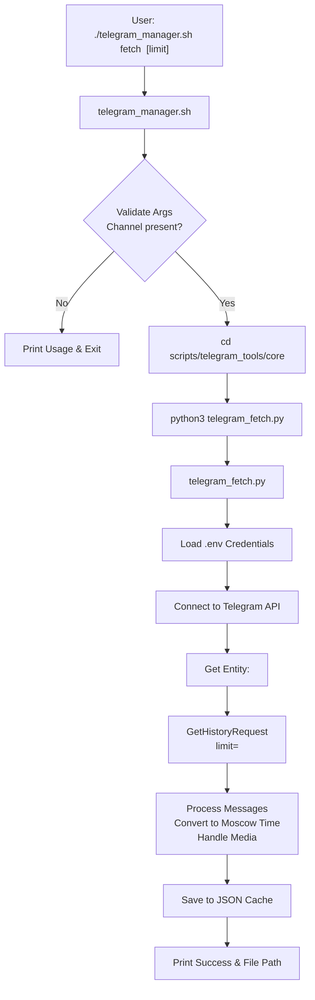

# Fetch Command

<cite>
**Referenced Files in This Document**   
- [telegram_manager.sh](file://telegram_manager.sh)
- [scripts/telegram_tools/core/telegram_fetch.py](file://scripts/telegram_tools/core/telegram_fetch.py)
- [scripts/telegram_tools/core/telegram_cache.py](file://scripts/telegram_tools/core/telegram_cache.py)
- [scripts/telegram_tools/core/telegram_fetch_large.py](file://scripts/telegram_tools/core/telegram_fetch_large.py)
</cite>

## Table of Contents
1. [Introduction](#introduction)
2. [Command Syntax and Usage](#command-syntax-and-usage)
3. [Execution Flow](#execution-flow)
4. [Integration with Caching System](#integration-with-caching-system)
5. [Error Handling](#error-handling)
6. [Performance Considerations](#performance-considerations)
7. [Workflow Context](#workflow-context)

## Introduction
The `fetch` command is a core functionality within the Telegram message management system, designed to retrieve messages from a specified Telegram channel using the Telethon API. It serves as the primary mechanism for obtaining fresh message data directly from Telegram servers and storing it in a structured JSON format for downstream processing. This command is invoked through the main shell script `telegram_manager.sh` and delegates the actual fetching and caching logic to the Python script `telegram_fetch.py`. The command ensures up-to-date data retrieval and is a critical component in the data pipeline, especially when cache freshness is required.

**Section sources**
- [telegram_manager.sh](file://telegram_manager.sh#L1-L23)
- [scripts/telegram_tools/core/telegram_fetch.py](file://scripts/telegram_tools/core/telegram_fetch.py#L1-L30)

## Command Syntax and Usage
The `fetch` command follows a simple and intuitive syntax: `fetch <channel> [limit]`. The `<channel>` parameter is mandatory and specifies the Telegram channel from which messages are to be retrieved. The `[limit]` parameter is optional and defines the maximum number of messages to fetch. If the limit is not provided, the command defaults to retrieving 200 messages. For example, the command `./telegram_manager.sh fetch aiclubsweggs 100` retrieves 100 messages from the `aiclubsweggs` channel. The channel name can be provided with or without the `@` prefix; the underlying script automatically normalizes the input to ensure the correct format.

**Section sources**
- [telegram_manager.sh](file://telegram_manager.sh#L9)
- [scripts/telegram_tools/core/telegram_fetch.py](file://scripts/telegram_tools/core/telegram_fetch.py#L124-L143)

## Execution Flow
When the `fetch` command is executed, the `telegram_manager.sh` script first validates the presence of the required channel argument. Upon successful validation, it changes the working directory to the core tools directory located at `scripts/telegram_tools/core`. From this location, it invokes the Python interpreter to execute the `telegram_fetch.py` script, passing the channel name and the limit (or the default value of 200) as command-line arguments. The `telegram_fetch.py` script then establishes a connection to the Telegram API using credentials loaded from a `.env` file, retrieves the specified number of messages via the `GetHistoryRequest` method, processes the message data (including converting timestamps to Moscow time and handling media content), and finally saves the structured data to a JSON file in the `telegram_cache` directory with a timestamped filename.

**Diagram sources**
- [telegram_manager.sh](file://telegram_manager.sh#L9-L11)
- [scripts/telegram_tools/core/telegram_fetch.py](file://scripts/telegram_tools/core/telegram_fetch.py#L22-L122)

## Integration with Caching System
The `fetch` command is intrinsically linked to the caching system, but it operates with a "fetch-first" strategy. Unlike other commands that may use cached data, `fetch` always retrieves fresh data from the Telegram API. Its primary role in the caching workflow is to update the cache with the latest messages. Each execution generates a new JSON file in the `telegram_cache` directory, named with the channel identifier and a timestamp, ensuring that the most recent data is always available. This behavior makes `fetch` the authoritative source for populating the cache, which other commands like `read` and `json` can then utilize. The metadata stored within each cache file includes the request limit and timestamp, providing full traceability of the data source.

**Section sources**
- [scripts/telegram_tools/core/telegram_fetch.py](file://scripts/telegram_tools/core/telegram_fetch.py#L22-L122)
- [scripts/telegram_tools/core/telegram_cache.py](file://scripts/telegram_tools/core/telegram_cache.py#L1-L50)

## Error Handling
The `fetch` command implements robust error handling at multiple levels. The shell script `telegram_manager.sh` performs initial validation, checking for the presence of the mandatory channel argument and exiting with a usage message if it is missing. The Python script `telegram_fetch.py` handles runtime exceptions that may occur during the API interaction. This includes catching any `Exception` that arises during the message retrieval process, such as network errors or API rate limits, and printing a descriptive error message to stderr. It also includes a safeguard for missing dependencies, specifically checking for the presence of the `telethon` library at import time and providing a clear installation instruction if it is not found. This layered approach ensures that users receive informative feedback for both usage errors and system-level failures.

**Section sources**
- [telegram_manager.sh](file://telegram_manager.sh#L9)
- [scripts/telegram_tools/core/telegram_fetch.py](file://scripts/telegram_tools/core/telegram_fetch.py#L124-L143)

## Performance Considerations
While the `fetch` command is efficient for retrieving moderate volumes of messages (up to a few hundred), it is subject to the Telegram API's per-request limit of 100 messages. To retrieve a large number of messages, the command must make multiple API calls, which can be time-consuming and resource-intensive. For extensive historical data retrieval, the system provides a specialized `fetch_large` command, implemented in `telegram_fetch_large.py`. This alternative script is designed to handle pagination automatically, fetching messages in batches to efficiently retrieve thousands of messages without overwhelming the API or the client. Users are advised to use `fetch_large` for bulk data operations to ensure optimal performance and reliability.

**Section sources**
- [scripts/telegram_tools/core/telegram_fetch.py](file://scripts/telegram_tools/core/telegram_fetch.py#L22-L122)
- [scripts/telegram_tools/core/telegram_fetch_large.py](file://scripts/telegram_tools/core/telegram_fetch_large.py#L0-L47)

## Workflow Context
The `fetch` command is a pivotal component within the broader message management workflow. It is typically the first step in any process that requires up-to-date Telegram data. Its output, the JSON cache files, serves as the input for subsequent commands. For instance, the `read` command can be used to filter and display messages from the cache, and the `json` command can be used to export the raw data. The `cache` command provides information about the current state of the cache, while the `clean` command can be used to remove old cache files. The `fetch` command, especially when used with the `--clean` flag in the `read` command, ensures that the entire pipeline operates on fresh data, making it the cornerstone of the system's data integrity.

**Section sources**
- [telegram_manager.sh](file://telegram_manager.sh#L1-L109)
- [scripts/telegram_tools/core/telegram_cache.py](file://scripts/telegram_tools/core/telegram_cache.py#L136-L175)