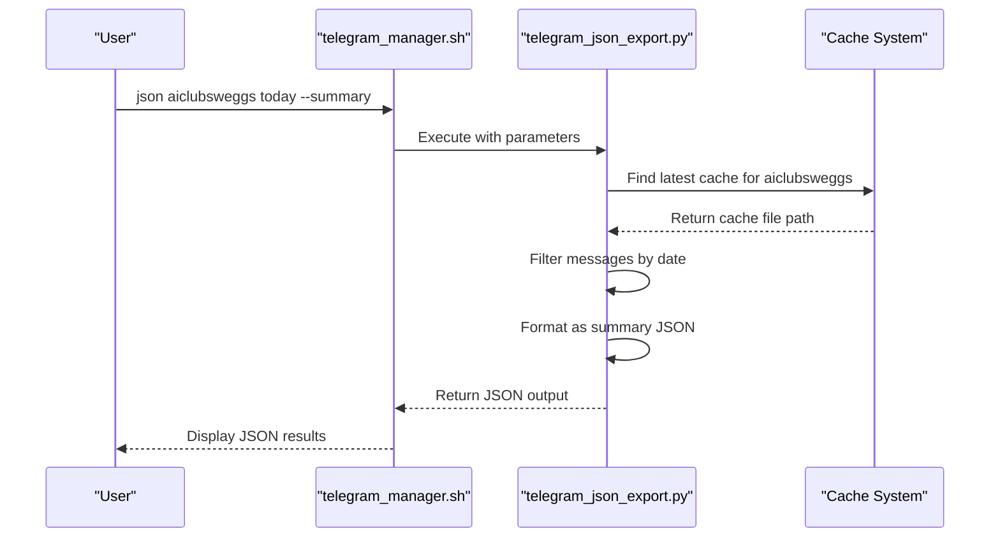
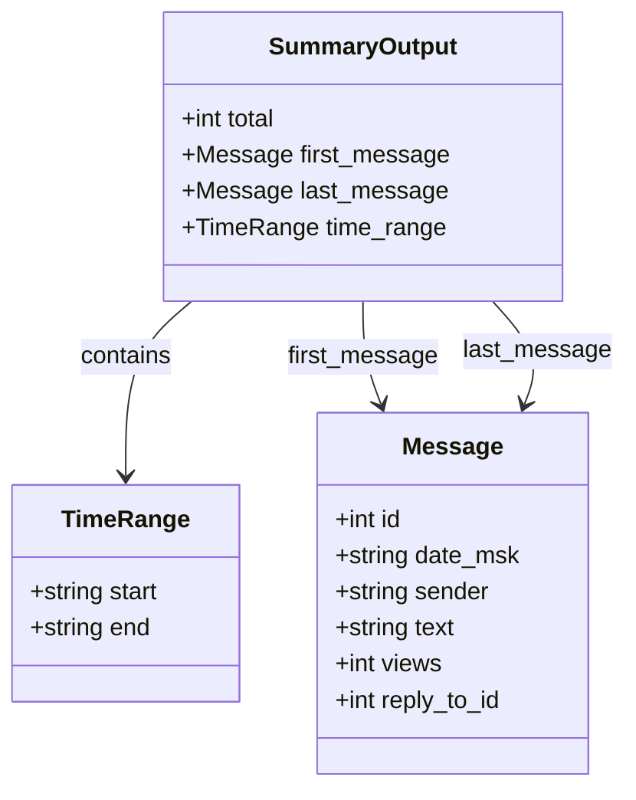
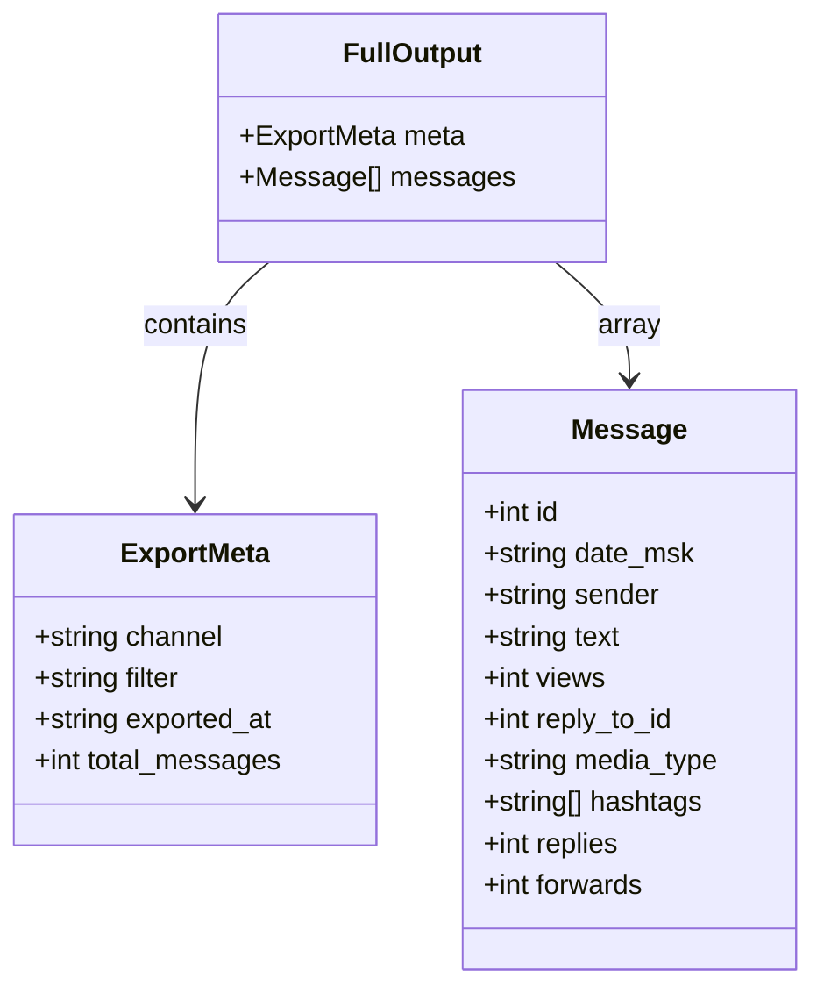
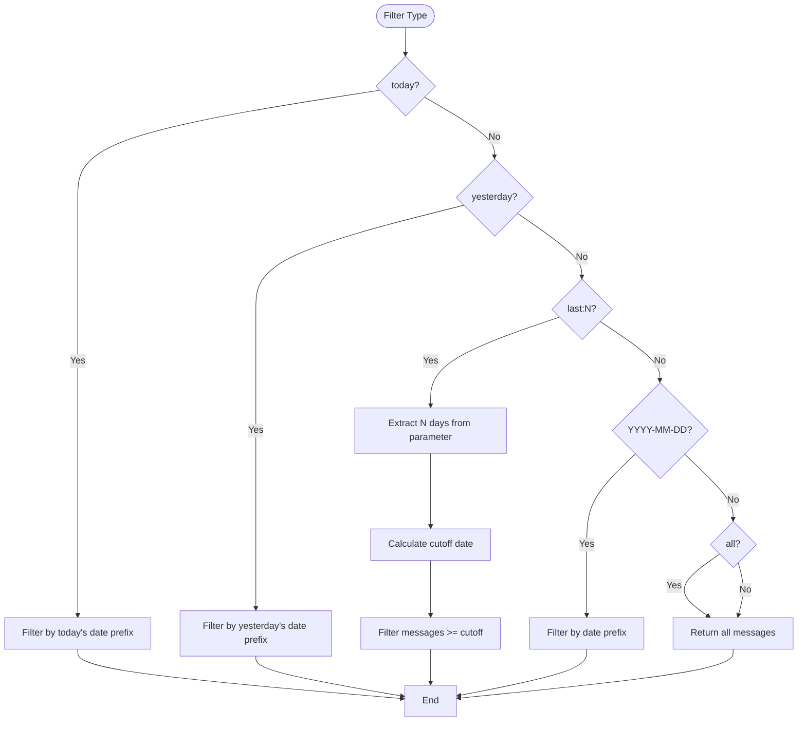
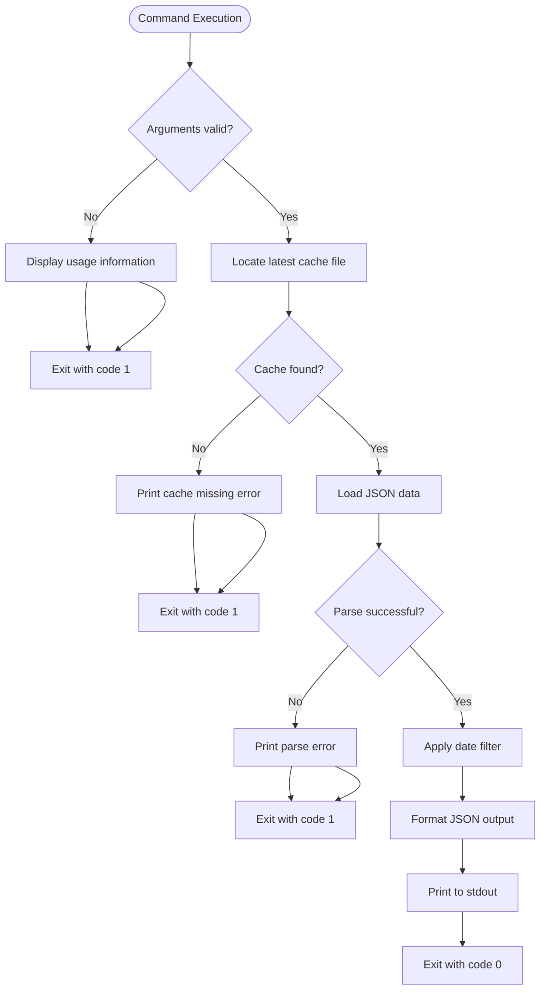

# JSON Export Command

<cite>
**Referenced Files in This Document**   
- [telegram_json_export.py](file://scripts/telegram_tools/core/telegram_json_export.py) - *Updated in recent commit*
- [telegram_filter.py](file://scripts/telegram_tools/core/telegram_filter.py)
- [telegram_cache.py](file://scripts/telegram_tools/core/telegram_cache.py)
- [telegram_manager.sh](file://telegram_manager.sh) - *Modified to support JSON export*
- [test_05_date_today.sh](file://tests/test_05_date_today.sh)
- [test_10_error_handling.sh](file://tests/test_10_error_handling.sh)
- [test_first_message_border_detection.sh](file://tests/test_first_message_border_detection.sh)
</cite>

## Update Summary
**Changes Made**   
- Updated command syntax and usage to reflect current implementation
- Enhanced core functionality section with accurate processing flow
- Clarified output mode differences with updated JSON structures
- Verified filtering system behavior against current code
- Updated error handling details based on actual implementation
- Refreshed examples to match current command interface

## Table of Contents
1. [Command Syntax and Usage](#command-syntax-and-usage)
2. [Core Functionality](#core-functionality)
3. Output Modes
   - [Summary Mode](#summary-mode)
   - [Full Mode](#full-mode)
4. [Filtering System](#filtering-system)
5. [Caching Integration](#caching-integration)
6. [Error Handling](#error-handling)
7. [Use Cases](#use-cases)
8. [Examples](#examples)

## Command Syntax and Usage

The `json` command provides a structured way to export Telegram messages in JSON format for external analysis and integration. The syntax follows a consistent pattern:

```
json <channel> [filter] [--summary|--full]
```

- `<channel>`: Required parameter specifying the Telegram channel to export (e.g., `aiclubsweggs` or `@aiclubsweggs`)
- `[filter]`: Optional parameter with default value `today` that determines which messages to include
- `[--summary|--full]`: Optional output mode parameter with default `--summary`

The command is accessible through the main `telegram_manager.sh` script, which routes the request to the dedicated `telegram_json_export.py` module for processing.

**Section sources**
- [telegram_manager.sh](file://telegram_manager.sh#L133-L164)
- [telegram_json_export.py](file://scripts/telegram_tools/core/telegram_json_export.py#L76-L121)

## Core Functionality

The JSON export command operates as a specialized data extraction tool that interfaces with the Telegram message caching system. When invoked, the command follows a three-step process:

1. **Channel Resolution**: The specified channel name is normalized to ensure consistent formatting (automatically prepending `@` if missing)
2. **Cache Retrieval**: The system locates the most recent cache file for the specified channel using timestamp-based sorting
3. **Data Processing**: Messages are filtered according to the specified criteria and formatted according to the requested output mode

The command serves as a bridge between the cached Telegram data and external systems that require structured JSON input, making it particularly valuable for data analysis pipelines and archival systems.



**Diagram sources**
- [telegram_manager.sh](file://telegram_manager.sh#L133-L164)
- [telegram_json_export.py](file://scripts/telegram_tools/core/telegram_json_export.py#L76-L121)

**Section sources**
- [telegram_json_export.py](file://scripts/telegram_tools/core/telegram_json_export.py#L1-L124)

## Summary Mode

The `--summary` output mode (default) provides a concise representation of the filtered message set, containing only essential metadata about the message range. This mode is optimized for quick analysis and integration with systems that need to understand message volume and temporal distribution without processing complete message objects.

The summary output includes:
- Total count of filtered messages
- First message in chronological order
- Last message in chronological order
- Time range spanning from the first to last message

This condensed format significantly reduces data transfer size and processing overhead, making it ideal for monitoring dashboards, analytics preprocessing, and initial data exploration.



**Diagram sources**
- [telegram_json_export.py](file://scripts/telegram_tools/core/telegram_json_export.py#L63-L98)

**Section sources**
- [telegram_json_export.py](file://scripts/telegram_tools/core/telegram_json_export.py#L63-L98)

## Full Mode

The `--full` output mode provides complete message objects in their original JSON structure, preserving all available metadata and content. This comprehensive export is designed for detailed analysis, archival purposes, and integration with systems that require access to the full message context.

The full output structure includes:
- Metadata about the export operation (channel, filter criteria, timestamp)
- Complete array of filtered message objects with all fields
- Original message structure as captured from Telegram

This mode generates significantly larger output but ensures no information loss, making it suitable for data science applications, compliance archiving, and forensic analysis.



**Diagram sources**
- [telegram_json_export.py](file://scripts/telegram_tools/core/telegram_json_export.py#L108-L117)

**Section sources**
- [telegram_json_export.py](file://scripts/telegram_tools/core/telegram_json_export.py#L108-L117)

## Filtering System

The JSON export command leverages a flexible filtering system that allows users to specify which messages should be included in the export. The filtering mechanism supports multiple temporal criteria:

- `today`: Messages from the current day (default)
- `yesterday`: Messages from the previous day
- `last:N`: Messages from the last N days (e.g., `last:7` for one week)
- `YYYY-MM-DD`: Messages from a specific date
- `all`: All cached messages regardless of date

The filtering system operates on Moscow time (MSK) timestamps embedded in the cached messages, ensuring consistent temporal boundaries across different time zones. Date filtering is implemented through string prefix matching on the `date_msk` field, which contains timestamps in `YYYY-MM-DD HH:MM:SS` format.



**Diagram sources**
- [telegram_json_export.py](file://scripts/telegram_tools/core/telegram_json_export.py#L20-L43)

**Section sources**
- [telegram_json_export.py](file://scripts/telegram_tools/core/telegram_json_export.py#L20-L43)
- [test_05_date_today.sh](file://tests/test_05_date_today.sh#L10-L25)

## Caching Integration

The JSON export command is tightly integrated with the caching system to ensure efficient data retrieval and optimal performance. The integration follows a hierarchical approach:

1. **Cache Location**: Messages are stored in JSON files within the `telegram_cache` directory, named with the channel identifier and timestamp
2. **Cache Selection**: The system automatically identifies the most recent cache file for the specified channel using lexicographic sorting
3. **Cache Validation**: While the JSON export command itself doesn't validate cache freshness, it relies on the upstream caching system to ensure data currency

This architecture enables rapid data access by eliminating the need for real-time API calls during export operations, while still providing mechanisms for users to ensure they're working with current data through the main manager's cache control features.

```mermaid
graph TB
subgraph "Cache System"
CacheDir[(telegram_cache/)]
CacheFile1["channel_20250915_080000.json"]
CacheFile2["channel_20250914_200000.json"]
CacheFile3["channel_20250914_120000.json"]
end
subgraph "Export Process"
Exporter[telegram_json_export.py]
Finder[find_latest_cache()]
Filter[filter_messages_json()]
end
Exporter --> Finder
Finder --> CacheDir
CacheDir --> CacheFile1
CacheDir --> CacheFile2
CacheDir --> CacheFile3
Finder --> CacheFile1
CacheFile1 --> Filter
Filter --> Exporter
```

**Diagram sources**
- [telegram_json_export.py](file://scripts/telegram_tools/core/telegram_json_export.py#L10-L18)
- [telegram_cache.py](file://scripts/telegram_tools/core/telegram_cache.py#L10-L35)

**Section sources**
- [telegram_json_export.py](file://scripts/telegram_tools/core/telegram_json_export.py#L10-L18)
- [telegram_cache.py](file://scripts/telegram_tools/core/telegram_cache.py#L10-L35)

## Error Handling

The JSON export command implements comprehensive error handling to provide clear feedback and maintain system stability. The error management system addresses several potential failure scenarios:

- **Missing Cache**: When no cache file exists for the specified channel, the command returns a descriptive error message suggesting the appropriate fetch command
- **Invalid Parameters**: The command validates input parameters and provides usage guidance when syntax errors occur
- **Processing Exceptions**: Runtime errors during JSON parsing or file operations are caught and reported with descriptive messages

Error messages are directed to stderr with appropriate formatting (including emoji indicators), ensuring they don't interfere with valid JSON output on stdout. This separation allows for clean integration with automated systems that can distinguish between operational output and error conditions.



**Diagram sources**
- [telegram_json_export.py](file://scripts/telegram_tools/core/telegram_json_export.py#L76-L121)
- [test_10_error_handling.sh](file://tests/test_10_error_handling.sh#L1-L244)

**Section sources**
- [telegram_json_export.py](file://scripts/telegram_tools/core/telegram_json_export.py#L76-L121)
- [test_10_error_handling.sh](file://tests/test_10_error_handling.sh#L1-L244)

## Use Cases

The JSON export command serves several important use cases in data analysis and system integration:

### Data Analysis Pipelines
The structured JSON output can be easily consumed by data analysis tools and frameworks. The summary mode provides quick insights into message volume and temporal patterns, while the full mode enables detailed content analysis, sentiment analysis, and topic modeling.

### Archival and Compliance
Organizations can use the command to create regular JSON exports for archival purposes, ensuring message history is preserved in a standardized, easily accessible format that meets compliance requirements.

### External System Integration
Developers can integrate the JSON output with external systems such as:
- Business intelligence dashboards
- Customer relationship management (CRM) systems
- Notification services
- Machine learning pipelines

### Automated Workflows
The command can be incorporated into automated scripts and cron jobs to generate regular reports, monitor channel activity, or trigger actions based on message content patterns.

**Section sources**
- [telegram_json_export.py](file://scripts/telegram_tools/core/telegram_json_export.py#L1-L124)
- [test_first_message_border_detection.sh](file://tests/test_first_message_border_detection.sh#L1-L56)

## Examples

### Basic Usage
Export today's messages from the aiclubsweggs channel in summary format:

```bash
./telegram_manager.sh json aiclubsweggs
```

### Specific Filter with Summary Output
Export messages from yesterday in the aiclubsweggs channel:

```bash
./telegram_manager.sh json aiclubsweggs yesterday --summary
```

### Complete Message Export
Export all messages from the last 7 days with complete message objects:

```bash
./telegram_manager.sh json aiclubsweggs last:7 --full
```

### Specific Date Export
Export messages from a specific date in full detail:

```bash
./telegram_manager.sh json aiclubsweggs 2025-09-15 --full
```

These examples demonstrate the flexibility of the JSON export command in accommodating various data extraction needs while maintaining a consistent interface.

**Section sources**
- [telegram_manager.sh](file://telegram_manager.sh#L133-L164)
- [telegram_json_export.py](file://scripts/telegram_tools/core/telegram_json_export.py#L76-L121)