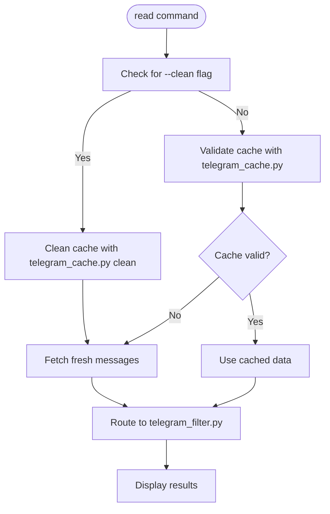
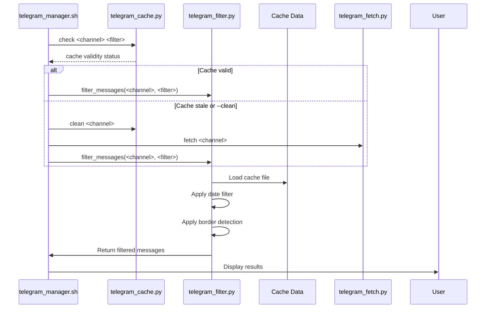
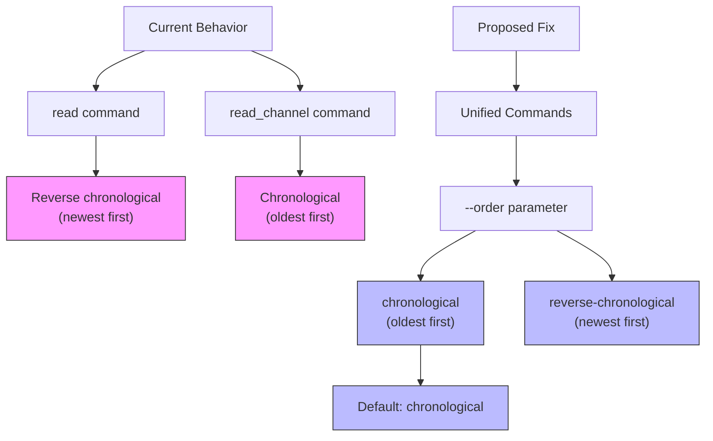

# Read Command

<cite>
**Referenced Files in This Document**   
- [telegram_manager.sh](file://telegram_manager.sh#L30-L72)
- [scripts/telegram_tools/core/telegram_cache.py](file://scripts/telegram_tools/core/telegram_cache.py#L32-L57)
- [scripts/telegram_tools/core/telegram_filter.py](file://scripts/telegram_tools/core/telegram_filter.py#L122-L173)
- [tests/BUG_REPORT_message_ordering.md](file://tests/BUG_REPORT_message_ordering.md#L38-L85)
- [tests/PROPOSED_FIX_message_ordering.md](file://tests/PROPOSED_FIX_message_ordering.md#L109-L155)
</cite>

## Table of Contents
1. [Command Syntax and Parameters](#command-syntax-and-parameters)
2. [Cache Management Behavior](#cache-management-behavior)
3. [Message Filtering Process](#message-filtering-process)
4. [Border Detection System](#border-detection-system)
5. [Message Ordering Behavior](#message-ordering-behavior)
6. [Usage Examples](#usage-examples)
7. [Common Issues and Troubleshooting](#common-issues-and-troubleshooting)

## Command Syntax and Parameters

The read command provides access to Telegram messages through a flexible syntax that supports filtering and cache management. The command follows the pattern: `read <channel> [filter] [--clean|clean_cache]`.

**Parameter Definitions:**
- **channel**: The Telegram channel identifier (e.g., @aiclubsweggs)
- **filter**: Optional filter parameter with supported values:
  - `today`: Messages from the current day
  - `yesterday`: Messages from the previous day
  - `last:N`: Messages from the last N days
  - `all`: All available cached messages
  - `YYYY-MM-DD`: Messages from a specific date
- **--clean|clean_cache**: Optional flags to force cache refresh

The command is implemented in the main script and routes operations to specialized Python modules for cache validation and message filtering.

**Section sources**
- [telegram_manager.sh](file://telegram_manager.sh#L30-L32)

## Cache Management Behavior

The read command implements intelligent cache management to balance data freshness with performance. By default, it checks cache validity using the TTL (Time-To-Live) rules defined in `telegram_cache.py` before deciding whether to fetch fresh data.

**Cache Validation Process:**
1. The command calls `telegram_cache.py check` to validate cache freshness
2. Cache validity is determined by filter type:
   - `today` filter: 5-minute TTL
   - `last:N` filter: 1-hour TTL for N≤7, 24-hour TTL for N>7
   - `yesterday` or `all` filter: 1-hour TTL
3. If cache is valid, existing data is used
4. If cache is stale, fresh messages are fetched via `telegram_fetch.py`

When the `--clean` or `clean_cache` flag is present, the command clears existing cache files and fetches fresh messages regardless of cache state. This ensures complete data refresh by first removing old cache files with `telegram_cache.py clean` and then retrieving new messages.



**Diagram sources**
- [telegram_manager.sh](file://telegram_manager.sh#L30-L72)
- [scripts/telegram_tools/core/telegram_cache.py](file://scripts/telegram_tools/core/telegram_cache.py#L32-L57)

**Section sources**
- [telegram_manager.sh](file://telegram_manager.sh#L30-L72)
- [scripts/telegram_tools/core/telegram_cache.py](file://scripts/telegram_tools/core/telegram_cache.py#L32-L57)

## Message Filtering Process

After cache management, the read command routes to `telegram_filter.py` to apply date-based filters and display results. The filtering process handles various filter types and applies them to cached message data.

**Filter Types and Processing:**
- `today`: Filters messages with date_msk field matching current date
- `yesterday`: Filters messages from previous day
- `last:N`: Includes messages from the last N days based on timestamp comparison
- Specific date (YYYY-MM-DD): Matches messages from that exact date
- `all`: Returns all cached messages without filtering

The filtering process also supports optional pattern matching and result limiting, though these are not directly exposed in the basic read command syntax. Filtered messages are grouped by date and displayed with sender information, message content, and available metadata.



**Diagram sources**
- [scripts/telegram_tools/core/telegram_filter.py](file://scripts/telegram_tools/core/telegram_filter.py#L122-L173)

**Section sources**
- [scripts/telegram_tools/core/telegram_filter.py](file://scripts/telegram_tools/core/telegram_filter.py#L122-L173)

## Border Detection System

The read command integrates with a border detection system to ensure accurate date-range filtering. This system validates that messages at the boundary of a date range are correctly identified, preventing messages from adjacent dates from being incorrectly included or excluded.

When filtering for a specific date, the system triggers border detection that examines messages immediately preceding the first filtered message. It checks 3-7 messages before the border to verify they belong to a different date. If messages with the same date are found before the supposed border, the system flags a potential detection issue.

The border detection includes a fallback mechanism that automatically fetches additional messages when insufficient data is available for proper validation. This ensures robust date-range filtering even when the initial cache doesn't contain enough context around date boundaries.

**Section sources**
- [scripts/telegram_tools/core/telegram_filter.py](file://scripts/telegram_tools/core/telegram_filter.py#L21-L159)

## Message Ordering Behavior

Currently, the read command displays messages in reverse chronological order (newest first) by default. This behavior stems from the underlying Telethon library's default iteration pattern in `iter_messages()`, which returns messages newest-first without explicit ordering parameters.

A known inconsistency exists between the `read` and `read_channel` commands regarding message ordering:
- `read` command: Returns messages in reverse chronological order (newest first)
- `read_channel` command: Returns messages in chronological order (oldest first) due to post-processing sorting

This inconsistency causes user confusion when requesting "the first message" of a period. The development team has proposed implementing an explicit `--order` parameter to resolve this issue, with plans to support both `chronological` (oldest-first) and `reverse-chronological` (newest-first) ordering options. The proposed fix would make ordering explicit and consistent across commands, with chronological order as the default to align with user expectations.



**Diagram sources**
- [tests/BUG_REPORT_message_ordering.md](file://tests/BUG_REPORT_message_ordering.md#L38-L85)
- [tests/PROPOSED_FIX_message_ordering.md](file://tests/PROPOSED_FIX_message_ordering.md#L109-L155)

**Section sources**
- [tests/BUG_REPORT_message_ordering.md](file://tests/BUG_REPORT_message_ordering.md#L38-L85)
- [tests/PROPOSED_FIX_message_ordering.md](file://tests/PROPOSED_FIX_message_ordering.md#L109-L155)

## Usage Examples

**Basic Usage:**
```bash
# Read today's messages from a channel
./telegram_manager.sh read @aiclubsweggs

# Read yesterday's messages
./telegram_manager.sh read @aiclubsweggs yesterday

# Read messages from last 3 days
./telegram_manager.sh read @aiclubsweggs last:3
```

**Forced Refresh:**
```bash
# Clear cache and fetch fresh messages
./telegram_manager.sh read @aiclubsweggs today --clean

# Alternative syntax for cache cleanup
./telegram_manager.sh read @aiclubsweggs clean_cache
```

**Combined Operations:**
```bash
# Force refresh for specific date range
./telegram_manager.sh read @aiclubsweggs 2025-09-15 --clean
```

**Section sources**
- [telegram_manager.sh](file://telegram_manager.sh#L30-L72)

## Common Issues and Troubleshooting

**Stale Cache Issues:**
- **Symptom**: Messages appear outdated despite new activity in the channel
- **Solution**: Use `--clean` flag to force cache refresh
- **Prevention**: Understand cache TTL rules based on filter type

**Incorrect Filter Syntax:**
- **Symptom**: Command fails with usage information
- **Solution**: Verify filter format (e.g., `last:7` not `last 7`)
- **Common mistakes**: Missing colon in `last:N`, incorrect date format

**Missing Cache Files:**
- **Symptom**: "No cache found" error message
- **Solution**: Run fetch command first: `./telegram_manager.sh fetch @channel`
- **Prevention**: Ensure initial data retrieval before reading

**Border Detection Warnings:**
- **Symptom**: "Fallback border detection" messages in output
- **Solution**: Usually informational; system automatically handles edge cases
- **Action**: If persistent, force refresh with `--clean` to ensure complete data

**Message Ordering Confusion:**
- **Symptom**: "First message" returns latest instead of earliest
- **Explanation**: Current default is reverse chronological order
- **Workaround**: None currently; await implementation of `--order` parameter
- **Note**: This is a known issue with planned resolution

**Section sources**
- [telegram_manager.sh](file://telegram_manager.sh#L30-L72)
- [scripts/telegram_tools/core/telegram_cache.py](file://scripts/telegram_tools/core/telegram_cache.py#L32-L57)
- [scripts/telegram_tools/core/telegram_filter.py](file://scripts/telegram_tools/core/telegram_filter.py#L21-L159)
- [tests/BUG_REPORT_message_ordering.md](file://tests/BUG_REPORT_message_ordering.md#L38-L85)