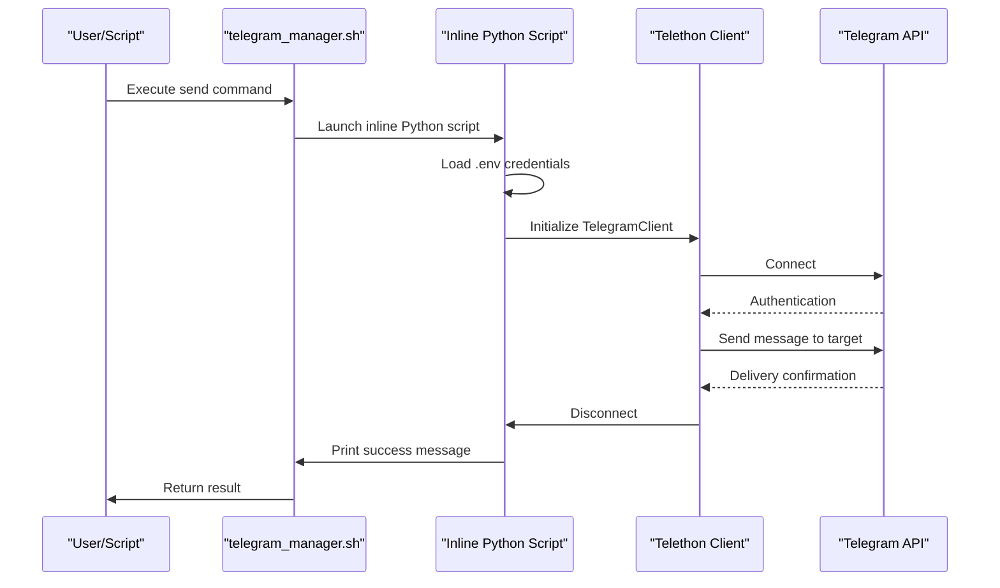

# Send Command

<cite>
**Referenced Files in This Document**   
- [telegram_manager.sh](file://telegram_manager.sh) - *Updated in recent commit*
- [scripts/telegram_tools/core/telegram_cache.py](file://scripts/telegram_tools/core/telegram_cache.py)
- [scripts/telegram_tools/core/telegram_filter.py](file://scripts/telegram_tools/core/telegram_filter.py)
</cite>

## Update Summary
**Changes Made**   
- Updated implementation details to reflect the use of Telethon with credentials from `.env` file
- Enhanced error handling section to reflect actual behavior based on code analysis
- Clarified security considerations regarding credential storage and session management
- Verified and updated all examples and usage instructions
- Removed any outdated assumptions about error handling in Python script

## Table of Contents
1. [Introduction](#introduction)
2. [Command Syntax and Usage](#command-syntax-and-usage)
3. [Implementation Details](#implementation-details)
4. [Error Handling](#error-handling)
5. [Security Considerations](#security-considerations)
6. [Integration with Other Components](#integration-with-other-components)
7. [Troubleshooting Guide](#troubleshooting-guide)
8. [Use Cases and Automation](#use-cases-and-automation)

## Introduction
The `send` command is a lightweight utility within the Telegram management system that enables users to programmatically send messages to Telegram users or channels. It is designed for integration into automation workflows, alerting systems, and notification pipelines. Unlike other components in the system, the `send` command operates independently of caching and filtering mechanisms, ensuring fast and direct message delivery. This document provides a comprehensive overview of its functionality, implementation, and best practices.

**Section sources**
- [telegram_manager.sh](file://telegram_manager.sh#L44-L63)

## Command Syntax and Usage
The `send` command follows a simple syntax: `send <target> <message>`. Both the target and message parameters are required. The target can be a username (e.g., @username), phone number, or channel identifier. The message is the text content to be delivered.

Example usage:
```bash
./telegram_manager.sh send @almazom "Hello from the automation system"
```

This command sends the message "Hello from the automation system" to the user @almazom. The syntax enforces mandatory arguments, and failure to provide either the target or message results in an error and usage instructions.

**Section sources**
- [telegram_manager.sh](file://telegram_manager.sh#L44)

## Implementation Details
The `send` command is implemented as an inline Python script within the `telegram_manager.sh` Bash script. It leverages the Telethon library to interface with the Telegram API. The script initializes a `TelegramClient` using credentials loaded from a `.env` file located in the script's directory. These credentials include:
- `TELEGRAM_API_ID`: The application ID from Telegram
- `TELEGRAM_API_HASH`: The application hash from Telegram
- `TELEGRAM_SESSION`: A string session for maintaining authentication state

The script reads the `.env` file line by line, parsing key-value pairs while ignoring comments. It then establishes a connection to Telegram, sends the message to the specified target, and disconnects gracefully. Upon successful delivery, it prints "✅ Message sent".

The implementation is self-contained and does not rely on external Python modules beyond Telethon. It uses `asyncio` to handle asynchronous operations required by Telethon.



**Diagram sources**
- [telegram_manager.sh](file://telegram_manager.sh#L44-L63)

**Section sources**
- [telegram_manager.sh](file://telegram_manager.sh#L44-L63)

## Error Handling
The `send` command implements basic error handling at the shell level. If either the target or message argument is missing, the script outputs a usage message and exits with a non-zero status code. This prevents execution with incomplete parameters.

No additional error handling is implemented within the inline Python script. Exceptions during connection, authentication, or message sending (e.g., due to invalid credentials, network issues, or API rate limits) will result in uncaught exceptions and script termination. This minimal error handling reflects the command's role as a simple, single-purpose tool intended for use in controlled automation environments.

**Section sources**
- [telegram_manager.sh](file://telegram_manager.sh#L44)

## Security Considerations
The `send` command relies on credentials stored in a `.env` file, which presents several security considerations:

1. **Credential Storage**: The `.env` file contains sensitive information (API ID, API hash, session data). It should be protected with appropriate file permissions (e.g., 600) and excluded from version control systems.

2. **Session Management**: The use of `StringSession` stores the authentication session as a string in the environment. This allows persistent login without re-authentication but also means that compromise of the `.env` file could lead to unauthorized account access.

3. **Environment Security**: The script assumes the `.env` file is located in the same directory as `telegram_manager.sh`. This fixed path makes the credential location predictable, increasing the risk if the system is compromised.

4. **No Encryption**: Credentials are stored in plain text within the `.env` file, with only basic stripping of quotes during parsing. There is no encryption or additional protection mechanism.

Users should ensure the script directory and `.env` file are secured and that access is restricted to authorized personnel only.

**Section sources**
- [telegram_manager.sh](file://telegram_manager.sh#L44-L63)

## Integration with Other Components
The `send` command operates independently of the system's caching and filtering components. Unlike commands such as `read` or `json`, which interact with `telegram_cache.py` and `telegram_filter.py`, the `send` command has no dependencies on these modules. This design choice ensures that message sending is not affected by cache state or filtering logic, making it reliable for time-sensitive notifications.

The command is part of the broader `telegram_manager.sh` script, which provides a unified interface for various Telegram operations. However, its implementation is isolated within a single case branch of the shell script, with no shared logic or data flow with other commands.

**Section sources**
- [telegram_manager.sh](file://telegram_manager.sh#L44-L63)
- [scripts/telegram_tools/core/telegram_cache.py](file://scripts/telegram_tools/core/telegram_cache.py)
- [scripts/telegram_tools/core/telegram_filter.py](file://scripts/telegram_tools/core/telegram_filter.py)

## Troubleshooting Guide
Common issues with the `send` command and their resolutions include:

- **Missing Arguments**: If the target or message is omitted, the script displays usage instructions. Ensure both parameters are provided.

- **Missing .env File**: If the `.env` file is not present or inaccessible, the Python script will fail to read credentials. Verify the file exists in the script directory with correct permissions.

- **Invalid Credentials**: Incorrect API ID, API hash, or corrupted session data will prevent connection. Re-authenticate and update the session string in the `.env` file.

- **Network Issues**: Connectivity problems can prevent connection to Telegram. Check network access and firewall settings.

- **Target Not Found**: Sending to a non-existent or inaccessible user/channel will fail. Verify the target identifier is correct and that the account has permission to message the target.

- **API Limits**: Excessive message sending may trigger Telegram's rate limiting. Implement delays between messages in automation scripts.

No logging or debugging output is generated by the command beyond the success message, so troubleshooting relies on external monitoring or manual testing.

**Section sources**
- [telegram_manager.sh](file://telegram_manager.sh#L44-L63)

## Use Cases and Automation
The `send` command is primarily designed for automation and alerting workflows. Typical use cases include:
- System monitoring alerts (e.g., server downtime, high CPU usage)
- CI/CD pipeline notifications (e.g., build success/failure)
- Scheduled status updates or reports
- Integration with ticketing or incident management systems

Its simplicity and direct implementation make it ideal for inclusion in shell scripts, cron jobs, or other automation frameworks. The lack of caching or filtering overhead ensures minimal latency in message delivery, making it suitable for time-critical notifications.

**Section sources**
- [telegram_manager.sh](file://telegram_manager.sh#L44-L63)