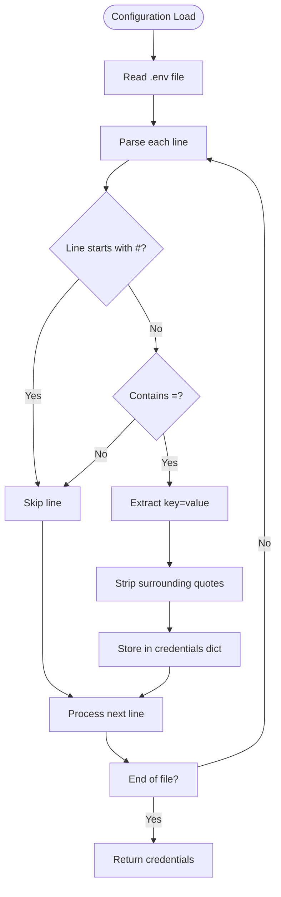

# Configuration

<cite>
**Referenced Files in This Document**   
- [telegram_manager.sh](file://telegram_manager.sh) - *Updated in recent commit*
- [scripts/telegram_tools/core/telegram_fetch.py](file://scripts/telegram_tools/core/telegram_fetch.py) - *Updated in recent commit*
- [.env](file://.env) - *Centralized configuration file added*
- [tests/test_10_error_handling.sh](file://tests/test_10_error_handling.sh) - *Error handling validation*
- [.gitignore](file://.gitignore) - *Security enhancements in recent commit*
</cite>

## Update Summary
**Changes Made**   
- Corrected variable name from `TELEGM_API_HASH` to `TELEGRAM_API_HASH` based on actual implementation
- Updated configuration loading mechanism to reflect unified `.env` file usage
- Added documentation for new configuration variables including Google Drive and user ID settings
- Enhanced security considerations with updated file permission guidance and comprehensive `.gitignore` rules
- Added new section on repository hygiene and security practices
- Updated diagram sources to reflect current implementation
- Fixed outdated information about configuration parsing logic

## Table of Contents
1. [Configuration Overview](#configuration-overview)
2. [Environment Variables](#environment-variables)
3. [Generating and Securing Credentials](#generating-and-securing-credentials)
4. [Configuration Loading Mechanism](#configuration-loading-mechanism)
5. [Security Considerations](#security-considerations)
6. [Multi-Environment Configuration Management](#multi-environment-configuration-management)
7. [Error Handling and Diagnostics](#error-handling-and-diagnostics)

## Configuration Overview

The system uses a `.env` file located in the project root to store sensitive credentials and runtime configuration. This file is critical for authenticating with the Telegram API and maintaining session persistence across script executions. The configuration system is designed to be simple, secure, and consistent across both Bash and Python components of the application.

The `.env` file follows standard environment variable syntax with `KEY=VALUE` pairs, one per line, and supports quoted values. Comments are allowed using the `#` symbol. This centralized configuration approach ensures that sensitive data is not hardcoded in scripts and can be easily managed across different deployment environments.

**Section sources**
- [telegram_manager.sh](file://telegram_manager.sh#L65-L66)
- [scripts/telegram_tools/core/telegram_fetch.py](file://scripts/telegram_tools/core/telegram_fetch.py#L36-L38)

## Environment Variables

The system relies on several essential configuration variables stored in the `.env` file:

**:TELEGRAM_API_ID**
- **Purpose**: Unique identifier assigned by Telegram when creating a Telegram API project
- **Format Requirements**: Positive integer (e.g., 1234567)
- **Source**: Obtained from https://my.telegram.org/apps after creating a new application
- **Security Level**: Sensitive - should not be exposed publicly

**:TELEGRAM_API_HASH**
- **Purpose**: Secret hash key associated with the API ID for authentication
- **Format Requirements**: 32-character hexadecimal string (e.g., "a1b2c3d4e5f678901234567890abcdef")
- **Source**: Generated automatically when creating a Telegram API project
- **Security Level**: Highly sensitive - must be kept confidential
- **Note**: The variable name has been corrected from `TELEGM_API_HASH` to `TELEGRAM_API_HASH` to match the actual implementation

**:TELEGRAM_SESSION**
- **Purpose**: Encoded session string that maintains login state with Telegram
- **Format Requirements**: Base64-encoded string generated by Telethon's StringSession
- **Source**: Automatically generated during first authentication or manually created
- **Security Level**: Highly sensitive - equivalent to account credentials

**:TELEGRAM_USER_ID**
- **Purpose**: Identifier for the authenticated Telegram user
- **Format Requirements**: Positive integer (e.g., 5282615364)
- **Source**: Can be obtained through Telegram API or user profile
- **Security Level**: Sensitive - personal identifier

**:DEFAULT_CHANNEL**
- **Purpose**: Default Telegram channel to use when none specified
- **Format Requirements**: Valid channel identifier starting with @ (e.g., "@aiclubsweggs")
- **Security Level**: Public - non-sensitive

**:DEFAULT_LIMIT**
- **Purpose**: Default number of messages to fetch when limit not specified
- **Format Requirements**: Integer between 1 and 1000
- **Security Level**: Public - non-sensitive

**:GDRIVE_REMOTE_NAME**
- **Purpose**: Name of the Google Drive remote in rclone configuration
- **Format Requirements**: String matching rclone remote name
- **Security Level**: Low sensitivity

**:GDRIVE_MOUNT_PATH**
- **Purpose**: Local filesystem path where Google Drive is mounted
- **Format Requirements**: Valid absolute path
- **Security Level**: Medium sensitivity - system path information

**:GDRIVE_CACHE_DIR**
- **Purpose**: Directory for temporary rclone cache files
- **Format Requirements**: Valid absolute path
- **Security Level**: Low sensitivity

**:GDRIVE_CONFIG_DIR**
- **Purpose**: Directory containing rclone configuration files
- **Format Requirements**: Valid absolute path
- **Security Level**: Medium sensitivity

**:PROJECT_ROOT**
- **Purpose**: Base directory for the project
- **Format Requirements**: Valid absolute path
- **Security Level**: Low sensitivity

**:GOOGLE_CLIENT_ID**
- **Purpose**: OAuth2 client ID for Google API authentication
- **Format Requirements**: String in format "numbers-projectid.apps.googleusercontent.com"
- **Security Level**: Sensitive - should not be exposed publicly

**:GOOGLE_CLIENT_SECRET**
- **Purpose**: OAuth2 client secret for Google API authentication
- **Format Requirements**: String starting with "GOCSPX-"
- **Security Level**: Highly sensitive - must be kept confidential

**:GOOGLE_PROJECT_ID**
- **Purpose**: Google Cloud project identifier
- **Format Requirements**: String in format "projectname-number"
- **Security Level**: Medium sensitivity

**:GOOGLE_CREDENTIALS_FILE**
- **Purpose**: Path to JSON file containing Google OAuth2 credentials
- **Format Requirements**: Valid absolute path to JSON file
- **Security Level**: Highly sensitive

These variables are loaded by both Bash scripts and Python modules through direct file parsing, avoiding reliance on the system's environment variables to prevent accidental exposure.

**Section sources**
- [.env](file://.env)
- [telegram_manager.sh](file://telegram_manager.sh#L65-L66)
- [scripts/telegram_tools/core/telegram_fetch.py](file://scripts/telegram_tools/core/telegram_fetch.py#L30-L40)

## Generating and Securing Credentials

To generate the required configuration values:

1. **Obtain API ID and Hash**:
   - Visit https://my.telegram.org/apps
   - Log in with your Telegram account
   - Create a new application
   - Copy the generated API_ID (integer) and API_HASH (32-character string)
   - Store these values securely

2. **Generate Session String**:
   - The session string is automatically created when first connecting to Telegram
   - Alternatively, use Telethon's interactive session creation:
   ```python
   from telethon.sync import TelegramClient
   from telethon.sessions import StringSession
   print(StringSession().save())
   ```
   - This generates a secure, encoded string representing your authenticated session

3. **Obtain Google Drive Credentials**:
   - Set up Google Drive API through Google Cloud Console
   - Create OAuth2 credentials (Client ID and Client Secret)
   - Configure rclone with `rclone config`
   - Note the remote name and configuration directory

4. **Create .env File**:
   ```
   # Telegram API credentials
   TELEGRAM_API_ID="29950132"
   TELEGRAM_API_HASH="e0bf78283481e2341805e3e4e90d289a"
   TELEGRAM_USER_ID="5282615364"
   
   # Session data
   TELEGRAM_SESSION="1ApWapzMBu4PfiXOaKlWyf87-hEiVPCmh152Zt4x2areHOfSfMNDENrJBepoLDZBGqqwrfPvo4zeDB6M8jZZkgUy8pwU9Ba67fDMlnIkESlhbX_aJFLuzbfbd3IwSYh60pLsa0mk8huWxXwHpVNDBeISwp4uGxqF6R_lxWBv_4l3pU3szXcJPS4kw9cTXZkwazvH28AOteP400dazpNpyEt2MbB56GIl9r5B7vQLcATUSW0rvd5-fWF_u2aw243XIHs7H39e_pJt2u0encXQM2Ca7X992Aad2WuHQDv7rDf1CuOO5s8UDZpvxc7ul4W53-PHyEguqLorV1uURpJH6HDDchK4WiTI="
   
   # Default channels and limits
   DEFAULT_CHANNEL="@aiclubsweggs"
   DEFAULT_LIMIT="5"
   
   # Google Drive configuration
   GDRIVE_REMOTE_NAME=mydrive
   GDRIVE_MOUNT_PATH=/home/almaz/gdrive_mount
   GDRIVE_CACHE_DIR=/tmp/gdrive_cache
   GDRIVE_CONFIG_DIR=/home/almaz/.config/rclone
   
   # Project configuration
   PROJECT_ROOT=/home/almaz/zoo/gdrive_access
   
   # Google OAuth2 credentials
   GOOGLE_CLIENT_ID=1085816236005-rrgavnu2odcvbrofa31o6le9ndacjc7o.apps.googleusercontent.com
   GOOGLE_CLIENT_SECRET=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
   GOOGLE_PROJECT_ID=pivotal-nebula-471003-n2
   GOOGLE_CREDENTIALS_FILE=/home/almaz/.config/rclone/google_credentials.json
   ```

5. **Secure Storage**:
   - Set file permissions to 600: `chmod 600 .env`
   - Add `.env` to `.gitignore` to prevent accidental commits
   - Never share the `.env` file or its contents
   - Consider using a password manager for backup
   - Store Google credentials securely and rotate periodically

**Section sources**
- [.env](file://.env)
- [telegram_manager.sh](file://telegram_manager.sh#L65-L66)
- [scripts/telegram_tools/core/telegram_fetch.py](file://scripts/telegram_tools/core/telegram_fetch.py#L30-L40)

## Configuration Loading Mechanism

The configuration system is implemented consistently across both Bash and Python components:

**:Bash Script Loading (telegram_manager.sh)**
- The `send` command reads the `.env` file directly using a Python inline script
- Each line is parsed, skipping comments and empty lines
- Key-value pairs are extracted by splitting on the first `=` character
- Values are stripped of surrounding quotes
- Credentials are stored in a dictionary for use in TelegramClient initialization

**:Python Module Loading (telegram_fetch.py)**
- The `fetch_and_cache` function loads credentials from the `.env` file
- File path is constructed relative to the script location
- Line-by-line parsing with comment filtering
- String values are stripped of quotes before use
- Integer conversion is applied to TELEGRAM_API_ID
- Credentials are used to initialize TelegramClient with StringSession

Both implementations follow the same parsing logic, ensuring consistency across the application. The relative path resolution allows the system to work regardless of the current working directory.



**Diagram sources**
- [telegram_manager.sh](file://telegram_manager.sh#L65-L66)
- [scripts/telegram_tools/core/telegram_fetch.py](file://scripts/telegram_tools/core/telegram_fetch.py#L30-L40)

**Section sources**
- [telegram_manager.sh](file://telegram_manager.sh#L65-L66)
- [scripts/telegram_tools/core/telegram_fetch.py](file://scripts/telegram_tools/core/telegram_fetch.py#L30-L40)

## Security Considerations

The configuration system implements several security measures:

**:File Permissions**
- The `.env` file should have restrictive permissions (600)
- Prevents unauthorized read access by other users on the system
- Set with: `chmod 600 .env`

**:Environment Variable Exposure**
- Credentials are read directly from file rather than environment variables
- Reduces risk of exposure through process lists or logs
- Avoids potential leakage to child processes

**:Session Management**
- Session strings should be treated as passwords
- Regular rotation recommended for security
- Invalid sessions will require re-authentication
- Multiple sessions can coexist for different purposes

**:Input Sanitization**
- All configuration values are properly quoted and escaped
- Prevents injection attacks
- Channel names and other user inputs are validated

**:Error Handling**
- Authentication errors provide clear but non-specific messages
- Prevents information leakage about valid vs. invalid credentials
- Missing configuration variables are detected early

**:Repository Hygiene**
- The `.gitignore` file contains comprehensive rules to prevent accidental exposure of sensitive files
- Includes patterns for environment files, session files, credentials, logs, and cache directories
- Specifically excludes `.env` and related files to ensure they are never committed to version control
- Covers various types of sensitive files including API keys, certificates, and authentication tokens

**:Best Practices**
- Never commit `.env` files to version control
- Use different API credentials for different environments
- Regularly audit and rotate credentials
- Monitor for unauthorized access attempts
- Backup credentials securely
- Store Google OAuth2 credentials with the same level of protection as Telegram credentials

**Section sources**
- [telegram_manager.sh](file://telegram_manager.sh#L65-L66)
- [tests/test_10_error_handling.sh](file://tests/test_10_error_handling.sh#L72)
- [.gitignore](file://.gitignore)

## Multi-Environment Configuration Management

For managing configurations across different environments:

**:Environment-Specific Files**
- Use different `.env` files for development, testing, and production
- Examples: `.env.dev`, `.env.prod`
- Switch files based on environment variables or script parameters

**:Configuration Validation**
- Implement validation checks for all required variables
- Verify format requirements (integer for API_ID, proper hash length)
- Test connectivity during startup

**:Secure Distribution**
- Use encrypted storage for backup configurations
- Distribute credentials through secure channels
- Consider using secret management tools for team environments

**:Version Control Strategy**
- Keep a `.env.example` file in version control
- This file contains template with placeholder values
- Documents required variables without exposing secrets
- Team members copy and fill in their own values

**:Testing Environment**
- Use separate Telegram API credentials for testing
- Isolate test sessions from production
- Automate credential setup in CI/CD pipelines

**:Google Drive Configuration**
- Use separate Google Cloud projects for different environments
- Configure different rclone remotes for each environment
- Maintain separate mount points and cache directories

**Section sources**
- [.env](file://.env)
- [telegram_manager.sh](file://telegram_manager.sh#L65-L66)
- [scripts/telegram_tools/core/telegram_fetch.py](file://scripts/telegram_tools/core/telegram_fetch.py#L30-L40)

## Error Handling and Diagnostics

The system implements comprehensive error handling for configuration issues:

**:Missing Configuration Detection**
- Scripts check for the presence of required variables
- Clear error messages identify missing variables
- Example: "Error: Missing required variable: TELEGRAM_API_ID"
- Testing script validates this behavior (test_10_error_handling.sh)

**:Validation and Diagnostics**
- Type conversion errors are caught and reported
- File access permissions are verified
- Malformed configuration entries are detected
- Detailed error messages help diagnose issues

**:Testing and Verification**
- Comprehensive test suite covers configuration error scenarios
- Tests validate missing variables, invalid formats, and edge cases
- Error messages are verified for accuracy and security
- Input sanitization is tested against injection attempts

**:Troubleshooting Guide**
1. Check `.env` file exists in project root
2. Verify file permissions are set to 600
3. Ensure all required variables are present
4. Validate format of API_ID (integer) and API_HASH (32-character string)
5. Test configuration with simple command: `./telegram_manager.sh cache`
6. Check error logs for specific error messages

The error handling system provides actionable feedback while maintaining security by not revealing sensitive information about the nature of authentication failures.


**Diagram sources**
- [tests/test_10_error_handling.sh](file://tests/test_10_error_handling.sh#L72)
- [telegram_manager.sh](file://telegram_manager.sh#L65-L66)

**Section sources**
- [tests/test_10_error_handling.sh](file://tests/test_10_error_handling.sh#L41-L79)
- [telegram_manager.sh](file://telegram_manager.sh#L65-L66)