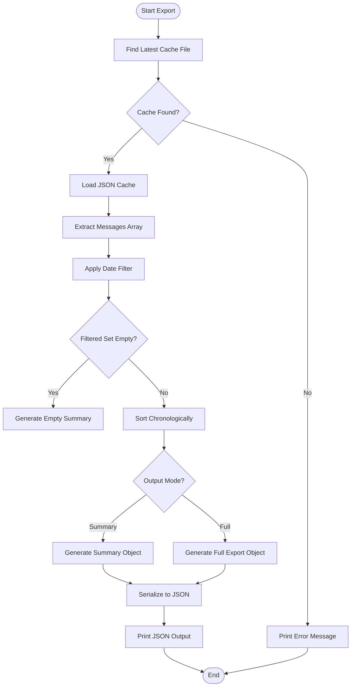
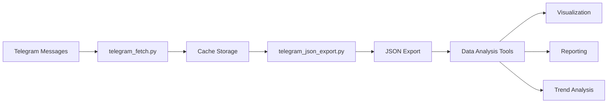

# Data Export

<cite>
**Referenced Files in This Document**   
- [telegram_json_export.py](file://scripts/telegram_tools/core/telegram_json_export.py)
- [telegram_cache.py](file://scripts/telegram_tools/core/telegram_cache.py)
- [telegram_fetch.py](file://scripts/telegram_tools/core/telegram_fetch.py)
- [aiclubsweggs_20250915_211527.json](file://telegram_cache/aiclubsweggs_20250915_211527.json)
</cite>

## Table of Contents
1. [Introduction](#introduction)
2. [Core Components](#core-components)
3. [Export Modes](#export-modes)
4. [Implementation Details](#implementation-details)
5. [Output Structure Examples](#output-structure-examples)
6. [Integration with Data Analysis Workflow](#integration-with-data-analysis-workflow)
7. [Performance Considerations](#performance-considerations)
8. [Extension Points](#extension-points)

## Introduction
The data export functionality enables users to transform cached Telegram message data into structured JSON format for external analysis and reporting. This feature provides two distinct export modes—summary and full—that cater to different analytical needs. The implementation in `telegram_json_export.py` reads from cached JSON files, applies date-based filters, and serializes the results into standardized JSON output. This document details the technical implementation, output formats, integration points, and performance characteristics of the data export system.

## Core Components

The data export functionality is implemented in `telegram_json_export.py`, which coordinates with the caching system to retrieve and process message data. The component relies on the cache management system to ensure data freshness and availability. Message data is structured with key fields including ID, date (in UTC and Moscow time), text content, sender information, view counts, forward counts, and reply relationships.

**Section sources**
- [telegram_json_export.py](file://scripts/telegram_tools/core/telegram_json_export.py#L1-L124)
- [telegram_cache.py](file://scripts/telegram_tools/core/telegram_cache.py#L1-L178)
- [telegram_fetch.py](file://scripts/telegram_tools/core/telegram_fetch.py#L1-L146)

## Export Modes

The system supports two export modes that provide different levels of detail for analysis purposes:

### Summary Mode
The summary mode (`--summary`) provides a condensed view of the filtered message set, including:
- Total message count
- First message (chronologically earliest)
- Last message (chronologically latest)
- Time range of the message set

This mode is ideal for quick overviews, trend analysis, and determining message volume patterns without transferring large datasets.

### Full Mode
The full mode (`--full`) exports the complete set of filtered messages with all available metadata. The output includes:
- Metadata about the export (channel, filter criteria, timestamp, message count)
- Complete message objects with all fields preserved

This mode is designed for comprehensive analysis, data verification, and integration with external analytics platforms.

**Section sources**
- [telegram_json_export.py](file://scripts/telegram_tools/core/telegram_json_export.py#L77-L95)
- [telegram_json_export.py](file://scripts/telegram_tools/core/telegram_json_export.py#L108-L124)

## Implementation Details

The export process follows a structured workflow that begins with cache retrieval and ends with JSON serialization:

### Cache Retrieval
The system locates the most recent cache file for the specified channel using the `find_latest_cache` function. Cache files are stored in the `telegram_cache` directory with a naming convention that includes the channel name and timestamp.

### Filtering Process
Messages are filtered based on the specified time criteria:
- `today`: Messages from the current day
- `yesterday`: Messages from the previous day
- `last:N`: Messages from the last N days
- Specific date: Messages from a particular date (YYYY-MM-DD format)
- `all`: All cached messages

The filtering is performed by comparing the `date_msk` field of each message against the filter criteria.

### Data Transformation
For summary mode, the system sorts messages chronologically and extracts the first and last messages. For full mode, all filtered messages are included in their original structure with metadata about the export context.



**Diagram sources**
- [telegram_json_export.py](file://scripts/telegram_tools/core/telegram_json_export.py#L27-L64)
- [telegram_json_export.py](file://scripts/telegram_tools/core/telegram_json_export.py#L97-L124)

**Section sources**
- [telegram_json_export.py](file://scripts/telegram_tools/core/telegram_json_export.py#L27-L124)

## Output Structure Examples

### Summary Mode Example
```json
{
  "total": 25,
  "first_message": {
    "id": 72950,
    "date_msk": "2025-09-15 16:40:32",
    "text": "📷 [Photo]",
    "sender": "Unknown",
    "views": null,
    "forwards": null,
    "reply_to_id": null
  },
  "last_message": {
    "id": 72960,
    "date_msk": "2025-09-15 19:53:17",
    "text": "📷 [Photo]",
    "sender": "Unknown",
    "views": null,
    "forwards": null,
    "reply_to_id": null
  },
  "time_range": {
    "start": "2025-09-15 16:40:32",
    "end": "2025-09-15 19:53:17"
  }
}
```

### Full Mode Example
```json
{
  "meta": {
    "channel": "@aiclubsweggs",
    "filter": "today",
    "exported_at": "2025-09-15T21:15:27.215771",
    "total_messages": 25
  },
  "messages": [
    {
      "id": 72950,
      "date_utc": "2025-09-15T13:40:32+00:00",
      "date_msk": "2025-09-15 16:40:32",
      "text": "📷 [Photo]",
      "sender": "Unknown",
      "views": null,
      "forwards": null,
      "reply_to_id": null
    },
    {
      "id": 72951,
      "date_utc": "2025-09-15T14:56:18+00:00",
      "date_msk": "2025-09-15 17:56:18",
      "text": "Это DR по теме?",
      "sender": "Unknown",
      "views": null,
      "forwards": null,
      "reply_to_id": 72950
    }
  ]
}
```

**Section sources**
- [aiclubsweggs_20250915_211527.json](file://telegram_cache/aiclubsweggs_20250915_211527.json#L1-L1012)
- [telegram_json_export.py](file://scripts/telegram_tools/core/telegram_json_export.py#L77-L124)

## Integration with Data Analysis Workflow

The data export functionality serves as a critical bridge between raw message data and analytical processing. The exported JSON can be consumed by various external tools:

### Data Analysis Pipeline


**Diagram sources**
- [telegram_json_export.py](file://scripts/telegram_tools/core/telegram_json_export.py#L1-L124)
- [telegram_fetch.py](file://scripts/telegram_tools/core/telegram_fetch.py#L1-L146)

The exported data integrates with the broader workflow by providing structured input for:
- Sentiment analysis
- Engagement metrics (views, forwards)
- Conversation thread analysis (via reply_to_id)
- Content trend identification
- User behavior patterns

## Performance Considerations

When exporting large datasets, several performance factors should be considered:

### Memory Usage
The entire message set is loaded into memory during processing, which can be substantial for channels with extensive message history. The system currently loads all messages from the cache file before filtering, which may lead to high memory consumption for large caches.

### Processing Time
Filtering performance scales linearly with the number of messages in the cache. For very large datasets, the filtering process may become a bottleneck, particularly when using date range filters that require datetime parsing.

### Optimization Recommendations
- Implement streaming JSON parsing for large files to reduce memory footprint
- Add indexing to cache files for faster date-based queries
- Consider pagination for extremely large exports
- Implement caching of frequently requested export ranges

**Section sources**
- [telegram_json_export.py](file://scripts/telegram_tools/core/telegram_json_export.py#L27-L64)
- [telegram_cache.py](file://scripts/telegram_tools/core/telegram_cache.py#L1-L178)

## Extension Points

The current implementation provides several opportunities for enhancement:

### Additional Export Formats
The system could be extended to support alternative output formats:
- CSV for spreadsheet analysis
- XML for legacy system integration
- Parquet for big data processing
- HTML for web-based reporting

### Enhanced Filtering Capabilities
Future versions could support:
- Text pattern filtering (regex, keyword search)
- Sender-based filtering
- Message type filtering (text, media, links)
- Engagement threshold filtering (minimum views/forwards)

### Advanced Export Options
Potential extensions include:
- Field selection (export only specified fields)
- Data transformation (custom formatting, aggregation)
- Direct export to cloud storage
- Scheduled export functionality

**Section sources**
- [telegram_json_export.py](file://scripts/telegram_tools/core/telegram_json_export.py#L1-L124)