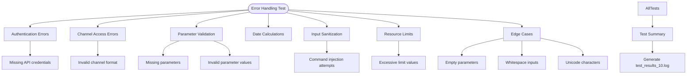

# Error Handling & Troubleshooting

<cite>
**Referenced Files in This Document**   
- [telegram_manager.sh](file://telegram_manager.sh)
- [test_10_error_handling.sh](file://tests/test_10_error_handling.sh)
- [scripts/telegram_tools/core/telegram_cache.py](file://scripts/telegram_tools/core/telegram_cache.py)
- [scripts/telegram_tools/core/telegram_fetch.py](file://scripts/telegram_tools/core/telegram_fetch.py)
- [scripts/telegram_tools/core/telegram_filter.py](file://scripts/telegram_tools/core/telegram_filter.py)
</cite>

## Table of Contents
1. [Common Failure Modes](#common-failure-modes)
2. [Shell-Level Error Handling](#shell-level-error-handling)
3. [Python Error Propagation](#python-error-propagation)
4. [Troubleshooting Workflows](#troubleshooting-workflows)
5. [Message Ordering & Border Detection](#message-ordering--border-detection)
6. [Error Scenario Testing](#error-scenario-testing)
7. [Recovery & Resilience](#recovery--resilience)

## Common Failure Modes

The system is designed to handle several common failure scenarios:

- **API Connection Issues**: Network timeouts, rate limiting, or unreachable Telegram servers
- **Authentication Errors**: Missing or invalid credentials in `.env` file
- **Cache Corruption**: Invalid JSON, missing cache files, or stale data
- **Invalid Parameters**: Incorrect channel names, malformed date ranges, out-of-bounds limits
- **Input Injection Attempts**: Malicious inputs containing shell commands or special characters

These failure modes are systematically validated through comprehensive testing and defensive programming practices.

**Section sources**
- [telegram_manager.sh](file://telegram_manager.sh#L2-L109)
- [test_10_error_handling.sh](file://tests/test_10_error_handling.sh#L4-L244)

## Shell-Level Error Handling

The primary script `telegram_manager.sh` implements robust error handling through the `set -euo pipefail` directive:

- **`set -e`**: Exits immediately on any command failure
- **`set -u`**: Treats undefined variables as errors
- **`set -o pipefail`**: Ensures pipelines fail if any component fails

This configuration prevents silent failures and ensures the script terminates on the first sign of error. Explicit validation checks are implemented for all commands:

```bash
[[ -z "${2:-}" ]] && echo "Usage: $0 fetch <channel> [limit]" && exit 1
```

Each command validates its required parameters before execution, providing clear error messages to guide users toward correct usage.

**Section sources**
- [telegram_manager.sh](file://telegram_manager.sh#L2-L109)

## Python Error Propagation

Python modules propagate errors back to the shell interface through structured exception handling and exit codes:

- **ImportError Handling**: Validates dependencies at startup
- **Exception Catching**: Wraps critical operations in try-except blocks
- **Standardized Exit Codes**: Uses `sys.exit(1)` for failures
- **Error Output**: Writes error messages to stderr with descriptive prefixes

For example, `telegram_fetch.py` handles connection and API errors:

```python
try:
    await fetch_and_cache(channel, limit, offset_id, suffix)
except Exception as e:
    print(f"❌ Error: {str(e)}", file=sys.stderr)
    sys.exit(1)
```

Errors are formatted with emoji indicators for quick visual recognition and include sufficient context for diagnosis.

**Section sources**
- [scripts/telegram_tools/core/telegram_fetch.py](file://scripts/telegram_tools/core/telegram_fetch.py#L14-L146)
- [scripts/telegram_tools/core/telegram_cache.py](file://scripts/telegram_tools/core/telegram_cache.py#L25-L29)
- [scripts/telegram_tools/core/telegram_filter.py](file://scripts/telegram_tools/core/telegram_filter.py#L60-L88)

## Troubleshooting Workflows

### Log Interpretation

Error logs follow a consistent format with visual indicators:
- ✅ Success messages
- ❌ Critical errors
- ⚠️ Warnings
- 📋 Informational messages

Key log patterns to recognize:
- "No cache found" indicates need for fresh fetch
- "Cache stale" suggests automatic refresh
- "Invalid channel format" points to input validation failure
- "Missing required variable" indicates configuration issues

### Cache Inspection

Use these commands to diagnose cache issues:
```bash
# View cache status
./telegram_manager.sh cache

# Clean specific channel cache
./telegram_manager.sh clean aiclubsweggs

# Force fresh fetch
./telegram_manager.sh read aiclubsweggs today --clean
```

The cache system maintains multiple versions with timestamped filenames, allowing inspection of historical data states.

**Section sources**
- [scripts/telegram_tools/core/telegram_cache.py](file://scripts/telegram_tools/core/telegram_cache.py#L104-L124)
- [telegram_manager.sh](file://telegram_manager.sh#L25-L50)

## Message Ordering & Border Detection

The system addresses message ordering problems through:

- **Reverse Chronological Storage**: Messages stored newest-first in cache
- **Fallback Border Detection**: Validates date boundaries by checking preceding messages
- **Auto-Fetch Recovery**: Automatically retrieves additional messages when border validation is inconclusive

Border detection failures are handled through a multi-layered approach:

1. Check 3-7 messages before the first filtered message
2. Validate that preceding messages belong to different dates
3. Auto-fetch additional messages if insufficient data exists
4. Proceed with warning if validation cannot be completed

This ensures accurate date-based filtering even when message boundaries are ambiguous.

**Section sources**
- [scripts/telegram_tools/core/telegram_filter.py](file://scripts/telegram_tools/core/telegram_filter.py#L60-L238)

## Error Scenario Testing

The `test_10_error_handling.sh` script provides comprehensive validation of error scenarios:



**Diagram sources**
- [tests/test_10_error_handling.sh](file://tests/test_10_error_handling.sh#L4-L244)

**Section sources**
- [tests/test_10_error_handling.sh](file://tests/test_10_error_handling.sh#L4-L244)

The test suite validates:
- Authentication error handling
- Parameter validation with clear messages
- Input sanitization against injection
- Resource limit enforcement
- Date format validation
- Edge case handling

Results are logged to `test_results_10.log` with detailed coverage analysis.

## Recovery & Resilience

The system implements several resilience features:

- **Automatic Cache Cleanup**: Removes old cache files, keeping only latest versions
- **Time-Based Cache Validation**: Uses TTL rules based on filter type
- **Graceful Degradation**: Continues operation with warnings when possible
- **Self-Healing**: Auto-fetches additional messages for border validation

Cache TTL rules are intelligent:
- **5 minutes** for today's messages (frequent updates)
- **60 minutes** for recent messages (last 7 days)
- **1440 minutes** (24 hours) for archive messages

Recovery procedures include:
1. Clean cache with `clean` command
2. Force fresh fetch with `--clean` flag
3. Verify with JSON export tools
4. Validate using test scripts

These features ensure the system maintains reliability even under adverse conditions.

**Section sources**
- [scripts/telegram_tools/core/telegram_cache.py](file://scripts/telegram_tools/core/telegram_cache.py#L25-L178)
- [telegram_manager.sh](file://telegram_manager.sh#L25-L50)