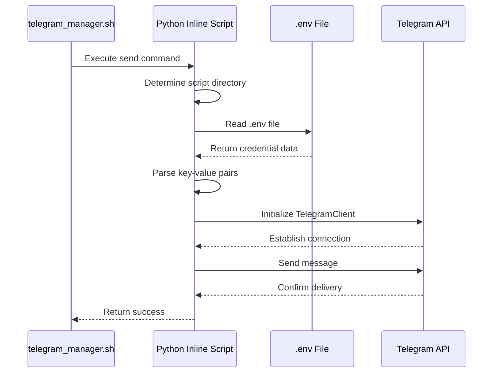

# Installation & Setup

<cite>
**Referenced Files in This Document**   
- [telegram_manager.sh](file://telegram_manager.sh)
- [scripts/telegram_tools/core/telegram_fetch.py](file://scripts/telegram_tools/core/telegram_fetch.py)
- [tests/test_10_error_handling.sh](file://tests/test_10_error_handling.sh)
</cite>

## Table of Contents
1. [Prerequisites](#prerequisites)
2. [Environment Configuration](#environment-configuration)
3. [Telegram API Credentials Setup](#telegram-api-credentials-setup)
4. [Session String Generation](#session-string-generation)
5. [Configuration File Setup](#configuration-file-setup)
6. [Common Setup Issues and Troubleshooting](#common-setup-issues-and-troubleshooting)
7. [Security Considerations](#security-considerations)
8. [Configuration Loading Mechanism](#configuration-loading-mechanism)

## Prerequisites

Before setting up the FALLBACK_SCRIPTS environment, ensure the following prerequisites are installed and properly configured:

- **Python 3**: Required for executing the core Telegram interaction scripts. Verify installation with `python3 --version`.
- **Bash**: The primary shell environment for running the `telegram_manager.sh` script.
- **Telethon Library**: Python library for interacting with the Telegram API. Install using `pip install telethon`.

These components form the foundation for the script's operation, enabling secure communication with Telegram's API and proper execution of messaging workflows.

**Section sources**
- [scripts/telegram_tools/core/telegram_fetch.py](file://scripts/telegram_tools/core/telegram_fetch.py#L15-L16)

## Environment Configuration

The system uses a `.env` file located in the root directory of the project to store sensitive credentials and configuration parameters. This file must be created manually and should contain the following environment variables:

```
TELEGRAM_API_ID=12345678
TELEGRAM_API_HASH=your_api_hash_here
TELEGRAM_SESSION=your_session_string_here
```

Ensure the `.env` file is placed in the same directory as `telegram_manager.sh`. The file should have restricted permissions to prevent unauthorized access:

```bash
chmod 600 .env
```

This configuration approach centralizes credentials while maintaining separation between code and sensitive data.

**Section sources**
- [telegram_manager.sh](file://telegram_manager.sh#L65-L75)

## Telegram API Credentials Setup

To obtain the required `TELEGRAM_API_ID` and `TELEGRAM_API_HASH`, follow these steps:

1. Visit [https://my.telegram.org](https://my.telegram.org) and log in with your phone number.
2. Navigate to the "API development tools" section.
3. Click "Create application" and fill in the required details (app name, email, etc.).
4. After creation, note the `api_id` (your `TELEGRAM_API_ID`) and `api_hash` (your `TELEGRAM_API_HASH`).

These credentials uniquely identify your application to Telegram's servers and are essential for authentication. Never share these values or commit them to version control.

**Section sources**
- [telegram_manager.sh](file://telegram_manager.sh#L65-L75)
- [tests/test_10_error_handling.sh](file://tests/test_10_error_handling.sh#L45-L47)

## Session String Generation

The `TELEGRAM_SESSION` string authenticates your specific user session. Generate it using the following Python script:

```python
from telethon.sync import TelegramClient

api_id = 'YOUR_API_ID'
api_hash = 'YOUR_API_HASH'

with TelegramClient('session_name', api_id, api_hash) as client:
    print(client.session.save())
```

Run this script once to generate your session string, then securely store it in the `.env` file. The session string allows the system to maintain authentication state without requiring repeated login prompts.

**Section sources**
- [telegram_manager.sh](file://telegram_manager.sh#L65-L75)

## Configuration File Setup

The `.env` file must follow strict formatting rules to ensure proper parsing:

- Each variable on a separate line
- No spaces around the equals sign
- No quotes unless explicitly required (the parser strips them)
- No comments within the file (lines starting with # are ignored)

Example of correct formatting:
```
TELEGRAM_API_ID=12345678
TELEGRAM_API_HASH=abcd1234ef567890ghij6789klmn0123
TELEGRAM_SESSION=1BIAJk...long_base64_string...
```

Incorrect formatting will result in authentication failures or parsing errors during script execution.

**Section sources**
- [telegram_manager.sh](file://telegram_manager.sh#L65-L75)

## Common Setup Issues and Troubleshooting

### Authentication Errors
If you encounter "Missing required variable" errors, verify:
- The `.env` file exists in the script's directory
- All three required variables are present
- Variable names are spelled exactly as expected
- File permissions allow read access by the executing user

### Malformed Session Strings
Invalid session strings typically cause connection failures. Ensure:
- The session string is generated using the correct API credentials
- The entire string is copied without truncation
- No extra characters or spaces are included

### Incorrect API Keys
Using invalid API credentials results in authentication rejection. Confirm:
- You're using the correct `api_id` and `api_hash` from your Telegram app
- Credentials are not swapped or mistyped
- The application hasn't been deleted from your Telegram settings

The system includes comprehensive error handling that provides specific feedback for these common issues, helping diagnose configuration problems quickly.

**Section sources**
- [tests/test_10_error_handling.sh](file://tests/test_10_error_handling.sh#L45-L47)

## Security Considerations

Credential security is paramount when working with Telegram API access:

- **File Permissions**: Restrict `.env` file access using `chmod 600 .env` to prevent other users from reading it.
- **Version Control**: Never commit the `.env` file to Git or other version control systems. Add it to `.gitignore`.
- **Environment Isolation**: Use separate API credentials for development and production environments.
- **Session Management**: Regularly regenerate session strings and revoke unused sessions through Telegram's active sessions management.

These practices minimize the risk of unauthorized access to your Telegram account through the script interface.

**Section sources**
- [telegram_manager.sh](file://telegram_manager.sh#L65-L75)

## Configuration Loading Mechanism

The `telegram_manager.sh` script locates and reads the configuration file through a deterministic process:

1. The script determines its own directory using `$(cd "$(dirname "${BASH_SOURCE[0]}")" && pwd)`
2. It constructs the path to the `.env` file in the same directory
3. When executing the `send` command, it uses Python's `pathlib.Path` to reference `script_dir / '.env'`
4. The file is parsed line by line, extracting key-value pairs while ignoring comments and empty lines
5. Credentials are stripped of surrounding quotes before being passed to the Telethon client

This mechanism ensures consistent configuration loading regardless of the current working directory from which the script is invoked.



**Diagram sources**
- [telegram_manager.sh](file://telegram_manager.sh#L65-L109)

**Section sources**
- [telegram_manager.sh](file://telegram_manager.sh#L65-L109)