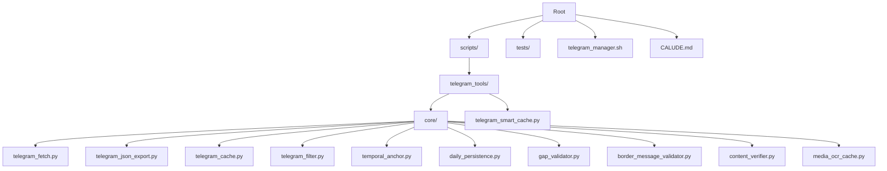
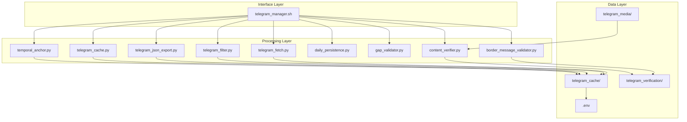
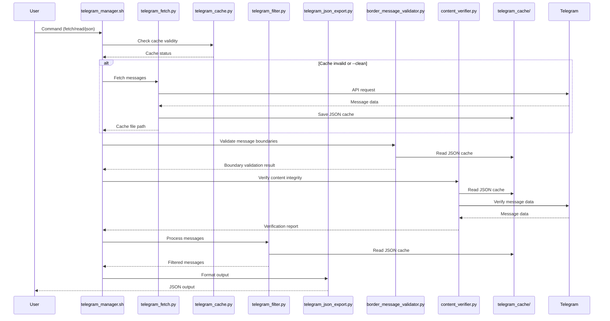
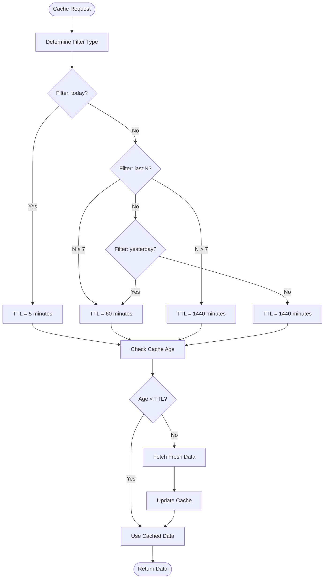
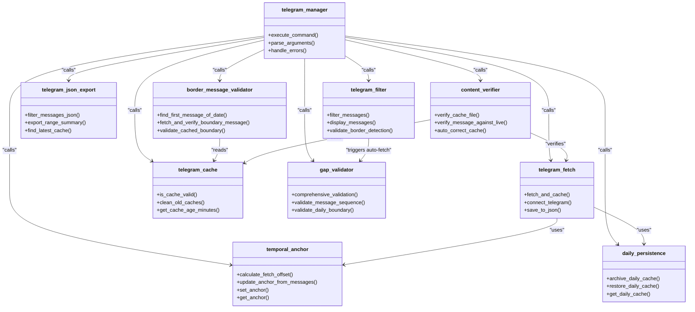
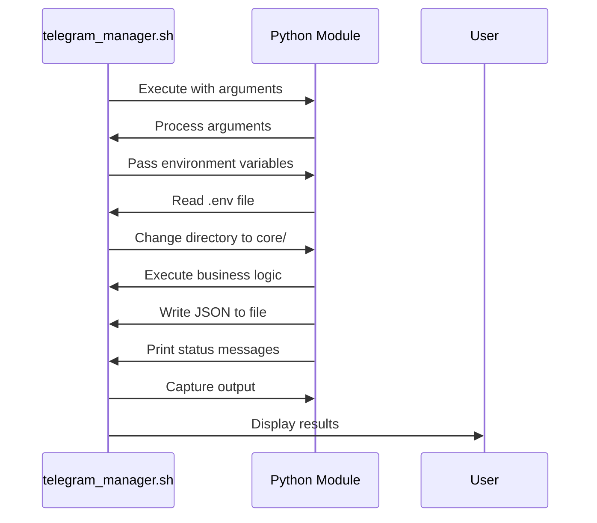
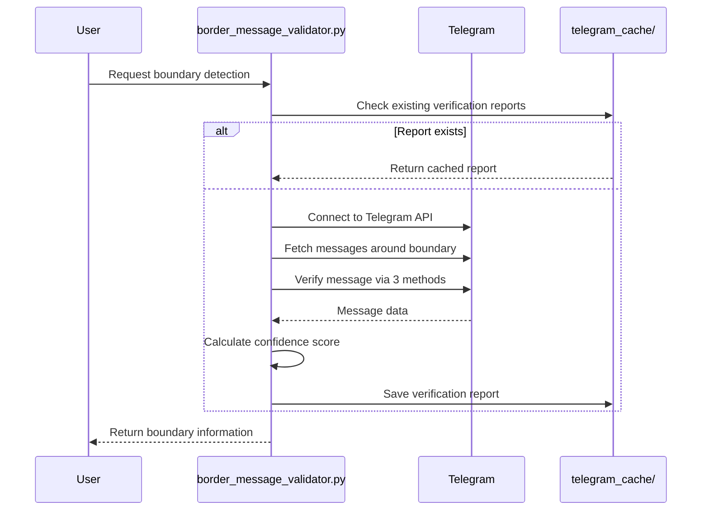
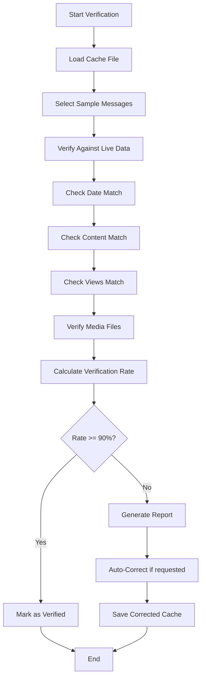

# JSON-Based Architecture Overview

<cite>
**Referenced Files in This Document**   
- [telegram_manager.sh](file://telegram_manager.sh)
- [telegram_fetch.py](file://scripts/telegram_tools/core/telegram_fetch.py)
- [telegram_json_export.py](file://scripts/telegram_tools/core/telegram_json_export.py)
- [telegram_cache.py](file://scripts/telegram_tools/core/telegram_cache.py)
- [temporal_anchor.py](file://scripts/telegram_tools/core/temporal_anchor.py)
- [daily_persistence.py](file://scripts/telegram_tools/core/daily_persistence.py)
- [gap_validator.py](file://scripts/telegram_tools/core/gap_validator.py)
- [telegram_smart_cache.py](file://scripts/telegram_tools/telegram_smart_cache.py)
- [border_message_validator.py](file://scripts/telegram_tools/core/border_message_validator.py) - *Added in recent commit*
- [content_verifier.py](file://scripts/telegram_tools/core/content_verifier.py) - *Added in recent commit*
</cite>

## Update Summary
**Changes Made**   
- Added new sections for boundary detection and content verification components
- Updated architecture overview to include new validation modules
- Enhanced data flow diagram to show boundary detection process
- Added integration details for new Python modules
- Updated project structure diagram to reflect new files

## Table of Contents
1. [Introduction](#introduction)
2. [Project Structure](#project-structure)
3. [Core Components](#core-components)
4. [Architecture Overview](#architecture-overview)
5. [Data Flow Between Components](#data-flow-between-components)
6. [Caching Strategy](#caching-strategy)
7. [Integration Patterns](#integration-patterns)
8. [Bash-Python Interaction](#bash-python-interaction)
9. [Boundary Detection System](#boundary-detection-system)
10. [Content Verification System](#content-verification-system)
11. [Conclusion](#conclusion)

## Introduction
This document provides a comprehensive overview of the JSON-based architecture used in the Telegram message management system. The system is designed to efficiently fetch, cache, filter, validate, and export Telegram messages using a combination of bash wrapper scripts and Python modules. The architecture emphasizes data integrity, temporal accuracy, and efficient caching strategies to ensure reliable message retrieval and processing. Recent enhancements include advanced boundary detection and content verification systems for improved data accuracy.

## Project Structure
The project follows a modular structure with clear separation of concerns between the bash wrapper, core Python modules, and supporting utilities. The main components are organized in a hierarchical directory structure that facilitates maintainability and scalability.

**Diagram sources**
- [telegram_manager.sh](file://telegram_manager.sh)
- [project_structure](file://)

**Section sources**
- [telegram_manager.sh](file://telegram_manager.sh)
- [project_structure](file://)

## Core Components
The system consists of several core components that work together to provide a complete message management solution. The bash wrapper script serves as the primary interface, while Python modules handle specific functionality such as message fetching, caching, filtering, validation, and boundary detection.

**Section sources**
- [telegram_manager.sh](file://telegram_manager.sh)
- [telegram_fetch.py](file://scripts/telegram_tools/core/telegram_fetch.py)
- [telegram_json_export.py](file://scripts/telegram_tools/core/telegram_json_export.py)
- [border_message_validator.py](file://scripts/telegram_tools/core/border_message_validator.py)
- [content_verifier.py](file://scripts/telegram_tools/core/content_verifier.py)

## Architecture Overview
The architecture follows a layered approach with clear separation between the interface layer (bash wrapper), processing layer (Python modules), and data layer (JSON cache files). This design enables flexible integration and easy maintenance of individual components. Recent updates have enhanced the validation layer with specialized modules for boundary detection and content verification.

**Diagram sources**
- [telegram_manager.sh](file://telegram_manager.sh)
- [telegram_fetch.py](file://scripts/telegram_tools/core/telegram_fetch.py)
- [telegram_filter.py](file://scripts/telegram_tools/core/telegram_filter.py)
- [telegram_json_export.py](file://scripts/telegram_tools/core/telegram_json_export.py)
- [telegram_cache.py](file://scripts/telegram_tools/core/telegram_cache.py)
- [temporal_anchor.py](file://scripts/telegram_tools/core/temporal_anchor.py)
- [daily_persistence.py](file://scripts/telegram_tools/core/daily_persistence.py)
- [gap_validator.py](file://scripts/telegram_tools/core/gap_validator.py)
- [border_message_validator.py](file://scripts/telegram_tools/core/border_message_validator.py)
- [content_verifier.py](file://scripts/telegram_tools/core/content_verifier.py)

## Data Flow Between Components
The data flow in this architecture follows a well-defined pattern from message retrieval to final output. Messages are fetched from Telegram, cached in JSON format, and then processed according to user requirements. The enhanced system now includes boundary detection and content verification steps to ensure data accuracy.

**Diagram sources**
- [telegram_manager.sh](file://telegram_manager.sh)
- [telegram_fetch.py](file://scripts/telegram_tools/core/telegram_fetch.py)
- [telegram_cache.py](file://scripts/telegram_tools/core/telegram_cache.py)
- [telegram_filter.py](file://scripts/telegram_tools/core/telegram_filter.py)
- [telegram_json_export.py](file://scripts/telegram_tools/core/telegram_json_export.py)
- [border_message_validator.py](file://scripts/telegram_tools/core/border_message_validator.py)
- [content_verifier.py](file://scripts/telegram_tools/core/content_verifier.py)

## Caching Strategy
The system implements a sophisticated caching strategy that balances freshness with performance. Cache validity is determined by time-based rules that vary according to the requested data range.

**Diagram sources**
- [telegram_cache.py](file://scripts/telegram_tools/core/telegram_cache.py)
- [telegram_fetch.py](file://scripts/telegram_tools/core/telegram_fetch.py)

## Integration Patterns
The system employs several integration patterns to ensure robust and reliable operation. These patterns govern how components interact and coordinate their activities.

**Diagram sources**
- [telegram_manager.sh](file://telegram_manager.sh)
- [telegram_fetch.py](file://scripts/telegram_tools/core/telegram_fetch.py)
- [telegram_cache.py](file://scripts/telegram_tools/core/telegram_cache.py)
- [telegram_filter.py](file://scripts/telegram_tools/core/telegram_filter.py)
- [telegram_json_export.py](file://scripts/telegram_tools/core/telegram_json_export.py)
- [temporal_anchor.py](file://scripts/telegram_tools/core/temporal_anchor.py)
- [daily_persistence.py](file://scripts/telegram_tools/core/daily_persistence.py)
- [gap_validator.py](file://scripts/telegram_tools/core/gap_validator.py)
- [border_message_validator.py](file://scripts/telegram_tools/core/border_message_validator.py)
- [content_verifier.py](file://scripts/telegram_tools/core/content_verifier.py)

## Bash-Python Interaction
The interaction between the bash wrapper and Python modules follows a well-defined pattern that enables seamless integration between the two environments.

**Diagram sources**
- [telegram_manager.sh](file://telegram_manager.sh)
- [telegram_fetch.py](file://scripts/telegram_tools/core/telegram_fetch.py)
- [telegram_cache.py](file://scripts/telegram_tools/core/telegram_cache.py)

## Boundary Detection System
The boundary detection system provides high-confidence identification of daily message boundaries using a triple-verification approach. This component ensures accurate detection of the first message of each day with 10/10 confidence.

**Section sources**
- [border_message_validator.py](file://scripts/telegram_tools/core/border_message_validator.py) - *Added in recent commit*
- [test_first_message_border_detection.sh](file://tests/test_first_message_border_detection.sh)

**Diagram sources**
- [border_message_validator.py](file://scripts/telegram_tools/core/border_message_validator.py)
- [test_first_message_border_detection.sh](file://tests/test_first_message_border_detection.sh)

## Content Verification System
The content verification system ensures cache consistency and detects content mismatches between cached data and live Telegram messages. This component provides advanced verification for message content integrity.

**Section sources**
- [content_verifier.py](file://scripts/telegram_tools/core/content_verifier.py) - *Added in recent commit*
- [telegram_cache.py](file://scripts/telegram_tools/core/telegram_cache.py)

**Diagram sources**
- [content_verifier.py](file://scripts/telegram_tools/core/content_verifier.py)

## Conclusion
The JSON-based architecture provides a robust and efficient solution for managing Telegram messages. By leveraging the strengths of both bash scripting and Python programming, the system achieves a balance between simplicity and functionality. The caching strategy ensures optimal performance while maintaining data freshness, and the modular design allows for easy extension and maintenance. The integration patterns and data flow mechanisms work together to create a reliable system that can handle various message management tasks effectively. Recent enhancements with the boundary detection and content verification systems have significantly improved data accuracy and integrity, providing 10/10 confidence in boundary detection and comprehensive content validation.