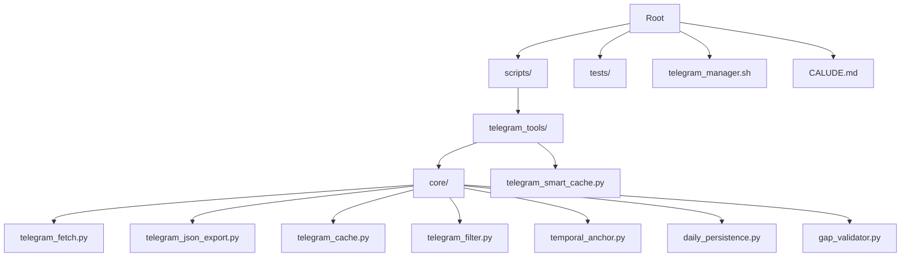
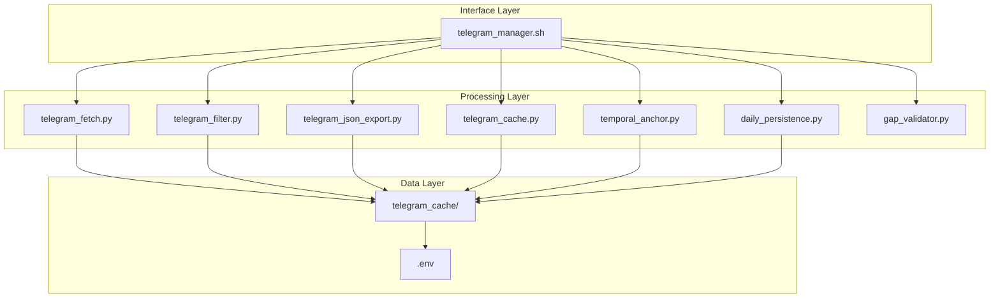
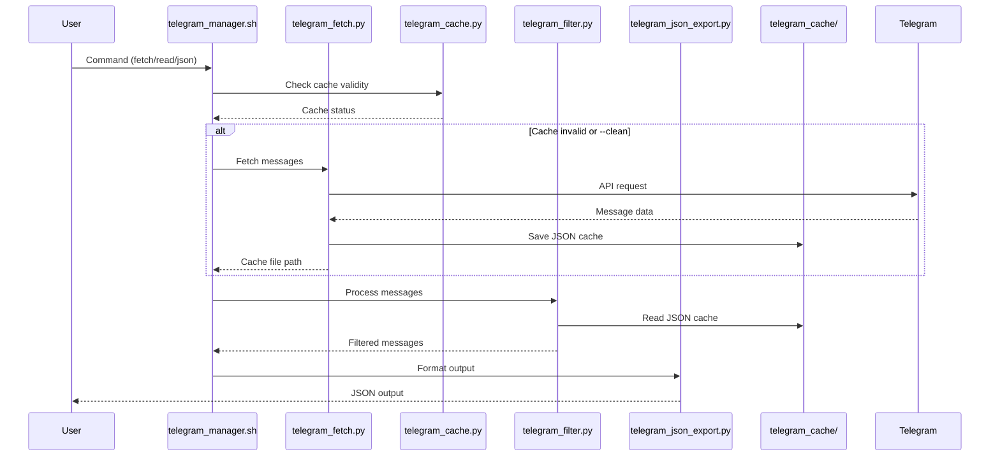
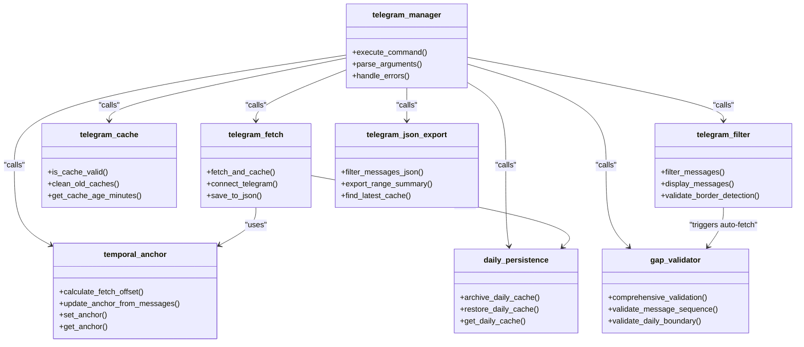

# JSON-Based Architecture Overview

<cite>
**Referenced Files in This Document**   
- [telegram_manager.sh](file://telegram_manager.sh)
- [telegram_fetch.py](file://scripts/telegram_tools/core/telegram_fetch.py)
- [telegram_json_export.py](file://scripts/telegram_tools/core/telegram_json_export.py)
- [telegram_cache.py](file://scripts/telegram_tools/core/telegram_cache.py)
- [telegram_filter.py](file://scripts/telegram_tools/core/telegram_filter.py)
- [temporal_anchor.py](file://scripts/telegram_tools/core/temporal_anchor.py)
- [daily_persistence.py](file://scripts/telegram_tools/core/daily_persistence.py)
- [gap_validator.py](file://scripts/telegram_tools/core/gap_validator.py)
- [telegram_smart_cache.py](file://scripts/telegram_tools/telegram_smart_cache.py)
</cite>

## Table of Contents
1. [Introduction](#introduction)
2. [Project Structure](#project-structure)
3. [Core Components](#core-components)
4. [Architecture Overview](#architecture-overview)
5. [Data Flow Between Components](#data-flow-between-components)
6. [Caching Strategy](#caching-strategy)
7. [Integration Patterns](#integration-patterns)
8. [Bash-Python Interaction](#bash-python-interaction)
9. [Conclusion](#conclusion)

## Introduction
This document provides a comprehensive overview of the JSON-based architecture used in the Telegram message management system. The system is designed to efficiently fetch, cache, filter, and export Telegram messages using a combination of bash wrapper scripts and Python modules. The architecture emphasizes data integrity, temporal accuracy, and efficient caching strategies to ensure reliable message retrieval and processing.

## Project Structure
The project follows a modular structure with clear separation of concerns between the bash wrapper, core Python modules, and supporting utilities. The main components are organized in a hierarchical directory structure that facilitates maintainability and scalability.

**Diagram sources**
- [telegram_manager.sh](file://telegram_manager.sh)
- [project_structure](file://.)

**Section sources**
- [telegram_manager.sh](file://telegram_manager.sh)
- [project_structure](file://.)

## Core Components
The system consists of several core components that work together to provide a complete message management solution. The bash wrapper script serves as the primary interface, while Python modules handle specific functionality such as message fetching, caching, filtering, and validation.

**Section sources**
- [telegram_manager.sh](file://telegram_manager.sh)
- [telegram_fetch.py](file://scripts/telegram_tools/core/telegram_fetch.py)
- [telegram_json_export.py](file://scripts/telegram_tools/core/telegram_json_export.py)

## Architecture Overview
The architecture follows a layered approach with clear separation between the interface layer (bash wrapper), processing layer (Python modules), and data layer (JSON cache files). This design enables flexible integration and easy maintenance of individual components.

**Diagram sources**
- [telegram_manager.sh](file://telegram_manager.sh)
- [telegram_fetch.py](file://scripts/telegram_tools/core/telegram_fetch.py)
- [telegram_filter.py](file://scripts/telegram_tools/core/telegram_filter.py)
- [telegram_json_export.py](file://scripts/telegram_tools/core/telegram_json_export.py)
- [telegram_cache.py](file://scripts/telegram_tools/core/telegram_cache.py)
- [temporal_anchor.py](file://scripts/telegram_tools/core/temporal_anchor.py)
- [daily_persistence.py](file://scripts/telegram_tools/core/daily_persistence.py)
- [gap_validator.py](file://scripts/telegram_tools/core/gap_validator.py)

## Data Flow Between Components
The data flow in this architecture follows a well-defined pattern from message retrieval to final output. Messages are fetched from Telegram, cached in JSON format, and then processed according to user requirements.

**Diagram sources**
- [telegram_manager.sh](file://telegram_manager.sh)
- [telegram_fetch.py](file://scripts/telegram_tools/core/telegram_fetch.py)
- [telegram_cache.py](file://scripts/telegram_tools/core/telegram_cache.py)
- [telegram_filter.py](file://scripts/telegram_tools/core/telegram_filter.py)
- [telegram_json_export.py](file://scripts/telegram_tools/core/telegram_json_export.py)

## Caching Strategy
The system implements a sophisticated caching strategy that balances freshness with performance. Cache validity is determined by time-based rules that vary according to the requested data range.

```mermaid
flowchart TD
Start([Cache Request]) --> CheckType["Determine Filter Type"]
CheckType --> Today{"Filter: today?"}
Today --> |Yes| TTL5["TTL = 5 minutes"]
Today --> |No| Recent{"Filter: last:N?"}
Recent --> |N ≤ 7| TTL60["TTL = 60 minutes"]
Recent --> |N > 7| TTL1440["TTL = 1440 minutes"]
Recent --> |No| Yesterday{"Filter: yesterday?"}
Yesterday --> |Yes| TTL60
Yesterday --> |No| Archive["TTL = 1440 minutes"]
TTL5 --> CheckAge["Check Cache Age"]
TTL60 --> CheckAge
TTL1440 --> CheckAge
Archive --> CheckAge
CheckAge --> Valid{"Age < TTL?"}
Valid --> |Yes| UseCache["Use Cached Data"]
Valid --> |No| FetchNew["Fetch Fresh Data"]
FetchNew --> UpdateCache["Update Cache"]
UpdateCache --> UseCache
UseCache --> End([Return Data])
```

**Diagram sources**
- [telegram_cache.py](file://scripts/telegram_tools/core/telegram_cache.py)
- [telegram_fetch.py](file://scripts/telegram_tools/core/telegram_fetch.py)

## Integration Patterns
The system employs several integration patterns to ensure robust and reliable operation. These patterns govern how components interact and coordinate their activities.

**Diagram sources**
- [telegram_manager.sh](file://telegram_manager.sh)
- [telegram_fetch.py](file://scripts/telegram_tools/core/telegram_fetch.py)
- [telegram_cache.py](file://scripts/telegram_tools/core/telegram_cache.py)
- [telegram_filter.py](file://scripts/telegram_tools/core/telegram_filter.py)
- [telegram_json_export.py](file://scripts/telegram_tools/core/telegram_json_export.py)
- [temporal_anchor.py](file://scripts/telegram_tools/core/temporal_anchor.py)
- [daily_persistence.py](file://scripts/telegram_tools/core/daily_persistence.py)
- [gap_validator.py](file://scripts/telegram_tools/core/gap_validator.py)

## Bash-Python Interaction
The interaction between the bash wrapper and Python modules follows a well-defined pattern that enables seamless integration between the two environments.

**Diagram sources**
- [telegram_manager.sh](file://telegram_manager.sh)
- [telegram_fetch.py](file://scripts/telegram_tools/core/telegram_fetch.py)
- [telegram_cache.py](file://scripts/telegram_tools/core/telegram_cache.py)

## Conclusion
The JSON-based architecture provides a robust and efficient solution for managing Telegram messages. By leveraging the strengths of both bash scripting and Python programming, the system achieves a balance between simplicity and functionality. The caching strategy ensures optimal performance while maintaining data freshness, and the modular design allows for easy extension and maintenance. The integration patterns and data flow mechanisms work together to create a reliable system that can handle various message management tasks effectively.