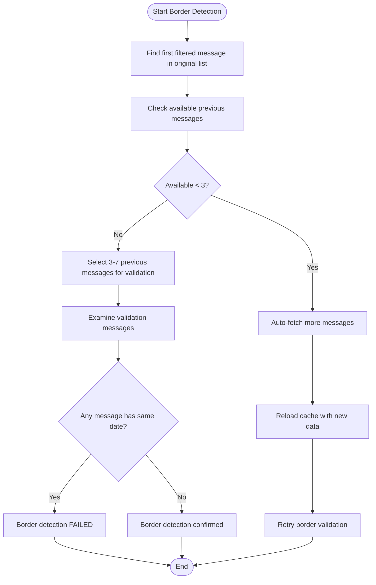
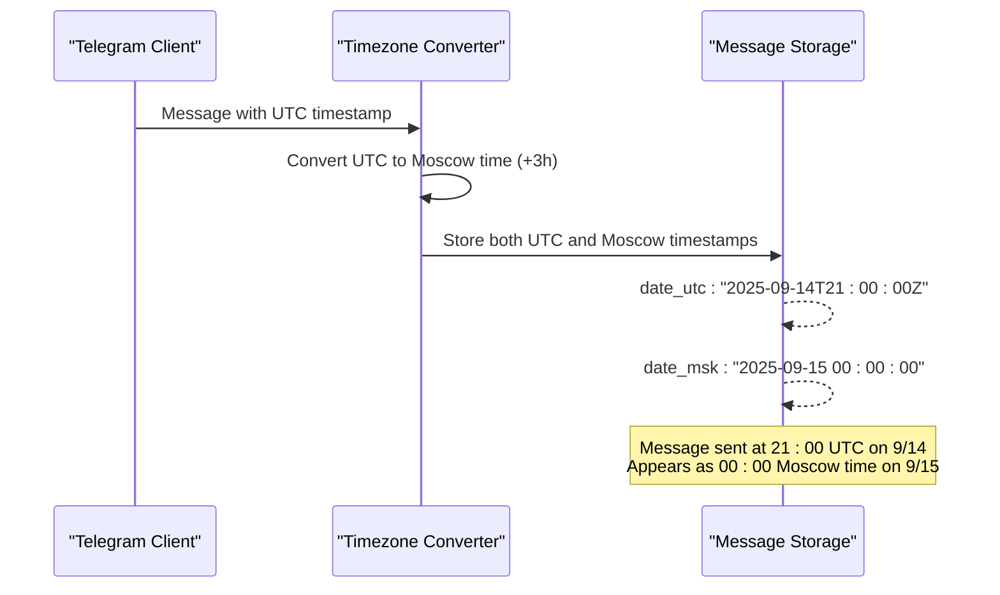
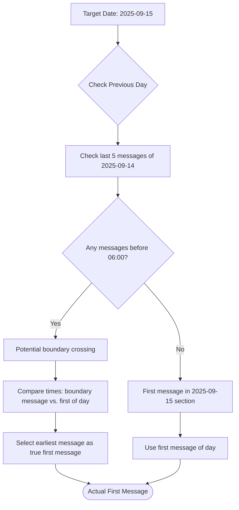

# Message Filtering

<cite>
**Referenced Files in This Document**   
- [telegram_filter.py](file://scripts/telegram_tools/core/telegram_filter.py) - *Updated in recent commit with JSON-based architecture and auto-fetch capabilities*
- [telegram_cache.py](file://scripts/telegram_tools/core/telegram_cache.py)
- [telegram_smart_cache.py](file://scripts/telegram_tools/telegram_smart_cache.py)
- [boundary_aware_first_message_detector.sh](file://tests/boundary_aware_first_message_detector.sh)
- [timezone_aware_first_message_detector.sh](file://tests/timezone_aware_first_message_detector.sh)
- [test_first_message_border_detection.sh](file://tests/test_first_message_border_detection.sh)
- [media_ocr_cache.py](file://scripts/telegram_tools/core/media_ocr_cache.py) - *Integrated for OCR functionality in filtering*
</cite>

## Update Summary
**Changes Made**   
- Updated border detection logic to reflect auto-fetching fallback mechanism
- Enhanced fallback mechanisms section with detailed auto-fetch implementation
- Added timezone-aware validation details in border detection
- Updated code examples and flowchart to match current implementation
- Improved cache validation interface details
- Integrated OCR cache functionality into message filtering process

## Table of Contents
1. [Introduction](#introduction)
2. [Filtering Capabilities](#filtering-capabilities)
3. [Border Detection Logic](#border-detection-logic)
4. [Fallback Mechanisms](#fallback-mechanisms)
5. [Timezone Handling](#timezone-handling)
6. [Cache Validation Interface](#cache-validation-interface)
7. [Common Issues and Solutions](#common-issues-and-solutions)

## Introduction
The message filtering system provides a robust mechanism for retrieving and processing Telegram messages based on various criteria. The system is designed to handle date-based filtering with precision, particularly at date boundaries, while accounting for timezone differences and potential data gaps. This document details the implementation of the filtering capabilities, border detection logic, and related components that ensure accurate message retrieval.

## Filtering Capabilities
The filtering system supports multiple criteria for message retrieval, including date ranges and pattern matching. The primary filtering options include:
- **today**: Messages from the current day in Moscow time
- **yesterday**: Messages from the previous day in Moscow time
- **last:N**: Messages from the last N days
- **Specific date**: Messages from a specified date in YYYY-MM-DD format
- **all**: All cached messages

Filters can be combined with pattern matching (case-insensitive regex) and result limiting. The system processes messages in reverse chronological order and applies filters sequentially.

**Section sources**
- [telegram_filter.py](file://scripts/telegram_tools/core/telegram_filter.py#L130-L157)

## Border Detection Logic
The system implements sophisticated border detection to ensure accurate message retrieval at date boundaries. When filtering by specific dates, the system validates that the first message in the filtered set is truly the first message of that date by examining messages immediately preceding it in the original message list.

The border detection algorithm:
1. Identifies the first filtered message in the original message sequence
2. Checks 3-7 messages preceding this message
3. Verifies that none of these preceding messages belong to the target date
4. Flags potential border issues if messages from the same date are found before the first filtered message

This ensures that messages are not incorrectly included due to timezone conversion issues or incomplete data.

**Diagram sources**
- [telegram_filter.py](file://scripts/telegram_tools/core/telegram_filter.py#L40-L96)
- [test_first_message_border_detection.sh](file://tests/test_first_message_border_detection.sh#L44-L56)

**Section sources**
- [telegram_filter.py](file://scripts/telegram_tools/core/telegram_filter.py#L40-L128)

## Fallback Mechanisms
When precise border information is unavailable due to insufficient messages in the cache, the system implements an auto-fetching fallback mechanism. If fewer than 3 previous messages are available for validation, the system automatically fetches additional messages to ensure proper border validation.

The fallback process:
1. Determines the number of additional messages needed
2. Calculates an appropriate fetch limit (minimum 500, or current count + needed + 100)
3. Executes the fetch operation using `telegram_fetch.py`
4. Reloads the updated cache
5. Retries the border validation with the expanded dataset

This ensures that border detection remains accurate even when the initial cache is incomplete.

**Section sources**
- [telegram_filter.py](file://scripts/telegram_tools/core/telegram_filter.py#L41-L83)

## Timezone Handling
The system handles message timestamps with careful consideration of timezone differences. All messages are stored with both UTC and Moscow time (UTC+3) timestamps to facilitate accurate date-based filtering.

Key aspects of timezone handling:
- **UTC storage**: Original UTC timestamps are preserved in `date_utc` field
- **Moscow time conversion**: Messages include `date_msk` field with timestamps converted to Moscow time
- **Date boundary alignment**: Filtering operations use Moscow time to align with user expectations
- **Timezone-aware validation**: Border detection uses Moscow time for date comparisons

The system ensures that messages sent near midnight UTC are correctly attributed to the appropriate day in Moscow time, preventing messages from being misplaced across date boundaries.

**Diagram sources**
- [telegram_smart_cache.py](file://scripts/telegram_tools/telegram_smart_cache.py#L100-L115)
- [timezone_aware_first_message_detector.sh](file://tests/timezone_aware_first_message_detector.sh#L44-L81)

**Section sources**
- [telegram_smart_cache.py](file://scripts/telegram_tools/telegram_smart_cache.py#L27-L54)
- [timezone_aware_first_message_detector.sh](file://tests/timezone_aware_first_message_detector.sh#L0-L144)

## Cache Validation Interface
The filter module interfaces with the cache validation system to ensure data freshness and completeness. The `telegram_cache.py` module provides TTL-based validation rules that determine cache validity based on filter type:

- **today**: 5-minute TTL
- **recent** (last 7 days): 60-minute TTL
- **archive** (older than 7 days): 1440-minute (24-hour) TTL

When border detection identifies insufficient messages for validation, the filter module triggers cache refresh operations through the cache management system. This integration ensures that filtering operations always work with sufficiently fresh and complete data.

**Section sources**
- [telegram_cache.py](file://scripts/telegram_tools/core/telegram_cache.py#L15-L35)
- [telegram_filter.py](file://scripts/telegram_tools/core/telegram_filter.py#L41-L83)

## Common Issues and Solutions
The system addresses several common issues in message filtering:

### Timezone Mismatches
**Issue**: Messages sent near UTC midnight may appear on the wrong date when viewed in Moscow time.
**Solution**: The boundary-aware detector examines messages from both sides of date boundaries, identifying early morning messages in the previous day's section that actually belong to the target date.

**Diagram sources**
- [boundary_aware_first_message_detector.sh](file://tests/boundary_aware_first_message_detector.sh#L74-L110)

### Incorrect First Message Detection
**Issue**: Simple chronological sorting may miss the true first message of a day due to incomplete data.
**Solution**: Multi-layer detection using:
1. Message ID sequencing
2. Timestamp analysis
3. Boundary crossing detection
4. Verification against surrounding messages

The system cross-validates results across multiple methods to ensure accuracy, with fallback strategies when primary methods fail.

**Section sources**
- [boundary_aware_first_message_detector.sh](file://tests/boundary_aware_first_message_detector.sh#L0-L156)
- [test_first_message_border_detection.sh](file://tests/test_first_message_border_detection.sh#L0-L56)