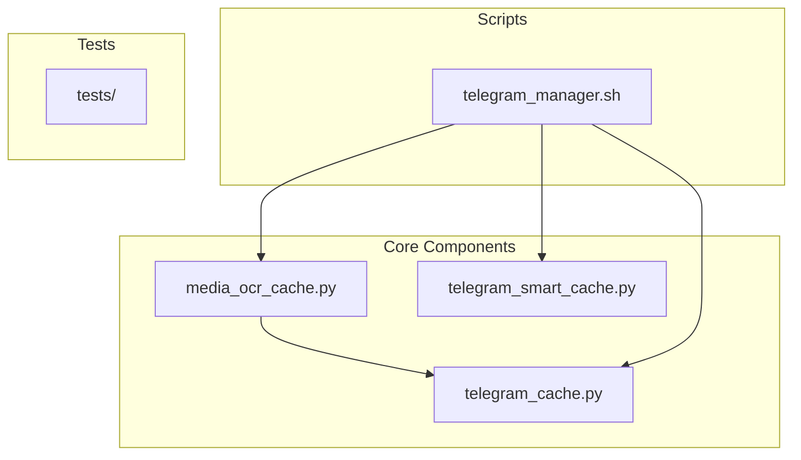
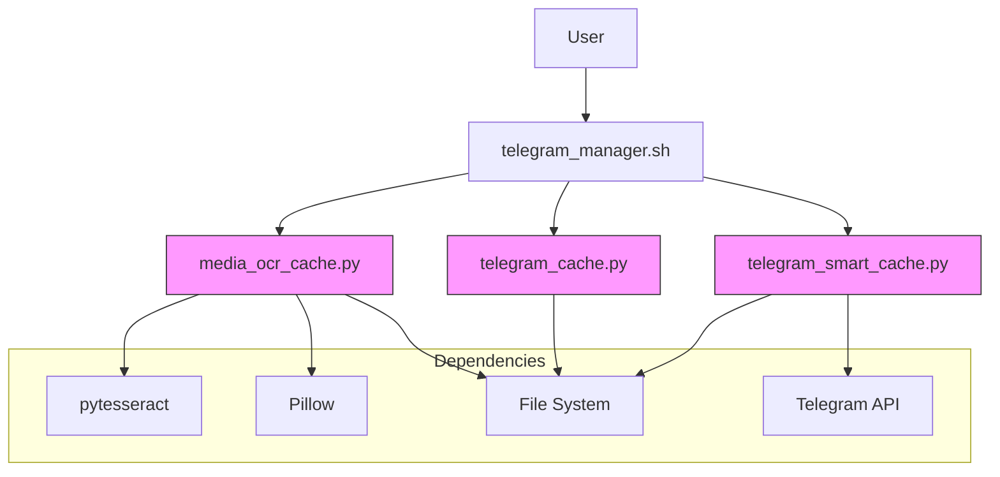
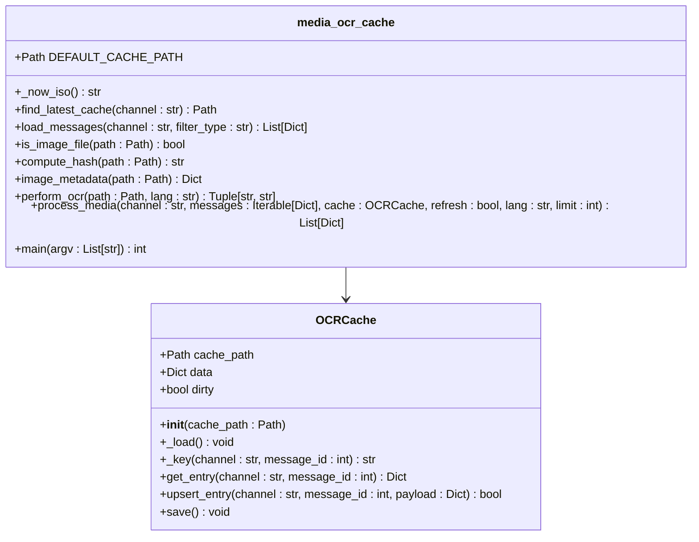
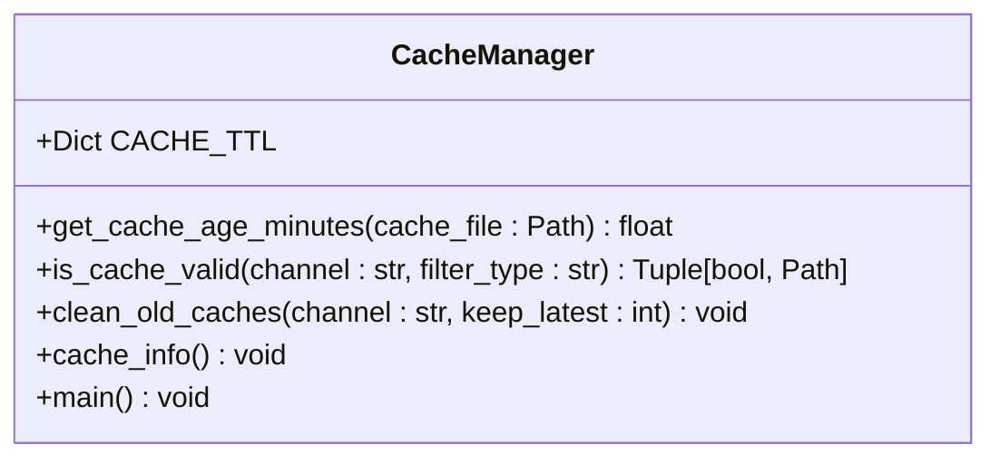
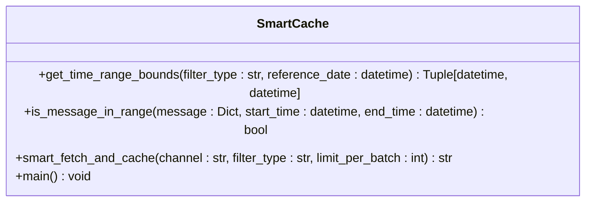
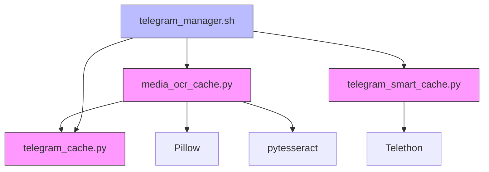

# OCR Caching System

<cite>
**Referenced Files in This Document**   
- [media_ocr_cache.py](file://scripts/telegram_tools/core/media_ocr_cache.py)
- [telegram_cache.py](file://scripts/telegram_tools/core/telegram_cache.py)
- [telegram_smart_cache.py](file://scripts/telegram_tools/telegram_smart_cache.py)
- [telegram_manager.sh](file://telegram_manager.sh)
</cite>

## Table of Contents
1. [Introduction](#introduction)
2. [Project Structure](#project-structure)
3. [Core Components](#core-components)
4. [Architecture Overview](#architecture-overview)
5. [Detailed Component Analysis](#detailed-component-analysis)
6. [Dependency Analysis](#dependency-analysis)
7. [Performance Considerations](#performance-considerations)
8. [Troubleshooting Guide](#troubleshooting-guide)
9. [Conclusion](#conclusion)

## Introduction
The OCR Caching System is designed to efficiently manage Optical Character Recognition (OCR) results for media assets in Telegram channels. It enables users to extract text from images, cache the results, and avoid redundant processing through intelligent caching mechanisms. The system integrates with Telegram data fetching workflows and supports multilingual OCR processing with fallback capabilities.

The primary purpose of this system is to enhance the accessibility and searchability of image-based content in Telegram channels by converting visual text into machine-readable format while minimizing computational overhead through effective caching strategies.

## Project Structure



**Diagram sources**
- [media_ocr_cache.py](file://scripts/telegram_tools/core/media_ocr_cache.py#L1-L278)
- [telegram_cache.py](file://scripts/telegram_tools/core/telegram_cache.py#L1-L179)
- [telegram_smart_cache.py](file://scripts/telegram_tools/telegram_smart_cache.py#L1-L244)
- [telegram_manager.sh](file://telegram_manager.sh#L1-L310)

**Section sources**
- [media_ocr_cache.py](file://scripts/telegram_tools/core/media_ocr_cache.py#L1-L278)
- [telegram_cache.py](file://scripts/telegram_tools/core/telegram_cache.py#L1-L179)
- [telegram_smart_cache.py](file://scripts/telegram_tools/telegram_smart_cache.py#L1-L244)
- [telegram_manager.sh](file://telegram_manager.sh#L1-L310)

## Core Components

The OCR Caching System consists of several key components that work together to provide efficient OCR processing and caching capabilities. The main component is `media_ocr_cache.py`, which handles OCR operations and maintains a persistent cache of results. This component integrates with the caching infrastructure provided by `telegram_cache.py` and leverages the smart caching strategy from `telegram_smart_cache.py`.

The system is accessible through the `telegram_manager.sh` script, which provides a unified interface for various operations including OCR processing, cache management, and data retrieval.

**Section sources**
- [media_ocr_cache.py](file://scripts/telegram_tools/core/media_ocr_cache.py#L1-L278)
- [telegram_cache.py](file://scripts/telegram_tools/core/telegram_cache.py#L1-L179)
- [telegram_smart_cache.py](file://scripts/telegram_tools/telegram_smart_cache.py#L1-L244)
- [telegram_manager.sh](file://telegram_manager.sh#L1-L310)

## Architecture Overview



**Diagram sources**
- [media_ocr_cache.py](file://scripts/telegram_tools/core/media_ocr_cache.py#L1-L278)
- [telegram_cache.py](file://scripts/telegram_tools/core/telegram_cache.py#L1-L179)
- [telegram_smart_cache.py](file://scripts/telegram_tools/telegram_smart_cache.py#L1-L244)
- [telegram_manager.sh](file://telegram_manager.sh#L1-L310)

## Detailed Component Analysis

### OCR Cache Manager Analysis

The OCR cache manager provides a comprehensive solution for processing and caching OCR results from Telegram media. It handles image validation, hash computation, metadata extraction, and OCR processing with error handling.



**Diagram sources**
- [media_ocr_cache.py](file://scripts/telegram_tools/core/media_ocr_cache.py#L1-L278)

**Section sources**
- [media_ocr_cache.py](file://scripts/telegram_tools/core/media_ocr_cache.py#L1-L278)

### Cache Management Analysis

The cache management system provides TTL-based cache validation and cleanup functionality. It implements different cache lifetimes based on the recency of the data, ensuring fresh content for recent messages while maintaining longer retention for archival data.



**Diagram sources**
- [telegram_cache.py](file://scripts/telegram_tools/core/telegram_cache.py#L1-L179)

**Section sources**
- [telegram_cache.py](file://scripts/telegram_tools/core/telegram_cache.py#L1-L179)

### Smart Cache Strategy Analysis

The smart cache strategy implements time-range-aware caching that ensures complete coverage of messages within a specified time period. It uses a scanning approach to verify that all messages in the desired range have been captured.



**Diagram sources**
- [telegram_smart_cache.py](file://scripts/telegram_tools/telegram_smart_cache.py#L1-L244)

**Section sources**
- [telegram_smart_cache.py](file://scripts/telegram_tools/telegram_smart_cache.py#L1-L244)

## Dependency Analysis



**Diagram sources**
- [media_ocr_cache.py](file://scripts/telegram_tools/core/media_ocr_cache.py#L1-L278)
- [telegram_cache.py](file://scripts/telegram_tools/core/telegram_cache.py#L1-L179)
- [telegram_smart_cache.py](file://scripts/telegram_tools/telegram_smart_cache.py#L1-L244)
- [telegram_manager.sh](file://telegram_manager.sh#L1-L310)

**Section sources**
- [media_ocr_cache.py](file://scripts/telegram_tools/core/media_ocr_cache.py#L1-L278)
- [telegram_cache.py](file://scripts/telegram_tools/core/telegram_cache.py#L1-L179)
- [telegram_smart_cache.py](file://scripts/telegram_tools/telegram_smart_cache.py#L1-L244)
- [telegram_manager.sh](file://telegram_manager.sh#L1-L310)

## Performance Considerations

The OCR Caching System implements several performance optimizations:

1. **Cache Hit Optimization**: The system checks for existing OCR results and content hashes before processing, avoiding redundant OCR operations.
2. **Batch Processing**: Media messages are processed in batches with configurable limits to manage memory usage.
3. **Efficient File Access**: File existence and type checks are performed before attempting OCR processing.
4. **Incremental Updates**: Only changed entries trigger cache updates, reducing I/O operations.
5. **Language Fallback**: The system attempts OCR with the specified language first, falling back to English if needed, maximizing success rates.

The cache TTL strategy in `telegram_cache.py` ensures that frequently accessed recent data is refreshed more often, while older data maintains longer cache durations, balancing freshness with performance.

**Section sources**
- [media_ocr_cache.py](file://scripts/telegram_tools/core/media_ocr_cache.py#L1-L278)
- [telegram_cache.py](file://scripts/telegram_tools/core/telegram_cache.py#L1-L179)

## Troubleshooting Guide

Common issues and their solutions:

1. **Missing Dependencies**: If OCR fails with "Pillow not installed" or "pytesseract not installed" errors, install the required packages:
   ```bash
   pip install Pillow pytesseract
   ```

2. **Cache File Not Found**: When no cache file is found for a channel, ensure you've first fetched messages using:
   ```bash
   ./telegram_manager.sh fetch <channel>
   ```

3. **Tesseract Not Available**: Install Tesseract OCR engine:
   ```bash
   # Ubuntu/Debian
   sudo apt-get install tesseract-ocr
   
   # macOS
   brew install tesseract
   ```

4. **File Permission Errors**: Ensure the script has read/write permissions to the telegram_cache directory.

5. **Language Support Issues**: Install additional Tesseract language packs:
   ```bash
   # For Russian support
   sudo apt-get install tesseract-ocr-rus
   ```

6. **Cache Validation Problems**: Use the cache info command to diagnose issues:
   ```bash
   ./telegram_manager.sh cache
   ```

**Section sources**
- [media_ocr_cache.py](file://scripts/telegram_tools/core/media_ocr_cache.py#L1-L278)
- [telegram_cache.py](file://scripts/telegram_tools/core/telegram_cache.py#L1-L179)
- [telegram_manager.sh](file://telegram_manager.sh#L1-L310)

## Conclusion

The OCR Caching System provides a robust solution for extracting and managing text content from Telegram media assets. By combining efficient OCR processing with intelligent caching strategies, the system minimizes redundant computation while ensuring up-to-date results. The integration with the broader Telegram management ecosystem through the `telegram_manager.sh` interface makes it accessible and easy to use.

Key strengths of the system include its modular design, comprehensive error handling, multilingual support, and performance optimizations. The cache invalidation and cleanup mechanisms ensure data freshness while maintaining efficient storage usage. This system effectively addresses the challenge of making image-based content in Telegram channels searchable and accessible through text-based queries.