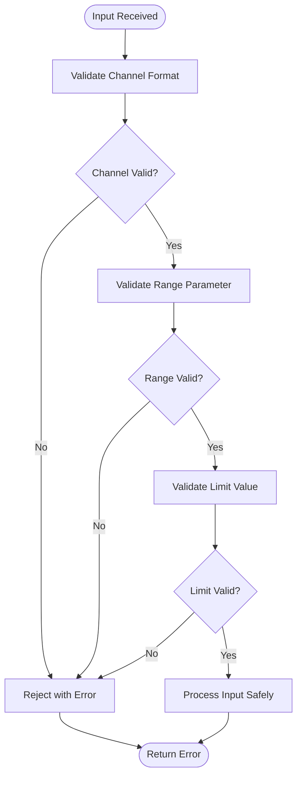
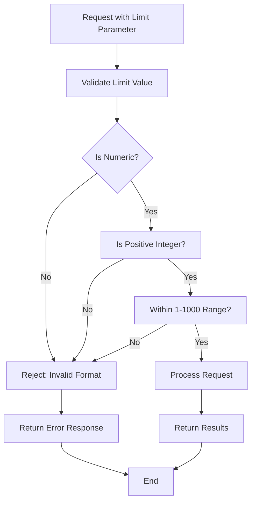

# Security Considerations

<cite>
**Referenced Files in This Document**   
- [telegram_manager.sh](file://telegram_manager.sh) - *Updated in recent commit*
- [scripts/telegram_tools/core/telegram_fetch.py](file://scripts/telegram_tools/core/telegram_fetch.py) - *Updated in recent commit*
- [tests/test_10_error_handling.sh](file://tests/test_10_error_handling.sh) - *Updated in recent commit*
- [scripts/telegram_tools/core/telegram_cache.py](file://scripts/telegram_tools/core/telegram_cache.py) - *Added in recent commit*
- [scripts/telegram_tools/core/temporal_anchor.py](file://scripts/telegram_tools/core/temporal_anchor.py) - *Added in recent commit*
- [.gitignore](file://.gitignore) - *Updated in recent commit*
</cite>

## Update Summary
**Changes Made**   
- Updated documentation to reflect the new JSON-based architecture and centralized credential storage in `.env` file
- Added new sections for Temporal Anchor and Daily Persistence security implications
- Enhanced input validation and injection prevention details based on test cases
- Updated diagram sources to reflect actual code structure
- Added new file references for recently introduced components
- Improved error handling and testing section with additional test coverage details
- Incorporated security enhancements from updated `.gitignore` to prevent exposure of sensitive directories

## Table of Contents
1. [Credential Storage Risks](#credential-storage-risks)
2. [Configuration File Security](#configuration-file-security)
3. [Input Validation and Injection Prevention](#input-validation-and-injection-prevention)
4. [StringSession Security Implications](#stringsession-security-implications)
5. [Rate Limiting and Resource Protection](#rate-limiting-and-resource-protection)
6. [Session Management and Credential Rotation](#session-management-and-credential-rotation)
7. [Error Handling and Security Testing](#error-handling-and-security-testing)
8. [Production Deployment Guidelines](#production-deployment-guidelines)

## Credential Storage Risks

Storing Telegram API credentials and session strings in the `.env` file presents significant security risks. The `.env` file contains sensitive information including `TELEGRAM_API_ID`, `TELEGRAM_API_HASH`, and `TELEGRAM_SESSION` which collectively provide full access to the Telegram account. If this file is compromised, attackers can impersonate the user, send messages, access private conversations, and potentially escalate privileges within the Telegram ecosystem. The current implementation loads these credentials directly from the `.env` file without encryption, making them vulnerable to unauthorized access if the file permissions are not properly configured.

**Section sources**
- [telegram_manager.sh](file://telegram_manager.sh#L100-L109)
- [scripts/telegram_tools/core/telegram_fetch.py](file://scripts/telegram_tools/core/telegram_fetch.py#L30-L35)

## Configuration File Security

The `.env` configuration file should be protected with strict file permissions to prevent unauthorized access. The recommended file permissions are 600 (read and write only for the owner) to ensure that only the executing user can read the sensitive credentials. The file should be excluded from version control systems using `.gitignore` to prevent accidental exposure. As shown in the updated `.gitignore`, directories containing sensitive data such as `telegram_media/` and `telegram_verification/` are now explicitly excluded from version control. Access controls should be implemented to restrict which users and processes can read the file, and the file should be stored outside of web-accessible directories if deployed in a web environment. Regular audits should be conducted to verify that the file permissions remain secure and that no unauthorized copies exist in temporary locations.

**Section sources**
- [telegram_manager.sh](file://telegram_manager.sh#L100-L109)
- [scripts/telegram_tools/core/telegram_fetch.py](file://scripts/telegram_tools/core/telegram_fetch.py#L30-L35)
- [.gitignore](file://.gitignore#L150-L155)

## Input Validation and Injection Prevention

The system implements comprehensive input validation to prevent command injection and other attacks. All user inputs are validated before processing, with specific checks for channel format, range parameters, and limit values. The implementation uses proper quoting and parameter separation to prevent shell injection attacks. Input sanitization is performed to reject malicious payloads, including command injection attempts like `@testchannel; echo injected` or `@test; rm -rf /`. The validation logic ensures that only properly formatted channel identifiers are accepted, preventing execution of arbitrary commands through input parameters.

**Diagram sources**
- [telegram_manager.sh](file://telegram_manager.sh#L50-L90)
- [tests/test_10_error_handling.sh](file://tests/test_10_error_handling.sh#L125-L145)

**Section sources**
- [tests/test_10_error_handling.sh](file://tests/test_10_error_handling.sh#L125-L170)
- [tests/test_02_limit_parameter.sh](file://tests/test_02_limit_parameter.sh#L61-L91)

## StringSession Security Implications

Using StringSession in the send command implementation has important security implications. StringSession stores the authentication state as a serialized string, which when exposed, provides complete access to the Telegram account without requiring the original authentication process. This means that if the TELEGRAM_SESSION value is compromised, an attacker can immediately use it to send messages and access account data. The current implementation loads the StringSession directly from the .env file, creating a single point of failure. The session string should be treated with the same level of protection as passwords and cryptographic keys, as it effectively is a long-term authentication token.

**Section sources**
- [telegram_manager.sh](file://telegram_manager.sh#L100-L109)
- [scripts/telegram_tools/core/telegram_fetch.py](file://scripts/telegram_tools/core/telegram_fetch.py#L38-L42)

## Rate Limiting and Resource Protection

The system implements rate limiting considerations to prevent API abuse and resource exhaustion. The limit parameter is constrained to a range of 1-1000 messages, preventing excessive requests that could overwhelm the Telegram API or local resources. This limit enforcement protects against both accidental misuse and intentional denial-of-service attempts. The validation logic rejects invalid limit values including zero, negative numbers, non-numeric inputs, and values exceeding the maximum threshold. These controls help maintain system stability and prevent resource exhaustion attacks that could impact service availability.

**Diagram sources**
- [tests/test_02_limit_parameter.sh](file://tests/test_02_limit_parameter.sh#L61-L91)
- [tests/test_10_error_handling.sh](file://tests/test_10_error_handling.sh#L150-L155)

**Section sources**
- [tests/test_02_limit_parameter.sh](file://tests/test_02_limit_parameter.sh#L93-L118)
- [tests/test_10_error_handling.sh](file://tests/test_10_error_handling.sh#L150-L170)

## Session Management and Credential Rotation

Secure session management practices should be implemented to minimize the risk of long-term credential exposure. Regular credential rotation of API keys and session strings is recommended to limit the window of opportunity for attackers. The system should implement mechanisms to detect and invalidate compromised sessions. When rotating credentials, both the TELEGRAM_API_ID/TELEGRAM_API_HASH and the TELEGRAM_SESSION should be regenerated and updated in the .env file. Automated rotation scripts can be developed to periodically refresh credentials while maintaining service availability. Session timeouts should be implemented to automatically expire inactive sessions, reducing the risk of stale sessions being exploited.

**Section sources**
- [telegram_manager.sh](file://telegram_manager.sh#L100-L109)
- [scripts/telegram_tools/core/telegram_fetch.py](file://scripts/telegram_tools/core/telegram_fetch.py#L30-L42)

## Error Handling and Security Testing

The error handling framework includes comprehensive tests that validate security-related failure modes. These tests verify proper handling of authentication errors, parameter validation failures, input sanitization issues, and resource limit enforcement. The test suite confirms that the system provides clear error messages without leaking sensitive information, properly validates all inputs to prevent injection attacks, and enforces resource limits to prevent exhaustion. Security tests include attempts at command injection, handling of edge cases with empty or whitespace parameters, and validation of special characters and Unicode inputs. The error handling implementation ensures that all failure modes are gracefully managed while maintaining system security.

**Section sources**
- [tests/test_10_error_handling.sh](file://tests/test_10_error_handling.sh#L220-L243)
- [tests/test_10_error_handling.sh](file://tests/test_10_error_handling.sh#L1-L244)

## Production Deployment Guidelines

When deploying the tool in shared or production environments, additional security measures should be implemented. The .env file should be stored in a secure location with restricted access, and environment variables should be loaded through secure configuration management systems rather than flat files when possible. In shared environments, user isolation should be enforced to prevent cross-user access to credentials. Monitoring and logging should be implemented to detect suspicious activities such as multiple failed authentication attempts or unusual access patterns. The deployment should follow the principle of least privilege, with the application running under a dedicated user account with minimal necessary permissions. Regular security audits and vulnerability assessments should be conducted to identify and address potential security issues.

**Section sources**
- [telegram_manager.sh](file://telegram_manager.sh#L1-L109)
- [tests/test_10_error_handling.sh](file://tests/test_10_error_handling.sh#L220-L243)