# Border Detection Tests

<cite>
**Referenced Files in This Document**   
- [boundary_aware_first_message_detector.sh](file://tests/boundary_aware_first_message_detector.sh)
- [timezone_aware_first_message_detector.sh](file://tests/timezone_aware_first_message_detector.sh)
- [ultra_robust_first_message_detector.sh](file://tests/ultra_robust_first_message_detector.sh)
- [test_first_message_border_detection.sh](file://tests/test_first_message_border_detection.sh)
- [simple_border_test.sh](file://tests/simple_border_test.sh)
</cite>

## Table of Contents
1. [Introduction](#introduction)
2. [Core Border Detection Mechanisms](#core-border-detection-mechanisms)
3. [Boundary-Aware Detection Strategy](#boundary-aware-detection-strategy)
4. [Timezone-Aware Detection Strategy](#timezone-aware-detection-strategy)
5. [Ultra-Robust Detection Framework](#ultra-robust-detection-framework)
6. [Test Validation and Fallback Verification](#test-validation-and-fallback-verification)
7. [Baseline Border Testing](#baseline-border-testing)
8. [Guidance for Interpreting Outputs and Extending Detectors](#guidance-for-interpreting-outputs-and-extending-detectors)

## Introduction
This document details the border detection testing framework designed to validate accurate identification of message boundaries for date-based queries. The system ensures reliable extraction of the first message of a given day across various timezones and edge cases, preventing data loss during exports. Multiple detection scripts implement layered strategies to handle timezone discrepancies, message gaps, and API inconsistencies. These tests are critical for maintaining data integrity when filtering messages by date, especially in distributed systems where time representation varies.

## Core Border Detection Mechanisms

The border detection system comprises multiple specialized scripts that address different aspects of message boundary identification. Each script implements a unique strategy to ensure robustness against common issues such as timezone misalignment, missing messages, and inconsistent API responses. The primary components include boundary-aware, timezone-aware, and ultra-robust detectors, supported by validation tests that verify correctness and fallback mechanisms.

**Section sources**
- [boundary_aware_first_message_detector.sh](file://tests/boundary_aware_first_message_detector.sh#L1-L156)
- [timezone_aware_first_message_detector.sh](file://tests/timezone_aware_first_message_detector.sh#L1-L144)
- [ultra_robust_first_message_detector.sh](file://tests/ultra_robust_first_message_detector.sh#L1-L130)

## Boundary-Aware Detection Strategy

The `boundary_aware_first_message_detector.sh` script addresses timezone boundary issues by analyzing message distribution across adjacent date sections. It retrieves messages in reverse chronological order and examines both the target date and the previous day's sections to detect early morning messages that may have been incorrectly categorized due to timezone differences.

The detector identifies potential boundary-crossing messages by scanning the last few entries of the previous day's section for timestamps between 00:00 and 06:00. If such messages exist and are earlier than the first message in the target day's section, they are considered the actual first message of the target date. This approach prevents data loss when messages near midnight are misattributed to the wrong date.


**Diagram sources**
- [boundary_aware_first_message_detector.sh](file://tests/boundary_aware_first_message_detector.sh#L50-L150)

**Section sources**
- [boundary_aware_first_message_detector.sh](file://tests/boundary_aware_first_message_detector.sh#L1-L156)

## Timezone-Aware Detection Strategy

The `timezone_aware_first_message_detector.sh` script implements a research-based approach that accounts for Telegram's use of UTC timestamps. It converts UTC timestamps to Moscow time (+3 hours) to accurately determine which messages belong to a specific date in local time.

The detection process involves four key steps: retrieving raw messages with UTC timestamps, converting each timestamp to Moscow time, filtering messages by the target date in Moscow time, and identifying the message with the lowest ID as the first message. This method ensures accurate date filtering regardless of the user's local timezone settings.

```mermaid
sequenceDiagram
participant Detector as "Timezone-Aware Detector"
participant Telegram as "Telegram Manager"
participant Converter as "UTC→Moscow Converter"
participant Filter as "Date Filter"
Detector->>Telegram : Request Messages (--limit 1000 --order reverse)
Telegram-->>Detector : Return Raw Messages with UTC Timestamps
Detector->>Converter : Convert Each UTC Timestamp to Moscow Time
Converter-->>Detector : Return Moscow Time and Date
Detector->>Filter : Filter Messages by Target Moscow Date
Filter-->>Detector : Return Messages for Target Date
Detector->>Detector : Sort by Message ID (Chronological)
Detector->>Detector : Select First Message (Lowest ID)
Detector->>Detector : Verify No Earlier Messages Exist
Detector-->>User : Output First Message of Target Date
```



**Diagram sources**
- [timezone_aware_first_message_detector.sh](file://tests/timezone_aware_first_message_detector.sh#L30-L140)

**Section sources**
- [timezone_aware_first_message_detector.sh](file://tests/timezone_aware_first_message_detector.sh#L1-L144)

## Ultra-Robust Detection Framework

The `ultra_robust_first_message_detector.sh` script implements a multi-layer fallback system designed to never fail in identifying the first message of any date. It employs five independent detection layers that cross-validate results to ensure reliability even in the presence of message gaps or API inconsistencies.

Layer 1 uses message ID sequential analysis, leveraging the fact that message IDs are sequential and timezone-independent. Layer 2 performs timestamp sequential analysis by sorting all messages chronologically. Layer 3 implements boundary detection by identifying transitions between date sections. Layer 4 conducts message content analysis, searching for known message patterns. Finally, Layer 5 performs cross-validation to determine the most reliable result across all layers.


**Diagram sources**
- [ultra_robust_first_message_detector.sh](file://tests/ultra_robust_first_message_detector.sh#L25-L125)

**Section sources**
- [ultra_robust_first_message_detector.sh](file://tests/ultra_robust_first_message_detector.sh#L1-L130)

## Test Validation and Fallback Verification

The `test_first_message_border_detection.sh` script validates the border detection method by verifying the correct identification of the first message on a known date (2025-09-15). It confirms that the system correctly identifies the message at 06:11:48 as the first message of the day, with the previous day's last message occurring at 22:13:23, resulting in an ~8-hour overnight gap.

This test demonstrates the fallback mechanism's effectiveness by showing that even if some detection layers fail, the system can still identify the correct first message through boundary analysis. The test output confirms successful border detection and provides context around the time boundary to validate the result.

```mermaid
flowchart LR
A[Test Script] --> B[Retrieve Messages in Reverse Order]
B --> C[Search for Known First Message (06:11:48)]
C --> D{Found?}
D --> |Yes| E[Display Boundary Context]
D --> |No| F[Fail Test]
E --> G[Validate Time Gap (~8 hours)]
G --> H[Pass Test]
H --> I[Output Conclusion]
```

**Diagram sources**
- [test_first_message_border_detection.sh](file://tests/test_first_message_border_detection.sh#L20-L50)

**Section sources**
- [test_first_message_border_detection.sh](file://tests/test_first_message_border_detection.sh#L1-L56)

## Baseline Border Testing

The `simple_border_test.sh` script provides baseline verification by manually inspecting the natural boundary between consecutive days. It retrieves messages around the midnight transition and displays the header changes between date sections (e.g., 2025-09-14 to 2025-09-15).

This simple test serves as a foundation for more complex detection methods by allowing direct observation of how messages are grouped by date. Users can visually identify the first message after a date header change, which should correspond to the first message of the new day. This approach is particularly useful for debugging and validating the output of automated detection scripts.

**Section sources**
- [simple_border_test.sh](file://tests/simple_border_test.sh#L1-L16)

## Guidance for Interpreting Outputs and Extending Detectors

When interpreting test outputs, focus on the source section indicator and timestamp of the detected first message. For boundary-aware detection, verify that early morning messages from the previous day are correctly attributed to the target date when appropriate. For timezone-aware detection, confirm that UTC-to-local time conversion aligns with expected message ordering.

To extend detectors for new edge cases:
1. Add new detection layers in the ultra-robust framework that address specific failure modes
2. Implement additional validation checks in test scripts for known problematic scenarios
3. Enhance timestamp parsing to handle new message formats or time representations
4. Incorporate machine learning-based anomaly detection for identifying unusual message patterns
5. Add support for additional timezones beyond Moscow time

These tests collectively ensure reliable date filtering by validating that message boundaries are correctly identified across different timezones and edge cases. The multi-layered approach prevents data loss during exports by providing fallback mechanisms that maintain accuracy even when individual detection methods fail.