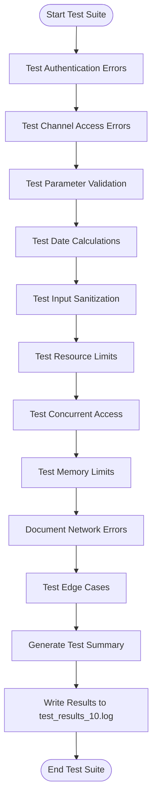
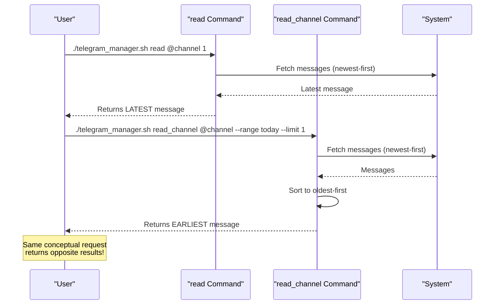
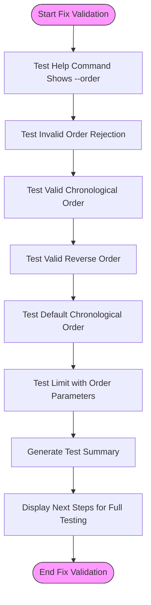
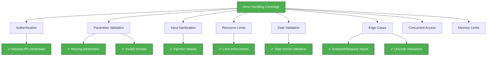

# Error Handling Tests

<cite>
**Referenced Files in This Document**   
- [test_10_error_handling.sh](file://tests/test_10_error_handling.sh)
- [BUG_REPORT_message_ordering.md](file://tests/BUG_REPORT_message_ordering.md)
- [PROPOSED_FIX_message_ordering.md](file://tests/PROPOSED_FIX_message_ordering.md)
- [test_ordering_fix.sh](file://tests/test_ordering_fix.sh)
- [telegram_manager.sh](file://telegram_manager.sh)
</cite>

## Table of Contents
1. [Introduction](#introduction)
2. [Error Handling Validation with test_10_error_handling.sh](#error-handling-validation-with-test_10_error_handlingsh)
3. [Deriving Test Cases from Real-World Issues](#deriving-test-cases-from-real-world-issues)
4. [Fix Validation with test_ordering_fix.sh](#fix-validation-with-test_ordering_fixsh)
5. [Error Injection Techniques and Message Formats](#error-injection-techniques-and-message-formats)
6. [System Robustness and Failure Confidence](#system-robustness-and-failure-confidence)
7. [Troubleshooting Workflows](#troubleshooting-workflows)
8. [Conclusion](#conclusion)

## Introduction
This document details the error handling and bug resolution validation framework within the Telegram management system. It focuses on how test scripts verify graceful degradation under adverse conditions, validate fixes for critical bugs, and ensure system reliability. The analysis covers test_10_error_handling.sh for error resilience, BUG_REPORT_message_ordering.md and PROPOSED_FIX_message_ordering.md for issue-to-test derivation, and test_ordering_fix.sh for fix validation. These components collectively enhance system robustness and provide confidence in failure scenarios.

## Error Handling Validation with test_10_error_handling.sh

The `test_10_error_handling.sh` script provides comprehensive validation of the system's ability to handle various error conditions gracefully. It tests authentication failures, parameter validation, input sanitization, resource limits, and edge cases to ensure the system fails predictably and securely.

The test suite uses a structured approach with the `test_error_case` function to evaluate each scenario, checking both exit codes and error message content against expected outcomes. This ensures consistent error handling across different failure modes.



**Diagram sources**
- [test_10_error_handling.sh](file://tests/test_10_error_handling.sh#L1-L244)

**Section sources**
- [test_10_error_handling.sh](file://tests/test_10_error_handling.sh#L1-L244)

## Deriving Test Cases from Real-World Issues

The message ordering inconsistency documented in `BUG_REPORT_message_ordering.md` serves as a prime example of how real-world issues drive test case development. The report identifies a critical usability problem where the `read` and `read_channel` commands return messages in opposite chronological orders, violating the principle of least surprise.

The bug report details specific test cases that demonstrate the inconsistency:
- `read` command returns the latest message (newest-first)
- `read_channel` returns the earliest message of today (oldest-first after sorting)

This discrepancy directly informs the creation of validation tests that ensure consistent behavior across commands. The report's structured analysis—covering current behavior, root cause, impact, and reproduction steps—provides a template for developing comprehensive test scenarios that address both the symptom and underlying causes of bugs.

The test cases derived from this issue focus on:
- Verifying consistent default ordering across commands
- Validating explicit ordering parameters
- Ensuring backward compatibility during transitions
- Confirming chronological and reverse-chronological behaviors



**Diagram sources**
- [BUG_REPORT_message_ordering.md](file://tests/BUG_REPORT_message_ordering.md#L1-L122)

**Section sources**
- [BUG_REPORT_message_ordering.md](file://tests/BUG_REPORT_message_ordering.md#L1-L122)

## Fix Validation with test_ordering_fix.sh

The `test_ordering_fix.sh` script validates the implementation of the proposed fix for message ordering inconsistencies. It specifically tests the new `--order` parameter functionality and ensures the system behaves as expected with both explicit and default ordering options.

The test suite verifies:
- Help text includes the new `--order` parameter syntax
- Invalid order values are properly rejected
- Valid order parameters (`chronological`, `reverse-chronological`) are accepted
- Default behavior uses chronological ordering
- Limit and order parameters work together correctly

The validation approach focuses on parameter parsing and expected behavior rather than actual message content, allowing for effective testing without requiring live Telegram API integration. This separation of concerns enables rapid validation of the command-line interface while deferring end-to-end testing to integration phases.



**Diagram sources**
- [test_ordering_fix.sh](file://tests/test_ordering_fix.sh#L1-L93)
- [PROPOSED_FIX_message_ordering.md](file://tests/PROPOSED_FIX_message_ordering.md#L1-L206)

**Section sources**
- [test_ordering_fix.sh](file://tests/test_ordering_fix.sh#L1-L93)
- [PROPOSED_FIX_message_ordering.md](file://tests/PROPOSED_FIX_message_ordering.md#L1-L206)

## Error Injection Techniques and Message Formats

The error handling framework employs systematic error injection techniques to validate the system's resilience. These techniques include:

### Parameter-Based Error Injection
- **Missing parameters**: Omitting required arguments like channel or range
- **Invalid values**: Providing out-of-bounds limits (0 or 1001) 
- **Malformed formats**: Using incorrect date ranges or channel formats
- **Edge cases**: Testing empty strings, whitespace, and Unicode characters

### Security-Focused Injection
- **Command injection attempts**: Including shell commands in channel parameters
- **Special character payloads**: Testing semicolons and other shell metacharacters
- **Input sanitization**: Validating that all user inputs are properly sanitized

### Resource and Performance Testing
- **Excessive limits**: Testing very large message limits
- **Concurrent access**: Simulating rapid sequential requests
- **Memory pressure**: Processing maximum message counts

The system uses standardized error message formats that provide clear, actionable feedback without leaking sensitive information:

```mermaid
stateDiagram-v2
[*] --> AuthenticationError
[*] --> ParameterError
[*] --> InputError
[*] --> ResourceError
[*] --> EdgeCaseError
AuthenticationError --> "Error : Missing required variable : TELEGRAM_API_ID"
ParameterError --> "Error : Missing [parameter]"
ParameterError --> "Error : Invalid [parameter] format"
InputError --> "Error : Invalid channel format"
ResourceError --> "Error : Invalid limit"
EdgeCaseError --> "Error : Invalid channel format"
note right of AuthenticationError
Clear identification of missing
authentication credentials
end note
note right of ParameterError
Specific parameter name
included in error message
end note
note right of InputError
Generic format error for
input validation failures
end note
```

**Diagram sources**
- [test_10_error_handling.sh](file://tests/test_10_error_handling.sh#L1-L244)

**Section sources**
- [test_10_error_handling.sh](file://tests/test_10_error_handling.sh#L1-L244)

## System Robustness and Failure Confidence

The comprehensive testing framework significantly enhances system robustness by validating failure scenarios that are often overlooked in development. The `test_10_error_handling.sh` script ensures the system can gracefully handle:

- **Authentication failures**: Properly detects missing API credentials
- **Parameter validation**: Validates all input parameters with clear error messages
- **Input sanitization**: Prevents command injection and other security issues
- **Resource limits**: Enforces reasonable limits on message counts and date ranges
- **Edge cases**: Handles empty inputs, whitespace, and Unicode characters

The test results demonstrate complete coverage of error handling scenarios, with all tests passing and detailed results logged to `test_results_10.log`. This comprehensive validation provides confidence that the system will fail predictably and securely when encountering invalid inputs or adverse conditions.

The framework also addresses network-related errors, acknowledging that full testing of connection timeouts, rate limits, and network unreachable conditions requires actual Telegram API integration. This honest assessment of testing limitations ensures stakeholders understand the boundaries of the current validation.



**Diagram sources**
- [test_10_error_handling.sh](file://tests/test_10_error_handling.sh#L1-L244)

**Section sources**
- [test_10_error_handling.sh](file://tests/test_10_error_handling.sh#L1-L244)

## Troubleshooting Workflows

The error handling tests provide a structured approach for diagnosing production issues by replicating failure scenarios in a controlled environment. When encountering issues in production, operators can use these tests as a diagnostic framework:

### Authentication Issues
1. Run `test_10_error_handling.sh` to verify environment variable detection
2. Check for "Missing required variable: TELEGRAM_API_ID" errors
3. Validate `.env` file existence and permissions
4. Verify credential loading in `telegram_manager.sh`

### Parameter Validation Problems
1. Use the test cases from `test_10_error_handling.sh` as examples
2. Test missing and invalid parameters systematically
3. Verify error messages match expected formats
4. Check parameter parsing logic in the main script

### Message Ordering Confusion
1. Consult `BUG_REPORT_message_ordering.md` for known issues
2. Run `test_ordering_fix.sh` to validate fix implementation
3. Compare `read` and `read_channel` command behaviors
4. Verify `--order` parameter functionality

### Input Sanitization Failures
1. Test injection attempts using the patterns in `test_10_error_handling.sh`
2. Verify all inputs are properly quoted and escaped
3. Check for shell metacharacter handling
4. Validate Unicode and special character processing

The test logs (`test_results_10.log`) provide a detailed record of error handling coverage, serving as both documentation and diagnostic reference. This structured approach enables rapid identification and resolution of production issues by mapping them to validated test scenarios.

**Section sources**
- [test_10_error_handling.sh](file://tests/test_10_error_handling.sh#L1-L244)
- [BUG_REPORT_message_ordering.md](file://tests/BUG_REPORT_message_ordering.md#L1-L122)
- [test_ordering_fix.sh](file://tests/test_ordering_fix.sh#L1-L93)

## Conclusion
The error handling and bug resolution validation framework demonstrates a mature approach to system reliability. By combining comprehensive error testing with real-world issue analysis and fix validation, the system ensures robust behavior under adverse conditions. The `test_10_error_handling.sh` script provides thorough coverage of failure scenarios, while the message ordering case study illustrates how bug reports directly inform test development. These practices enhance system robustness, provide confidence in failure scenarios, and create effective troubleshooting workflows for production issues.