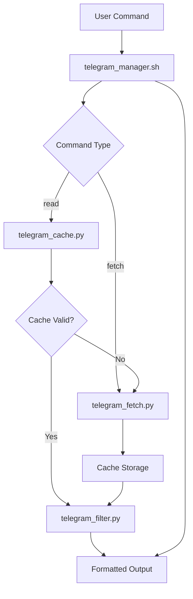
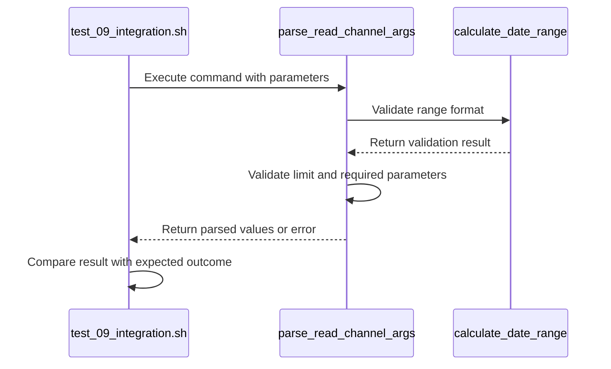
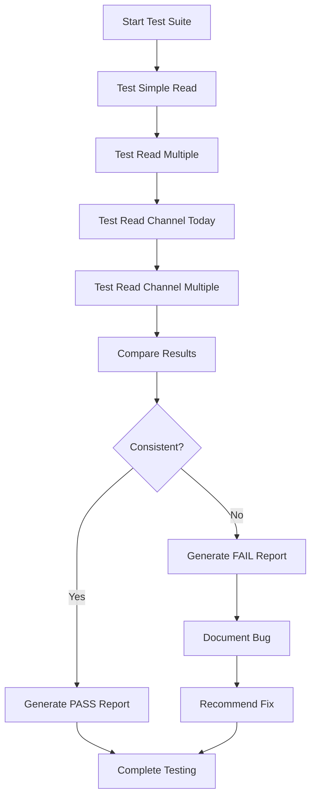
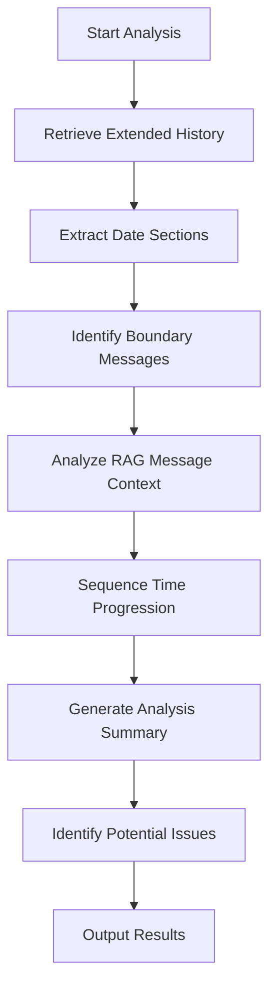
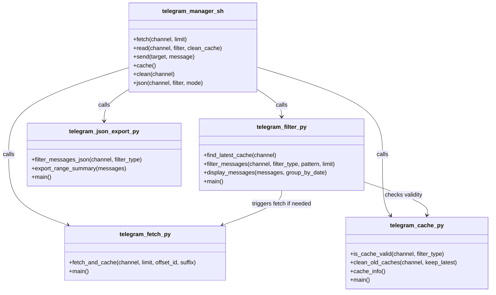
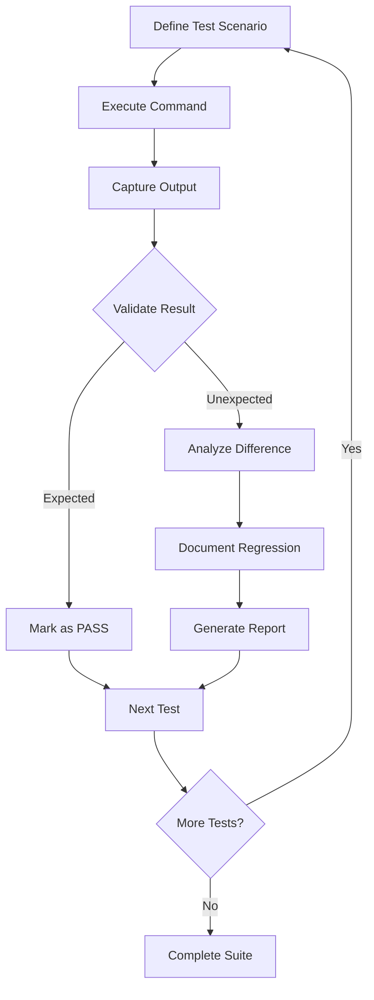
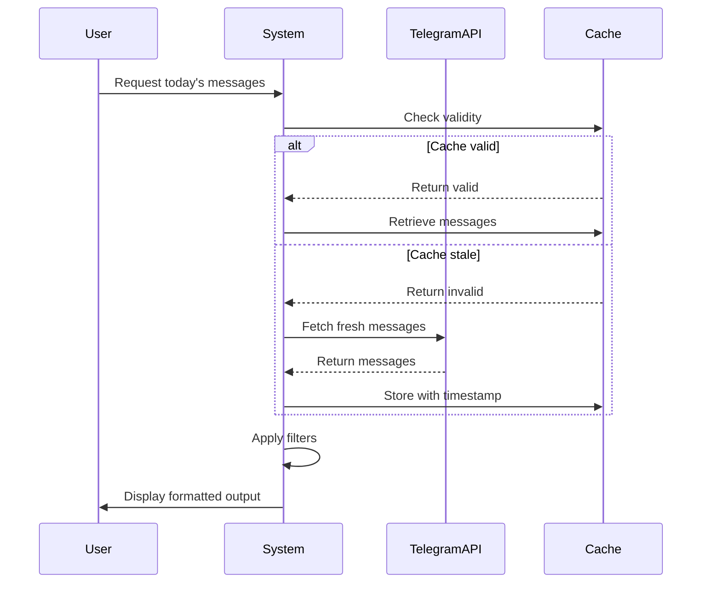
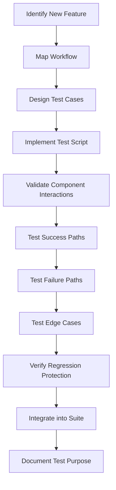

# Integration Tests

<cite>
**Referenced Files in This Document**   
- [telegram_manager.sh](file://telegram_manager.sh)
- [test_09_integration.sh](file://tests/test_09_integration.sh)
- [test_ordering_integration.sh](file://tests/test_ordering_integration.sh)
- [comprehensive_message_analysis.sh](file://tests/comprehensive_message_analysis.sh)
- [scripts/telegram_tools/core/telegram_fetch.py](file://scripts/telegram_tools/core/telegram_fetch.py)
- [scripts/telegram_tools/core/telegram_filter.py](file://scripts/telegram_tools/core/telegram_filter.py)
- [scripts/telegram_tools/core/telegram_cache.py](file://scripts/telegram_tools/core/telegram_cache.py)
- [scripts/telegram_tools/core/telegram_json_export.py](file://scripts/telegram_tools/core/telegram_json_export.py)
</cite>

## Table of Contents
1. [Introduction](#introduction)
2. [Integration Test Overview](#integration-test-overview)
3. [test_09_integration.sh Analysis](#test_09_integrationsh-analysis)
4. [test_ordering_integration.sh Analysis](#test_ordering_integrationsh-analysis)
5. [comprehensive_message_analysis.sh Analysis](#comprehensive_message_analysissh-analysis)
6. [Component Interaction Workflow](#component-interaction-workflow)
7. [Test Scenarios and Regression Detection](#test-scenarios-and-regression-detection)
8. [Real-World Usage Simulation](#real-world-usage-simulation)
9. [Extending Integration Tests](#extending-integration-tests)
10. [Conclusion](#conclusion)

## Introduction
Integration testing plays a critical role in validating the end-to-end functionality of the Telegram message management system. This document analyzes the integration test suite that verifies the coordination between the bash script interface (telegram_manager.sh), Python core modules, and cache interactions. The tests ensure that message fetching, filtering, and output formatting work correctly in sequence, detecting regressions in message ordering and cache synchronization. These tests simulate real-world usage patterns to maintain system coherence across component boundaries.

## Integration Test Overview
The integration test suite validates the complete workflow from user command invocation through message retrieval, filtering, and output generation. The tests verify the interaction between the telegram_manager.sh script and the Python core modules (telegram_fetch.py, telegram_filter.py, telegram_cache.py) while ensuring proper cache management. The test suite detects regressions in message ordering and cache synchronization by comparing expected versus actual behavior across different command combinations and edge cases.

**Diagram sources**
- [telegram_manager.sh](file://telegram_manager.sh#L1-L110)
- [scripts/telegram_tools/core/telegram_fetch.py](file://scripts/telegram_tools/core/telegram_fetch.py#L1-L150)
- [scripts/telegram_tools/core/telegram_filter.py](file://scripts/telegram_tools/core/telegram_filter.py#L1-L240)
- [scripts/telegram_tools/core/telegram_cache.py](file://scripts/telegram_tools/core/telegram_cache.py#L1-L180)

**Section sources**
- [telegram_manager.sh](file://telegram_manager.sh#L1-L110)
- [tests/test_09_integration.sh](file://tests/test_09_integration.sh#L1-L280)
- [tests/test_ordering_integration.sh](file://tests/test_ordering_integration.sh#L1-L185)

## test_09_integration.sh Analysis
The test_09_integration.sh script validates the complete command parsing functionality of the system. It tests the parse_read_channel_args function by simulating various command combinations and verifying correct parameter extraction. The test covers basic commands, parameter variations, and error conditions to ensure robust argument handling.

The test suite includes scenarios for basic command execution, limit parameter usage, full parameter combinations, custom date ranges, and error handling for missing or invalid parameters. It also verifies parameter order flexibility and support for different channel formats (username and group ID). Each test case validates that the system correctly parses channel identifiers, date ranges, limits, and offset IDs while enforcing validation rules for each parameter.

**Diagram sources**
- [tests/test_09_integration.sh](file://tests/test_09_integration.sh#L1-L280)
- [telegram_manager.sh](file://telegram_manager.sh#L1-L110)

**Section sources**
- [tests/test_09_integration.sh](file://tests/test_09_integration.sh#L1-L280)
- [telegram_manager.sh](file://telegram_manager.sh#L1-L110)

## test_ordering_integration.sh Analysis
The test_ordering_integration.sh script specifically targets message ordering inconsistencies in the system. It verifies the actual behavior of message retrieval commands and documents identified bugs in message ordering logic. The test compares the output of different command variants to detect regressions in message sequence handling.

This integration test reveals a critical inconsistency between the 'read' and 'read_channel' commands. The 'read' command returns messages in reverse chronological order (newest first) without post-processing, while the 'read_channel' command fetches messages newest-first but then sorts them chronologically (oldest first). This creates user confusion when requesting "the first message," as the same conceptual request returns opposite results depending on the command used.

The test generates a comprehensive report documenting the inconsistency, including message IDs, timestamps, and behavioral differences. It provides a clear recommendation to implement an explicit ordering parameter for both commands to eliminate ambiguity and ensure consistent behavior across the system.

**Diagram sources**
- [tests/test_ordering_integration.sh](file://tests/test_ordering_integration.sh#L1-L185)
- [telegram_manager.sh](file://telegram_manager.sh#L1-L110)

**Section sources**
- [tests/test_ordering_integration.sh](file://tests/test_ordering_integration.sh#L1-L185)
- [telegram_manager.sh](file://telegram_manager.sh#L1-L110)

## comprehensive_message_analysis.sh Analysis
The comprehensive_message_analysis.sh script performs detailed analysis of message sequences around date boundaries. It retrieves extended message history and analyzes candidate messages around specific date boundaries (such as September 14-15) to validate correct message ordering and timestamp handling.

This test focuses on identifying issues in date boundary detection and timezone conversion logic. It extracts messages from consecutive days and highlights specific messages of interest, such as the "RAG message" at 22:13:23 on September 14. The script analyzes the time sequence around the boundary to determine whether messages are correctly assigned to their respective dates based on Moscow timezone.

The comprehensive analysis includes color-coded output to distinguish messages from different dates, context analysis around specific messages, and chronological ordering of key timestamps. It raises questions about the correct identification of the "first message" of a new day, highlighting potential issues in timezone conversion or date boundary logic that could affect message ordering accuracy.

**Diagram sources**
- [tests/comprehensive_message_analysis.sh](file://tests/comprehensive_message_analysis.sh#L1-L115)
- [scripts/telegram_tools/core/telegram_fetch.py](file://scripts/telegram_tools/core/telegram_fetch.py#L1-L150)

**Section sources**
- [tests/comprehensive_message_analysis.sh](file://tests/comprehensive_message_analysis.sh#L1-L115)
- [scripts/telegram_tools/core/telegram_fetch.py](file://scripts/telegram_tools/core/telegram_fetch.py#L1-L150)

## Component Interaction Workflow
The integration tests validate a complex workflow involving multiple components working in concert. The process begins with the telegram_manager.sh script parsing user commands and routing them to appropriate Python modules. The core interaction pattern follows a cache-aside strategy where the system first checks cache validity before deciding whether to fetch fresh messages.

When a read command is issued, the system uses telegram_cache.py to check if cached data is still valid based on TTL rules. If the cache is stale or cleaning is requested, telegram_fetch.py retrieves fresh messages from Telegram and stores them in JSON format. The telegram_filter.py module then processes the cached messages according to the specified filter criteria, applying date-based, pattern-based, or limit-based filtering.

The integration tests verify that this workflow operates correctly under various conditions, including cache hits, cache misses, cache cleaning, and different filter combinations. They ensure that message ordering remains consistent across the entire pipeline and that cache synchronization works properly to avoid stale data issues.

**Diagram sources**
- [telegram_manager.sh](file://telegram_manager.sh#L1-L110)
- [scripts/telegram_tools/core/telegram_fetch.py](file://scripts/telegram_tools/core/telegram_fetch.py#L1-L150)
- [scripts/telegram_tools/core/telegram_filter.py](file://scripts/telegram_tools/core/telegram_filter.py#L1-L240)
- [scripts/telegram_tools/core/telegram_cache.py](file://scripts/telegram_tools/core/telegram_cache.py#L1-L180)
- [scripts/telegram_tools/core/telegram_json_export.py](file://scripts/telegram_tools/core/telegram_json_export.py#L1-L125)

**Section sources**
- [telegram_manager.sh](file://telegram_manager.sh#L1-L110)
- [scripts/telegram_tools/core/telegram_fetch.py](file://scripts/telegram_tools/core/telegram_fetch.py#L1-L150)
- [scripts/telegram_tools/core/telegram_filter.py](file://scripts/telegram_tools/core/telegram_filter.py#L1-L240)
- [scripts/telegram_tools/core/telegram_cache.py](file://scripts/telegram_tools/core/telegram_cache.py#L1-L180)
- [scripts/telegram_tools/core/telegram_json_export.py](file://scripts/telegram_tools/core/telegram_json_export.py#L1-L125)

## Test Scenarios and Regression Detection
The integration test suite employs multiple scenarios to detect regressions in message ordering and cache synchronization. Key test scenarios include:

- **Basic command parsing**: Validates that required parameters (channel, range) are correctly parsed and validated
- **Parameter combinations**: Tests various combinations of limit, offset, and range parameters to ensure correct handling
- **Error conditions**: Verifies proper error handling for missing channels, invalid ranges, and out-of-bounds limits
- **Message ordering**: Compares output from different command variants to detect inconsistencies in message sequence
- **Cache behavior**: Tests cache validation, staleness detection, and cleanup operations
- **Date boundary handling**: Analyzes message sequences around day boundaries to identify timezone conversion issues

The tests detect regressions by establishing baseline behavior and comparing current output against expected results. When inconsistencies are found, such as the message ordering bug documented in test_ordering_integration.sh, the tests generate detailed reports with evidence of the issue. This enables developers to identify and fix problems before they affect users.

**Diagram sources**
- [tests/test_09_integration.sh](file://tests/test_09_integration.sh#L1-L280)
- [tests/test_ordering_integration.sh](file://tests/test_ordering_integration.sh#L1-L185)
- [tests/comprehensive_message_analysis.sh](file://tests/comprehensive_message_analysis.sh#L1-L115)

**Section sources**
- [tests/test_09_integration.sh](file://tests/test_09_integration.sh#L1-L280)
- [tests/test_ordering_integration.sh](file://tests/test_ordering_integration.sh#L1-L185)
- [tests/comprehensive_message_analysis.sh](file://tests/comprehensive_message_analysis.sh#L1-L115)

## Real-World Usage Simulation
The integration tests simulate real-world usage patterns by combining multiple operations in sequence, reflecting how users actually interact with the system. The tests mimic common user workflows such as:

- Checking recent messages with automatic cache management
- Retrieving messages from specific date ranges
- Searching for messages containing specific patterns
- Managing cache size and freshness
- Exporting message data for analysis

By simulating these patterns, the tests ensure that the system behaves correctly under realistic conditions. For example, the cache validation logic in telegram_cache.py uses different TTL values based on the recency of requested messages, reflecting the real-world expectation that recent messages change more frequently than archived ones.

The tests also simulate edge cases that users might encounter, such as network delays, API rate limiting, and timezone boundary conditions. This comprehensive simulation approach helps identify issues that might not appear in isolated unit tests but could affect user experience in production.

**Diagram sources**
- [telegram_manager.sh](file://telegram_manager.sh#L1-L110)
- [scripts/telegram_tools/core/telegram_cache.py](file://scripts/telegram_tools/core/telegram_cache.py#L1-L180)
- [scripts/telegram_tools/core/telegram_fetch.py](file://scripts/telegram_tools/core/telegram_fetch.py#L1-L150)
- [scripts/telegram_tools/core/telegram_filter.py](file://scripts/telegram_tools/core/telegram_filter.py#L1-L240)

**Section sources**
- [telegram_manager.sh](file://telegram_manager.sh#L1-L110)
- [scripts/telegram_tools/core/telegram_cache.py](file://scripts/telegram_tools/core/telegram_cache.py#L1-L180)
- [scripts/telegram_tools/core/telegram_fetch.py](file://scripts/telegram_tools/core/telegram_fetch.py#L1-L150)
- [scripts/telegram_tools/core/telegram_filter.py](file://scripts/telegram_tools/core/telegram_filter.py#L1-L240)

## Extending Integration Tests
To extend the integration test suite for new feature combinations, follow these guidelines:

1. **Identify new workflows**: Map out the sequence of operations for the new feature
2. **Create test scaffolding**: Use existing test patterns as templates for new tests
3. **Validate component interactions**: Ensure all components work together correctly
4. **Test edge cases**: Include boundary conditions and error scenarios
5. **Verify regression protection**: Ensure new tests detect potential regressions

When adding tests for new features, maintain the same structure and conventions as existing tests. Use descriptive test names, clear expected outcomes, and comprehensive coverage of both success and failure paths. For features involving message ordering or date handling, include specific tests for timezone boundaries and daylight saving time transitions.

The test suite can be extended by creating new test scripts in the tests directory following the naming convention test_XX_feature.sh, where XX is the next available number. Each new test should include setup, execution, validation, and reporting phases similar to the existing integration tests.

**Diagram sources**
- [tests/test_09_integration.sh](file://tests/test_09_integration.sh#L1-L280)
- [tests/test_ordering_integration.sh](file://tests/test_ordering_integration.sh#L1-L185)

**Section sources**
- [tests/test_09_integration.sh](file://tests/test_09_integration.sh#L1-L280)
- [tests/test_ordering_integration.sh](file://tests/test_ordering_integration.sh#L1-L185)

## Conclusion
The integration test suite provides comprehensive validation of the Telegram message management system's end-to-end workflows. By testing the coordination between telegram_manager.sh, Python core modules, and cache interactions, the suite ensures system coherence and detects regressions in critical areas like message ordering and cache synchronization.

The tests validate complex scenarios combining message fetching, filtering, and output formatting in sequence, simulating real-world usage patterns. They have successfully identified issues such as the message ordering inconsistency between 'read' and 'read_channel' commands, demonstrating their effectiveness in catching subtle bugs that could affect user experience.

To maintain system reliability, the integration tests should be run regularly, especially when modifying core components or adding new features. The extensible test framework allows for easy addition of new test cases to cover emerging requirements and edge cases, ensuring continued robustness of the system.