# Unit Tests

<cite>
**Referenced Files in This Document**   
- [test_01_range_parameter.sh](file://tests/test_01_range_parameter.sh)
- [test_05_date_today.sh](file://tests/test_05_date_today.sh)
- [test_02_limit_parameter.sh](file://tests/test_02_limit_parameter.sh)
- [test_10_error_handling.sh](file://tests/test_10_error_handling.sh)
- [telegram_manager.sh](file://telegram_manager.sh)
</cite>

## Table of Contents
1. [Introduction](#introduction)
2. [Core Components](#core-components)
3. [Parameter Validation Testing](#parameter-validation-testing)
4. [Date-Based Operations Testing](#date-based-operations-testing)
5. [Edge Case Handling](#edge-case-handling)
6. [Assertion Patterns and Shell Testing Techniques](#assertion-patterns-and-shell-testing-techniques)
7. [Common Failures and Troubleshooting](#common-failures-and-troubleshooting)
8. [Unit Tests as Living Documentation](#unit-tests-as-living-documentation)

## Introduction
This document details the unit testing strategy for individual command parameters within the Telegram manager CLI tool. The test suite focuses on validating atomic behaviors such as range, limit, offset, channel, and date-based operations through isolated test scripts. Each test verifies correct parsing, execution, and error handling of specific command-line arguments. These tests follow a Test-Driven Development (TDD) approach with explicit RED-GREEN-REFACTOR phases, ensuring robustness and maintainability.

## Core Components

The unit testing framework is built around shell-based test scripts that validate the behavior of key functions in `telegram_manager.sh`. These tests isolate individual parameters and verify their correct interpretation and enforcement. The primary components under test include range specifications, message limits, channel identifiers, and date calculations, all of which are critical for reliable message retrieval and filtering.

**Section sources**
- [test_01_range_parameter.sh](file://tests/test_01_range_parameter.sh#L1-L158)
- [test_02_limit_parameter.sh](file://tests/test_02_limit_parameter.sh#L1-L118)
- [test_05_date_today.sh](file://tests/test_05_date_today.sh#L1-L52)

## Parameter Validation Testing

Unit tests for parameter validation ensure that inputs such as `--limit`, `--range`, and channel names conform to expected formats and constraints. For example, the `--limit` parameter must be an integer between 1 and 1000. The test script `test_02_limit_parameter.sh` validates this using a combination of regex matching and numeric bounds checking:

```mermaid
flowchart TD
Start([Start Validation]) --> RegexCheck["Check if input matches ^[0-9]+$"]
RegexCheck --> NumericCheck{"Is number ≥ 1 and ≤ 1000?"}
NumericCheck --> |Yes| Valid[Return 0 - Valid]
NumericCheck --> |No| Invalid[Return 1 - Invalid]
```

**Diagram sources**
- [test_02_limit_parameter.sh](file://tests/test_02_limit_parameter.sh#L25-L32)
- [telegram_manager.sh](file://telegram_manager.sh#L1-L110)

The validation logic is implemented using Bash pattern matching and arithmetic evaluation:
- `[[ "$limit" =~ ^[0-9]+$ ]]` ensures the input is numeric
- `[[ "$limit" -ge 1 ]]` and `[[ "$limit" -le 1000 ]]` enforce bounds

These tests cover edge cases such as leading zeros (`01`, `001`), zero, negative numbers, decimals, and non-numeric strings to ensure comprehensive validation.

**Section sources**
- [test_02_limit_parameter.sh](file://tests/test_02_limit_parameter.sh#L1-L118)
- [test_10_error_handling.sh](file://tests/test_10_error_handling.sh#L81-L126)

## Date-Based Operations Testing

Date-based operations are tested through functions like `calculate_date_range()`, which interprets various date range formats including `"today"`, `"yesterday"`, `"last:N"`, and custom date ranges in `YYYY-MM-DD:YYYY-MM-DD` format. The test script `test_01_range_parameter.sh` validates both valid and invalid range specifications.

For the `"today"` range, the function computes the start and end times in Moscow timezone (`Europe/Moscow`), setting the range from `00:00:00` to `23:59:59` of the current day. The test script `test_05_date_today.sh` verifies this behavior by comparing the actual output against the expected datetime string.

**Diagram sources**
- [test_05_date_today.sh](file://tests/test_05_date_today.sh#L1-L52)
- [test_01_range_parameter.sh](file://tests/test_01_range_parameter.sh#L25-L75)

The test suite includes validation for leap years, invalid months (e.g., `2025-13-01`), and malformed date formats to ensure robust date parsing.

**Section sources**
- [test_01_range_parameter.sh](file://tests/test_01_range_parameter.sh#L1-L158)
- [test_05_date_today.sh](file://tests/test_05_date_today.sh#L1-L52)

## Edge Case Handling

The test suite thoroughly examines edge cases to ensure resilience under unexpected inputs. Examples include:
- Empty strings and whitespace-only inputs
- Leading zeros in numeric parameters (`01`, `001`)
- Boundary values like `limit=1` and `limit=1000`
- Single-day ranges (e.g., `2025-02-28:2025-02-28`)
- Leap year validation (`2024-02-29`)

Tests also verify rejection of invalid formats such as:
- Non-numeric limits (`abc`, `1.5`)
- Invalid date components (e.g., `2025-09-32`)
- Missing end dates in range specifications
- Special characters in channel names

These edge cases are systematically tested to prevent runtime errors and ensure predictable behavior.

**Section sources**
- [test_01_range_parameter.sh](file://tests/test_01_range_parameter.sh#L120-L158)
- [test_02_limit_parameter.sh](file://tests/test_02_limit_parameter.sh#L85-L118)
- [test_10_error_handling.sh](file://tests/test_10_error_handling.sh#L150-L244)

## Assertion Patterns and Shell Testing Techniques

The test scripts employ custom assertion helpers such as `assert_range_valid()` and `assert_range_invalid()` to streamline test execution and reporting. These functions increment test counters, provide colored output (green for pass, red for fail), and generate descriptive messages.

Shell-based testing techniques include:
- Use of `set -euo pipefail` for strict error handling
- Mock implementations of core functions (e.g., `calculate_date_range`)
- Timezone-aware date calculations using `TZ="Europe/Moscow"`
- String comparison for expected vs actual output
- Exit code validation for error conditions

The TDD structure follows RED-GREEN-REFACTOR phases:
- **RED**: Write failing tests first
- **GREEN**: Implement minimal code to pass tests
- **REFACTOR**: Review for simplicity and maintainability

This approach ensures that all functionality is test-covered before implementation.

**Section sources**
- [test_01_range_parameter.sh](file://tests/test_01_range_parameter.sh#L85-L118)
- [test_05_date_today.sh](file://tests/test_05_date_today.sh#L15-L52)

## Common Failures and Troubleshooting

Common failures identified through unit testing include:
- Incorrect date parsing due to invalid format or timezone misconfiguration
- Limit overflow (values > 1000 or < 1)
- Malformed range specifications (e.g., missing colon separator)
- Channel name validation failures (invalid characters, length constraints)

Troubleshooting guidance:
- Verify input format against documented patterns
- Check timezone settings when date calculations fail
- Ensure numeric inputs are integers without leading signs or decimals
- Validate channel names start with `@` or `-100` prefix
- Review error messages for specific validation failure reasons

The `test_10_error_handling.sh` script provides comprehensive coverage of error scenarios, including missing parameters, invalid values, and injection attempts.

**Section sources**
- [test_10_error_handling.sh](file://tests/test_10_error_handling.sh#L1-L244)
- [test_01_range_parameter.sh](file://tests/test_01_range_parameter.sh#L100-L158)

## Unit Tests as Living Documentation

The unit tests serve as living documentation for expected CLI behavior. Each test case clearly defines:
- Valid and invalid input formats
- Expected output for correct inputs
- Error messages for invalid inputs
- Boundary conditions and edge cases

By examining the test scripts, developers can understand how parameters should be formatted and what behaviors to expect without consulting external documentation. The tests also document the TDD process, showing how functionality was developed incrementally with verification at each step.

This approach ensures that the test suite remains aligned with actual implementation and provides immediate feedback when changes introduce regressions.

**Section sources**
- [test_01_range_parameter.sh](file://tests/test_01_range_parameter.sh#L1-L158)
- [test_02_limit_parameter.sh](file://tests/test_02_limit_parameter.sh#L1-L118)
- [test_05_date_today.sh](file://tests/test_05_date_today.sh#L1-L52)