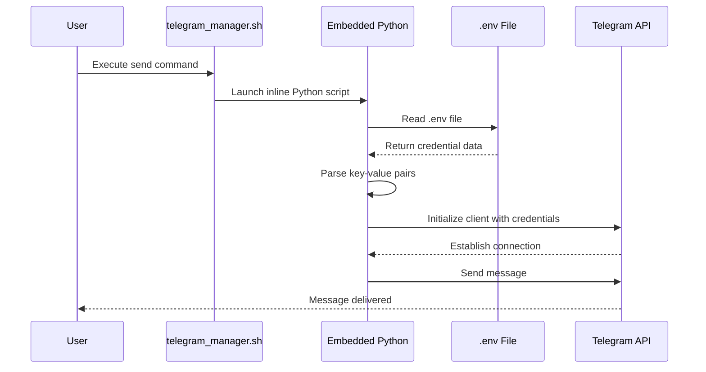

# Configuration and Environment Setup

<cite>
**Referenced Files in This Document**   
- [telegram_manager.sh](file://telegram_manager.sh)
- [.env](file://.env)
- [scripts/telegram_tools/core/telegram_fetch.py](file://scripts/telegram_tools/core/telegram_fetch.py)
</cite>

## Table of Contents
1. [Introduction](#introduction)
2. [Environment File Setup](#environment-file-setup)
3. [Credential Loading Mechanism](#credential-loading-mechanism)
4. [Script Directory Resolution](#script-directory-resolution)
5. [Generating Telegram API Credentials](#generating-telegram-api-credentials)
6. [Security Best Practices](#security-best-practices)
7. [Troubleshooting Common Issues](#troubleshooting-common-issues)

## Introduction
This document provides comprehensive guidance on configuring the FALLBACK_SCRIPTS tool, with a focus on setting up the required environment and authentication credentials for interacting with the Telegram API. It covers the creation and management of the `.env` file, explains how credentials are accessed by the `send` command, details the script's path resolution logic, and offers step-by-step instructions for generating necessary Telegram credentials. Additionally, it includes security recommendations and solutions to common setup problems.

## Environment File Setup
To configure the FALLBACK_SCRIPTS tool, a `.env` file must be created in the root directory of the project. This file stores essential credentials required for authenticating with the Telegram API. The following three variables must be defined:

- `TELEGRAM_API_ID`: A numeric identifier obtained from Telegram's API development portal
- `TELEGRAM_API_HASH`: A secret string key associated with your API ID
- `TELEGRAM_SESSION`: A string-based session token generated after successful login

Example `.env` file content:
```
TELEGRAM_API_ID=1234567
TELEGRAM_API_HASH="a1b2c3d4e5f6g7h8i9j0k1l2m3n4o5p6"
TELEGRAM_SESSION="1234567890abcdef1234567890abcdef1234567890abcdef"
```

The `.env` file should be placed in the same directory as `telegram_manager.sh`. It is critical that this file is not committed to version control systems due to its sensitive nature.

**Section sources**
- [telegram_manager.sh](file://telegram_manager.sh#L65-L75)

## Credential Loading Mechanism
The `send` command within `telegram_manager.sh` accesses credentials from the `.env` file through an embedded Python script. When the `send` subcommand is invoked, the script dynamically reads the `.env` file, parses key-value pairs, and loads them into a dictionary for use in establishing a Telegram client connection.

The process involves:
1. Constructing the path to the `.env` file using the resolved script directory
2. Opening and reading the file line by line
3. Filtering out comments and empty lines
4. Parsing valid `KEY=VALUE` entries
5. Stripping quotation marks from values
6. Using the parsed credentials to initialize a `TelegramClient` with `StringSession`

This mechanism ensures that credentials are securely loaded at runtime without hardcoding them into the script.



**Diagram sources**
- [telegram_manager.sh](file://telegram_manager.sh#L65-L109)

**Section sources**
- [telegram_manager.sh](file://telegram_manager.sh#L65-L109)
- [scripts/telegram_tools/core/telegram_fetch.py](file://scripts/telegram_tools/core/telegram_fetch.py#L15-L25)

## Script Directory Resolution
The `telegram_manager.sh` script employs a robust directory resolution mechanism to ensure correct path calculation regardless of the execution context. This is achieved using the `BASH_SOURCE` variable and `dirname`/`cd` commands to compute the absolute path of the script's location.

The key line responsible for this functionality is:
```bash
SCRIPT_DIR="$(cd "$(dirname "${BASH_SOURCE[0]}")" && pwd)"
```

This expression:
- Uses `${BASH_SOURCE[0]}` to get the script's filename
- Applies `dirname` to extract the directory portion
- Changes into that directory and uses `pwd` to resolve the full path
- Assigns the result to `SCRIPT_DIR` for reuse throughout the script

By anchoring all relative paths to `SCRIPT_DIR`, the script guarantees consistent behavior whether executed from its own directory or from any other location in the filesystem.

**Section sources**
- [telegram_manager.sh](file://telegram_manager.sh#L4)

## Generating Telegram API Credentials
To generate the required Telegram API credentials, follow these steps:

### Step 1: Obtain API ID and Hash
1. Visit [https://my.telegram.org](https://my.telegram.org) and log in with your phone number
2. Navigate to the "API development tools" section
3. Click "Create application"
4. Fill in the required fields (app name, short name, platform)
5. Submit the form
6. Record the displayed `api_id` and `api_hash` values
7. Add these to your `.env` file as `TELEGRAM_API_ID` and `TELEGRAM_API_HASH`

### Step 2: Generate Session String
1. Use a temporary Python script or the `telethon` interactive session generator
2. Initialize a `TelegramClient` with your API ID and hash
3. Run `client.start()` which will prompt for your phone number and login code
4. After successful authentication, call `client.session.save()` or print `StringSession.save(client.session)`
5. Copy the resulting string and store it as `TELEGRAM_SESSION` in your `.env` file

Alternatively, the first execution of any script that uses `TelegramClient` can generate the session interactively, after which the session string can be extracted and reused.

**Section sources**
- [telegram_manager.sh](file://telegram_manager.sh#L65-L109)
- [scripts/telegram_tools/core/telegram_fetch.py](file://scripts/telegram_tools/core/telegram_fetch.py#L20-L30)

## Security Best Practices
To protect your Telegram credentials and maintain system security:

- **File Permissions**: Set restrictive permissions on the `.env` file using `chmod 600 .env` to allow only the owner to read and write
- **Environment Isolation**: Avoid using these credentials in shared or public environments
- **Version Control**: Add `.env` to your `.gitignore` file to prevent accidental commits
- **Session Management**: Regularly regenerate session strings and invalidate old ones through Telegram's active sessions management
- **API Key Rotation**: Periodically recreate your API credentials and update them across all systems
- **Access Monitoring**: Regularly check your active Telegram sessions and terminate any unfamiliar ones

Storing credentials in a dedicated, restricted `.env` file rather than embedding them directly in scripts enhances both security and maintainability.

**Section sources**
- [.env](file://.env)
- [telegram_manager.sh](file://telegram_manager.sh#L65-L75)

## Troubleshooting Common Issues
This section addresses frequent setup issues and their resolutions.

### Missing .env File
**Symptom**: Error message indicating missing `TELEGRAM_API_ID` or file not found  
**Solution**: Verify that a `.env` file exists in the project root directory. Create it if missing and populate with valid credentials.

### Incorrect API Credentials
**Symptom**: Authentication failure, unauthorized access errors  
**Solution**: Double-check `TELEGRAM_API_ID` and `TELEGRAM_API_HASH` values from [my.telegram.org](https://my.telegram.org). Ensure no extra spaces or quotation marks are included.

### Session Invalidation
**Symptom**: Session timeout or invalid session errors  
**Solution**: Regenerate the session string by re-authenticating with Telegram. Terminate the old session via Telegram's active sessions interface.

### Path Resolution Failures
**Symptom**: Script fails to locate `.env` or core modules when run from different directories  
**Solution**: The `SCRIPT_DIR` resolution in `telegram_manager.sh` should handle this automatically. If issues persist, verify that symbolic links or unusual directory structures aren't interfering with path resolution.

### Permission Denied Errors
**Symptom**: Cannot read `.env` file despite its existence  
**Solution**: Check file permissions with `ls -l .env` and set appropriate permissions using `chmod 600 .env`.

**Section sources**
- [telegram_manager.sh](file://telegram_manager.sh#L65-L75)
- [tests/test_10_error_handling.sh](file://tests/test_10_error_handling.sh#L45-L50)