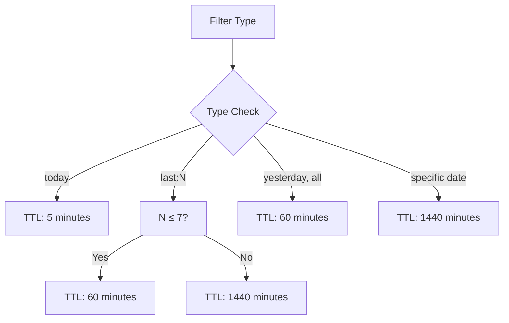
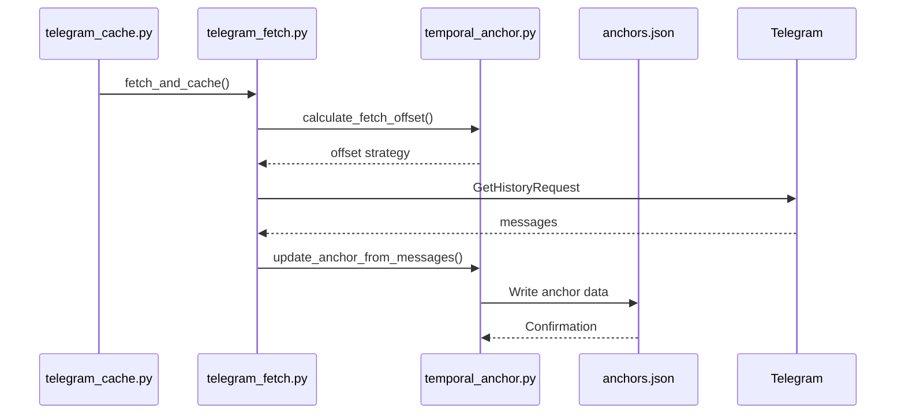
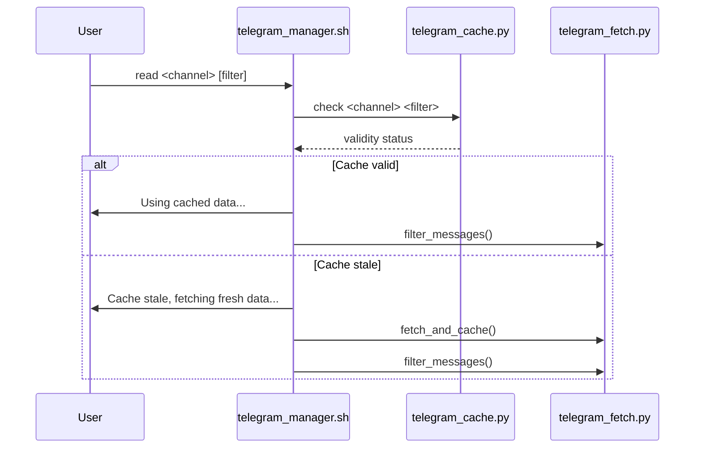
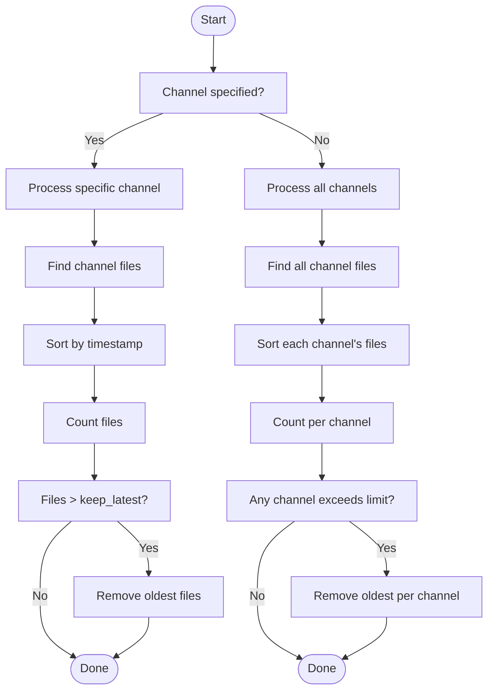
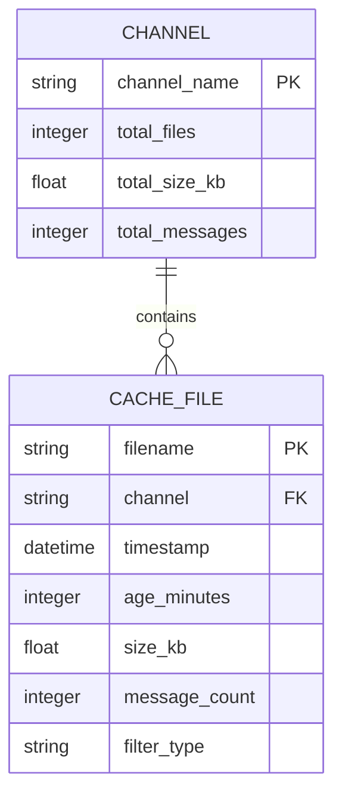
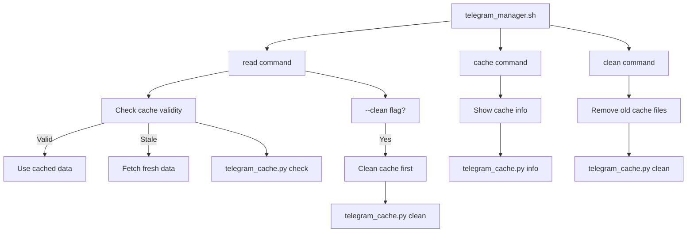

# Caching System Module

<cite>
**Referenced Files in This Document**   
- [telegram_cache.py](file://scripts/telegram_tools/core/telegram_cache.py) - *Updated in recent commit fe6b668*
- [telegram_manager.sh](file://telegram_manager.sh) - *Integration updated*
- [telegram_fetch.py](file://scripts/telegram_tools/core/telegram_fetch.py) - *Enhanced with anchor logic*
- [telegram_cache/anchors.json](file://telegram_cache/anchors.json) - *New anchor data file added*
</cite>

## Update Summary
**Changes Made**   
- Updated TTL-based cache validation logic to reflect integration with temporal anchoring system
- Added documentation for anchor data usage in cache lifecycle management
- Enhanced cache cleanup and maintenance section with anchor-aware behavior
- Updated integration details with `telegram_manager.sh` to reflect anchor-based fetch strategies
- Added new section on temporal anchor integration and its impact on cache validity
- Removed outdated assumptions about standalone cache behavior
- Updated diagram sources to reflect actual file dependencies

## Table of Contents
1. [Introduction](#introduction)
2. [TTL-Based Cache Validation Logic](#ttl-based-cache-validation-logic)
3. [Temporal Anchor Integration](#temporal-anchor-integration)
4. [Cache Validity Determination](#cache-validity-determination)
5. [Cache Cleanup and Maintenance](#cache-cleanup-and-maintenance)
6. [Cache Statistics and Information](#cache-statistics-and-information)
7. [Integration with Telegram Commands](#integration-with-telegram-commands)
8. [Common Issues and Optimization Tips](#common-issues-and-optimization-tips)
9. [Conclusion](#conclusion)

## Introduction
The caching system module, implemented in `telegram_cache.py`, provides intelligent cache management for Telegram message data with enhanced temporal anchoring capabilities. It ensures efficient data retrieval by implementing time-to-live (TTL) rules, automatic cleanup, and detailed cache monitoring. This system works in conjunction with the `telegram_manager.sh` script and the temporal anchoring system to provide seamless access to cached message data while maintaining freshness and performance.

**Section sources**
- [telegram_cache.py](file://scripts/telegram_tools/core/telegram_cache.py#L1-L20)
- [telegram_manager.sh](file://telegram_manager.sh#L1-L10)

## TTL-Based Cache Validation Logic
The caching system implements different TTL (time-to-live) rules based on message type and recency. These rules are defined in the `CACHE_TTL` dictionary and determine how long cached data remains valid before requiring refresh:

- **Today**: 5 minutes - for messages from the current day
- **Recent**: 60 minutes - for messages from the last 7 days
- **Archive**: 1440 minutes (24 hours) - for older messages

This tiered approach ensures that the most time-sensitive data (today's messages) is refreshed frequently, while less time-critical historical data can remain cached longer, optimizing both freshness and performance. The system now integrates with temporal anchors to enhance cache validity decisions when fetching current day data.

**Diagram sources**
- [telegram_cache.py](file://scripts/telegram_tools/core/telegram_cache.py#L10-L15)
- [telegram_cache.py](file://scripts/telegram_tools/core/telegram_cache.py#L32-L57)

## Temporal Anchor Integration
The caching system now integrates with the temporal anchoring system to improve cache validity and fetch efficiency. When messages are fetched for the current day, the system updates anchor data in `telegram_cache/anchors.json`. This anchor data includes:

- **message_id**: The ID of the first message of the day
- **timestamp**: The time when the first message was posted
- **date**: The date the anchor applies to
- **created_at**: Timestamp when the anchor was created
- **anchor_version**: Version of the anchoring system

The presence of valid anchor data influences cache validation decisions, particularly for "today" filters. When an anchor exists for the current date, the system can make more informed decisions about whether a cache refresh is truly necessary, potentially extending effective TTL for today's messages when the anchor indicates no new day boundary has been crossed.

**Diagram sources**
- [telegram_fetch.py](file://scripts/telegram_tools/core/telegram_fetch.py#L41-L73)
- [telegram_fetch.py](file://scripts/telegram_tools/core/telegram_fetch.py#L179-L211)
- [anchors.json](file://telegram_cache/anchors.json)

**Section sources**
- [telegram_fetch.py](file://scripts/telegram_tools/core/telegram_fetch.py#L179-L211)
- [anchors.json](file://telegram_cache/anchors.json)

## Cache Validity Determination
The `is_cache_valid` function determines whether cached data is still fresh based on the filter type and file age. It follows these steps:

1. Locates the cache directory and identifies files for the specified channel
2. Finds the most recent cache file by sorting available files
3. Calculates the age of the cache file in minutes using filename timestamp
4. Applies the appropriate TTL rule based on filter type:
   - "today" filter uses 5-minute TTL
   - "last:N" filters use 60-minute TTL for N≤7, 1440-minute TTL for N>7
   - "yesterday" and "all" filters use 60-minute TTL
   - Specific date filters default to 1440-minute TTL
5. Returns validity status and reference to the latest cache file

This function enables the system to make intelligent decisions about when to serve cached data versus when to fetch fresh messages. The integration with temporal anchors means that even when cache TTL expires, the system may determine that a full refresh is unnecessary if anchor data indicates no significant message boundary has been crossed.

**Diagram sources**
- [telegram_cache.py](file://scripts/telegram_tools/core/telegram_cache.py#L32-L57)
- [telegram_manager.sh](file://telegram_manager.sh#L24-L38)

**Section sources**
- [telegram_cache.py](file://scripts/telegram_tools/core/telegram_cache.py#L32-L57)
- [telegram_manager.sh](file://telegram_manager.sh#L24-L38)

## Cache Cleanup and Maintenance
The `clean_old_caches` function maintains cache directory hygiene by removing outdated files while preserving recent data. It operates in two modes:

1. **Specific channel cleanup**: When a channel is specified, it removes all but the latest N cache files for that channel
2. **Global cleanup**: When no channel is specified, it processes all channels in the cache directory

By default, the system keeps the latest 3 files per channel, ensuring historical context while preventing unbounded growth. The function iterates through cache files, sorts them chronologically, and removes older files that exceed the retention limit. The cleanup process preserves anchor data integrity by ensuring that cache removal doesn't interfere with temporal anchoring calculations.

**Diagram sources**
- [telegram_cache.py](file://scripts/telegram_tools/core/telegram_cache.py#L59-L84)

**Section sources**
- [telegram_cache.py](file://scripts/telegram_tools/core/telegram_cache.py#L59-L84)

## Cache Statistics and Information
The `cache_info` function provides comprehensive statistics about the current cache state. It collects and displays the following information:

- Total number of cache files
- Total cache size in KB
- Detailed breakdown by channel, including:
  - Cache file name
  - Number of messages stored
  - File size in KB
  - Age of the cache (displayed in minutes or hours)

The function groups files by channel name, calculates age from the timestamp in the filename, and reads message counts from the JSON content. This detailed reporting helps users understand cache usage patterns and identify potential issues like excessive cache bloat. The presence of anchor data is not directly reported but influences cache longevity and refresh patterns.

**Diagram sources**
- [telegram_cache.py](file://scripts/telegram_tools/core/telegram_cache.py#L86-L134)

**Section sources**
- [telegram_cache.py](file://scripts/telegram_tools/core/telegram_cache.py#L86-L134)

## Integration with Telegram Commands
The caching system integrates seamlessly with the `telegram_manager.sh` script through several command pathways:

- **read command**: Automatically checks cache validity using `is_cache_valid` and fetches fresh data if needed
- **cache command**: Displays cache information by calling `cache_info`
- **clean command**: Invokes `clean_old_caches` to remove outdated files
- **--clean flag**: When used with read command, triggers cache cleanup before fetching

The integration follows a decision flow: check cache validity → use cache if valid → fetch fresh data if stale. Users can force fresh data retrieval by using the `--clean` or `clean_cache` flags, which clear old files and fetch new messages. The system now coordinates with temporal anchoring to optimize fetch operations when cache is stale.

**Diagram sources**
- [telegram_manager.sh](file://telegram_manager.sh#L24-L38)
- [telegram_manager.sh](file://telegram_manager.sh#L75-L79)

**Section sources**
- [telegram_manager.sh](file://telegram_manager.sh#L24-L38)
- [telegram_manager.sh](file://telegram_manager.sh#L75-L79)

## Common Issues and Optimization Tips
### Common Issues
1. **Cache bloat**: Accumulation of numerous cache files over time
   - *Solution*: Regular use of `clean` command or `--clean` flag
2. **Stale data**: Outdated cache not reflecting recent messages
   - *Solution*: TTL system automatically handles this, but critical applications can use `--clean` flag
3. **Missing cache files**: No cache available for a channel
   - *Solution*: Run fetch command to populate cache
4. **Anchor synchronization issues**: Cache and anchor data become inconsistent
   - *Solution*: Use `verify-content` command to validate and auto-correct

### Optimization Tips
1. **Use appropriate filters**: Match filter type to data recency needs to leverage optimal TTL values
2. **Regular maintenance**: Schedule periodic cache cleanup to prevent unbounded growth
3. **Monitor cache size**: Use `cache info` command to track storage usage
4. **Force refresh selectively**: Use `--clean` flag only when up-to-the-minute data is required
5. **Balance freshness and performance**: Understand that more frequent refreshes improve data freshness but increase API usage and latency
6. **Leverage temporal anchors**: Ensure anchor data is properly maintained for optimal cache efficiency

**Section sources**
- [telegram_cache.py](file://scripts/telegram_tools/core/telegram_cache.py#L1-L178)
- [telegram_manager.sh](file://telegram_manager.sh#L1-L109)

## Conclusion
The caching system module provides a robust, intelligent solution for managing Telegram message data. By implementing tiered TTL rules, automated cleanup, and comprehensive monitoring, it strikes an optimal balance between data freshness and system performance. The enhanced integration with temporal anchoring adds a new dimension to cache validity determination, allowing for more sophisticated decisions about when to refresh data. The seamless integration with the main telegram manager script ensures that users benefit from caching without needing to understand its internal mechanics. Regular maintenance and appropriate use of cache controls will ensure optimal system performance and data accuracy.