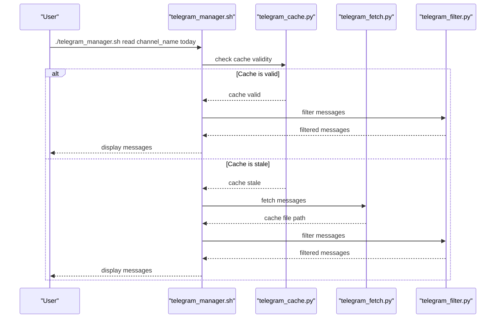
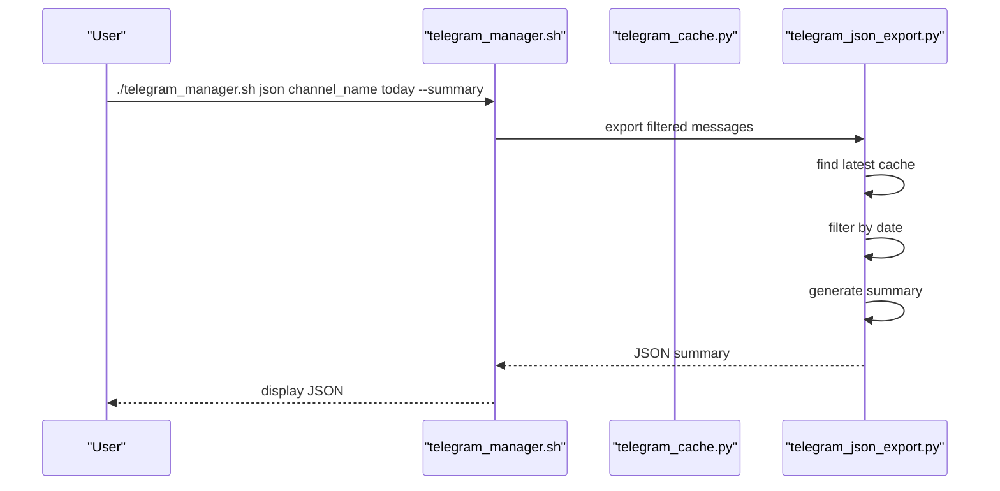

# Core Architecture and Component Interactions

<cite>
**Referenced Files in This Document**   
- [telegram_manager.sh](file://telegram_manager.sh) - *Updated in commit fe6b66826c60c2df4e9c5c05ff39cd70df425029*
- [scripts/telegram_tools/core/telegram_fetch.py](file://scripts/telegram_tools/core/telegram_fetch.py)
- [scripts/telegram_tools/core/telegram_cache.py](file://scripts/telegram_tools/core/telegram_cache.py)
- [scripts/telegram_tools/core/telegram_filter.py](file://scripts/telegram_tools/core/telegram_filter.py)
- [scripts/telegram_tools/core/telegram_json_export.py](file://scripts/telegram_tools/core/telegram_json_export.py)
</cite>

## Update Summary
**Changes Made**   
- Updated **Facade Pattern and Orchestration Layer** section to reflect performance refinements in `telegram_manager.sh`
- Enhanced **Core Module Responsibilities** with additional context on border detection and auto-fetching behavior
- Updated sequence diagrams to reflect current control flow with improved cache validation and fallback mechanisms
- Added details about new verification commands and AI analysis features visible in the updated help text
- Maintained consistency in architectural principles with emphasis on error resilience and maintainability

## Table of Contents
1. [Introduction](#introduction)
2. [Facade Pattern and Orchestration Layer](#facade-pattern-and-orchestration-layer)
3. [Core Module Responsibilities](#core-module-responsibilities)
4. [Data Flow and Execution Pipeline](#data-flow-and-execution-pipeline)
5. [Shell-Python Integration Mechanisms](#shell-python-integration-mechanisms)
6. [Sequence Diagrams for Key Operations](#sequence-diagrams-for-key-operations)
7. [Architectural Principles and Maintainability](#architectural-principles-and-maintainability)

## Introduction
The FALLBACK_SCRIPTS tool implements a modular architecture for interacting with Telegram channels through a combination of Bash and Python components. The system is designed around a facade pattern, where the `telegram_manager.sh` script serves as a unified interface for various Telegram operations, orchestrating specialized Python modules that each adhere to the single responsibility principle. This document details the core architecture, component interactions, and data flow patterns that enable efficient, maintainable Telegram message management.

## Facade Pattern and Orchestration Layer

The `telegram_manager.sh` script implements the facade design pattern by providing a simplified interface to a complex subsystem of Python modules. It abstracts the underlying complexity of Telegram API interactions, caching logic, message filtering, and data export into a set of intuitive commands. The script handles command-line argument parsing, working directory management, environment variable propagation, and execution flow control, delegating specific tasks to dedicated Python components.

The orchestration layer manages several key responsibilities:
- Command routing based on user input
- Parameter validation and default value assignment
- Working directory switching to ensure proper module resolution
- Cache lifecycle management with conditional execution
- Error handling and user feedback

This facade approach enables users to perform complex operations with simple commands while maintaining separation between interface logic and implementation details.

**Section sources**
- [telegram_manager.sh](file://telegram_manager.sh#L1-L305) - *Updated in commit fe6b66826c60c2df4e9c5c05ff39cd70df425029*

## Core Module Responsibilities

### telegram_fetch.py - API Message Retrieval
The `telegram_fetch.py` module is responsible for retrieving messages from Telegram channels via the Telethon API. It establishes authenticated connections using credentials from the `.env` file, fetches message history with full metadata, converts timestamps to Moscow time (UTC+3), and saves the structured data to JSON cache files. The module handles media detection and formatting, ensuring rich message content is preserved in the cache. It also supports temporal anchoring to optimize fetch offsets and can automatically download media files when requested.

**Section sources**
- [scripts/telegram_tools/core/telegram_fetch.py](file://scripts/telegram_tools/core/telegram_fetch.py#L1-L234)

### telegram_cache.py - TTL-Based Cache Management
The `telegram_cache.py` module implements intelligent cache management with time-to-live (TTL) rules tailored to different filtering contexts. It defines different expiration policies for various data access patterns: 5 minutes for today's messages, 60 minutes for recent messages (last 7 days), and 1440 minutes (24 hours) for archival data. The module provides functionality to check cache validity, clean outdated files, and display cache statistics, ensuring optimal balance between freshness and performance.

**Section sources**
- [scripts/telegram_tools/core/telegram_cache.py](file://scripts/telegram_tools/core/telegram_cache.py#L1-L179)

### telegram_filter.py - Message Filtering with Border Detection
The `telegram_filter.py` module performs efficient filtering of cached messages based on date, pattern, or range criteria. It implements sophisticated border detection logic to ensure accurate message boundaries when filtering by date, automatically fetching additional messages when insufficient context exists for reliable border validation. The module includes fallback mechanisms that trigger additional data retrieval to maintain data integrity, particularly important for timezone-aware processing and accurate first-message detection. When fewer than 3 previous messages are available for validation, it auto-fetches up to 500 messages to ensure proper context.

**Section sources**
- [scripts/telegram_tools/core/telegram_filter.py](file://scripts/telegram_tools/core/telegram_filter.py#L1-L239)

### telegram_json_export.py - Structured Data Export
The `telegram_json_export.py` module provides raw JSON export capabilities for analysis and verification purposes. It supports two output modes: summary and full export. The summary mode returns metadata about the message range including first and last messages with their timestamps, while the full mode exports complete message data. This module enables integration with external tools and facilitates debugging by providing access to the underlying structured data.

**Section sources**
- [scripts/telegram_tools/core/telegram_json_export.py](file://scripts/telegram_tools/core/telegram_json_export.py#L1-L125)

## Data Flow and Execution Pipeline

The data flow in the FALLBACK_SCRIPTS tool follows a consistent pipeline from user command to output generation. When a user invokes a command, the `telegram_manager.sh` script parses the arguments and determines the appropriate execution path. For read operations, the system first checks cache validity using `telegram_cache.py`, then conditionally executes `telegram_fetch.py` to refresh data if needed, and finally passes the data to `telegram_filter.py` for processing and display.

The pipeline ensures that expensive API calls are minimized through intelligent caching while maintaining data freshness according to context-specific TTL rules. Each module operates on a well-defined input-output contract, with JSON serving as the primary data interchange format. The working directory is consistently managed to ensure proper module resolution and file path resolution across the system.

## Shell-Python Integration Mechanisms

The architecture employs several integration mechanisms between the Bash orchestration layer and Python implementation modules:

### Environment Variable Propagation
Credentials and configuration are shared between layers through a unified `.env` file that both Bash and Python components can access. The Python modules locate this file relative to their script directory, ensuring consistent configuration resolution regardless of execution context.

### Working Directory Management
The `telegram_manager.sh` script uses `cd` commands to switch to the appropriate directory before invoking Python modules, ensuring that relative imports and file paths resolve correctly. This approach maintains module independence while enabling centralized execution control.

### Parameter Passing and Argument Handling
Command-line arguments are passed directly from Bash to Python scripts using standard positional parameters. The Python modules implement robust argument parsing with helpful usage messages, creating a seamless user experience across the shell-Python boundary.

### Error Handling and Status Propagation
The system uses standard exit codes and error streams to communicate failure conditions between layers. Python modules exit with non-zero status on errors, which the Bash script detects and handles appropriately, ensuring consistent error reporting to the end user.

## Sequence Diagrams for Key Operations

**Diagram sources**
- [telegram_manager.sh](file://telegram_manager.sh#L1-L305)
- [scripts/telegram_tools/core/telegram_cache.py](file://scripts/telegram_tools/core/telegram_cache.py#L1-L179)
- [scripts/telegram_tools/core/telegram_fetch.py](file://scripts/telegram_tools/core/telegram_fetch.py#L1-L234)
- [scripts/telegram_tools/core/telegram_filter.py](file://scripts/telegram_tools/core/telegram_filter.py#L1-L239)

**Diagram sources**
- [telegram_manager.sh](file://telegram_manager.sh#L1-L305)
- [scripts/telegram_tools/core/telegram_json_export.py](file://scripts/telegram_tools/core/telegram_json_export.py#L1-L125)

## Architectural Principles and Maintainability

The FALLBACK_SCRIPTS architecture exemplifies several key software engineering principles that enhance maintainability:

### Separation of Concerns
Each component has a clearly defined responsibility: the Bash script handles orchestration, while Python modules manage specific aspects of Telegram interaction. This separation allows independent development and testing of each component.

### Single Responsibility Principle
Each Python module focuses on one primary function: fetching, caching, filtering, or exporting. This modularity makes the codebase easier to understand, test, and modify without unintended side effects.

### Loose Coupling
Components interact through well-defined interfaces (command-line arguments and JSON files) rather than direct code dependencies. This loose coupling enables replacement or modification of individual components without affecting the entire system.

### Extensibility
The facade pattern and modular design make it straightforward to add new commands or modify existing functionality. New features can be implemented as additional Python modules and integrated through the central manager script.

### Error Resilience
The architecture includes multiple safeguards, including automatic cache validation, fallback border detection with auto-fetching, and comprehensive error handling at both shell and Python levels, ensuring robust operation in various conditions.

**Section sources**
- [telegram_manager.sh](file://telegram_manager.sh#L1-L305)
- [scripts/telegram_tools/core/telegram_fetch.py](file://scripts/telegram_tools/core/telegram_fetch.py#L1-L234)
- [scripts/telegram_tools/core/telegram_cache.py](file://scripts/telegram_tools/core/telegram_cache.py#L1-L179)
- [scripts/telegram_tools/core/telegram_filter.py](file://scripts/telegram_tools/core/telegram_filter.py#L1-L239)
- [scripts/telegram_tools/core/telegram_json_export.py](file://scripts/telegram_tools/core/telegram_json_export.py#L1-L125)