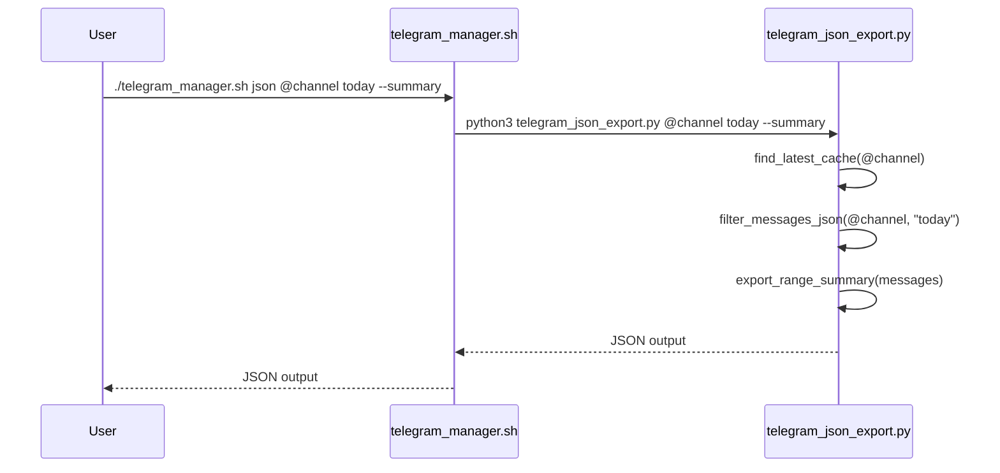

# JSON Export Module

<cite>
**Referenced Files in This Document**   
- [telegram_json_export.py](file://scripts/telegram_tools/core/telegram_json_export.py)
- [telegram_manager.sh](file://telegram_manager.sh)
</cite>

## Table of Contents
1. [Introduction](#introduction)
2. [Core Functions](#core-functions)
3. [Output Modes](#output-modes)
4. [Integration with telegram_manager.sh](#integration-with-telegram_manager.sh)
5. [Usage Examples](#usage-examples)
6. [External Tool Integration](#external-tool-integration)
7. [Common Issues and Troubleshooting](#common-issues-and-troubleshooting)
8. [Conclusion](#conclusion)

## Introduction
The JSON Export Module provides a mechanism to extract raw message data from cached Telegram channels in structured JSON format. It enables both detailed analysis and quick verification of message ranges through two distinct output modes. The module integrates with the broader Telegram management system and supports various filtering options based on date and time ranges.

**Section sources**
- [telegram_json_export.py](file://scripts/telegram_tools/core/telegram_json_export.py#L1-L25)

## Core Functions

### filter_messages_json Function
The `filter_messages_json` function applies date-based filtering logic to cached messages, returning raw JSON data that matches the specified criteria. It supports multiple filter types:
- **today**: Messages from the current day
- **yesterday**: Messages from the previous day
- **last:N**: Messages from the last N days
- **YYYY-MM-DD**: Messages from a specific date
- **all**: All cached messages

This function retrieves the latest cache file for the specified channel and filters messages by comparing their `date_msk` field against the requested time range. The filtering logic mirrors that used in other modules, ensuring consistency across the system.

**Section sources**
- [telegram_json_export.py](file://scripts/telegram_tools/core/telegram_json_export.py#L19-L64)

### export_range_summary Function
The `export_range_summary` function generates a concise summary of a message collection, including metadata about the temporal span and key messages. When provided with a list of messages, it returns:
- Total message count
- First message (chronologically earliest)
- Last message (chronologically latest)
- Time range with start and end timestamps

Since messages are stored in reverse chronological order, the function sorts them chronologically to accurately identify the first and last messages. This summary is particularly useful for verifying data integrity and understanding message distribution over time.

**Section sources**
- [telegram_json_export.py](file://scripts/telegram_tools/core/telegram_json_export.py#L54-L64)

## Output Modes
The module supports two output modes controlled by command-line arguments:

### --summary Mode (Default)
Produces a compact JSON object containing only the range summary. This mode is ideal for:
- Quick verification of message availability
- Monitoring message activity patterns
- Integration with status dashboards
- Automated validation scripts

### --full Mode
Exports complete message data with metadata in a structured format:
- **meta**: Channel identifier, filter criteria, export timestamp, and message count
- **messages**: Array of all filtered message objects in their raw JSON form

This mode is suitable for:
- In-depth data analysis
- Exporting data for external processing
- Archival purposes
- Debugging message content and structure

**Section sources**
- [telegram_json_export.py](file://scripts/telegram_tools/core/telegram_json_export.py#L97-L124)

## Integration with telegram_manager.sh
The JSON export functionality is accessible through the `json` command in `telegram_manager.sh`. This integration allows users to export data using a simplified interface without directly invoking Python scripts.

The shell script routes the `json` command to the `telegram_json_export.py` module, passing through the channel, filter, and output mode parameters. This abstraction provides a consistent user experience across all Telegram management operations.



**Diagram sources**
- [telegram_manager.sh](file://telegram_manager.sh#L65-L109)
- [telegram_json_export.py](file://scripts/telegram_tools/core/telegram_json_export.py#L1-L124)

**Section sources**
- [telegram_manager.sh](file://telegram_manager.sh#L65-L109)

## Usage Examples
Common usage patterns include:

**Basic summary export:**
```bash
python telegram_json_export.py @aiclubsweggs today --summary
```

**Complete data export:**
```bash
python telegram_json_export.py @aiclubsweggs last:7 --full
```

**Using the integrated shell command:**
```bash
./telegram_manager.sh json @aiclubsweggs yesterday --summary
```

These commands support automation and can be incorporated into larger data processing pipelines.

**Section sources**
- [telegram_json_export.py](file://scripts/telegram_tools/core/telegram_json_export.py#L70-L95)

## External Tool Integration
The exported JSON can be processed by various external tools:

**With jq for data extraction:**
```bash
./telegram_manager.sh json @channel today --full | jq '.messages[] | {id, date_msk, sender, text}'
```

**For CSV conversion:**
```bash
./telegram_manager.sh json @channel all --full | python3 -c "import sys, json, csv; data=json.load(sys.stdin); writer=csv.writer(sys.stdout); writer.writerow(['id','date','sender','text']); [writer.writerow([m['id'],m['date_msk'],m['sender'],m['text']]) for m in data['messages']]"
```

**Data analysis with Python:**
```python
import json, sys
data = json.load(sys.stdin)
print(f"Average messages per hour: {len(data['messages']) / 24:.2f}")
```

The structured output enables seamless integration with data analysis frameworks, visualization tools, and custom processing scripts.

## Common Issues and Troubleshooting

### Empty Exports
Empty results typically occur when:
- No cache exists for the channel (run `fetch` first)
- No messages match the filter criteria
- Cache is outdated or corrupted

Solution: Refresh the cache using `./telegram_manager.sh fetch <channel>` before exporting.

### Malformed JSON
JSON parsing errors may result from:
- Interrupted export process
- Corrupted cache files
- System resource limitations

Prevention: Always validate JSON output with tools like `jq` or online validators when processing programmatically.

### Cache Location Issues
The module expects cache files in the `telegram_cache` directory relative to the script location. Ensure this directory exists and contains properly formatted JSON cache files.

**Section sources**
- [telegram_json_export.py](file://scripts/telegram_tools/core/telegram_json_export.py#L27-L45)
- [telegram_json_export.py](file://scripts/telegram_tools/core/telegram_json_export.py#L110-L124)

## Conclusion
The JSON Export Module provides essential functionality for extracting and analyzing Telegram message data in structured format. Its dual output modes cater to both quick verification needs and comprehensive data analysis requirements. The seamless integration with `telegram_manager.sh` makes it accessible through a consistent interface, while the raw JSON output enables powerful integration with external tools and processing pipelines. Understanding the filtering logic and output structure is key to effectively utilizing this module for data analysis and system verification tasks.