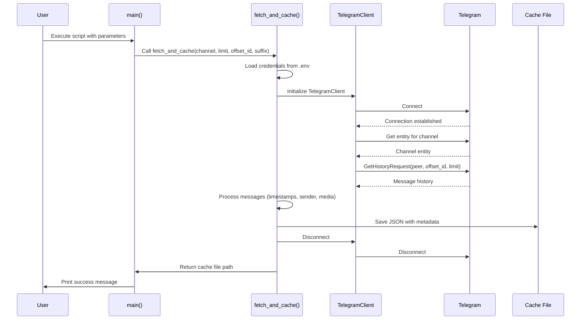
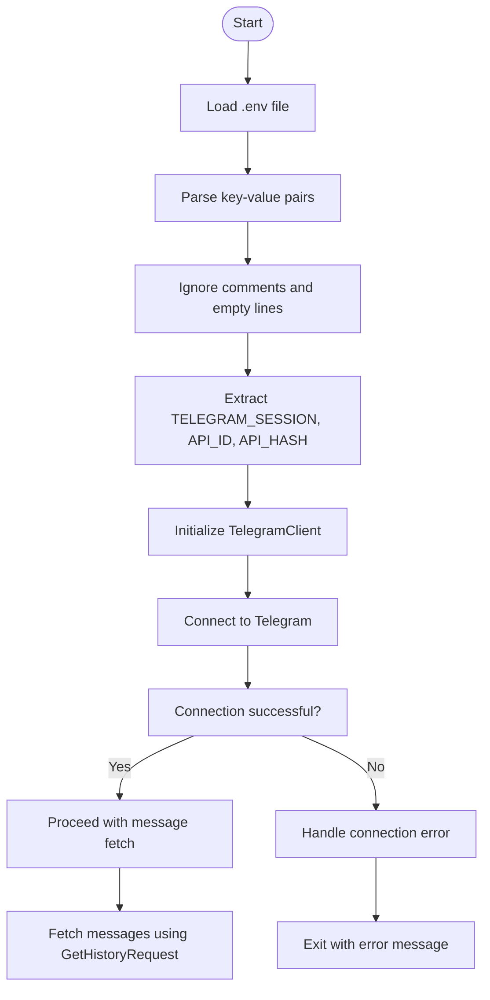
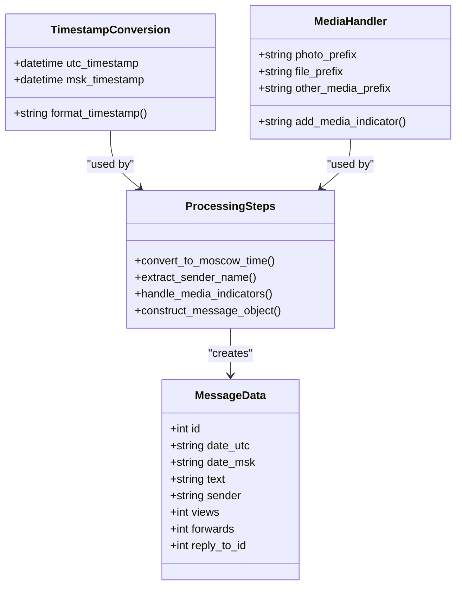
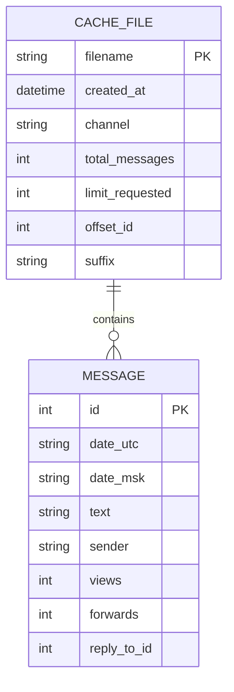
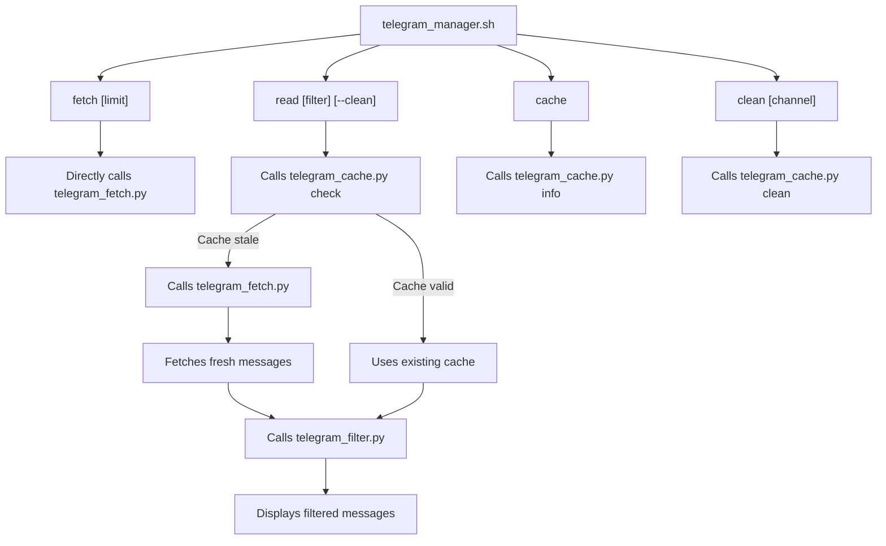

# Message Fetching Module

<cite>
**Referenced Files in This Document**   
- [telegram_fetch.py](file://scripts/telegram_tools/core/telegram_fetch.py)
- [telegram_manager.sh](file://telegram_manager.sh)
- [telegram_cache.py](file://scripts/telegram_tools/core/telegram_cache.py)
- [telegram_filter.py](file://scripts/telegram_tools/core/telegram_filter.py)
</cite>

## Table of Contents
1. [Introduction](#introduction)
2. [Core Functionality](#core-functionality)
3. [API Authentication and Credentials](#api-authentication-and-credentials)
4. [Message Data Processing](#message-data-processing)
5. [Caching Mechanism](#caching-mechanism)
6. [Direct Module Usage](#direct-module-usage)
7. [Integration with telegram_manager.sh](#integration-with-telegram_managersh)
8. [Error Handling Strategy](#error-handling-strategy)
9. [Troubleshooting Guide](#troubleshooting-guide)

## Introduction
The `telegram_fetch.py` module is a lightweight Python script designed to retrieve messages from Telegram channels using the Telethon library. It implements a simple yet effective caching system that stores message data in structured JSON format with comprehensive metadata. The module supports flexible parameters for message retrieval, including limits, offsets, and custom suffixes for cache files. This document provides a detailed analysis of its implementation, focusing on the `fetch_and_cache` function, data processing pipeline, caching strategy, and integration with the broader system.

**Section sources**
- [telegram_fetch.py](file://scripts/telegram_tools/core/telegram_fetch.py#L1-L146)

## Core Functionality
The core functionality of the module is implemented in the `fetch_and_cache` asynchronous function, which orchestrates the entire message retrieval and caching process. This function accepts four parameters: `channel`, `limit`, `offset_id`, and `suffix`. It uses Telethon's `GetHistoryRequest` to fetch messages from the specified Telegram channel, processes the raw message data into a structured format, and saves it to a JSON cache file with metadata.

The function begins by loading API credentials from a `.env` file located in the project root directory. It then establishes a connection to Telegram using the Telethon client, retrieves the entity for the specified channel, and executes the `GetHistoryRequest` with the provided parameters. After retrieving the messages, it processes each message to extract relevant information, including sender details, timestamps in both UTC and Moscow time, and media indicators. Finally, it saves the processed data to a cache file and disconnects from the Telegram client.

**Diagram sources**
- [telegram_fetch.py](file://scripts/telegram_tools/core/telegram_fetch.py#L25-L146)

**Section sources**
- [telegram_fetch.py](file://scripts/telegram_tools/core/telegram_fetch.py#L25-L146)

## API Authentication and Credentials
The module handles API authentication by loading credentials from a unified `.env` file located in the project root directory. This file contains three essential pieces of information: `TELEGRAM_SESSION`, `TELEGRAM_API_ID`, and `TELEGRAM_API_HASH`. The script reads this file line by line, parsing key-value pairs while ignoring comments and empty lines. The `TELEGRAM_SESSION` is used to initialize a `StringSession` object, which maintains the user's session state across executions, eliminating the need for repeated authentication.

The authentication process uses Telethon's `TelegramClient` class, which requires the session object, API ID (as an integer), and API hash (as a string) to establish a connection. If the Telethon library is not installed, the script provides a clear error message with installation instructions. This approach centralizes credential management and enhances security by keeping sensitive information out of the source code.

**Diagram sources**
- [telegram_fetch.py](file://scripts/telegram_tools/core/telegram_fetch.py#L35-L45)

**Section sources**
- [telegram_fetch.py](file://scripts/telegram_tools/core/telegram_fetch.py#L35-L45)

## Message Data Processing
The module processes raw message data from Telegram into a structured format that includes both UTC and Moscow timestamps, sender information, and media indicators. For each message retrieved via `GetHistoryRequest`, the script extracts and transforms various attributes to create a comprehensive representation of the message.

Timestamp conversion is a key aspect of data processing. The script converts the message's UTC timestamp to Moscow time (UTC+3) using the `pytz` library. This ensures that users in the Moscow timezone can easily interpret message times without manual conversion. The converted timestamp is formatted as "YYYY-MM-DD HH:MM:SS" for readability and consistency.

Sender information is extracted from the message object, with special handling for cases where the sender's first or last name might be missing. The script constructs a full sender name when both first and last names are available, defaulting to "Unknown" if no sender information is present.

Media content is indicated through text prefixes that visually represent different media types. Photos are marked with "📷 [Photo]", documents with "📎 [File]", and other media types with "📦 [Media]". These indicators are prepended to the message text, providing immediate visual feedback about message content without requiring users to open attachments.

**Diagram sources**
- [telegram_fetch.py](file://scripts/telegram_tools/core/telegram_fetch.py#L75-L120)

**Section sources**
- [telegram_fetch.py](file://scripts/telegram_tools/core/telegram_fetch.py#L75-L120)

## Caching Mechanism
The caching mechanism implemented in `telegram_fetch.py` saves messages in structured JSON format with comprehensive metadata. Cache files are stored in a dedicated `telegram_cache` directory located in the project root. The directory is created automatically if it doesn't exist, ensuring the caching system works out of the box without manual setup.

Cache filenames follow a consistent naming convention: `{channel}_{timestamp}{suffix}.json`. The channel name is cleaned by removing "@" symbols and replacing "/" with underscores. The timestamp is formatted as "YYYYMMDD_HHMMSS" to provide chronological sorting. An optional suffix can be added to differentiate between different fetch operations for the same channel.

The JSON structure includes two main sections: `meta` and `messages`. The meta section contains metadata about the fetch operation, including the channel name, cache timestamp, total message count, requested limit, offset ID, and suffix. The messages section contains an array of processed message objects, each with standardized fields for ID, timestamps, text content, sender information, and engagement metrics.

This caching approach enables efficient data retrieval for downstream processing by other modules like `telegram_filter.py` and supports cache validation through `telegram_cache.py`. The structured format ensures consistency across different fetch operations and facilitates automated processing.

**Diagram sources**
- [telegram_fetch.py](file://scripts/telegram_tools/core/telegram_fetch.py#L122-L140)

**Section sources**
- [telegram_fetch.py](file://scripts/telegram_tools/core/telegram_fetch.py#L122-L140)

## Direct Module Usage
The `telegram_fetch.py` module can be called directly from the command line with various parameters to customize message retrieval. The main function provides a simple interface that parses command-line arguments and invokes the `fetch_and_cache` function with the appropriate parameters.

To use the module directly, execute the script with Python 3 followed by the required and optional parameters. The basic usage pattern is: `python telegram_fetch.py <channel> [limit] [offset_id] [suffix]`. The channel parameter is required and can be specified with or without the "@" prefix. The limit parameter controls the number of messages to retrieve (default: 100). The offset_id parameter allows pagination by specifying the message ID to start from. The suffix parameter adds a custom identifier to the cache filename.

Example usage:
- `python telegram_fetch.py aiclubsweggs` - Fetch 100 messages from the aiclubsweggs channel
- `python telegram_fetch.py @aiclubsweggs 50` - Fetch 50 messages from the aiclubsweggs channel
- `python telegram_fetch.py aiclubsweggs 100 72857 older` - Fetch 100 messages starting from message ID 72857 with "older" suffix
- `python telegram_fetch.py @aiclubsweggs 200 0 recent` - Fetch 200 most recent messages with "recent" suffix

The script provides helpful usage information when executed without parameters or with incorrect arguments, making it accessible to users who may not be familiar with its interface.

**Section sources**
- [telegram_fetch.py](file://scripts/telegram_tools/core/telegram_fetch.py#L142-L146)

## Integration with telegram_manager.sh
The `telegram_fetch.py` module is tightly integrated with the `telegram_manager.sh` script, which serves as the primary interface for interacting with Telegram functionality. The shell script provides a higher-level abstraction that simplifies common operations and orchestrates the interaction between different Python modules.

When the `fetch` command is invoked in `telegram_manager.sh`, it directly calls `telegram_fetch.py` with the specified channel and limit parameters. For the `read` command, the script first checks cache validity using `telegram_cache.py`. If the cache is stale or the `--clean` flag is specified, it automatically triggers `telegram_fetch.py` to retrieve fresh messages before passing control to `telegram_filter.py` for display.

This integration creates a seamless workflow where users can retrieve and view messages with a single command, while the system handles cache management transparently. The shell script also provides additional commands like `cache` to display cache information and `clean` to remove old cache files, creating a comprehensive management interface for Telegram interactions.

**Diagram sources**
- [telegram_manager.sh](file://telegram_manager.sh#L25-L63)
- [telegram_fetch.py](file://scripts/telegram_tools/core/telegram_fetch.py#L142-L146)

**Section sources**
- [telegram_manager.sh](file://telegram_manager.sh#L25-L63)
- [telegram_fetch.py](file://scripts/telegram_tools/core/telegram_fetch.py#L142-L146)

## Error Handling Strategy
The module implements a robust error handling strategy that provides clear feedback to users while maintaining system stability. In the main function, all calls to `fetch_and_cache` are wrapped in a try-except block that catches any exceptions that may occur during execution.

When an error occurs, the script prints an error message to stderr with a red "❌" emoji for visual indication, followed by the exception message. It then exits with a non-zero status code (1), signaling failure to the calling process. This approach ensures that errors are not silently ignored and provides actionable information for troubleshooting.

The script also includes proactive error prevention through input validation. It checks for the presence of required command-line arguments and provides helpful usage information when parameters are missing or incorrect. Additionally, it handles the case where the Telethon library is not installed by providing a clear error message with installation instructions.

For credential-related issues, the error handling is delegated to the Telethon library, which will raise appropriate exceptions if authentication fails. These exceptions are caught by the main try-except block and reported to the user, enabling them to verify their credentials in the `.env` file.

**Section sources**
- [telegram_fetch.py](file://scripts/telegram_tools/core/telegram_fetch.py#L142-L146)

## Troubleshooting Guide
This section addresses common issues that may occur when using the message fetching module and provides practical solutions.

**API Connection Failures**
If you encounter connection errors, verify the following:
- Ensure the Telethon library is installed: `pip install telethon`
- Check that the `.env` file exists in the project root directory
- Verify that the `.env` file contains valid `TELEGRAM_API_ID`, `TELEGRAM_API_HASH`, and `TELEGRAM_SESSION` values
- Confirm that your internet connection is stable

**Authentication Issues**
Authentication problems typically stem from invalid credentials:
- Regenerate your API credentials on the Telegram API development page
- Re-authenticate with Telegram to generate a new session string
- Ensure the `TELEGRAM_SESSION` value is properly quoted in the `.env` file
- Check that the `TELEGRAM_API_ID` is an integer value

**Channel Access Problems**
If you cannot access a specific channel:
- Verify that you are a member of the channel (private channels require membership)
- Check that the channel username is correct and properly formatted
- Ensure you have the necessary permissions to view messages in the channel
- Try accessing the channel through the Telegram app to confirm accessibility

**Cache-Related Issues**
For problems with caching:
- Verify that the `telegram_cache` directory has write permissions
- Check that there is sufficient disk space available
- Manually delete corrupted cache files if JSON parsing errors occur
- Use the `clean` command in `telegram_manager.sh` to remove old cache files

**Environment Configuration**
Ensure your environment is properly configured:
- The `.env` file should be located in the project root directory
- Each credential should be on a separate line in the format `KEY=VALUE`
- Values containing spaces or special characters should be enclosed in quotes
- The file should not contain BOM (Byte Order Mark) characters

**Section sources**
- [telegram_fetch.py](file://scripts/telegram_tools/core/telegram_fetch.py#L35-L45)
- [telegram_manager.sh](file://telegram_manager.sh#L0-L23)