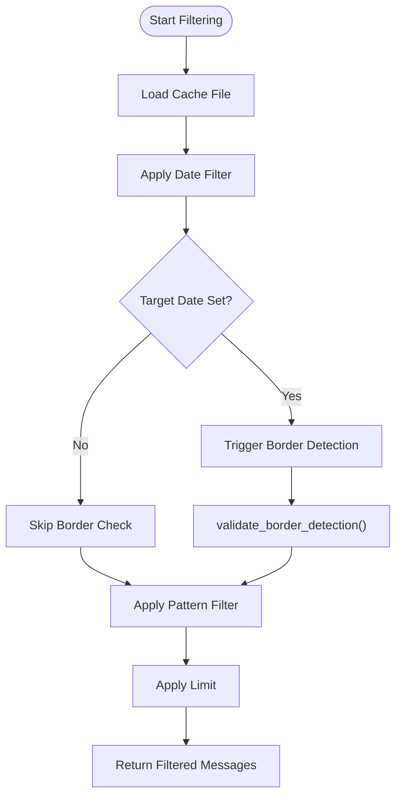
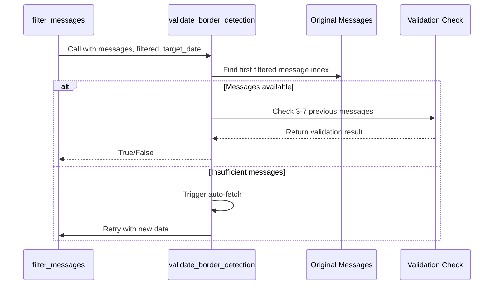
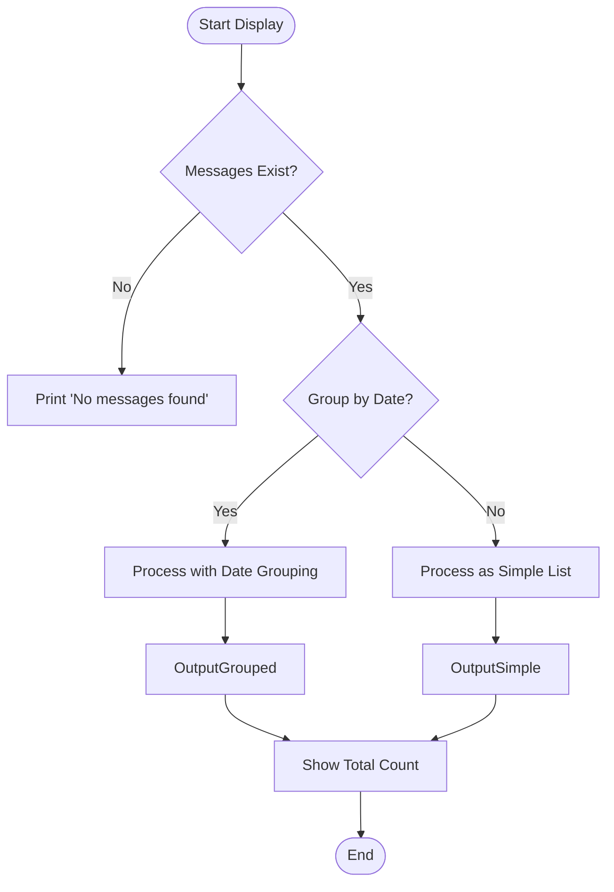

# Message Filtering Module

<cite>
**Referenced Files in This Document**   
- [telegram_filter.py](file://scripts/telegram_tools/core/telegram_filter.py)
- [telegram_fetch.py](file://scripts/telegram_tools/core/telegram_fetch.py)
- [test_first_message_border_detection.sh](file://tests/test_first_message_border_detection.sh)
- [test_05_date_today.sh](file://tests/test_05_date_today.sh)
</cite>

## Table of Contents
1. [Introduction](#introduction)
2. [Core Filtering Functionality](#core-filtering-functionality)
3. [Border Detection System](#border-detection-system)
4. [Auto-Fetching Mechanism](#auto-fetching-mechanism)
5. [Message Display and Formatting](#message-display-and-formatting)
6. [Integration with Read Command](#integration-with-read-command)
7. [Troubleshooting Common Issues](#troubleshooting-common-issues)
8. [Conclusion](#conclusion)

## Introduction
The message filtering module provides a robust mechanism for retrieving and processing Telegram messages based on date, pattern, and range criteria. Built around the `telegram_filter.py` script, this system enables users to efficiently extract relevant messages from cached JSON data. The module supports various filtering modes including today, yesterday, last:N days, specific dates, and regex-based pattern matching. It incorporates advanced validation techniques to ensure accurate date-based filtering through a sophisticated border detection system.

**Section sources**
- [telegram_filter.py](file://scripts/telegram_tools/core/telegram_filter.py#L1-L20)

## Core Filtering Functionality

The `filter_messages` function serves as the primary interface for message retrieval and filtering. It supports multiple filter types:

- **today**: Retrieves messages from the current day using Moscow time
- **yesterday**: Retrieves messages from the previous day
- **last:N**: Retrieves messages from the last N days
- **YYYY-MM-DD**: Retrieves messages from a specific date
- **all**: Returns all cached messages

Pattern-based filtering is implemented using Python's `re` module, enabling case-insensitive regex matching against message text. The function also supports result limiting through the `limit` parameter.

The filtering process follows a sequential pipeline: date filtering → border validation → pattern matching → result limiting. This ensures that computationally expensive operations like regex matching are performed only on already date-filtered subsets.



**Diagram sources**
- [telegram_filter.py](file://scripts/telegram_tools/core/telegram_filter.py#L122-L173)

**Section sources**
- [telegram_filter.py](file://scripts/telegram_tools/core/telegram_filter.py#L122-L173)

## Border Detection System

The `validate_border_detection` function implements a critical validation mechanism that ensures accurate date-based filtering by examining messages preceding the first match. This system addresses the challenge of correctly identifying the boundary between different calendar days in message streams.

The algorithm works as follows:
1. Identifies the first message in the filtered results (which appears last due to reverse chronological ordering)
2. Locates this message in the original message list to determine its position
3. Examines 3-7 messages immediately preceding the first filtered message
4. Verifies that none of these preceding messages share the target date

This approach prevents false positives where messages from the target date might appear earlier in the stream than expected. The system logs detailed validation steps, making it easier to diagnose filtering issues.



**Diagram sources**
- [telegram_filter.py](file://scripts/telegram_tools/core/telegram_filter.py#L20-L120)

**Section sources**
- [telegram_filter.py](file://scripts/telegram_tools/core/telegram_filter.py#L20-L120)

## Auto-Fetching Mechanism

When the border detection system encounters insufficient message data for proper validation, it triggers an auto-fetching mechanism to retrieve additional messages. This self-correcting feature enhances filtering accuracy by ensuring adequate context for border validation.

The auto-fetch process:
1. Detects when fewer than 3 preceding messages are available
2. Calculates the required number of additional messages
3. Invokes `telegram_fetch.py` with an increased limit (minimum 500 messages)
4. Reloads the updated cache file
5. Retries the border validation with the expanded dataset

This mechanism specifically addresses edge cases where cached data is limited, such as when users have recently cleared their cache or are working with channels that have low message volume. The auto-fetch uses Moscow timezone-aware timestamps to maintain consistency across operations.

**Section sources**
- [telegram_filter.py](file://scripts/telegram_tools/core/telegram_filter.py#L45-L100)
- [telegram_fetch.py](file://scripts/telegram_tools/core/telegram_fetch.py#L1-L147)

## Message Display and Formatting

The `display_messages` function provides formatted output of filtered results with optional date grouping. When `group_by_date=True`, messages are organized by calendar day with weekday labels and time-stamped entries.

Key display features:
- Date headers with weekday names (e.g., "==== 2025-09-15 (Monday) ====")
- Time-stamped message entries showing sender and content
- Metadata display for message views and reply relationships
- Summary statistics showing total message count
- Empty state handling with appropriate messaging

The function maintains reverse chronological order (newest first) and supports both grouped and flat output formats based on the `group_by_date` parameter.



**Diagram sources**
- [telegram_filter.py](file://scripts/telegram_tools/core/telegram_filter.py#L175-L205)

**Section sources**
- [telegram_filter.py](file://scripts/telegram_tools/core/telegram_filter.py#L175-L205)

## Integration with Read Command

The filtering module integrates seamlessly with the `read` command through the `telegram_manager.sh` interface. This integration enables complex filtering scenarios via command-line parameters:

```bash
python telegram_filter.py @channel today 'pattern' 10
```

The system is tested extensively through shell scripts in the `tests/` directory, particularly `test_09_integration.sh` which validates end-to-end functionality. The integration respects command-line argument ordering: channel, filter type, pattern, and limit.

Complex filtering scenarios include:
- Date-range filtering with regex pattern matching
- Limited result sets from specific time periods
- Multi-condition filtering (e.g., last:7 'error' 50)
- Timezone-aware date calculations using Moscow time

**Section sources**
- [telegram_filter.py](file://scripts/telegram_tools/core/telegram_filter.py#L231-L238)
- [test_09_integration.sh](file://tests/test_09_integration.sh#L1-L50)

## Troubleshooting Common Issues

### Border Detection Failures
Border detection may fail when:
- Cache contains insufficient message history (<3 preceding messages)
- Message timestamps have timezone inconsistencies
- Network issues prevent auto-fetching

**Solutions:**
1. Ensure complete cache by running `telegram_fetch.py` with high limits
2. Verify timezone settings in credentials
3. Check internet connectivity for auto-fetch operations

### Filter Accuracy Problems
Common causes include:
- Incorrect date formatting in filter parameters
- Regex patterns that are too broad or narrow
- Cached data that doesn't reflect current channel state

**Best Practices:**
- Use specific date formats (YYYY-MM-DD)
- Test regex patterns with simple cases first
- Refresh cache regularly using `telegram_fetch.py`
- Verify results with different limit values

### Performance Considerations
For large message sets:
- Apply date filters before pattern matching
- Use reasonable limits to avoid excessive output
- Consider using `last:N` instead of specific dates for recent messages

The test suite in the `tests/` directory provides validation tools like `test_first_message_border_detection.sh` that can help verify correct operation.

**Section sources**
- [test_first_message_border_detection.sh](file://tests/test_first_message_border_detection.sh#L1-L57)
- [test_05_date_today.sh](file://tests/test_05_date_today.sh#L1-L52)

## Conclusion
The message filtering module provides a comprehensive solution for extracting and displaying Telegram messages based on various criteria. Its sophisticated border detection system ensures accurate date-based filtering, while the auto-fetching mechanism enhances reliability by automatically correcting insufficient data conditions. The integration with the read command enables flexible querying, and the detailed logging facilitates troubleshooting. By following best practices for cache management and pattern specification, users can achieve reliable and efficient message retrieval.