# Data Flow and Message Processing Pipeline

<cite>
**Referenced Files in This Document**   
- [telegram_manager.sh](file://telegram_manager.sh)
- [scripts/telegram_tools/core/telegram_cache.py](file://scripts/telegram_tools/core/telegram_cache.py)
- [scripts/telegram_tools/core/telegram_fetch.py](file://scripts/telegram_tools/core/telegram_fetch.py)
- [scripts/telegram_tools/core/telegram_filter.py](file://scripts/telegram_tools/core/telegram_filter.py)
- [scripts/telegram_tools/telegram_smart_cache.py](file://scripts/telegram_tools/telegram_smart_cache.py)
</cite>

## Table of Contents
1. [Introduction](#introduction)
2. [End-to-End Data Flow Overview](#end-to-end-data-flow-overview)
3. [Cache Validation and TTL Management](#cache-validation-and-ttl-management)
4. [Message Fetching and Caching Strategy](#message-fetching-and-caching-strategy)
5. [Message Filtering and Border Detection](#message-filtering-and-border-detection)
6. [Conditional Logic in the 'read' Command](#conditional-logic-in-the-read-command)
7. [Message Processing Pipeline](#message-processing-pipeline)
8. [Cache Integrity and Edge Case Handling](#cache-integrity-and-edge-case-handling)
9. [Performance Implications and Optimization](#performance-implications-and-optimization)

## Introduction
The FALLBACK_SCRIPTS system implements a robust message processing pipeline for Telegram channels, designed to balance performance, accuracy, and reliability. This document details the end-to-end data flow from user command execution through cache validation, message fetching, filtering, and final output. The system employs intelligent caching strategies, timezone-aware timestamp handling, and sophisticated border detection to ensure message integrity across cache boundaries.

## End-to-End Data Flow Overview
The system processes user requests through a coordinated pipeline involving shell orchestration, Python-based caching logic, message fetching, and content filtering. The primary entry point is the `telegram_manager.sh` script, which routes commands to specialized Python modules responsible for cache management, API interaction, and data processing.

**Diagram sources**
- [telegram_manager.sh](file://telegram_manager.sh#L1-L110)
- [scripts/telegram_tools/core/telegram_cache.py](file://scripts/telegram_tools/core/telegram_cache.py#L1-L178)
- [scripts/telegram_tools/core/telegram_fetch.py](file://scripts/telegram_tools/core/telegram_fetch.py#L1-L146)
- [scripts/telegram_tools/core/telegram_filter.py](file://scripts/telegram_tools/core/telegram_filter.py#L1-L238)

**Section sources**
- [telegram_manager.sh](file://telegram_manager.sh#L1-L110)
- [scripts/telegram_tools/core/telegram_cache.py](file://scripts/telegram_tools/core/telegram_cache.py#L1-L178)

## Cache Validation and TTL Management
The system implements a tiered TTL (Time-To-Live) strategy based on message recency, ensuring fresh data for recent messages while conserving bandwidth for archival content. Cache validity is determined by the `is_cache_valid()` function in `telegram_cache.py`, which applies different TTL rules based on filter type.

**Diagram sources**
- [scripts/telegram_tools/core/telegram_cache.py](file://scripts/telegram_tools/core/telegram_cache.py#L45-L98)

**Section sources**
- [scripts/telegram_tools/core/telegram_cache.py](file://scripts/telegram_tools/core/telegram_cache.py#L1-L178)

## Message Fetching and Caching Strategy
The message fetching process, implemented in `telegram_fetch.py`, retrieves messages from Telegram's API and stores them in JSON format with comprehensive metadata. The system uses Moscow time (UTC+3) for all displayed timestamps, ensuring consistency across timezones. Each cache file includes metadata about the fetch operation, including request parameters and caching time.

**Diagram sources**
- [scripts/telegram_tools/core/telegram_fetch.py](file://scripts/telegram_tools/core/telegram_fetch.py#L1-L146)

**Section sources**
- [scripts/telegram_tools/core/telegram_fetch.py](file://scripts/telegram_tools/core/telegram_fetch.py#L1-L146)

## Message Filtering and Border Detection
The filtering process, managed by `telegram_filter.py`, applies date-based, pattern-based, and limit-based filters to cached messages. A critical feature is the border detection mechanism that validates whether the first message in a filtered set truly represents the boundary of the requested time period, preventing truncation errors.

**Diagram sources**
- [scripts/telegram_tools/core/telegram_filter.py](file://scripts/telegram_tools/core/telegram_filter.py#L1-L238)

**Section sources**
- [scripts/telegram_tools/core/telegram_filter.py](file://scripts/telegram_tools/core/telegram_filter.py#L1-L238)

## Conditional Logic in the 'read' Command
The 'read' command in `telegram_manager.sh` implements conditional logic to determine whether to use cached data or fetch fresh messages. This decision is based on cache validity checks and optional clean cache flags provided by the user.

**Diagram sources**
- [telegram_manager.sh](file://telegram_manager.sh#L1-L110)

**Section sources**
- [telegram_manager.sh](file://telegram_manager.sh#L1-L110)

## Message Processing Pipeline
The message processing pipeline handles timestamp conversion, metadata extraction, and content filtering to deliver a consistent output format. All timestamps are converted from UTC to Moscow time (UTC+3) for display, and media messages are annotated with appropriate icons.

```mermaid
flowchart LR
Raw["Raw Telegram Message"] --> Time["Convert UTC timestamp<br/>to Moscow time (UTC+3)"]
Time --> Sender["Extract sender name:<br/>first_name + last_name"]
Sender --> Media["Process media content:<br/>Photo → 📷, File → 📎, Other → 📦"]
Media --> Text["Combine text content with<br/>media indicators"]
Text --> Meta["Extract metadata:<br/>views, forwards, reply_to_id"]
Meta --> Struct["Create structured JSON:<br/>id, date_utc, date_msk,<br/>text, sender, views, etc."]
Struct --> Cache["Store in timestamped JSON file"]
style Raw fill:#f9f,stroke:#333
style Cache fill:#9f9,stroke:#333
```

**Diagram sources**
- [scripts/telegram_tools/core/telegram_fetch.py](file://scripts/telegram_tools/core/telegram_fetch.py#L1-L146)
- [scripts/telegram_tools/core/telegram_filter.py](file://scripts/telegram_tools/core/telegram_filter.py#L1-L238)

**Section sources**
- [scripts/telegram_tools/core/telegram_fetch.py](file://scripts/telegram_tools/core/telegram_fetch.py#L1-L146)
- [scripts/telegram_tools/core/telegram_filter.py](file://scripts/telegram_tools/core/telegram_filter.py#L1-L238)

## Cache Integrity and Edge Case Handling
The system implements several mechanisms to maintain message integrity across cache boundaries and handle edge cases such as empty channels or network failures. The fallback border detection automatically triggers additional message fetching when insufficient data is available for proper validation.

**Diagram sources**
- [scripts/telegram_tools/core/telegram_fetch.py](file://scripts/telegram_tools/core/telegram_fetch.py#L1-L146)
- [scripts/telegram_tools/core/telegram_filter.py](file://scripts/telegram_tools/core/telegram_filter.py#L1-L238)

**Section sources**
- [scripts/telegram_tools/core/telegram_fetch.py](file://scripts/telegram_tools/core/telegram_fetch.py#L1-L146)
- [scripts/telegram_tools/core/telegram_filter.py](file://scripts/telegram_tools/core/telegram_filter.py#L1-L238)

## Performance Implications and Optimization
The system balances performance through intelligent caching strategies and optimized data retrieval. Different data pathways have distinct performance characteristics based on cache hit rates, network latency, and processing overhead.

**Diagram sources**
- [scripts/telegram_tools/core/telegram_cache.py](file://scripts/telegram_tools/core/telegram_cache.py#L1-L178)
- [scripts/telegram_tools/core/telegram_fetch.py](file://scripts/telegram_tools/core/telegram_fetch.py#L1-L146)
- [scripts/telegram_tools/core/telegram_filter.py](file://scripts/telegram_tools/core/telegram_filter.py#L1-L238)

**Section sources**
- [scripts/telegram_tools/core/telegram_cache.py](file://scripts/telegram_tools/core/telegram_cache.py#L1-L178)
- [scripts/telegram_tools/core/telegram_fetch.py](file://scripts/telegram_tools/core/telegram_fetch.py#L1-L146)
- [scripts/telegram_tools/core/telegram_filter.py](file://scripts/telegram_tools/core/telegram_filter.py#L1-L238)