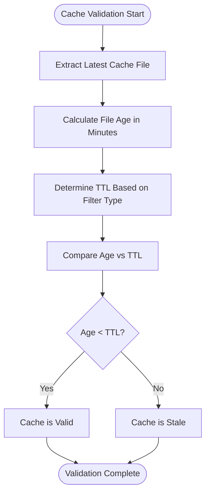
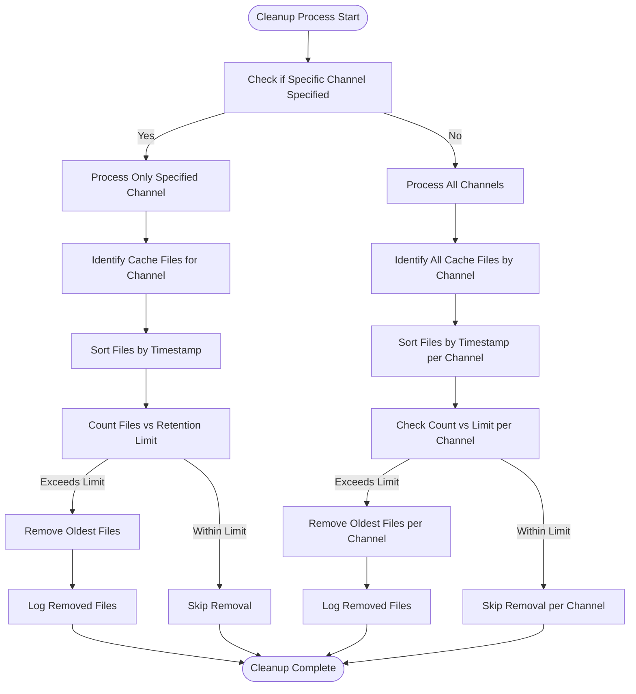
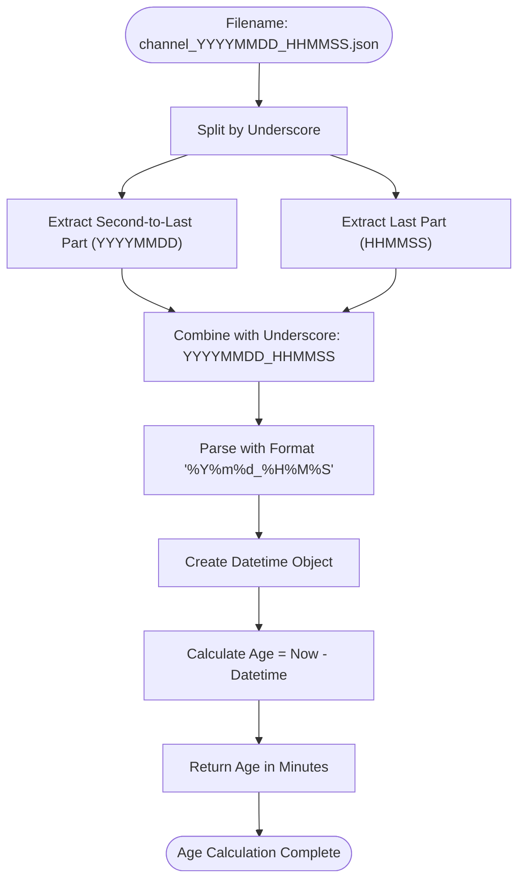
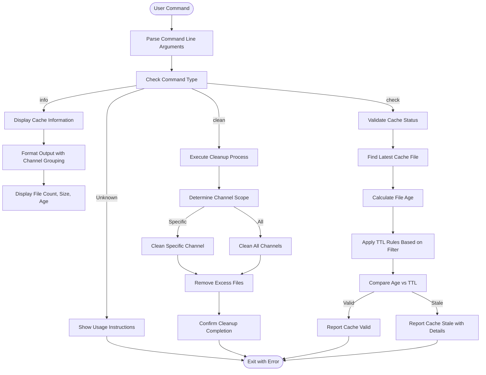
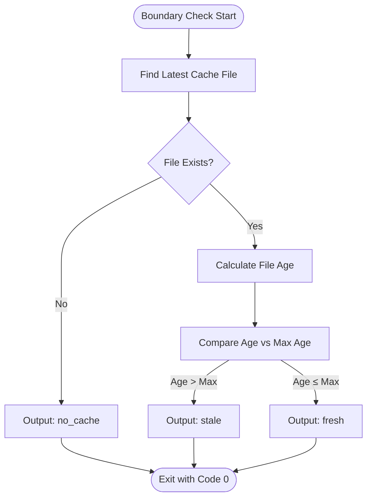

# Cache Operations

<cite>
**Referenced Files in This Document**   
- [telegram_cache.py](file://scripts/telegram_tools/core/telegram_cache.py)
- [simple_boundary_check.py](file://scripts/telegram_tools/simple_boundary_check.py)
- [telegram_smart_cache.py](file://scripts/telegram_tools/telegram_smart_cache.py)
</cite>

## Table of Contents
1. [Intelligent TTL System](#intelligent-ttl-system)
2. [Cache Validation Mechanism](#cache-validation-mechanism)
3. [Cache Cleanup Process](#cache-cleanup-process)
4. [Filename Convention and Timestamp Extraction](#filename-convention-and-timestamp-extraction)
5. [Cache Check and Clean Operations](#cache-check-and-clean-operations)
6. [Interaction Between Cache Status and Automatic Fetching](#interaction-between-cache-status-and-automatic-fetching)
7. [Simple Boundary Check Implementation](#simple-boundary-check-implementation)

## Intelligent TTL System

The FALLBACK_SCRIPTS tool implements an intelligent TTL (Time-To-Live) system with different expiration rules based on message categories. This system ensures that cache freshness is maintained according to the recency and importance of the messages.

The TTL configuration is defined in the `CACHE_TTL` dictionary within the `telegram_cache.py` file, which establishes three distinct expiration rules:

- **Today messages**: 5 minutes TTL for messages from the current day, ensuring near-real-time freshness for the most recent content
- **Recent messages**: 60 minutes TTL for messages from the last 7 days, providing a balance between freshness and performance
- **Archive messages**: 1440 minutes (24 hours) TTL for older messages, optimizing resource usage for historical content

The TTL system dynamically determines the appropriate expiration time based on the filter type requested. When a filter type starts with "last:", the system evaluates the number of days specified and applies the "recent" TTL for periods of 7 days or less, and the "archive" TTL for longer periods. For specific date filters, the system defaults to the archive TTL, assuming these requests are for historical data.

**Section sources**
- [telegram_cache.py](file://scripts/telegram_tools/core/telegram_cache.py#L10-L17)

## Cache Validation Mechanism

The cache validation mechanism checks whether cached data remains valid based on the TTL rules and the requested filter type. This process ensures that applications always work with appropriately fresh data while minimizing unnecessary network requests.

The validation process begins by identifying the latest cache file for a given channel. The system then calculates the age of this file in minutes by extracting the timestamp from the filename and comparing it to the current time. This age is then compared against the appropriate TTL value determined by the filter type.

The validation logic handles various filter types differently:
- For "today" filters, it applies the 5-minute TTL
- For "last:N" filters, it applies the 60-minute TTL if N ≤ 7, otherwise the 1440-minute TTL
- For "yesterday" and "all" filters, it applies the 60-minute TTL
- For specific date filters, it assumes archive data and applies the 1440-minute TTL

If the cache file's age is less than the applicable TTL, the cache is considered valid; otherwise, it is deemed stale and requires refreshing.

**Diagram sources**
- [telegram_cache.py](file://scripts/telegram_tools/core/telegram_cache.py#L48-L77)

**Section sources**
- [telegram_cache.py](file://scripts/telegram_tools/core/telegram_cache.py#L48-L77)

## Cache Cleanup Process

The cache cleanup process ensures efficient storage utilization by retaining only the latest N files per channel, preventing unbounded growth of cached data. This mechanism maintains a balance between having sufficient historical cache data for recovery purposes and conserving disk space.

The cleanup function `clean_old_caches` can operate in two modes:
1. **Channel-specific cleanup**: When a specific channel is provided, it removes all but the latest N cache files for that channel
2. **Global cleanup**: When no channel is specified, it iterates through all channels in the cache directory and applies the retention policy to each

By default, the system retains the 3 most recent cache files per channel, though this number can be configured. The cleanup process sorts cache files chronologically and removes the oldest files that exceed the retention limit. Each removal is logged with a confirmation message indicating which file was deleted.

This cleanup process is typically executed as a maintenance operation, either manually through the command line or automatically as part of regular system maintenance routines.

**Diagram sources**
- [telegram_cache.py](file://scripts/telegram_tools/core/telegram_cache.py#L79-L116)

**Section sources**
- [telegram_cache.py](file://scripts/telegram_tools/core/telegram_cache.py#L79-L116)

## Filename Convention and Timestamp Extraction

The system employs a standardized filename convention for cache files: `channel_YYYYMMDD_HHMMSS.json`. This format incorporates the channel identifier followed by a timestamp that indicates when the cache was created, ending with the JSON file extension.

The timestamp portion of the filename uses a 14-digit format: 8 digits for the date (YYYYMMDD) followed by an underscore and 6 digits for the time (HHMMSS). This structure enables both human readability and programmatic parsing.

The timestamp extraction process is implemented in the `get_cache_age_minutes` function, which parses the filename to determine the cache file's age. The function works by:
1. Splitting the filename stem (without extension) by underscores
2. Extracting the second-to-last and last components, which contain the date and time portions
3. Concatenating these components with an underscore to form the complete timestamp string
4. Parsing this string using the format '%Y%m%d_%H%M%S' to create a datetime object
5. Calculating the difference between the current time and the parsed timestamp to determine the file's age in minutes

This extraction method assumes that the timestamp components are always the last two underscore-separated parts of the filename, which is guaranteed by the consistent naming convention.

**Diagram sources**
- [telegram_cache.py](file://scripts/telegram_tools/core/telegram_cache.py#L20-L35)

**Section sources**
- [telegram_cache.py](file://scripts/telegram_tools/core/telegram_cache.py#L20-L35)

## Cache Check and Clean Operations

The system provides command-line operations for checking cache status and performing cleanup, implemented in the main function of `telegram_cache.py`. These operations allow users to interact with the cache system directly.

The available commands include:
- **info**: Displays comprehensive cache information and statistics, showing all cache files grouped by channel with details about message count, file size, and age
- **clean [channel]**: Executes the cache cleanup process, either for a specific channel or globally if no channel is specified
- **check <channel> [type]**: Validates whether the cache for a specific channel and filter type is still valid according to the TTL rules

When checking cache validity, the system outputs a clear status message indicating whether the cache is valid or stale. If the cache is stale, it provides additional information about the last cached file and its age. The info command presents a detailed overview of the cache directory, including total file count and size, with each channel's cache files listed in order of recency.

These operations are designed to be intuitive and provide immediate feedback, making it easy for users to monitor and manage the cache system.

**Diagram sources**
- [telegram_cache.py](file://scripts/telegram_tools/core/telegram_cache.py#L149-L178)

**Section sources**
- [telegram_cache.py](file://scripts/telegram_tools/core/telegram_cache.py#L149-L178)

## Interaction Between Cache Status and Automatic Fetching

The cache status directly influences the automatic fetching behavior in the FALLBACK_SCRIPTS tool. When a request is made for Telegram data, the system first checks the cache validity before deciding whether to use existing data or initiate a new fetch operation.

The interaction follows a decision process:
1. The system determines the required filter type for the data request
2. It validates the cache using the TTL rules appropriate for that filter type
3. If the cache is valid, the system uses the existing data, avoiding unnecessary network requests
4. If the cache is stale or non-existent, the system triggers the smart caching process to fetch fresh data

The `telegram_smart_cache.py` script implements this behavior by first checking if valid cache data exists before initiating a potentially resource-intensive fetch operation. This script uses the same TTL-based validation logic to make its decision, ensuring consistency across the system.

When a fetch is required, the smart caching process ensures complete time range coverage by scanning messages until it finds content that predates the requested time range. This approach prevents the "SSOT truncation trap" by guaranteeing that all messages within the specified time range are captured, even if they are not in the initial batch returned by the API.

**Section sources**
- [telegram_cache.py](file://scripts/telegram_tools/core/telegram_cache.py#L48-L77)
- [telegram_smart_cache.py](file://scripts/telegram_tools/telegram_smart_cache.py#L54-L94)

## Simple Boundary Check Implementation

The simple boundary check implementation provides a minimal, KISS (Keep It Simple, Stupid) approach to cache freshness validation. Located in `simple_boundary_check.py`, this script offers a straightforward staleness check that determines whether a cache is older than a specified maximum age.

The implementation focuses on a single concern: determining if the cache has exceeded a freshness threshold. It does not incorporate the sophisticated TTL rules based on message categories but instead uses a uniform maximum age parameter. The check process:
1. Locates the latest cache file for the specified channel
2. Calculates the file's age by comparing its modification time to the current time
3. Returns a status code indicating whether the cache is fresh (0) or stale (1)

This simple check returns one of three possible outputs:
- "fresh" if the cache is younger than the maximum age
- "stale" if the cache exceeds the maximum age
- "no_cache" if no cache files exist for the channel

The simplicity of this implementation makes it suitable for scenarios where a basic freshness check is sufficient, or where the more complex TTL logic is not required. It serves as a lightweight alternative to the full cache validation system.

**Diagram sources**
- [simple_boundary_check.py](file://scripts/telegram_tools/simple_boundary_check.py#L18-L37)

**Section sources**
- [simple_boundary_check.py](file://scripts/telegram_tools/simple_boundary_check.py#L18-L37)