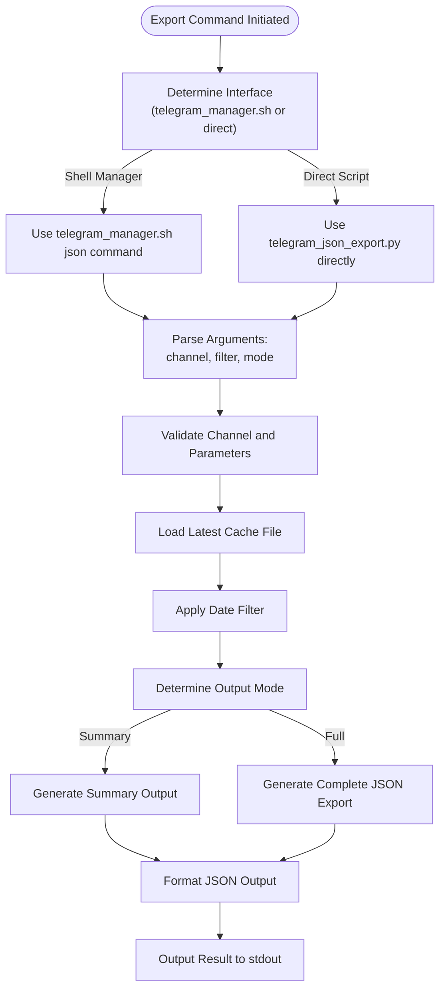
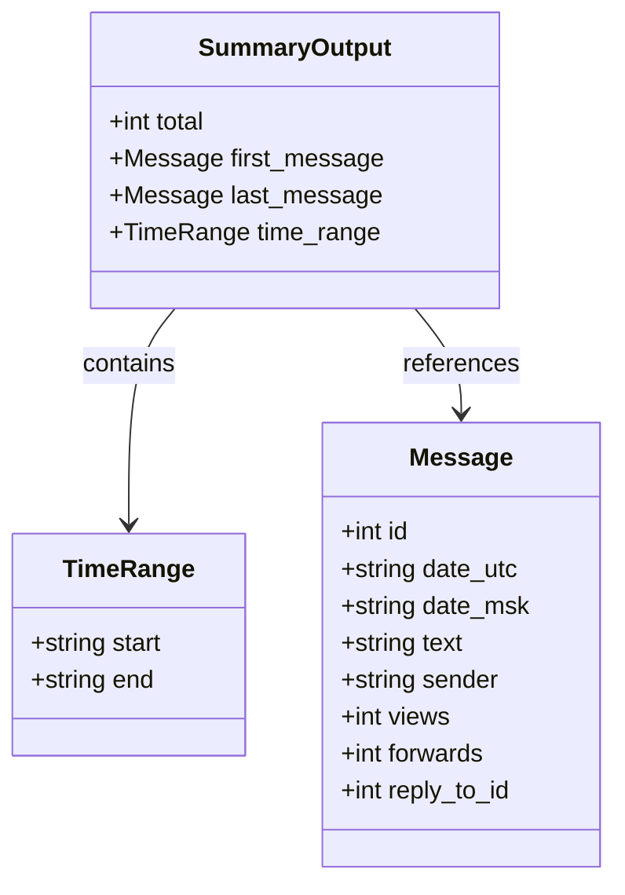
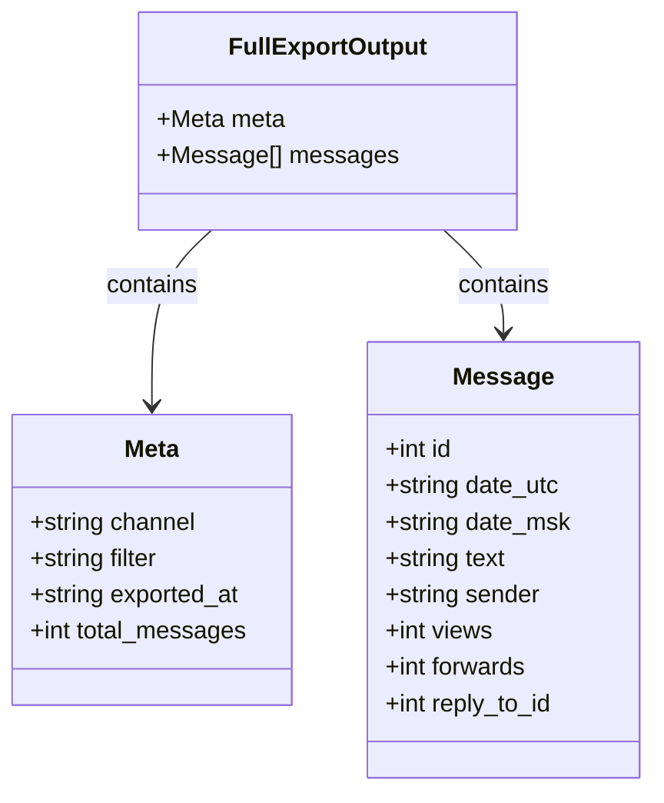
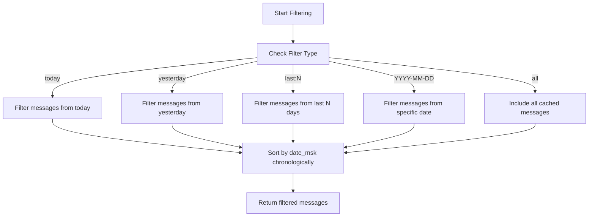
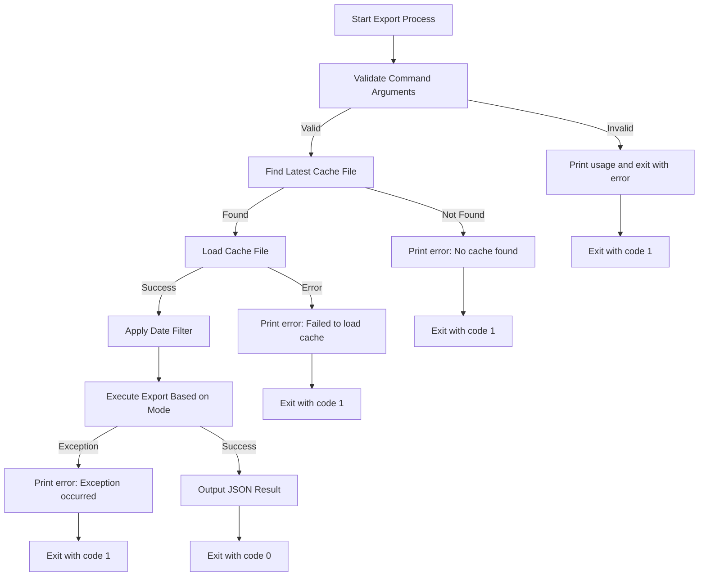

# Data Export

<cite>
**Referenced Files in This Document**   
- [telegram_json_export.py](file://scripts/telegram_tools/core/telegram_json_export.py)
- [telegram_manager.sh](file://telegram_manager.sh)
- [telegram_filter.py](file://scripts/telegram_tools/core/telegram_filter.py)
</cite>

## Table of Contents
1. [Introduction](#introduction)
2. [Export Command Overview](#export-command-overview)
3. [Output Modes](#output-modes)
4. [Date Filtering Logic](#date-filtering-logic)
5. [Data Model](#data-model)
6. [Usage Examples](#usage-examples)
7. [Error Handling](#error-handling)
8. [Integration with External Tools](#integration-with-external-tools)

## Introduction

The FALLBACK_SCRIPTS tool provides robust data export functionality for Telegram message data through its JSON export command. This feature enables users to extract message data in structured JSON format for analysis, verification, and integration with external tools. The export system works with cached message data and supports flexible filtering and two distinct output modes to accommodate different use cases.

**Section sources**
- [telegram_json_export.py](file://scripts/telegram_tools/core/telegram_json_export.py#L1-L10)

## Export Command Overview

The JSON export functionality can be accessed through two primary interfaces: the direct Python script or the unified shell manager. The command follows a consistent pattern with required channel specification, optional date filtering, and output mode selection.



**Diagram sources**
- [telegram_json_export.py](file://scripts/telegram_tools/core/telegram_json_export.py#L100-L124)
- [telegram_manager.sh](file://telegram_manager.sh#L85-L90)

**Section sources**
- [telegram_json_export.py](file://scripts/telegram_tools/core/telegram_json_export.py#L90-L124)
- [telegram_manager.sh](file://telegram_manager.sh#L85-L90)

## Output Modes

The JSON export command provides two distinct output modes to serve different analytical needs: `--summary` and `--full`. The `--summary` mode is the default when no mode is specified.

### Summary Mode

The `--summary` mode returns a concise object containing essential metadata about the filtered message set. This mode is ideal for quick assessments of message ranges and volume without transferring complete message data.



**Diagram sources**
- [telegram_json_export.py](file://scripts/telegram_tools/core/telegram_json_export.py#L63-L75)

**Section sources**
- [telegram_json_export.py](file://scripts/telegram_tools/core/telegram_json_export.py#L55-L75)

### Full Mode

The `--full` mode exports complete message data with comprehensive metadata. This mode is suitable for detailed analysis, data processing, or integration with external analytics tools.



**Diagram sources**
- [telegram_json_export.py](file://scripts/telegram_tools/core/telegram_json_export.py#L110-L118)

**Section sources**
- [telegram_json_export.py](file://scripts/telegram_tools/core/telegram_json_export.py#L110-L118)

## Date Filtering Logic

The date filtering logic in export operations mirrors the filtering mechanism used in read commands, ensuring consistency across the toolset. The filtering system supports multiple formats to accommodate various use cases.



**Diagram sources**
- [telegram_json_export.py](file://scripts/telegram_tools/core/telegram_json_export.py#L35-L62)

**Section sources**
- [telegram_json_export.py](file://scripts/telegram_tools/core/telegram_json_export.py#L27-L62)

## Data Model

The exported messages follow a consistent data model with standardized fields that capture essential message information and metadata.

### Message Data Structure

The following table details the structure of the message objects in the exported JSON:

| Field | Type | Description | Example |
|-------|------|-------------|---------|
| id | integer | Unique message identifier assigned by Telegram | 12345 |
| date_utc | string | Message date and time in UTC timezone (ISO 8601 format) | 2025-09-15T14:30:45+00:00 |
| date_msk | string | Message date and time in Moscow timezone (UTC+3) | 2025-09-15 17:30:45 |
| text | string | Message text content, with media indicators for non-text messages | "Hello world" or "📷 [Photo] Check this out" |
| sender | string | Name of the message sender (first name, or first and last name if available) | "John Doe" |
| views | integer or null | Number of times the message has been viewed (if available) | 42 or null |
| forwards | integer or null | Number of times the message has been forwarded (if available) | 5 or null |
| reply_to_id | integer or null | ID of the message this message replies to (if it's a reply) | 12344 or null |

**Section sources**
- [telegram_fetch.py](file://scripts/telegram_tools/core/telegram_fetch.py#L72-L101)
- [telegram_fetch_large.py](file://scripts/telegram_tools/core/telegram_fetch_large.py#L85-L111)
- [telegram_smart_cache.py](file://scripts/telegram_tools/telegram_smart_cache.py#L129-L153)

## Usage Examples

The JSON export command can be used in various scenarios for data analysis and integration.

### Basic Export Commands

```bash
# Export summary of today's messages from a channel
python telegram_json_export.py @aiclubsweggs today --summary

# Export complete JSON of yesterday's messages
python telegram_json_export.py @aiclubsweggs yesterday --full

# Export messages from the last 7 days with summary
python telegram_json_export.py @aiclubsweggs last:7 --summary

# Export all cached messages in full format
python telegram_json_export.py @aiclubsweggs all --full
```

### Using the Shell Manager

```bash
# Using the unified manager script
./telegram_manager.sh json @aiclubsweggs today --summary
./telegram_manager.sh json @aiclubsweggs last:3 --full
```

**Section sources**
- [telegram_json_export.py](file://scripts/telegram_tools/core/telegram_json_export.py#L90-L95)
- [telegram_manager.sh](file://telegram_manager.sh#L85-L90)

## Error Handling

The export process includes comprehensive error handling to manage various failure scenarios gracefully.



The error handling system captures exceptions during the export process and outputs user-friendly error messages to stderr, ensuring that the tool fails gracefully without exposing sensitive system information.

**Diagram sources**
- [telegram_json_export.py](file://scripts/telegram_tools/core/telegram_json_export.py#L97-L124)

**Section sources**
- [telegram_json_export.py](file://scripts/telegram_tools/core/telegram_json_export.py#L97-L124)

## Integration with External Tools

The structured JSON output enables seamless integration with various external tools for data analysis and processing.

### Example: Processing with jq

```bash
# Extract sender names from full export
python telegram_json_export.py @aiclubsweggs today --full | jq '.messages[].sender' | sort | uniq -c

# Count messages by date from summary
python telegram_json_export.py @aiclubsweggs last:7 --summary | jq '.time_range'

# Filter messages containing specific text
python telegram_json_export.py @aiclubsweggs all --full | jq 'select(.messages[].text | contains("urgent"))'
```

### Example: Importing to Python

```python
import json
import subprocess

# Run the export command and capture output
result = subprocess.run([
    'python', 'telegram_json_export.py', '@aiclubsweggs', 'today', '--full'
], capture_output=True, text=True)

# Parse the JSON output
data = json.loads(result.stdout)

# Analyze the messages
message_count = data['meta']['total_messages']
senders = [msg['sender'] for msg in data['messages']]
```

The consistent JSON structure ensures reliable integration with data processing pipelines, analytics platforms, and custom applications.

**Section sources**
- [telegram_json_export.py](file://scripts/telegram_tools/core/telegram_json_export.py#L110-L118)