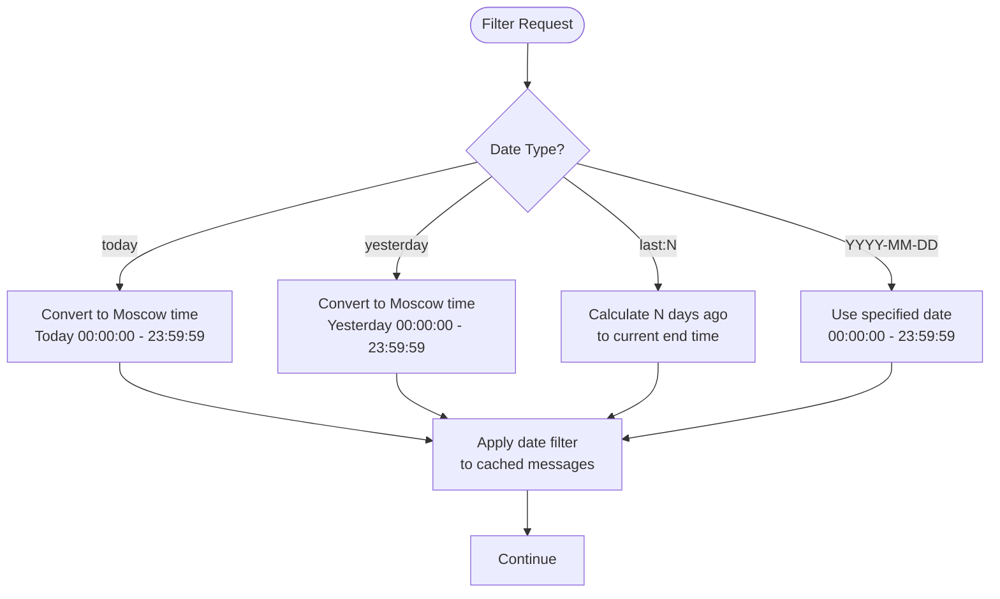
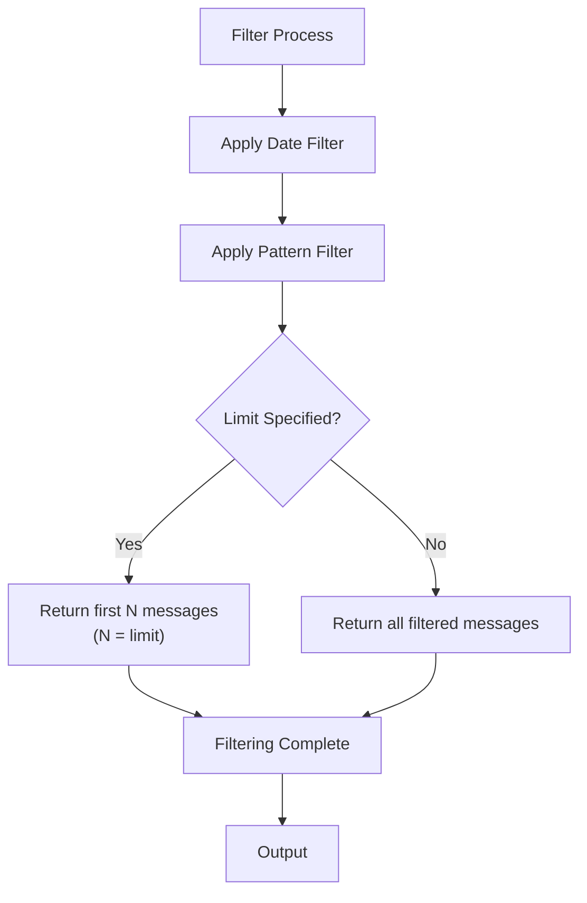
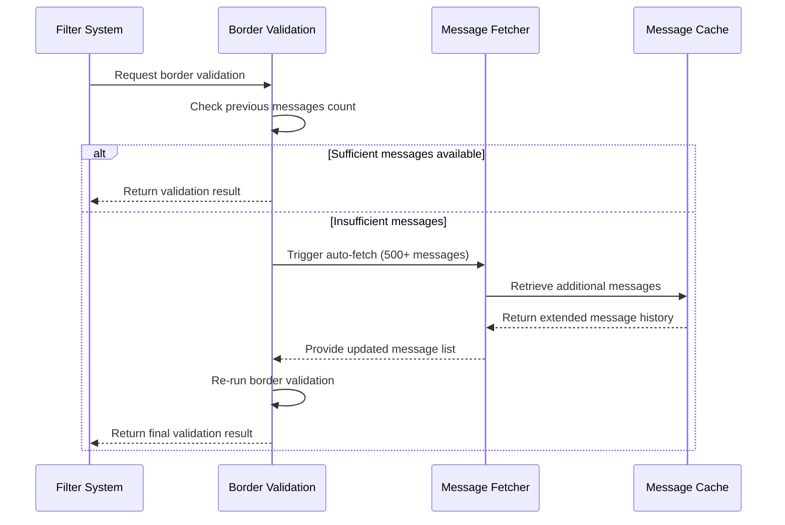
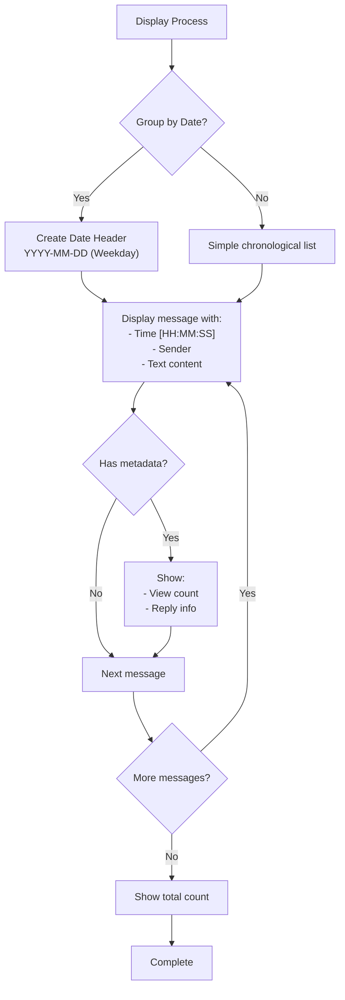

# Filtering Capabilities

<cite>
**Referenced Files in This Document**   
- [telegram_filter.py](file://scripts/telegram_tools/core/telegram_filter.py)
- [telegram_manager.sh](file://telegram_manager.sh)
- [test_date_calculations.sh](file://tests/test_date_calculations.sh)
- [test_01_range_parameter.sh](file://tests/test_01_range_parameter.sh)
- [test_02_limit_parameter.sh](file://tests/test_02_limit_parameter.sh)
- [test_first_message_border_detection.sh](file://tests/test_first_message_border_detection.sh)
- [simple_boundary_check.py](file://scripts/telegram_tools/simple_boundary_check.py)
</cite>

## Table of Contents
1. [Introduction](#introduction)
2. [Date-Based Filtering Options](#date-based-filtering-options)
3. [Pattern Matching Functionality](#pattern-matching-functionality)
4. [Limit Parameter](#limit-parameter)
5. [Border Detection System](#border-detection-system)
6. [Fallback Border Detection Mechanism](#fallback-border-detection-mechanism)
7. [Combining Filters](#combining-filters)
8. [Message Display Formatting](#message-display-formatting)
9. [Conclusion](#conclusion)

## Introduction
The FALLBACK_SCRIPTS tool provides robust filtering capabilities for Telegram message data, enabling users to retrieve and analyze messages based on date, content patterns, and quantity limits. The system is designed with timezone awareness, particularly for Moscow time (UTC+3), and includes sophisticated border detection mechanisms to ensure accurate filtering results. This document details the filtering features, including date-based filters, pattern matching, result limiting, and validation systems that prevent common issues related to message ordering and timezone boundaries.

**Section sources**
- [telegram_filter.py](file://scripts/telegram_tools/core/telegram_filter.py#L1-L50)
- [telegram_manager.sh](file://telegram_manager.sh#L1-L20)

## Date-Based Filtering Options
The filtering system supports multiple date-based filtering options to retrieve messages from specific time periods. These include:

- **today**: Retrieves messages from the current day in Moscow time (UTC+3)
- **yesterday**: Retrieves messages from the previous day in Moscow time
- **last:N**: Retrieves messages from the last N days, where N is a positive integer
- **YYYY-MM-DD**: Retrieves messages from a specific date in ISO format

The system converts all dates to Moscow timezone for consistent filtering, ensuring that daily boundaries align with local time rather than UTC. For example, when filtering for "today", the system calculates the start and end of the day in Moscow time (00:00:00 to 23:59:59) and retrieves all messages within this range. The "last:N" filter creates a date range from N days ago to the end of the current day, providing a rolling window of message history.

**Diagram sources**
- [telegram_filter.py](file://scripts/telegram_tools/core/telegram_filter.py#L130-L145)
- [test_date_calculations.sh](file://tests/test_date_calculations.sh#L0-L41)

**Section sources**
- [telegram_filter.py](file://scripts/telegram_tools/core/telegram_filter.py#L130-L162)
- [test_date_calculations.sh](file://tests/test_date_calculations.sh#L0-L41)
- [test_01_range_parameter.sh](file://tests/test_01_range_parameter.sh#L28-L69)

## Pattern Matching Functionality
The system supports case-insensitive regular expression filtering of message content, allowing users to search for specific keywords, phrases, or patterns within message text. When a pattern is provided, the filter applies a regex search across the "text" field of each message, ignoring case sensitivity. This enables flexible searching capabilities, such as finding all messages containing a particular keyword regardless of capitalization. The pattern matching is applied after date filtering, ensuring that only messages from the specified time period are evaluated for content matching. This two-step filtering approach optimizes performance by reducing the dataset before applying the more computationally intensive regex operations.

**Section sources**
- [telegram_filter.py](file://scripts/telegram_tools/core/telegram_filter.py#L170-L175)

## Limit Parameter
The limit parameter constrains the number of results returned by the filtering operation, preventing excessive output and improving performance. Users can specify a limit value between 1 and 1000 messages. The system validates the limit parameter to ensure it is a positive integer within the acceptable range. When a valid limit is provided, the filter returns only the first N messages from the filtered results, where N is the specified limit. This feature is particularly useful when dealing with high-volume channels, allowing users to quickly preview recent messages without retrieving the entire message history. The limit is applied after both date and pattern filtering, ensuring that the most relevant messages (typically the most recent) are returned.

**Diagram sources**
- [telegram_filter.py](file://scripts/telegram_tools/core/telegram_filter.py#L177-L180)
- [test_02_limit_parameter.sh](file://tests/test_02_limit_parameter.sh#L61-L91)

**Section sources**
- [telegram_filter.py](file://scripts/telegram_tools/core/telegram_filter.py#L177-L180)
- [test_02_limit_parameter.sh](file://tests/test_02_limit_parameter.sh#L61-L91)

## Border Detection System
The border detection system validates date-based filtering results by examining messages around date boundaries to prevent timezone-related errors. When filtering by a specific date, the system checks messages immediately preceding the first filtered message to ensure they belong to a different date. This prevents issues where messages near midnight might be incorrectly included or excluded due to timezone conversion artifacts. The system performs this validation by analyzing 3-7 messages before the first filtered message, depending on availability. If any of these preceding messages have the same date as the target date, the border detection flags a potential issue, indicating that the filtering boundary may be incorrect. This mechanism ensures data integrity when analyzing daily message patterns and prevents double-counting or missing messages at day boundaries.

**Section sources**
- [telegram_filter.py](file://scripts/telegram_tools/core/telegram_filter.py#L40-L98)

## Fallback Border Detection Mechanism
The fallback border detection mechanism enhances the border validation process by automatically fetching additional messages when insufficient data is available for proper validation. When the system detects fewer than 3 previous messages available for border checking, it triggers an auto-fetch process to retrieve more message history. This ensures that the border validation can be performed with adequate context, even when the current cache contains limited message history. The auto-fetch operation retrieves a significantly larger number of messages (minimum 500) to ensure comprehensive coverage of the date boundary. After fetching additional messages, the system reloads the updated cache and re-runs the border validation process. This proactive approach prevents false positives in border detection and maintains accuracy even when working with sparse or incomplete message caches.

**Diagram sources**
- [telegram_filter.py](file://scripts/telegram_tools/core/telegram_filter.py#L60-L98)
- [test_first_message_border_detection.sh](file://tests/test_first_message_border_detection.sh#L0-L56)

**Section sources**
- [telegram_filter.py](file://scripts/telegram_tools/core/telegram_filter.py#L40-L98)
- [test_first_message_border_detection.sh](file://tests/test_first_message_border_detection.sh#L0-L56)

## Combining Filters
Users can combine multiple filtering parameters to create more specific queries. For example, a user can retrieve yesterday's messages that contain a specific keyword by combining the "yesterday" date filter with a pattern match. The filtering process applies parameters in sequence: first by date, then by pattern, and finally by limit. This allows for complex queries such as retrieving the first 50 messages from last week that contain the word "update". The system processes these combined filters efficiently by applying the most restrictive filter first (typically the date filter) to minimize the dataset before applying more computationally intensive operations like regex pattern matching. This sequential filtering approach optimizes performance while providing flexible query capabilities.

**Section sources**
- [telegram_filter.py](file://scripts/telegram_tools/core/telegram_filter.py#L130-L180)
- [telegram_manager.sh](file://telegram_manager.sh#L30-L45)

## Message Display Formatting
The system formats filtered messages for clear and readable output, grouping them by date with appropriate headers. When displaying messages, the system shows the date header followed by the day of the week, providing immediate context for each message group. Each message is displayed with its time in 24-hour format, sender name, and message content. Additional metadata such as view count and reply information is shown below the message text when available. Messages are presented in reverse chronological order (newest first) within each date group, maintaining the natural flow of conversation. The system also provides a summary count of total messages returned, helping users quickly understand the scope of their query results.

**Diagram sources**
- [telegram_filter.py](file://scripts/telegram_tools/core/telegram_filter.py#L182-L215)

**Section sources**
- [telegram_filter.py](file://scripts/telegram_tools/core/telegram_filter.py#L182-L215)

## Conclusion
The FALLBACK_SCRIPTS filtering system provides comprehensive capabilities for retrieving and analyzing Telegram messages with precision and reliability. By combining date-based filtering, pattern matching, and result limiting, users can create targeted queries to extract specific information from message history. The system's border detection mechanisms ensure data accuracy by validating date boundaries and automatically fetching additional context when needed. The Moscow timezone-aware design prevents common issues related to day boundaries in different time zones. Together, these features create a robust filtering solution that balances flexibility, performance, and accuracy for effective message analysis.