# Message Management

<cite>
**Referenced Files in This Document**   
- [telegram_fetch.py](file://scripts/telegram_tools/core/telegram_fetch.py)
- [telegram_fetch_large.py](file://scripts/telegram_tools/core/telegram_fetch_large.py)
- [telegram_smart_cache.py](file://scripts/telegram_tools/telegram_smart_cache.py)
- [telegram_json_export.py](file://scripts/telegram_tools/core/telegram_json_export.py)
- [telegram_manager.sh](file://telegram_manager.sh)
- [BUG_REPORT_message_ordering.md](file://tests/BUG_REPORT_message_ordering.md)
- [PROPOSED_FIX_message_ordering.md](file://tests/PROPOSED_FIX_message_ordering.md)
- [test_ordering_integration.sh](file://tests/test_ordering_integration.sh)
</cite>

## Table of Contents
1. [Introduction](#introduction)
2. [Message Data Model](#message-data-model)
3. [Fetch Command Implementation](#fetch-command-implementation)
4. [Media Message Handling](#media-message-handling)
5. [Pagination and Offset Management](#pagination-and-offset-management)
6. [Data Flow from API to Cache](#data-flow-from-api-to-cache)
7. [Message Ordering Behavior](#message-ordering-behavior)
8. [Error Handling and Rate Limiting](#error-handling-and-rate-limiting)
9. [Usage Examples](#usage-examples)
10. [Conclusion](#conclusion)

## Introduction

The FALLBACK_SCRIPTS tool provides comprehensive message management functionality for Telegram channels through its `fetch` and `read` commands. This document details the implementation of message fetching, processing, and caching mechanisms, with a focus on the Telethon-based message retrieval system, media handling, data modeling, and ordering behavior. The system is designed to efficiently retrieve messages with configurable limits, handle various media types, and manage cache storage with intelligent TTL rules.

**Section sources**
- [telegram_manager.sh](file://telegram_manager.sh#L1-L110)
- [telegram_fetch.py](file://scripts/telegram_tools/core/telegram_fetch.py#L1-L146)

## Message Data Model

The system captures a comprehensive set of message attributes in its data model, transforming raw Telegram API responses into structured JSON objects. Each message includes essential metadata fields that provide context and enable downstream processing.

The core message data model includes the following fields:
- **id**: Unique message identifier from Telegram
- **date_utc**: Message timestamp in ISO format (UTC)
- **date_msk**: Message timestamp converted to Moscow time (UTC+3)
- **text**: Processed message content with media indicators
- **sender**: Display name of the message sender
- **views**: View count for the message (if available)
- **forwards**: Forward count for the message (if available)
- **reply_to_id**: ID of the message being replied to (if applicable)

This data model enables rich message analysis and supports various filtering and export operations. The inclusion of both UTC and Moscow timestamps accommodates different timezone requirements, while the sender name extraction provides human-readable identification.


**Diagram sources**
- [telegram_fetch.py](file://scripts/telegram_tools/core/telegram_fetch.py#L72-L101)
- [telegram_fetch_large.py](file://scripts/telegram_tools/core/telegram_fetch_large.py#L85-L111)

**Section sources**
- [telegram_fetch.py](file://scripts/telegram_tools/core/telegram_fetch.py#L72-L101)
- [telegram_fetch_large.py](file://scripts/telegram_tools/core/telegram_fetch_large.py#L85-L111)

## Fetch Command Implementation

The fetch command implementation leverages Telethon's `GetHistoryRequest` to retrieve messages from Telegram channels. This approach provides access to complete message metadata, including views, forwards, and sender information, which are essential for the application's functionality.

The implementation follows a structured process:
1. Establish connection to Telegram using credentials from the `.env` file
2. Resolve the channel entity using `get_entity`
3. Execute `GetHistoryRequest` with specified parameters
4. Process each message to extract relevant data
5. Convert timestamps to Moscow time
6. Enrich text content with media indicators
7. Store results in JSON cache

The fetch operation supports configurable parameters including channel identifier, message limit, offset ID, and optional suffix for cache file naming. The system handles authentication through API credentials stored in a unified `.env` file, ensuring secure access to Telegram's API.


**Diagram sources**
- [telegram_fetch.py](file://scripts/telegram_tools/core/telegram_fetch.py#L41-L70)
- [telegram_manager.sh](file://telegram_manager.sh#L15-L20)

**Section sources**
- [telegram_fetch.py](file://scripts/telegram_tools/core/telegram_fetch.py#L41-L146)
- [telegram_manager.sh](file://telegram_manager.sh#L15-L20)

## Media Message Handling

The system enhances message text by adding appropriate emojis to indicate media content, improving readability and providing visual cues about message type. This enrichment process occurs during message processing and applies different indicators based on the media type.

The media handling logic follows a hierarchical approach:
1. Check if the message has media content
2. Determine the specific media type
3. Prepend the appropriate emoji and descriptor to the message text

The system recognizes three primary media categories:
- **📷 [Photo]**: Applied to messages containing photo media
- **📎 [File]**: Applied to messages containing document attachments
- **📦 [Media]**: Applied to all other media types (videos, stickers, etc.)

This approach ensures that users can quickly identify media messages in the output, even when viewing plain text representations. The media indicators are prepended to the existing message text, preserving the original content while adding contextual information.

```mermaid
flowchart TD
Start([Message Processing]) --> HasMedia{"Has media?"}
HasMedia --> |No| KeepText["Keep original text"]
HasMedia --> |Yes| IsPhoto{"Is photo?"}
IsPhoto --> |Yes| AddPhoto["Prepend '📷 [Photo]'"]
IsPhoto --> |No| IsDocument{"Is document?"}
IsDocument --> |Yes| AddFile["Prepend '📎 [File]'"]
IsDocument --> |No| AddMedia["Prepend '📦 [Media]'"]
AddPhoto --> Complete
AddFile --> Complete
AddMedia --> Complete
KeepText --> Complete
Complete([Complete message])
```



**Diagram sources**
- [telegram_fetch.py](file://scripts/telegram_tools/core/telegram_fetch.py#L72-L85)
- [telegram_smart_cache.py](file://scripts/telegram_tools/telegram_smart_cache.py#L129-L138)

**Section sources**
- [telegram_fetch.py](file://scripts/telegram_tools/core/telegram_fetch.py#L72-L85)
- [telegram_fetch_large.py](file://scripts/telegram_tools/core/telegram_fetch_large.py#L85-L98)
- [telegram_smart_cache.py](file://scripts/telegram_tools/telegram_smart_cache.py#L129-L138)

## Pagination and Offset Management

The system implements robust pagination through offset handling, enabling retrieval of large message sets and continuation of previous fetch operations. This is particularly important for channels with extensive message histories where retrieving all messages in a single request is impractical.

For large-scale message retrieval, the `telegram_fetch_large.py` script employs a batch processing strategy:
- Messages are fetched in configurable batch sizes
- The offset ID is updated after each batch using the ID of the oldest message retrieved
- The process continues until the total requested limit is reached or no more messages are available

This approach efficiently handles large datasets while respecting Telegram's API rate limits and response size constraints. The offset management ensures that pagination is consistent and that messages are retrieved in the expected order without duplication.


**Diagram sources**
- [telegram_fetch_large.py](file://scripts/telegram_tools/core/telegram_fetch_large.py#L47-L83)
- [telegram_fetch_large.py](file://scripts/telegram_tools/core/telegram_fetch_large.py#L85-L111)

**Section sources**
- [telegram_fetch_large.py](file://scripts/telegram_tools/core/telegram_fetch_large.py#L47-L111)

## Data Flow from API to Cache

The message data flow follows a well-defined pipeline from Telegram API retrieval to persistent cache storage. This process ensures data integrity, efficient storage, and quick access for subsequent operations.

The data flow consists of the following stages:
1. **API Request**: Initiate message retrieval using Telethon's `GetHistoryRequest`
2. **Data Processing**: Transform raw message objects into structured data
3. **Timestamp Conversion**: Convert UTC timestamps to Moscow time
4. **Media Enrichment**: Add appropriate emojis to indicate media content
5. **Cache Storage**: Save processed data to JSON files with metadata

Cache files are organized in the `telegram_cache` directory with a naming convention that includes the channel name, timestamp, and optional suffix. Each cache file contains both metadata about the fetch operation and the array of processed messages, enabling comprehensive tracking and auditability.


**Diagram sources**
- [telegram_fetch.py](file://scripts/telegram_tools/core/telegram_fetch.py#L101-L130)
- [telegram_cache.py](file://scripts/telegram_tools/core/telegram_cache.py#L1-L178)

**Section sources**
- [telegram_fetch.py](file://scripts/telegram_tools/core/telegram_fetch.py#L101-L130)
- [telegram_cache.py](file://scripts/telegram_tools/core/telegram_cache.py#L1-L178)

## Message Ordering Behavior

The system exhibits different message ordering behaviors depending on the command used, which has led to user confusion and documented issues. This inconsistency stems from differing approaches to message retrieval and post-processing between the `read` and `read_channel` commands.

The current behavior can be summarized as follows:
- **read command**: Uses `iter_messages()` without the reverse parameter, returning messages in newest-first order (reverse chronological)
- **read_channel command**: Uses `iter_messages()` with `reverse=False` (also newest-first) but then sorts messages by date to display in chronological order (oldest-first)

This creates ambiguity when users request "the first message," as the same conceptual request returns opposite results depending on the command used. The temporal first message (oldest) differs from the retrieval first message (newest), leading to inconsistent user experiences.


**Diagram sources**
- [test_ordering_integration.sh](file://tests/test_ordering_integration.sh#L127-L166)
- [BUG_REPORT_message_ordering.md](file://tests/BUG_REPORT_message_ordering.md#L120-L122)

**Section sources**
- [test_ordering_integration.sh](file://tests/test_ordering_integration.sh#L127-L182)
- [BUG_REPORT_message_ordering.md](file://tests/BUG_REPORT_message_ordering.md#L1-L122)
- [PROPOSED_FIX_message_ordering.md](file://tests/PROPOSED_FIX_message_ordering.md#L1-L206)

## Error Handling and Rate Limiting

The system implements comprehensive error handling to manage various failure scenarios and edge cases. While some error conditions are documented for future implementation, the current system handles several critical error types.

The error handling strategy includes:
- **Authentication errors**: Proper handling of missing or invalid credentials
- **Parameter validation**: Clear error messages for invalid inputs
- **Input sanitization**: Protection against injection attacks and malformed data
- **Resource limits**: Enforcement of message limits to prevent excessive resource usage
- **Network errors**: Handling of connection timeouts and network unavailability
- **Rate limiting**: Consideration of Telegram API rate limits

The system validates inputs such as channel names, limits, and offset IDs to ensure they meet expected formats and constraints. For example, message limits are restricted to values between 1 and 1000, while channel names must follow Telegram's naming conventions.


**Diagram sources**
- [test_10_error_handling.sh](file://tests/test_10_error_handling.sh#L172-L243)
- [test_02_limit_parameter.sh](file://tests/test_02_limit_parameter.sh#L1-L118)
- [test_03_offset_simple.sh](file://tests/test_03_offset_simple.sh#L1-L41)

**Section sources**
- [test_10_error_handling.sh](file://tests/test_10_error_handling.sh#L172-L243)
- [test_02_limit_parameter.sh](file://tests/test_02_limit_parameter.sh#L1-L118)
- [test_03_offset_simple.sh](file://tests/test_03_offset_simple.sh#L1-L41)
- [test_04_channel_simple.sh](file://tests/test_04_channel_simple.sh#L1-L50)

## Usage Examples

The FALLBACK_SCRIPTS tool provides several practical examples of message fetching with different parameters and channels. These examples demonstrate the flexibility of the system and its ability to handle various use cases.

Common usage patterns include:

**Basic message fetching:**
```bash
./telegram_manager.sh fetch aiclubsweggs 100
```
This command retrieves 100 messages from the specified channel and caches them for subsequent use.

**Reading messages with filtering:**
```bash
./telegram_manager.sh read aiclubsweggs today
```
This command reads messages from the cache, applying a filter for messages from today. If the cache is stale, it automatically fetches fresh data.

**Forced cache refresh:**
```bash
./telegram_manager.sh read aiclubsweggs today --clean
```
This command clears the existing cache and fetches fresh messages before displaying them, ensuring the most up-to-date content.

**Exporting to JSON:**
```bash
./telegram_manager.sh json aiclubsweggs today --full
```
This command exports all cached messages to JSON format, providing structured data for external processing.

These examples illustrate the core functionality of the message management system and demonstrate how users can interact with Telegram content through the FALLBACK_SCRIPTS tool.

**Section sources**
- [telegram_manager.sh](file://telegram_manager.sh#L1-L110)
- [test_ordering_integration.sh](file://tests/test_ordering_integration.sh#L127-L182)

## Conclusion

The message management functionality in the FALLBACK_SCRIPTS tool provides a robust framework for retrieving, processing, and caching Telegram messages. The system leverages Telethon's API to fetch messages with configurable limits and offset handling, enabling efficient pagination through large message histories. Media messages are enriched with appropriate emojis to enhance readability, and a comprehensive message data model captures essential metadata for analysis.

However, the current implementation exhibits inconsistent message ordering behavior between different commands, leading to user confusion. The `read` command returns messages in reverse chronological order, while the `read_channel` command presents them in chronological order after post-processing. This discrepancy highlights the need for a unified approach to message ordering with explicit parameters to control sort behavior.

Future improvements should focus on standardizing the message ordering behavior, implementing comprehensive rate limiting to respect Telegram's API constraints, and enhancing error handling for network-related issues. By addressing these areas, the system can provide a more consistent and reliable user experience for message management tasks.