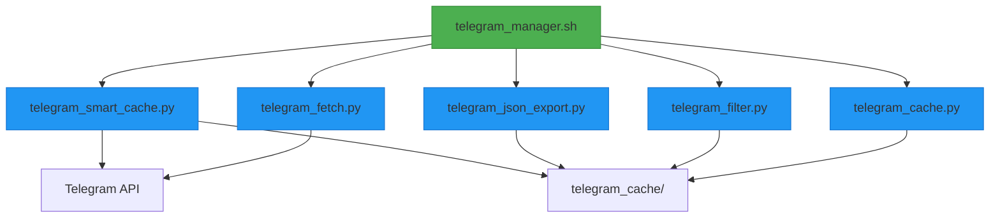
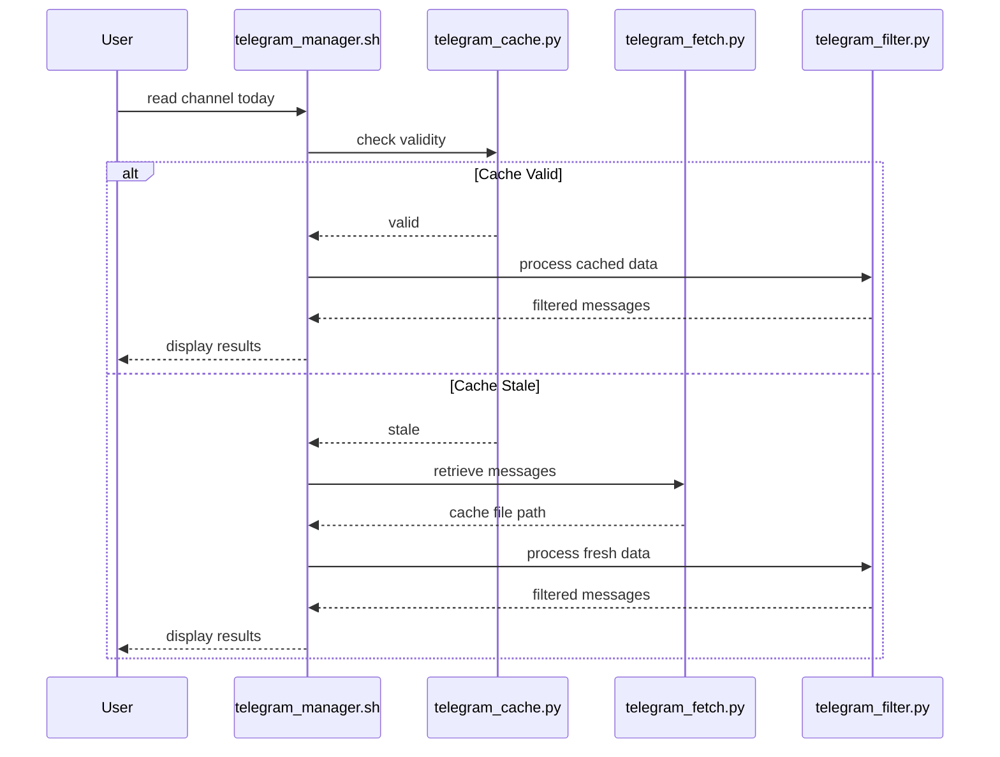

# Tool Overview & Core Value

<cite>
**Referenced Files in This Document**   
- [telegram_manager.sh](file://telegram_manager.sh)
- [telegram_fetch.py](file://scripts/telegram_tools/core/telegram_fetch.py)
- [telegram_cache.py](file://scripts/telegram_tools/core/telegram_cache.py)
- [telegram_filter.py](file://scripts/telegram_tools/core/telegram_filter.py)
- [telegram_json_export.py](file://scripts/telegram_tools/core/telegram_json_export.py)
- [telegram_smart_cache.py](file://scripts/telegram_tools/telegram_smart_cache.py)
</cite>

## Table of Contents
1. [Introduction](#introduction)
2. [Core Architecture](#core-architecture)
3. [Key Features](#key-features)
4. [Data Flow](#data-flow)
5. [Practical Examples](#practical-examples)
6. [Technical Deep Dive](#technical-deep-dive)

## Introduction

The FALLBACK_SCRIPTS CLI tool is a powerful automation system designed for intelligent management of Telegram messages through caching, filtering, and message processing. Built as a facade-driven architecture, it combines bash orchestration with modular Python components to provide a seamless interface for interacting with Telegram channels. The tool's core value lies in its ability to abstract complex Telegram API interactions into simple command-line operations while maintaining data freshness through smart caching mechanisms.

At its heart, the system solves common challenges in message retrieval such as rate limiting, data consistency, and time-boundary detection. By implementing TTL (Time-to-Live) rules and border detection algorithms, it ensures accurate message filtering across day boundaries and provides reliable access to both recent and historical messages. The tool is particularly valuable for users who need to analyze message patterns, extract data for reporting, or automate communication workflows.

**Section sources**
- [telegram_manager.sh](file://telegram_manager.sh#L0-L23)
- [telegram_fetch.py](file://scripts/telegram_tools/core/telegram_fetch.py#L0-L10)

## Core Architecture

The FALLBACK_SCRIPTS tool follows a facade pattern where the main entry point `telegram_manager.sh` serves as a unified interface to multiple specialized Python modules. This architecture separates concerns while maintaining simplicity for end users. The bash script handles command routing, parameter validation, and execution flow, delegating specific tasks to purpose-built Python components that operate on a shared cache system.

The core components work in concert: `telegram_fetch.py` retrieves messages from Telegram and stores them in JSON format, `telegram_cache.py` manages cache validity based on configurable TTL rules, `telegram_filter.py` applies date and pattern-based filtering to cached data, and `telegram_json_export.py` provides raw JSON output for external analysis. This modular design allows each component to be developed and tested independently while contributing to the overall system functionality.

**Diagram sources**
- [telegram_manager.sh](file://telegram_manager.sh#L0-L109)
- [telegram_fetch.py](file://scripts/telegram_tools/core/telegram_fetch.py#L0-L144)
- [telegram_cache.py](file://scripts/telegram_tools/core/telegram_cache.py#L0-L42)
- [telegram_filter.py](file://scripts/telegram_tools/core/telegram_filter.py#L0-L237)
- [telegram_json_export.py](file://scripts/telegram_tools/core/telegram_json_export.py#L0-L124)

**Section sources**
- [telegram_manager.sh](file://telegram_manager.sh#L0-L109)
- [telegram_fetch.py](file://scripts/telegram_tools/core/telegram_fetch.py#L0-L144)

## Key Features

### Message Fetching and Caching
The tool provides robust message fetching capabilities through the `fetch` command, which retrieves messages from specified Telegram channels and stores them in a structured JSON cache. The caching system implements intelligent TTL rules that vary based on message recency: 5 minutes for today's messages, 60 minutes for recent messages (last 7 days), and 1440 minutes (24 hours) for archived messages. This ensures that frequently accessed data remains fresh while reducing unnecessary API calls for historical content.

### Smart Cache Management
The `smart cache` system goes beyond simple time-based invalidation by implementing border detection algorithms that verify the accuracy of date-based message filtering. When retrieving messages for a specific date, the system validates that no messages from the target date appear in the previous day's section, preventing misclassification due to timezone differences or message ordering issues. The system can automatically fetch additional messages when border validation requires more context, ensuring data integrity.

### Advanced Filtering and Export
Users can filter messages by various criteria including `today`, `yesterday`, `last:N` days, or specific dates. Pattern-based filtering allows searching for keywords within message content. The `json` command exports raw message data in JSON format, either as a summary (first and last message) or complete dataset, enabling integration with external analysis tools. Cache management commands allow users to inspect cache status or clean outdated files.

**Section sources**
- [telegram_cache.py](file://scripts/telegram_tools/core/telegram_cache.py#L0-L178)
- [telegram_filter.py](file://scripts/telegram_tools/core/telegram_filter.py#L0-L237)
- [telegram_json_export.py](file://scripts/telegram_tools/core/telegram_json_export.py#L0-L124)
- [telegram_smart_cache.py](file://scripts/telegram_tools/telegram_smart_cache.py#L0-L243)

## Data Flow

The high-level data flow begins when a user executes a command through `telegram_manager.sh`. For read operations, the system first checks cache validity using `telegram_cache.py check` with the specified filter type. If the cache is valid (within TTL), the system proceeds to filter the cached data. If the cache is stale, it triggers `telegram_fetch.py` to retrieve fresh messages before filtering.

The message filtering process involves loading the latest cache file, applying date-based filters to select relevant messages, and optionally applying pattern matching. During this process, border detection is automatically triggered for single-date filters to ensure accurate date boundary handling. The filtered results are then formatted and displayed to the user in a readable format with date grouping and metadata display.

For JSON export operations, the system follows a similar flow but outputs structured JSON data instead of formatted text, making it suitable for programmatic consumption. The send functionality operates outside the caching system, directly connecting to Telegram to deliver messages using credentials stored in the `.env` file.

**Diagram sources**
- [telegram_manager.sh](file://telegram_manager.sh#L25-L63)
- [telegram_cache.py](file://scripts/telegram_tools/core/telegram_cache.py#L0-L178)
- [telegram_filter.py](file://scripts/telegram_tools/core/telegram_filter.py#L0-L237)

**Section sources**
- [telegram_manager.sh](file://telegram_manager.sh#L25-L109)
- [telegram_cache.py](file://scripts/telegram_tools/core/telegram_cache.py#L0-L178)

## Practical Examples

Common use cases demonstrate the tool's practical value. To fetch the latest 100 messages from a channel: `./telegram_manager.sh fetch aiclubsweggs 100`. To read today's messages with automatic cache management: `./telegram_manager.sh read aiclubsweggs today`. Users can force fresh data retrieval by adding the `--clean` flag: `./telegram_manager.sh read aiclubsweggs today --clean`.

For data analysis, users can export message ranges in JSON format: `./telegram_manager.sh json aiclubsweggs today --full` exports all messages from today as raw JSON, while `--summary` provides just the first and last message with timing information. Sending messages is equally straightforward: `./telegram_manager.sh send @username "Hello"` delivers a message directly through the Telegram API.

The tool also supports advanced filtering with pattern matching: `./telegram_manager.sh read aiclubsweggs last:3 'gemini'` finds messages containing "gemini" from the last three days. Cache inspection is available via `./telegram_manager.sh cache` to view cache statistics, and cleanup can be performed with `./telegram_manager.sh clean` to remove outdated cache files.

**Section sources**
- [telegram_manager.sh](file://telegram_manager.sh#L65-L109)
- [telegram_filter.py](file://scripts/telegram_tools/core/telegram_filter.py#L0-L237)

## Technical Deep Dive

The system's technical sophistication lies in its border detection algorithm and smart caching strategy. The border detection mechanism validates date-based filters by examining messages immediately preceding the first filtered message to ensure they belong to a different date. If insufficient context exists, the system automatically triggers additional message fetching to guarantee accurate boundary detection.

The TTL-based cache invalidation system balances freshness and performance, with different rules for different data access patterns. The cache directory structure uses timestamped JSON files that preserve message metadata including sender information, timestamps in both UTC and Moscow time, view counts, and reply relationships. This rich metadata enables sophisticated filtering and analysis while maintaining compatibility with the Telegram API's data model.

The modular Python components share a common data format and cache location, enabling interoperability while maintaining separation of concerns. Each component focuses on a specific responsibility: fetching, caching, filtering, or exporting, which simplifies maintenance and testing. The bash facade provides a user-friendly interface while handling error conditions and parameter validation to ensure robust operation.

**Section sources**
- [telegram_filter.py](file://scripts/telegram_tools/core/telegram_filter.py#L41-L95)
- [telegram_cache.py](file://scripts/telegram_tools/core/telegram_cache.py#L0-L178)
- [telegram_smart_cache.py](file://scripts/telegram_tools/telegram_smart_cache.py#L0-L243)