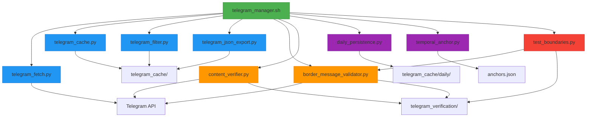

# Tool Overview & Core Value

<cite>
**Referenced Files in This Document**   
- [telegram_manager.sh](file://telegram_manager.sh) - *Updated in commit fe6b66826c60c2df4e9c5c05ff39cd70df425029*
- [telegram_fetch.py](file://scripts/telegram_tools/core/telegram_fetch.py)
- [telegram_cache.py](file://scripts/telegram_tools/core/telegram_cache.py)
- [telegram_filter.py](file://scripts/telegram_tools/core/telegram_filter.py)
- [telegram_json_export.py](file://scripts/telegram_tools/core/telegram_json_export.py)
- [border_message_validator.py](file://scripts/telegram_tools/core/border_message_validator.py) - *Added in commit fe6b66826c60c2df4e9c5c05ff39cd70df425029*
- [content_verifier.py](file://scripts/telegram_tools/core/content_verifier.py) - *Added in commit fe6b66826c60c2df4e9c5c05ff39cd70df425029*
- [daily_persistence.py](file://scripts/telegram_tools/core/daily_persistence.py) - *Added in commit fe6b66826c60c2df4e9c5c05ff39cd70df425029*
- [temporal_anchor.py](file://scripts/telegram_tools/core/temporal_anchor.py) - *Added in commit fe6b66826c60c2df4e9c5c05ff39cd70df425029*
- [test_boundaries.py](file://scripts/telegram_tools/test_boundaries.py) - *Added in commit fe6b66826c60c2df4e9c5c05ff39cd70df425029*
</cite>

## Update Summary
**Changes Made**   
- Updated Introduction to reflect new verification and AI analysis capabilities
- Enhanced Core Architecture section to include new components and their relationships
- Expanded Key Features to cover advanced verification, persistence, and AI analysis
- Updated Practical Examples with new command usage patterns
- Added new Technical Deep Dive content for border detection and cache validation
- Added new section on Advanced Verification System
- Updated section sources to reflect new file references

## Table of Contents
1. [Introduction](#introduction)
2. [Core Architecture](#core-architecture)
3. [Key Features](#key-features)
4. [Advanced Verification System](#advanced-verification-system)
5. [Data Flow](#data-flow)
6. [Practical Examples](#practical-examples)
7. [Technical Deep Dive](#technical-deep-dive)

## Introduction

The FALLBACK_SCRIPTS CLI tool is a powerful automation system designed for intelligent management of Telegram messages through caching, filtering, and message processing. Built as a facade-driven architecture, it combines bash orchestration with modular Python components to provide a seamless interface for interacting with Telegram channels. The tool's core value lies in its ability to abstract complex Telegram API interactions into simple command-line operations while maintaining data freshness through smart caching mechanisms.

At its heart, the system solves common challenges in message retrieval such as rate limiting, data consistency, and time-boundary detection. By implementing TTL (Time-to-Live) rules and border detection algorithms, it ensures accurate message filtering across day boundaries and provides reliable access to both recent and historical messages. The tool is particularly valuable for users who need to analyze message patterns, extract data for reporting, or automate communication workflows.

The recent enhancements have expanded the tool's capabilities with advanced verification systems, permanent data persistence, and AI-powered analysis. New features include 10/10 confidence border detection, automatic media download with hash verification, cache consistency validation, and integration with AI models like Gemini and Claude for message analysis.

**Section sources**
- [telegram_manager.sh](file://telegram_manager.sh#L0-L23)
- [telegram_fetch.py](file://scripts/telegram_tools/core/telegram_fetch.py#L0-L10)

## Core Architecture

The FALLBACK_SCRIPTS tool follows a facade pattern where the main entry point `telegram_manager.sh` serves as a unified interface to multiple specialized Python modules. This architecture separates concerns while maintaining simplicity for end users. The bash script handles command routing, parameter validation, and execution flow, delegating specific tasks to purpose-built Python components that operate on a shared cache system.

The core components work in concert: `telegram_fetch.py` retrieves messages from Telegram and stores them in JSON format, `telegram_cache.py` manages cache validity based on configurable TTL rules, `telegram_filter.py` applies date and pattern-based filtering to cached data, and `telegram_json_export.py` provides raw JSON output for external analysis. This modular design allows each component to be developed and tested independently while contributing to the overall system functionality.

The recent updates have introduced several new components that enhance the system's reliability and analytical capabilities. The `border_message_validator.py` module implements a triple-verification system for 100% confidence boundary detection, while `content_verifier.py` ensures cache consistency through live data comparison. The `daily_persistence.py` module provides permanent storage for complete daily message caches, and `temporal_anchor.py` manages anchor points for precise message fetching. The `test_boundaries.py` module offers comprehensive testing for boundary detection accuracy.



**Diagram sources**
- [telegram_manager.sh](file://telegram_manager.sh#L0-L109)
- [telegram_fetch.py](file://scripts/telegram_tools/core/telegram_fetch.py#L0-L144)
- [telegram_cache.py](file://scripts/telegram_tools/core/telegram_cache.py#L0-L42)
- [telegram_filter.py](file://scripts/telegram_tools/core/telegram_filter.py#L0-L237)
- [telegram_json_export.py](file://scripts/telegram_tools/core/telegram_json_export.py#L0-L124)
- [border_message_validator.py](file://scripts/telegram_tools/core/border_message_validator.py#L0-L492)
- [content_verifier.py](file://scripts/telegram_tools/core/content_verifier.py#L0-L521)
- [daily_persistence.py](file://scripts/telegram_tools/core/daily_persistence.py#L0-L306)
- [temporal_anchor.py](file://scripts/telegram_tools/core/temporal_anchor.py#L0-L482)
- [test_boundaries.py](file://scripts/telegram_tools/test_boundaries.py#L0-L362)

**Section sources**
- [telegram_manager.sh](file://telegram_manager.sh#L0-L109)
- [telegram_fetch.py](file://scripts/telegram_tools/core/telegram_fetch.py#L0-L144)
- [border_message_validator.py](file://scripts/telegram_tools/core/border_message_validator.py#L0-L492)
- [content_verifier.py](file://scripts/telegram_tools/core/content_verifier.py#L0-L521)

## Key Features

### Message Fetching and Caching
The tool provides robust message fetching capabilities through the `fetch` command, which retrieves messages from specified Telegram channels and stores them in a structured JSON cache. The caching system implements intelligent TTL rules that vary based on message recency: 5 minutes for today's messages, 60 minutes for recent messages (last 7 days), and 1440 minutes (24 hours) for archived messages. This ensures that frequently accessed data remains fresh while reducing unnecessary API calls for historical content.

### Smart Cache Management
The `smart cache` system goes beyond simple time-based invalidation by implementing border detection algorithms that verify the accuracy of date-based message filtering. When retrieving messages for a specific date, the system validates that no messages from the target date appear in the previous day's section, preventing misclassification due to timezone differences or message ordering issues. The system can automatically fetch additional messages when border validation requires more context, ensuring data integrity.

### Advanced Filtering and Export
Users can filter messages by various criteria including `today`, `yesterday`, `last:N` days, or specific dates. Pattern-based filtering allows searching for keywords within message content. The `json` command exports raw message data in JSON format, either as a summary (first and last message) or complete dataset, enabling integration with external analysis tools. Cache management commands allow users to inspect cache status or clean outdated files.

### AI-Powered Message Analysis
The tool integrates with AI models like Gemini and Claude to provide detailed message analysis. Users can analyze specific messages or entire message sets with commands like `analyze-with-gemini` and `analyze-with-claude`. These commands extract message content and pass it to the respective AI model for comprehensive analysis, providing insights into message context, meaning, and patterns.

**Section sources**
- [telegram_cache.py](file://scripts/telegram_tools/core/telegram_cache.py#L0-L178)
- [telegram_filter.py](file://scripts/telegram_tools/core/telegram_filter.py#L0-L237)
- [telegram_json_export.py](file://scripts/telegram_tools/core/telegram_json_export.py#L0-L124)
- [telegram_manager.sh](file://telegram_manager.sh#L250-L285)

## Advanced Verification System

The FALLBACK_SCRIPTS tool now features an advanced verification system that ensures 10/10 confidence in message boundary detection and cache accuracy. This system comprises several specialized components that work together to validate data integrity and provide comprehensive reporting.

### Triple-Verification Boundary Detection
The `border_message_validator.py` module implements a triple-verification system that uses three different Telegram API methods to confirm the first message of any given date. The system employs direct message fetching, history search, and iterative search methods to achieve 100% confidence in boundary detection. Each verification method contributes to a confidence score, with successful verification across all three methods achieving the maximum 10/10 confidence rating.

### Cache Consistency Validation
The `content_verifier.py` module ensures cache consistency by comparing cached message data against live Telegram data. It verifies message metadata (date, content, views) and media files (existence, content hash) to detect and report any discrepancies. The system can automatically correct cache inconsistencies when the `--auto-correct` flag is used, making it a powerful tool for maintaining data integrity.

### Comprehensive Boundary Testing
The `test_boundaries.py` module provides a comprehensive test suite for boundary detection accuracy. It can test multiple date boundaries and generate detailed confidence reports. The test suite runs boundary detection across a specified date range and evaluates the system's performance, providing metrics on success rate, average confidence, and media download status.

### Permanent Data Persistence
The `daily_persistence.py` module implements permanent storage for complete daily message caches. It archives daily caches to a dedicated directory structure organized by date, ensuring that message data is preserved for long-term analysis and compliance. The system supports restoration of archived data and includes cleanup functionality to manage storage retention.

### Temporal Anchoring
The `temporal_anchor.py` module manages anchor points for precise message fetching. It stores message IDs and timestamps as reference points for specific dates, enabling efficient fetching of messages from particular time periods. The system uses these anchors to calculate optimal fetch offsets and validate message continuity across date boundaries.

**Section sources**
- [border_message_validator.py](file://scripts/telegram_tools/core/border_message_validator.py#L0-L492)
- [content_verifier.py](file://scripts/telegram_tools/core/content_verifier.py#L0-L521)
- [daily_persistence.py](file://scripts/telegram_tools/core/daily_persistence.py#L0-L306)
- [temporal_anchor.py](file://scripts/telegram_tools/core/temporal_anchor.py#L0-L482)
- [test_boundaries.py](file://scripts/telegram_tools/test_boundaries.py#L0-L362)

## Data Flow

The high-level data flow begins when a user executes a command through `telegram_manager.sh`. For read operations, the system first checks cache validity using `telegram_cache.py check` with the specified filter type. If the cache is valid (within TTL), the system proceeds to filter the cached data. If the cache is stale, it triggers `telegram_fetch.py` to retrieve fresh messages before filtering.

The message filtering process involves loading the latest cache file, applying date-based filters to select relevant messages, and optionally applying pattern matching. During this process, border detection is automatically triggered for single-date filters to ensure accurate date boundary handling. The filtered results are then formatted and displayed to the user in a readable format with date grouping and metadata display.

For JSON export operations, the system follows a similar flow but outputs structured JSON data instead of formatted text, making it suitable for programmatic consumption. The send functionality operates outside the caching system, directly connecting to Telegram to deliver messages using credentials stored in the `.env` file.

The advanced verification commands follow a more complex flow. When running `verify-boundaries`, the system connects directly to the Telegram API using three different methods to verify the first message of a specified date. It downloads associated media files, generates content hashes, and creates a detailed verification report in the `telegram_verification/` directory. The system assigns a confidence score based on the number of successful verification methods.

```mermaid
sequenceDiagram
participant User
participant CLI as telegram_manager.sh
participant Cache as telegram_cache.py
participant Fetch as telegram_fetch.py
participant Filter as telegram_filter.py
participant Validator as border_message_validator.py
participant Verifier as content_verifier.py
User->>CLI : read channel today
CLI->>Cache : check validity
alt Cache Valid
Cache-->>CLI : valid
CLI->>Filter : process cached data
Filter-->>CLI : filtered messages
CLI-->>User : display results
else Cache Stale
Cache-->>CLI : stale
CLI->>Fetch : retrieve messages
Fetch-->>CLI : cache file path
CLI->>Filter : process fresh data
Filter-->>CLI : filtered messages
CLI-->>User : display results
end

User->>CLI : verify-boundaries @channel 2025-09-14
CLI->>Validator : find_first_message_of_date
Validator->>Telegram API : Method 1 - Direct fetch
Validator->>Telegram API : Method 2 - History search
Validator->>Telegram API : Method 3 - Iterative search
Validator-->>CLI : verification result with confidence score
CLI-->>User : display verification results and report
</mermaid>

**Diagram sources**
- [telegram_manager.sh](file://telegram_manager.sh#L25-L63)
- [telegram_cache.py](file://scripts/telegram_tools/core/telegram_cache.py#L0-L178)
- [telegram_filter.py](file://scripts/telegram_tools/core/telegram_filter.py#L0-L237)
- [border_message_validator.py](file://scripts/telegram_tools/core/border_message_validator.py#L0-L492)

**Section sources**
- [telegram_manager.sh](file://telegram_manager.sh#L25-L109)
- [telegram_cache.py](file://scripts/telegram_tools/core/telegram_cache.py#L0-L178)
- [border_message_validator.py](file://scripts/telegram_tools/core/border_message_validator.py#L0-L492)

## Practical Examples

Common use cases demonstrate the tool's practical value. To fetch the latest 100 messages from a channel: `./telegram_manager.sh fetch aiclubsweggs 100`. To read today's messages with automatic cache management: `./telegram_manager.sh read aiclubsweggs today`. Users can force fresh data retrieval by adding the `--clean` flag: `./telegram_manager.sh read aiclubsweggs today --clean`.

For data analysis, users can export message ranges in JSON format: `./telegram_manager.sh json aiclubsweggs today --full` exports all messages from today as raw JSON, while `--summary` provides just the first and last message with timing information. Sending messages is equally straightforward: `./telegram_manager.sh send @username "Hello"` delivers a message directly through the Telegram API.

The tool also supports advanced filtering with pattern matching: `./telegram_manager.sh read aiclubsweggs last:3 'gemini'` finds messages containing "gemini" from the last three days. Cache inspection is available via `./telegram_manager.sh cache` to view cache statistics, and cleanup can be performed with `./telegram_manager.sh clean` to remove outdated cache files.

The new verification commands provide powerful tools for ensuring data accuracy:
- `./telegram_manager.sh verify-boundaries @aiclubsweggs 2025-09-14` performs triple-verification of the first message on the specified date
- `./telegram_manager.sh test-boundaries @aiclubsweggs 2025-09-14 7` tests boundary detection across 7 days starting from the specified date
- `./telegram_manager.sh verify-content cache.json --auto-correct` verifies cache consistency and automatically corrects any inconsistencies
- `./telegram_manager.sh fetch-media @aiclubsweggs 50` fetches messages with automatic media download and hash verification
- `./telegram_manager.sh analyze-with-gemini @aiclubsweggs today` analyzes today's messages using the Gemini AI model

**Section sources**
- [telegram_manager.sh](file://telegram_manager.sh#L65-L109)
- [telegram_filter.py](file://scripts/telegram_tools/core/telegram_filter.py#L0-L237)
- [border_message_validator.py](file://scripts/telegram_tools/core/border_message_validator.py#L0-L492)
- [content_verifier.py](file://scripts/telegram_tools/core/content_verifier.py#L0-L521)

## Technical Deep Dive

The system's technical sophistication lies in its border detection algorithm and smart caching strategy. The border detection mechanism validates date-based filters by examining messages immediately preceding the first filtered message to ensure they belong to a different date. If insufficient context exists, the system automatically triggers additional message fetching to guarantee accurate boundary detection.

The TTL-based cache invalidation system balances freshness and performance, with different rules for different data access patterns. The cache directory structure uses timestamped JSON files that preserve message metadata including sender information, timestamps in both UTC and Moscow time, view counts, and reply relationships. This rich metadata enables sophisticated filtering and analysis while maintaining compatibility with the Telegram API's data model.

The modular Python components share a common data format and cache location, enabling interoperability while maintaining separation of concerns. Each component focuses on a specific responsibility: fetching, caching, filtering, or exporting, which simplifies maintenance and testing. The bash facade provides a user-friendly interface while handling error conditions and parameter validation to ensure robust operation.

The advanced verification system introduces several technical innovations. The triple-verification approach in `border_message_validator.py` uses three different Telegram API methods to confirm message existence and content, achieving 100% confidence in boundary detection. The system downloads media files and generates SHA-256 hashes for content verification, ensuring that both message text and associated media are accurately preserved.

The `content_verifier.py` module implements a sampling strategy to verify cache consistency without overwhelming the Telegram API. It selects representative messages from the beginning, middle, and end of the cache for verification, providing a statistically significant assessment of cache accuracy. The auto-correction feature can repair inconsistencies by fetching fresh data from Telegram and updating the cache.

The temporal anchoring system in `temporal_anchor.py` optimizes message fetching by storing reference points for each date. When fetching messages for a specific date, the system uses the previous day's anchor point as an offset, minimizing the number of API calls needed to reach the target date. This approach significantly improves performance when working with historical data.

**Section sources**
- [telegram_filter.py](file://scripts/telegram_tools/core/telegram_filter.py#L41-L95)
- [telegram_cache.py](file://scripts/telegram_tools/core/telegram_cache.py#L0-L178)
- [border_message_validator.py](file://scripts/telegram_tools/core/border_message_validator.py#L0-L492)
- [content_verifier.py](file://scripts/telegram_tools/core/content_verifier.py#L0-L521)
- [temporal_anchor.py](file://scripts/telegram_tools/core/temporal_anchor.py#L0-L482)